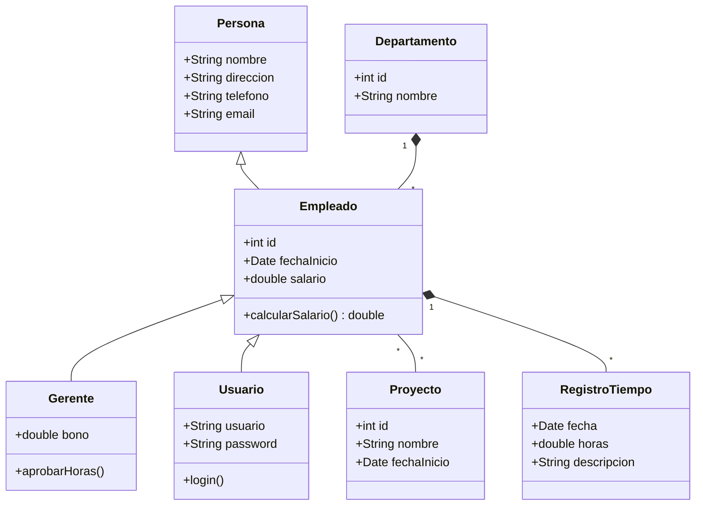
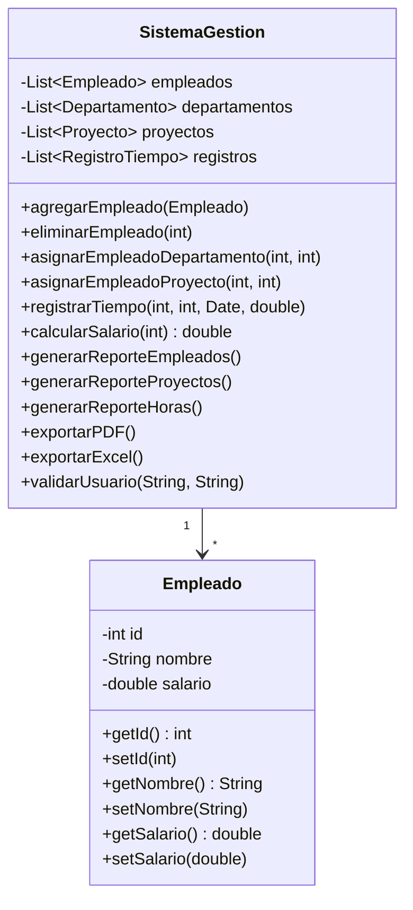
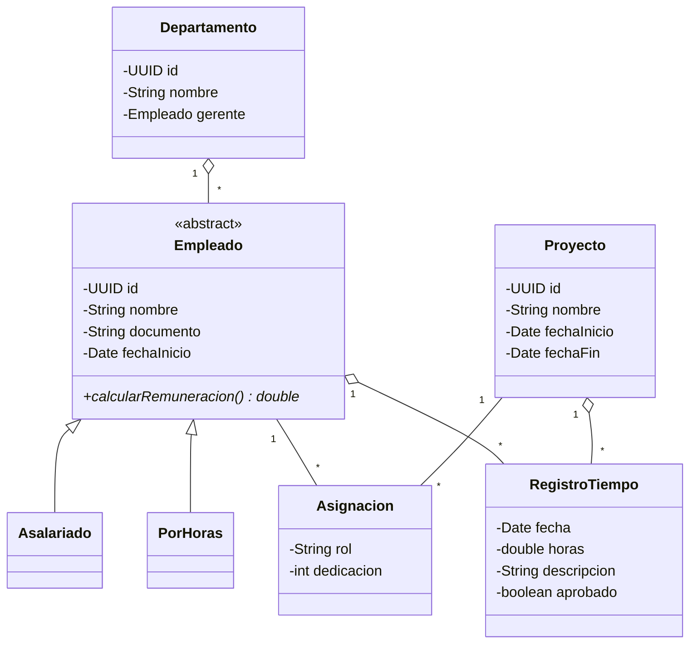

# 2. Evaluación crítica de propuestas de modelado, incluidas las generadas con IA

> El enunciado señala que se emplearon herramientas de inteligencia artificial
> para generar diagramas de clases y que estos "presentan errores conceptuales y
> estructurales". Este documento examina tres propuestas preliminares
> representativas, identifica sus fallos concretos y explica en qué se corrigen
> en el modelo final.

## Contenido

- [2.1. Método de evaluación](#21-método-de-evaluación)
- [2.2. Propuesta A: jerarquía por conveniencia](#22-propuesta-a-jerarquía-por-conveniencia)
- [2.3. Propuesta B: modelo anémico con clase orquestadora](#23-propuesta-b-modelo-anémico-con-clase-orquestadora)
- [2.4. Propuesta C: la que casi acierta](#24-propuesta-c-la-que-casi-acierta)
- [2.5. Resumen de errores y correcciones](#25-resumen-de-errores-y-correcciones)
- [2.6. Patrones de fallo de la IA en modelado](#26-patrones-de-fallo-de-la-ia-en-modelado)
- [2.7. Qué sí aportó la asistencia automática](#27-qué-sí-aportó-la-asistencia-automática)

---

## 2.1. Método de evaluación

Cada propuesta se juzgó con seis preguntas. No son de estilo: cada una tiene una
consecuencia observable si se responde mal.

1. **¿La herencia expresa una relación "es un" permanente?** Si un objeto puede
   dejar de pertenecer a la subclase sin dejar de ser el mismo objeto, la
   herencia está mal usada y obligará a destruir y recrear instancias.
2. **¿Las relaciones muchos-a-muchos con atributos propios se modelan como clase
   de asociación?** Si no, esos atributos se acaban duplicando o perdiendo.
3. **¿Las clases tienen comportamiento, o solo datos?** Un modelo de puros
   getters y setters desplaza las reglas a otro sitio, donde nadie las protege.
4. **¿Las multiplicidades reflejan las reglas del enunciado?** Una multiplicidad
   equivocada es una regla de negocio equivocada.
5. **¿Se distingue composición de agregación?** Determina qué pasa al eliminar
   el contenedor.
6. **¿El modelo soporta los requisitos no funcionales?** Trazabilidad,
   privacidad y control de acceso son estructurales; no se añaden después.

---

## 2.2. Propuesta A: jerarquía por conveniencia

Es la salida más común cuando se pide "un diagrama de clases para un sistema de
gestión de empleados, departamentos y proyectos".

### Errores identificados

**A1. `Gerente extends Empleado` — herencia sobre un rol temporal.**
Ser gerente es un cargo que se ocupa y se deja. Con esta jerarquía, ascender a
alguien exige crear un objeto `Gerente` nuevo y destruir el `Empleado` anterior:
se pierde el identificador, y con él las horas cargadas, las asignaciones y el
historial. Degradarlo obliga a la operación inversa. Además, nada impide que un
`Gerente` no dirija ningún departamento, ni que dos objetos `Gerente` reclamen el
mismo.
*Prueba de que está mal:* la pregunta "¿sigue siendo la misma persona?" tiene
respuesta afirmativa, y la herencia no puede representarlo.

**A2. `Usuario extends Empleado` — jerarquía que rompe por los dos extremos.**
Hay **empleados sin usuario** (un operario al que su supervisor le carga las
horas) y **usuarios sin empleado** (la cuenta del auditor externo, la cuenta
técnica de administración). Con esta herencia, el primer caso obliga a inventar
credenciales falsas y el segundo a inventar un legajo y un salario. Ambos
ensucian la nómina.

**A3. `Empleado "*" -- "*" Proyecto` — asociación sin clase intermedia.**
No hay dónde poner el rol en el proyecto, el porcentaje de dedicación ni las
fechas de alta y baja de la participación. Al desasignar solo cabe borrar el
vínculo, y las horas ya cargadas quedan sin nada que las explique: exactamente la
"falta de trazabilidad" que el proyecto viene a resolver.

**A4. `Departamento "1" *-- "*" Empleado` — composición equivocada.**
El rombo relleno significa que el empleado no existe fuera del departamento y que
eliminar el departamento elimina a sus empleados. En una empresa real, disolver un
área reasigna a la gente. Debe ser agregación, y la multiplicidad del lado del
departamento es `0..1`, no `1`, porque un empleado recién ingresado puede estar
sin asignar.

**A5. `RegistroTiempo` colgado solo de `Empleado`.**
El enunciado pide que los registros estén asociados "a un empleado **y a un
proyecto** específico". Aquí no hay forma de saber a qué proyecto imputar las
horas, y con ello se cae el informe de costos por proyecto.

**A6. Atributos públicos y ausencia de reglas.**
Todo es `+`. Cualquiera puede escribir `empleado.salario = 0`. No hay validación
de horas, ni de fechas, ni de estados.

**A7. `calcularSalario()` concreto en la clase base.**
Con una sola implementación, las tres modalidades de contrato solo caben dentro de
un `switch`, que es el problema que la herencia debía eliminar.

**A8. Ningún estado en `RegistroTiempo`.**
Sin estados no hay circuito de aprobación, y sin circuito no hay trazabilidad: una
hora cargada es indistinguible de una hora validada.

**A9. `login()` dentro de `Usuario`.**
Autenticar exige limitar intentos, consultar el almacén y emitir una sesión. Nada
de eso es responsabilidad de una entidad de dominio, y meterlo ahí la hace
imposible de probar sin infraestructura.

**A10. `int id` autoincremental.**
Filtra el volumen de negocio (el número de empleado revela cuánta gente pasó por
la empresa) y facilita la enumeración de recursos por parte de un atacante.

---

## 2.3. Propuesta B: modelo anémico con clase orquestadora

Segunda variante habitual: al pedir "que respete el encapsulamiento", el
resultado son clases con todos los atributos privados, un getter y un setter por
cada uno, y toda la lógica desplazada a un gestor central.

### Errores identificados

**B1. Modelo de dominio anémico.**
`Empleado` no sabe hacer nada. Es una estructura de datos con ceremonia. El
encapsulamiento es aparente: un setter público por cada atributo privado deja la
clase igual de expuesta, solo que con el triple de código. `setSalario(-100)`
sigue siendo posible.

**B2. `SistemaGestion` es una clase-dios.**
Concentra alta de personal, asignaciones, cálculo de haberes, generación de
informes, exportación y autenticación. Viola la responsabilidad única de forma
tan amplia que el archivo crece sin límite y cualquier cambio lo toca. Es
programación procedural con sintaxis de objetos.

**B3. Un método de exportación por formato.**
`exportarPDF()` y `exportarExcel()` como métodos distintos significan que añadir
CSV obliga a escribir `exportarCSV()` y a modificar todos los llamadores. Con una
abstracción `Exportador`, añadir un formato es añadir una clase.

**B4. Un método de informe por informe.**
Mismo error en el otro eje. Cinco informes por tres formatos serían quince
métodos.

**B5. Identificadores en las firmas en lugar de objetos.**
`asignarEmpleadoProyecto(int, int)` no puede validar nada por sí misma y permite
invertir los argumentos sin que el compilador se entere.

**B6. Colecciones en memoria como modelo de persistencia.**
`List<Empleado>` dentro del gestor implica que todo vive en un proceso. No hay
frontera de persistencia, así que no hay dónde enchufar un almacén sin reescribir
el gestor entero.

**B7. `validarUsuario` devolviendo un booleano.**
Se pierde la distinción entre "credenciales incorrectas", "cuenta bloqueada" y
"cuenta desactivada", y con ella la posibilidad de aplicar políticas distintas.

---

## 2.4. Propuesta C: la que casi acierta

Tercera iteración, tras señalar los fallos anteriores. Corrige lo evidente y
conserva errores más sutiles, que son los peligrosos porque pasan la revisión
superficial.

### Aciertos

Jerarquía por modalidad de contrato con método abstracto; `Gerente` como
asociación; `Asignacion` como clase intermedia; `RegistroTiempo` ligado a
empleado y proyecto; identificadores UUID; agregación en lugar de composición.

### Errores que quedan

**C1. `Asignacion` sin fechas.**
Tiene rol y dedicación, pero no `fechaAsignacion` ni `fechaDesasignacion`. Sin
ellas, la única forma de desasignar es borrar la fila, y se pierde el histórico.
Peor: se vuelve imposible validar que unas horas del 3 de marzo correspondan a un
proyecto en el que la persona ya participaba ese día, que es la comprobación que
sostiene la trazabilidad.

**C2. `boolean aprobado` en lugar de un estado.**
Un booleano solo distingue dos situaciones. El circuito real tiene cuatro:
borrador, enviado, aprobado y rechazado. Con un booleano no existe el rechazo, no
hay dónde guardar el motivo, y "aún no enviado" y "rechazado" son
indistinguibles, de modo que quien aprueba no sabe qué mirar. Tampoco hay
`aprobadoPor`, así que no queda constancia de quién validó.

**C3. Sin ciclo de vida en `Proyecto`.**
Solo fechas. No hay estados ni, por tanto, reglas: nada impide cargar horas a un
proyecto terminado hace un año, ni asignar personal a uno cancelado.

**C4. `documento` como atributo plano.**
El requisito de proteger datos personales es estructural. Dejar el documento como
un `String` más significa que estará en claro en el almacén, en los volcados y en
los informes. La corrección no es "cifrarlo después", es separar el bloque de
datos personales y darle un tratamiento propio desde el modelo.

**C5. Falta `presupuestoHoras` en `Proyecto`.**
Sin él no hay informe de desvío ni alerta de sobrecoste, que es una de las
preguntas que la gerencia querrá hacerle al sistema.

**C6. `Usuario` sigue sin aparecer.**
El modelo no dice quién puede hacer qué. La autorización queda fuera del diseño y
acaba dispersa por el código.

**C7. Multiplicidad `Departamento "1"`.**
Sigue impidiendo que exista un empleado sin departamento asignado. Debe ser
`0..1`.

**C8. Sin auditoría.**
No hay ninguna entidad que registre operaciones. La trazabilidad que ofrece el
modelo cubre las horas, pero no responde a "¿quién cambió este salario y
cuándo?".

---

## 2.5. Resumen de errores y corrección adoptada

| # | Error | Propuesta | Corrección en el modelo final |
|---|---|---|---|
| A1 | `Gerente` como subclase | A | Asociación `Departamento.gerenteId → Empleado` |
| A2 | `Usuario` como subclase de `Empleado` | A | Entidades separadas, asociación opcional `0..1` |
| A3 | N:M sin clase de asociación | A | `AsignacionProyecto` con identidad y atributos |
| A4 | Composición departamento–empleado | A | Agregación, multiplicidad `0..1` |
| A5 | Registro de horas sin proyecto | A | `RegistroTiempo` referencia empleado **y** proyecto |
| A6 | Atributos públicos, sin invariantes | A, B | Campos privados y operaciones con nombre de negocio |
| A7 | Cálculo concreto en la base | A | `calcularRemuneracionMensual` abstracto |
| A8 | Sin estados en el registro | A | `BORRADOR / ENVIADO / APROBADO / RECHAZADO` |
| A9 | `login()` en la entidad | A | `ServicioAutenticacion` en la capa de aplicación |
| A10 | Identificador autoincremental | A | UUID v4 vía `crypto.randomUUID()` |
| B1 | Modelo anémico | B | Lógica dentro de las entidades |
| B2 | Clase-dios | B | Un servicio por área, con dependencias explícitas |
| B3 | Un método por formato | B | `Exportador` + `FabricaExportadores` |
| B4 | Un método por informe | B | `Reporte` con método plantilla + subclases |
| B5 | Identificadores sueltos en las firmas | B | Objetos de dominio y validación de identificadores |
| B6 | Colecciones en memoria | B | Abstracción `Repositorio<T>` |
| B7 | Autenticación booleana | B | Jerarquía `ErrorDominio` con causas distinguibles |
| C1 | Asignación sin vigencia temporal | C | `fechaAsignacion` / `fechaDesasignacion` y `estabaVigenteEn()` |
| C2 | `boolean aprobado` | C | Estado + `aprobadoPor` + `motivoRechazo` |
| C3 | Proyecto sin ciclo de vida | C | Máquina de estados con transiciones validadas |
| C4 | Datos personales en claro | C | Bloque `datosSensibles` cifrado con AES-256-GCM |
| C5 | Sin presupuesto de horas | C | `presupuestoHoras` y `excedePresupuesto()` |
| C6 | Sin modelo de acceso | C | `Usuario`, `Rol`, `PoliticaAutorizacion` |
| C7 | Multiplicidad `1` obligatoria | C | `0..1` |
| C8 | Sin auditoría | C | `RegistroAuditoria` inmutable |

---

## 2.6. Patrones de fallo de la IA en modelado

Los errores anteriores no son aleatorios. Se repiten con una regularidad que
conviene nombrar, porque saber dónde mirar es lo que hace útil la revisión.

**Confunde estructura léxica con estructura semántica.** El generador ve
"gerente" y "empleado" como sustantivos donde uno es un caso particular del otro,
y produce herencia. No distingue "es un tipo de" (permanente) de "hace de"
(temporal). Este es el origen de A1 y A2, y es el error más caro porque contamina
el ciclo de vida de los objetos.

**Devuelve el patrón más frecuente, no el más adecuado.** Los diagramas de
ejemplo que abundan usan asociaciones simples, así que produce asociaciones
simples aunque el caso pida una clase de asociación (A3). Igual con composición
frente a agregación (A4): el rombo relleno se dibuja más, y aparece.

**Modela sustantivos y olvida procesos.** Es bueno enumerando entidades y sus
atributos, y sistemáticamente pobre en ciclos de vida. Ninguna de las tres
propuestas incluyó una máquina de estados. Un booleano donde hacía falta un
estado (C2) es la versión atenuada del mismo defecto.

**Trata los requisitos no funcionales como una capa posterior.** Seguridad,
privacidad y trazabilidad se piden en el enunciado, pero no aparecen en el
diagrama: se asume que se añaden luego. Y no se pueden añadir luego. Que el
documento del empleado sea un `String` plano (C4) es una decisión de diseño con
consecuencias que ninguna capa superior arregla.

**Optimiza la coherencia interna, no la del dominio.** Los tres diagramas son
internamente consistentes y sintácticamente correctos. Ninguna herramienta de
validación de UML habría marcado un solo error. Todos los fallos son de
correspondencia con la realidad de la empresa, y esa correspondencia solo la
verifica quien conoce el dominio.

**Es literal con el enunciado y no lo interroga.** El enunciado dice "cada
empleado tendrá nombre, dirección, teléfono, correo, fecha de inicio y salario".
Las tres propuestas ponen `salario` en `Empleado`. Ninguna se pregunta qué pasa
con quien cobra por hora, aunque el mismo enunciado hable de registrar horas
trabajadas. La contradicción está en el texto y hay que salir del texto para
verla.

---

## 2.7. Qué sí aportó la asistencia automática

Descartar la herramienta sería la conclusión equivocada. Fue útil en tareas
distintas de la que se le pidió al principio:

- **Enumeración inicial de candidatos.** Producir rápidamente una lista amplia de
  entidades y atributos posibles es un buen punto de partida, aunque la selección
  sea manual.
- **Trabajo mecánico y verificable.** Serializadores, formateadores, la tabla de
  anchos de glifo del generador de PDF: código tedioso cuyo resultado se puede
  comprobar de forma objetiva.
- **Contraste de alternativas.** Pedir tres modelos distintos y compararlos
  resultó más productivo que pedir "el mejor": la comparación hace visibles las
  decisiones que un modelo único presenta como si fueran obvias.
- **Redacción de documentación** a partir de código ya escrito y revisado.

El límite es nítido. La herramienta produce lo estadísticamente habitual; el
modelado correcto exige decidir qué es verdad **en esta empresa**, y eso incluye
detectar que el propio enunciado se contradice. Por eso las propuestas se usaron
como material a criticar y no como resultado, y por eso cada decisión del modelo
final está justificada por escrito en el documento siguiente.

---

**Anterior:** [1. Análisis POO](01-analisis-poo.md) · **Siguiente:** [3. Modelo estructural UML](03-modelo-uml.md)
