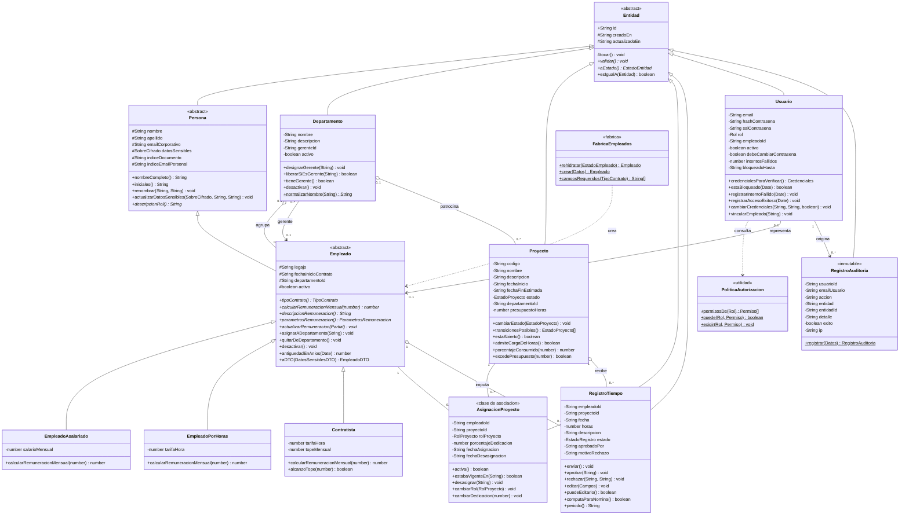
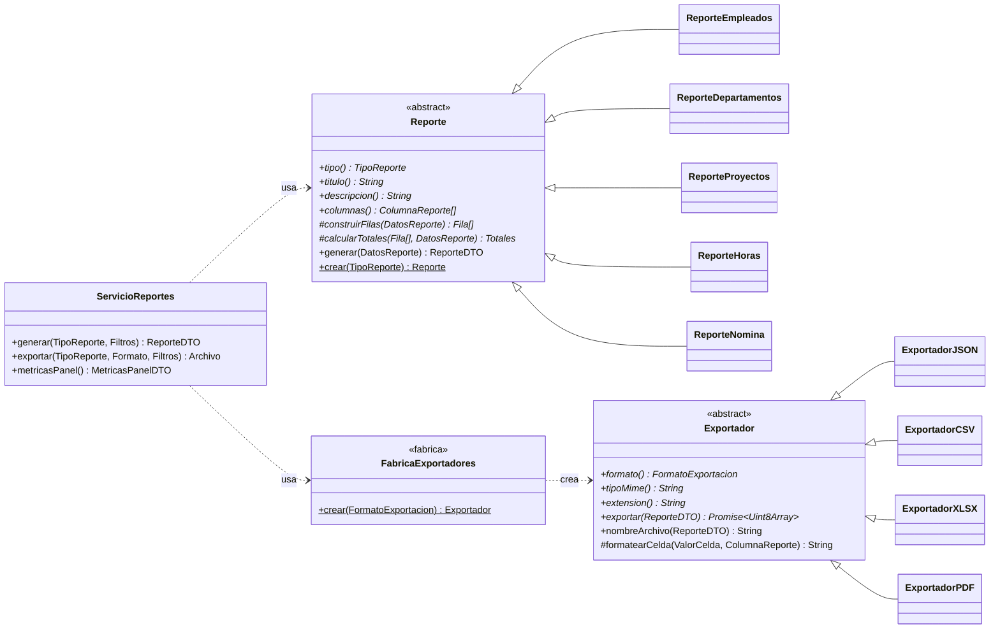
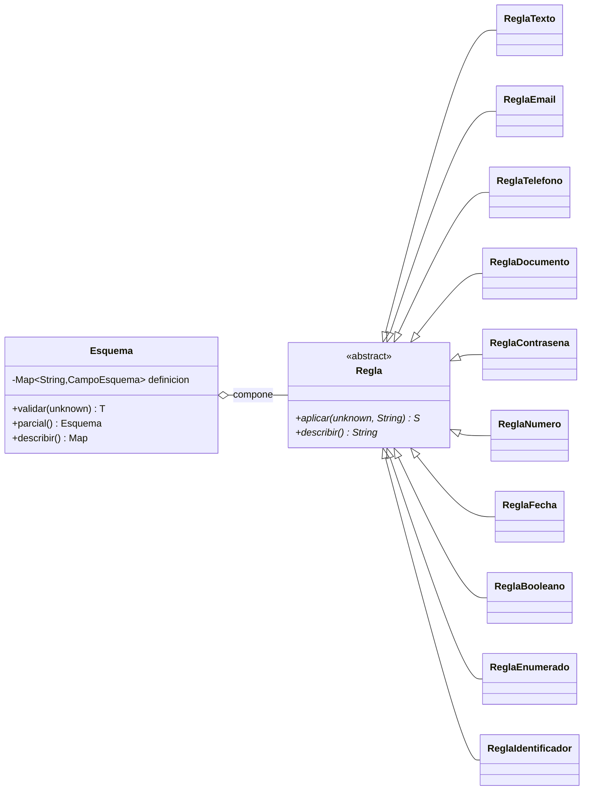
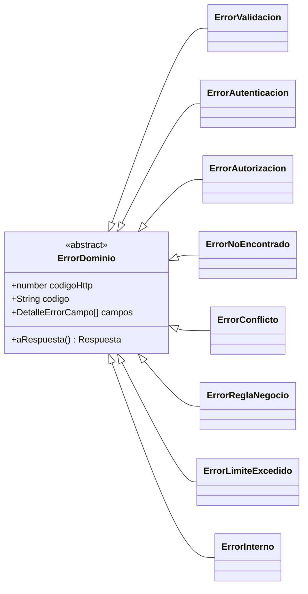
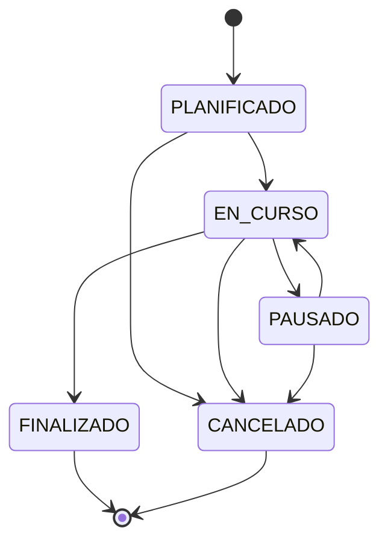
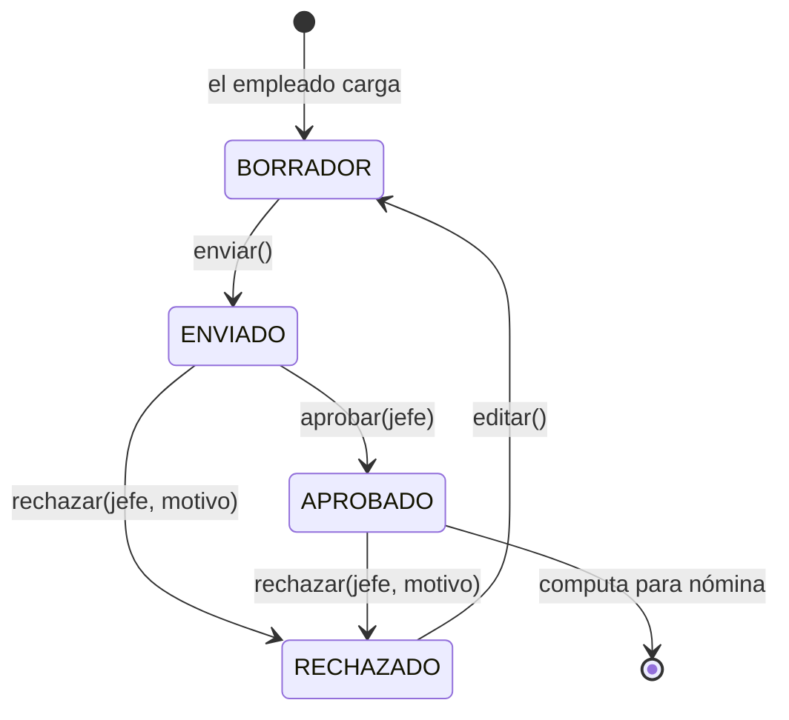
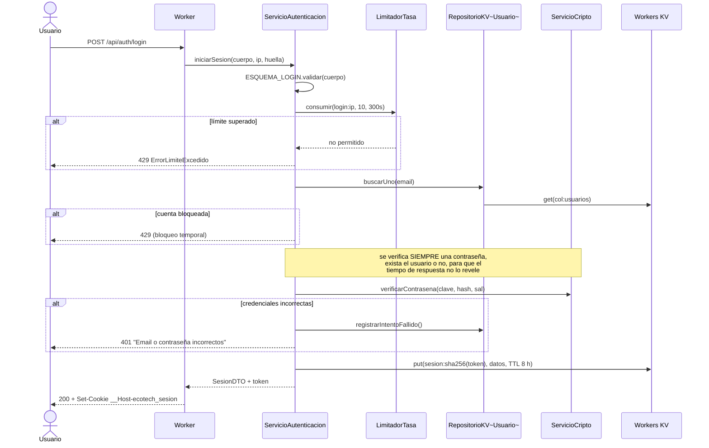
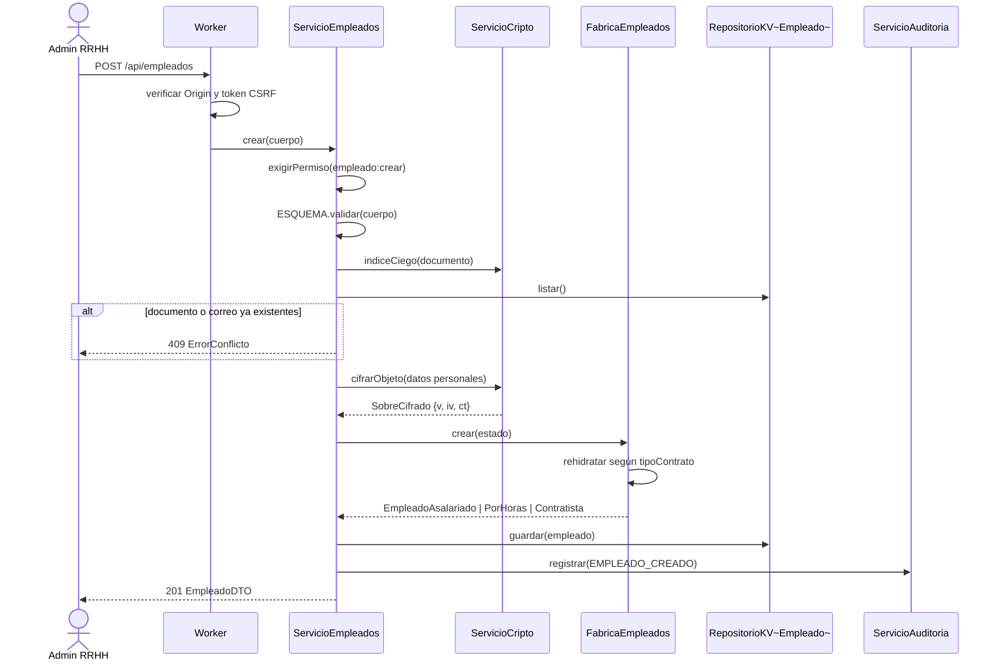
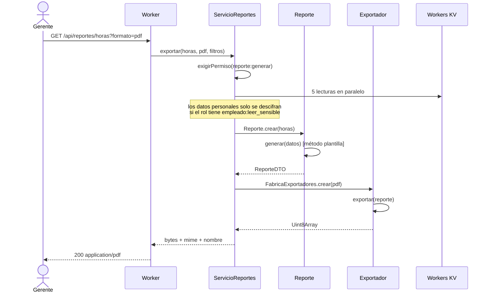

# 3. Modelo estructural en UML

> Diagrama de clases final del sistema, con atributos, métodos, relaciones y
> multiplicidades, más los diagramas de comportamiento que lo complementan.
> La justificación de cada decisión está en
> [04-justificacion-diseno.md](04-justificacion-diseno.md).

## Contenido

- [3.1. Diagrama de clases del dominio](#31-diagrama-de-clases-del-dominio)
- [3.2. Catálogo de clases](#32-catálogo-de-clases)
- [3.3. Relaciones y multiplicidades](#33-relaciones-y-multiplicidades)
- [3.4. Jerarquía de reportes y exportadores](#34-jerarquía-de-reportes-y-exportadores)
- [3.5. Jerarquía de validación y de errores](#35-jerarquía-de-validación-y-de-errores)
- [3.6. Persistencia: el patrón Repositorio](#36-persistencia-el-patrón-repositorio)
- [3.7. Máquinas de estados](#37-máquinas-de-estados)
- [3.8. Diagramas de secuencia](#38-diagramas-de-secuencia)
- [3.9. Notación empleada](#39-notación-empleada)

---

## 3.1. Diagrama de clases del dominio



> El diagrama muestra el dominio. Las capas de aplicación, infraestructura y
> presentación se documentan en
> [05-arquitectura.md](05-arquitectura.md).

---

## 3.2. Catálogo de clases

### `Entidad` (abstracta) — `src/dominio/base/Entidad.ts`

Raíz de la jerarquía. Aporta identidad (`id` inmutable), marcas de tiempo y el
contrato `validar()` / `aEstado()`. `tocar()` es `protected`: toda mutación pasa
por él, de modo que `actualizadoEn` no puede quedar desfasado.

La igualdad es **por identidad, no por valor**: dos empleados con los mismos
datos son personas distintas.

### `Persona` (abstracta) — `src/dominio/personas/Persona.ts`

Concentra lo que hace de alguien una persona física y, con ello, la protección de
sus datos. `datosSensibles` es un `SobreCifrado`: la entidad **nunca ve el texto
en claro**. Descifrar es una operación asíncrona y con permisos, y por eso vive en
la capa de servicio. Así la entidad permanece síncrona y comprobable sin
criptografía.

`indiceDocumento` e `indiceEmailPersonal` son HMAC-SHA256 de esos valores.
Permiten responder "¿ya existe un empleado con este documento?" sin descifrar la
colección entera.

### `Empleado` (abstracta) — `src/dominio/personas/Empleado.ts`

Declara cuatro miembros abstractos que cada modalidad de contrato resuelve a su
manera. El invariante "un empleado pertenece a un solo departamento a la vez" se
cumple **por construcción**: `departamentoId` es un campo escalar, no una
colección. Reasignar es reemplazar, nunca añadir.

La baja es lógica (`desactivar()`), no física: borrar el registro dejaría
huérfanas las horas y asignaciones históricas, y los informes de períodos
cerrados cambiarían retroactivamente.

### Las tres subclases

| Clase | Parámetros | Fórmula |
|---|---|---|
| `EmpleadoAsalariado` | `salarioMensual` | Importe fijo, con independencia de las horas |
| `EmpleadoPorHoras` | `tarifaHora` | `horas × tarifa`, con las que superan 160 h/mes al 1,5× |
| `Contratista` | `tarifaHora`, `topeMensual` | `min(horas × tarifa, tope)`, sin recargo por extras |

### `AsignacionProyecto` — clase de asociación

Resuelve el muchos-a-muchos entre `Empleado` y `Proyecto`. Los cuatro atributos
del vínculo (rol, dedicación, fecha de alta, fecha de baja) no pertenecen a
ninguno de los dos extremos.

`estabaVigenteEn(fecha)` es la operación que sostiene la trazabilidad: no se
imputan horas a un proyecto en el que no se participaba ese día.

### `RegistroTiempo` — `src/dominio/tiempo/RegistroTiempo.ts`

Circuito de aprobación explícito en lugar de una celda editable. Un registro
aprobado no se edita: para corregirlo hay que rechazarlo antes, y ese rechazo
queda en la auditoría. Es lo que impide reescribir el pasado sin dejar rastro.

`aprobar()` rechaza que el aprobador sea el propio autor: separación de funciones.

### `Usuario` — `src/dominio/seguridad/Usuario.ts`

Entidad **separada** de `Empleado`, con asociación opcional `0..1` en ambos
sentidos. Hay empleados sin cuenta y cuentas sin empleado.

Lleva su propia defensa contra fuerza bruta: cinco intentos fallidos bloquean la
cuenta quince minutos. El bloqueo es temporal a propósito, para que un atacante no
pueda dejar fuera del sistema a un empleado legítimo.

### `RegistroAuditoria` — inmutable

No expone ningún método de mutación. Un asiento que se puede editar no sirve como
evidencia. Por eso tampoco participa del patrón `tocar()` del resto de entidades.

---

## 3.3. Relaciones y multiplicidades

| Origen | Destino | Tipo | Multiplicidad | Justificación |
|---|---|---|---|---|
| `Departamento` | `Empleado` | Agregación | `0..1` ↔ `0..*` | Un empleado pertenece a un departamento a la vez, y puede no tener ninguno (recién ingresado, o dado de baja). Disolver un departamento **no** elimina a su gente: por eso agregación y no composición |
| `Departamento` | `Empleado` (gerente) | Asociación dirigida | `0..*` ↔ `0..1` | El puesto puede estar vacante. Un mismo empleado podría dirigir más de un área en una empresa pequeña |
| `Departamento` | `Proyecto` | Agregación | `0..1` ↔ `0..*` | Un proyecto puede ser transversal y no colgar de ningún área |
| `Empleado` | `AsignacionProyecto` | Asociación | `1` ↔ `0..*` | Toda asignación pertenece a un empleado; un empleado puede no estar asignado a nada |
| `Proyecto` | `AsignacionProyecto` | Asociación | `1` ↔ `0..*` | Simétrico |
| `Empleado` | `RegistroTiempo` | Agregación | `1` ↔ `0..*` | El registro carece de sentido sin su autor, pero se conserva aunque el empleado cause baja |
| `Proyecto` | `RegistroTiempo` | Agregación | `1` ↔ `0..*` | Requisito explícito: las horas se imputan a un empleado **y** a un proyecto |
| `Usuario` | `Empleado` | Asociación dirigida | `0..1` ↔ `0..1` | Ni todo empleado tiene cuenta ni toda cuenta corresponde a un empleado |

### Por qué agregación y no composición

La composición (rombo relleno) significa que la parte no existe fuera del todo y
se destruye con él. Aplicada a `Departamento → Empleado` implicaría que eliminar
un área elimina a sus empleados, que es falso en cualquier empresa.

`Empleado → RegistroTiempo` sí se acerca a la composición conceptual —un parte de
horas no significa nada sin su autor—, pero se modela como agregación porque **el
sistema no borra en cascada**: la baja de un empleado es lógica y sus registros
sobreviven para que los informes históricos sigan cuadrando.

### Cómo se materializan las relaciones

Las asociaciones se persisten como **identificadores**, no como referencias a
objetos:

```ts
class Departamento {
  private _gerenteId: string | null;   // no: private _gerente: Empleado
}
```

Tres razones: evita ciclos al serializar, evita reescribir todos los
departamentos cuando cambia un empleado, y encaja con un almacén clave-valor,
donde cada colección se guarda por separado. La contrapartida es que la
integridad referencial no la garantiza el modelo: la imponen los servicios, que
comprueban que el identificador exista y apunte a una entidad activa antes de
guardar.

---

## 3.4. Jerarquía de reportes y exportadores

Dos ejes independientes que se combinan sin condicionales.



`Reporte.generar()` es un **método plantilla**: la clase base fija el algoritmo
(cabecera, columnas, filas, totales) y las subclases rellenan los pasos. El
servicio no sabe qué informes existen:

```ts
const reporte = Reporte.crear(tipo).generar(datos);
const bytes = await FabricaExportadores.crear(formato).exportar(reporte);
```

Cinco informes × cuatro formatos = veinte combinaciones, sin un solo `switch` en
el servicio. Añadir un informe es añadir una clase; añadir un formato, también.

`FabricaExportadores` vive en su propio módulo y no como método estático de
`Exportador` por una razón concreta que se explica en
[04-justificacion-diseno.md](04-justificacion-diseno.md#48-por-qué-las-fábricas-viven-en-módulos-aparte):
la cláusula `extends` se evalúa al cargar el módulo, de modo que una base que
importa a sus subclases produce un ciclo que revienta en tiempo de carga.

---

## 3.5. Jerarquía de validación y de errores





| Error | HTTP | Cuándo |
|---|---|---|
| `ErrorValidacion` | 400 | La entrada no cumple el esquema |
| `ErrorAutenticacion` | 401 | Sin sesión válida o credenciales incorrectas |
| `ErrorAutorizacion` | 403 | Hay sesión, pero el rol no habilita la operación |
| `ErrorNoEncontrado` | 404 | La entidad referenciada no existe |
| `ErrorConflicto` | 409 | Choca con un invariante de unicidad |
| `ErrorReglaNegocio` | 422 | Sintácticamente válido, pero viola una regla |
| `ErrorLimiteExcedido` | 429 | Se superó el límite de intentos |
| `ErrorInterno` | 500 | Fallo no atribuible al cliente |

El polimorfismo está en que la capa HTTP no interroga el tipo concreto: pregunta
al error por su propio `codigoHttp`. Añadir un error nuevo no obliga a tocar el
enrutador.

---

## 3.6. Persistencia: el patrón Repositorio

```mermaid
classDiagram
    direction LR

    class Repositorio~T~ {
        <<interface>>
        +obtener(String) Promise~T~
        +obtenerOFallar(String) Promise~T~
        +listar(filtro) Promise~T[]~
        +guardar(T) Promise~T~
        +guardarVarias(T[]) Promise~void~
        +eliminar(String) Promise~boolean~
        +existe(String) Promise~boolean~
        +contar(filtro) Promise~number~
        +buscarUno(predicado) Promise~T~
    }

    class RepositorioKV~T~ {
        -AlmacenKV almacen
        -String coleccion
        -Function rehidratar
    }

    class AlmacenKV {
        -Map cache
        -Map enVuelo
        +leer(String) Promise~T~
        +escribir(String, T, number) Promise~void~
        +mutar(String, mutador) Promise~T~
        +mutarColeccion(String, mutador) Promise~Map~
        +siguienteCorrelativo(String) Promise~number~
    }

    class Contexto {
        +Entorno entorno
        +Solicitante solicitante
        +AlmacenKV almacen
        +ServicioCripto cripto
        +LimitadorTasa limitador
        +empleados() RepositorioKV
        +departamentos() RepositorioKV
        +proyectos() RepositorioKV
        +asignaciones() RepositorioKV
        +registrosTiempo() RepositorioKV
        +usuarios() RepositorioKV
        +auditoria() RepositorioKV
        +exigirPermiso(Permiso) Solicitante
    }

    Repositorio~T~ <|.. RepositorioKV~T~
    RepositorioKV~T~ --> AlmacenKV
    Contexto o-- RepositorioKV~T~
    Contexto o-- AlmacenKV
```



`RepositorioKV<T, E>` es **una sola clase genérica** que sirve a las siete
colecciones. La reconstrucción del objeto a partir del estado plano se delega en
una función que recibe por constructor, así que no hace falta una subclase de
repositorio por entidad. Es composición en lugar de herencia: parametrizar la
única clase que hay, en vez de multiplicarla.

---

## 3.7. Máquinas de estados

### Proyecto



`FINALIZADO` y `CANCELADO` son terminales a propósito. Para revivir un proyecto
se crea uno nuevo, de modo que los informes de períodos cerrados nunca cambien
retroactivamente. Solo `EN_CURSO` admite carga de horas.

### Registro de tiempo



Tres reglas que el diagrama hace explícitas:

1. Solo `APROBADO` computa para la nómina y los informes de costo.
2. `aprobar()` exige que el aprobador **no** sea el autor.
3. Un registro aprobado no se edita: hay que rechazarlo antes, y el rechazo exige
   un motivo de al menos cinco caracteres y queda en la auditoría.

---

## 3.8. Diagramas de secuencia

### Inicio de sesión



### Alta de empleado, con control de duplicados



### Generación de un informe



---

## 3.9. Notación empleada

Los diagramas están en **Mermaid**, que GitHub renderiza directamente. Las
convenciones son las de UML 2.5:

| Símbolo | Significado |
|---|---|
| `<<abstract>>` | Clase abstracta: no se instancia |
| `*` tras la firma | Método abstracto |
| `$` tras la firma | Miembro estático |
| `+` `#` `-` | Visibilidad pública, protegida, privada |
| `<|--` | Herencia (generalización) |
| `<|..` | Implementación de interfaz |
| `o--` | Agregación (rombo hueco): la parte sobrevive al todo |
| `*--` | Composición (rombo relleno): la parte muere con el todo |
| `-->` | Asociación dirigida |
| `..>` | Dependencia (uso puntual) |
| `"0..1"` `"0..*"` `"1"` | Multiplicidades |

**Sobre visibilidad y TypeScript.** El diagrama marca como `#` (protegido) lo que
en el código es `protected`, y como `-` lo que es `private`. TypeScript aplica
ambos en tiempo de compilación; en tiempo de ejecución no hay barrera real, salvo
para los campos con `#` nativo, que aquí no se usan porque complican la
serialización. El encapsulamiento del sistema descansa en el compilador, en la
revisión de código y, sobre todo, en que la única vía de mutación son operaciones
con nombre de negocio: no hay setters genéricos que saltarse.

---

**Anterior:** [2. Evaluación crítica](02-evaluacion-critica-ia.md) · **Siguiente:** [4. Justificación técnica del diseño](04-justificacion-diseno.md)
