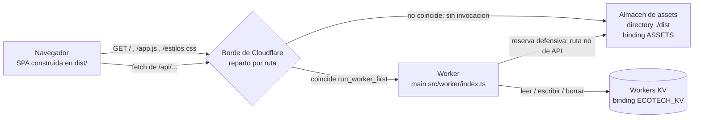
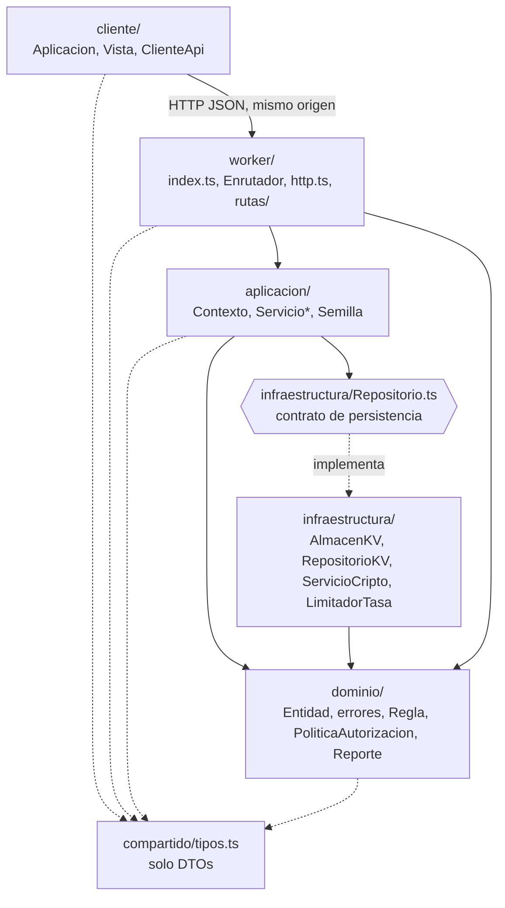
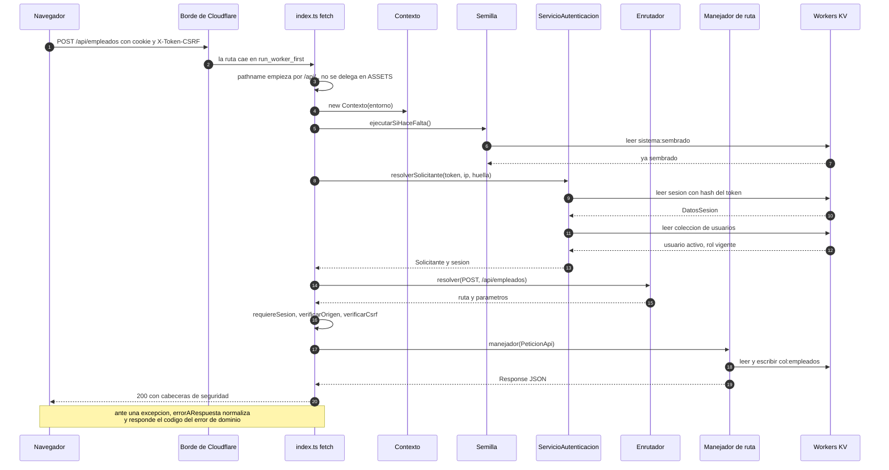

# Arquitectura de EcoTech Solutions

Este documento describe cómo está construido el sistema de gestión interna: qué
se despliega, cómo se reparte el tráfico, qué capas hay y qué depende de qué,
qué ocurre exactamente durante una petición, y qué compromisos se asumieron.
Todo lo que se afirma aquí es comprobable en el código; se citan las rutas.

## Tabla de contenidos

- [1. Vista general](#1-vista-general)
- [2. Capas y regla de dependencia](#2-capas-y-regla-de-dependencia)
- [3. Ciclo de vida de una petición](#3-ciclo-de-vida-de-una-petición)
- [4. Inyección de dependencias](#4-inyección-de-dependencias)
- [5. Arranque en frío y rendimiento](#5-arranque-en-frío-y-rendimiento)
- [6. Compilación y despliegue](#6-compilación-y-despliegue)
- [7. Limitaciones asumidas](#7-limitaciones-asumidas)

---

## 1. Vista general

El sistema se despliega como **un único Worker de Cloudflare** más un **almacén
de assets estáticos**, ambos declarados en el mismo `wrangler.jsonc`, y un
**namespace de Workers KV** como única persistencia. No hay base de datos
relacional, ni servidor de aplicaciones, ni proceso separado para el frontend.

```jsonc
// wrangler.jsonc
"main": "src/worker/index.ts",
"assets": {
  "directory": "./dist",
  "binding": "ASSETS",
  "not_found_handling": "single-page-application",
  "run_worker_first": ["/api/*"]
},
"kv_namespaces": [{ "binding": "ECOTECH_KV", "id": "23f56c5aab26495994322da9c054565f" }]
```

### Reparto del tráfico

`run_worker_first: ["/api/*"]` es lo que decide, en el borde y antes de que
exista una invocación, qué petición ejecuta código:

| Petición | Quién responde | ¿Invoca el Worker? |
| --- | --- | --- |
| cualquier `/api/...` | `src/worker/index.ts` | sí |
| `GET /` , `GET /app.js` , `GET /estilos.css` | almacén de assets (`./dist`) | no |
| cualquier otra ruta fuera de `/api/` | almacén de assets, reserva a `index.html` por `not_found_handling` | no |

La reserva de SPA es una red y no un requisito: `src/cliente/Aplicacion.ts`
enruta por fragmento (`#/empleados`), y su comentario explica que se eligió así
precisamente para que la navegación no dependa de que el servidor devuelva
`index.html` en cada ruta profunda.

Servir el frontend no consume invocación ni tiempo de CPU del Worker: el bundle,
el HTML y el CSS salen directamente del almacén de assets. El código del Worker
solo corre para la API.

`src/worker/index.ts` conserva de todos modos una reserva defensiva por si la
configuración cambiara:

```ts
if (!url.pathname.startsWith('/api/')) {
  return aplicarCabecerasSeguridad(await entorno.ASSETS.fetch(peticion));
}
```

Es decir: si algo que no es API llegara al Worker, se delega en el binding
`ASSETS` en lugar de devolver un 404 de API.

### Por qué un solo Worker y un solo origen

La decisión no es estética; hay tres mecanismos del sistema que **dependen** de
que la SPA y la API compartan origen:

1. **La cookie de sesión.** `NOMBRE_COOKIE_SESION` es `__Host-ecotech_sesion`
   (`src/dominio/seguridad/Sesion.ts`). El prefijo `__Host-` exige `Path=/`,
   HTTPS y **ausencia de `Domain`**: solo funciona si quien la recibe y quien la
   envía son el mismo host.
2. **La defensa anti-CSRF de primer nivel.** `verificarOrigen` en
   `src/worker/http.ts` compara `new URL(origen).host` con
   `new URL(peticion.url).host`. Con dos orígenes distintos esa comparación
   habría que relajarla y dejaría de servir.
3. **La CSP.** `src/worker/http.ts` fija `default-src 'none'` y luego
   `script-src 'self'`, `style-src 'self'`, `connect-src 'self'`. Un frontend en
   otro origen obligaría a abrir `connect-src` a un host externo.

Además no hay CORS que configurar ni preflight que pagar: el navegador manda
`credentials: 'same-origin'` desde `src/cliente/ClienteApi.ts` y listo.

### Diagrama de despliegue



---

## 2. Capas y regla de dependencia

| Directorio | Responsabilidad | De quién depende |
| --- | --- | --- |
| `src/compartido/tipos.ts` | DTOs y uniones de literales que cruzan la red | de nadie |
| `src/dominio/` | entidades, invariantes, validación, RBAC, reportes | de `compartido` (y una fuga documentada abajo) |
| `src/infraestructura/` | `AlmacenKV`, `RepositorioKV`, `Repositorio`, `ServicioCripto`, `LimitadorTasa` | de `dominio/base` |
| `src/aplicacion/` | `Contexto` y los casos de uso (`Servicio*.ts`, `Semilla.ts`) | de `dominio` e `infraestructura` |
| `src/worker/` | `index.ts`, `Enrutador`, `http.ts`, `rutas/*.ts` | de `aplicacion` y `dominio` |
| `src/cliente/` | SPA en TypeScript sin framework | solo de `compartido` |

`src/compartido/tipos.ts` no importa nada, y por eso lo pueden incluir tanto el
bundle del Worker como el del navegador sin arrastrar código detrás. Los roles y
permisos se modelan como uniones de literales (`ROLES`, `PERMISOS`) y no como
`enum`, para que el tipo sobreviva al borrado de tipos de esbuild.

### La regla de dependencia

Las flechas apuntan siempre hacia adentro. Comprobado sobre el árbol de imports:
`src/infraestructura/*.ts` solo importa `dominio/base/Entidad.js`,
`dominio/base/errores.js` y sus propios módulos; ni `aplicacion` ni `dominio`
importan nada de `src/worker/` o `src/cliente/`.

**El contrato de persistencia es `src/infraestructura/Repositorio.ts`**, una
interfaz de nueve métodos (`obtener`, `obtenerOFallar`, `listar`, `guardar`,
`guardarVarias`, `eliminar`, `existe`, `contar`, `buscarUno`) que no menciona KV
en ninguna firma. `RepositorioKV` la implementa sobre `AlmacenKV`.

El problema concreto que eso resuelve: `RepositorioKV` guarda **la colección
entera bajo una sola clave** (`col:empleados`, `col:proyectos`, …), un modelo de
datos que solo tiene sentido en un almacén clave-valor con coste por operación.
Si mañana se migra a D1 o Postgres, ese modelo desaparece — pero las reglas de
negocio de `ServicioEmpleados` o de `Empleado` no cambian, porque solo conocen
los nueve métodos. Es también lo que hace testeable el núcleo: `tests/` ejercita
dominio e infraestructura sin levantar un Worker.

Dos matices honestos, ambos verificables:

- Los getters de `Contexto` están anotados con el tipo **concreto**
  `RepositorioKV<Empleado, EstadoEmpleado>`, no con `Repositorio<...>`. En la
  práctica los servicios solo invocan métodos que están en la interfaz, pero el
  tipo no lo obliga hoy.
- `src/dominio/personas/Persona.ts` importa `SobreCifrado` desde
  `../../infraestructura/ServicioCripto.js`. Es un `import type` (se borra en
  compilación), pero la flecha va en el sentido incorrecto.

### Diagrama de capas



---

## 3. Ciclo de vida de una petición

Paso a paso siguiendo `src/worker/index.ts` de arriba abajo.

**0. Antes del Worker.** El borde aplica `run_worker_first`. Solo `/api/*` llega
al `fetch`.

**1. Assets contra API.** Se construye `new URL(peticion.url)`. Si el `pathname`
no empieza por `/api/`, se responde con `entorno.ASSETS.fetch(peticion)` envuelto
en `aplicarCabecerasSeguridad`. Es la reserva defensiva; en operación normal no
se ejecuta.

**2. Contexto.** `const ctx = new Contexto(entorno)`. El constructor crea
`AlmacenKV`, `ServicioCripto` (resolviendo la clave maestra) y `LimitadorTasa`.
Los siete repositorios **no** se crean aquí (ver sección 4).

**3. Siembra perezosa.** `await new Semilla(ctx).ejecutarSiHaceFalta()`. Lee la
clave `sistema:sembrado`; si ya está marcada devuelve `false` y sigue. Existe
porque en Workers no hay un paso de post-despliegue donde correr migraciones:
sin esto, un despliegue limpio no tendría ningún usuario con el que entrar. La
marca se escribe al terminar, así que la operación es idempotente.

**4. Resolución de sesión.** `ServicioAutenticacion.leerTokenDeCookie` recorre la
cabecera `Cookie` buscando `__Host-ecotech_sesion` y solo acepta el valor si
coincide con `/^[0-9a-f]{64}$/`. Después, `resolverSolicitante(token, ip, huella)`:

1. calcula `sha256(token)` y lee la clave `sesion:<hash>` — en KV se guarda el
   hash, nunca el token;
2. si `sesionExpirada`, borra la clave y devuelve `null`;
3. si la huella guardada difiere de la actual (`huellaDe` en `src/worker/http.ts`,
   un FNV-1a del `User-Agent`, deliberadamente sin la IP), borra la sesión;
4. relee el usuario y exige que exista y esté `activo`;
5. devuelve el `Solicitante` con el **rol releído del usuario**, no el
   desnormalizado en la sesión.

Si hay resultado, se asigna a `ctx.solicitante`.

**5. Resolución de ruta.** `enrutador.resolver(metodo, pathname)` recorre
linealmente las rutas registradas y compara **segmento a segmento**, no con
expresiones regulares (`src/worker/Enrutador.ts`). Los segmentos `:param` se
decodifican con `decodeURIComponent` una sola vez. Si no hay coincidencia se
consulta `metodosDe(ruta)`: si la ruta existe con otros verbos la respuesta es
`405 METODO_NO_PERMITIDO` con la cabecera `Allow`; si no existe en absoluto,
`404 NO_ENCONTRADO`.

**6. Sesión obligatoria.** `ruta.requiereSesion` vale `true` por defecto en
`Enrutador.registrar`. Solo tres de las 34 rutas registradas lo desactivan:
`POST /api/auth/login`, `POST /api/auth/logout` y `GET /api/salud`. Si la ruta
la exige y no hubo sesión resuelta, se lanza `ErrorAutenticacion` (401).

**7. Origen y CSRF.** Solo para `POST`, `PUT`, `PATCH` y `DELETE`:

- `verificarOrigen(peticion)` compara el host de `Origin` con el de la URL. Si no
  hay `Origin`, se acepta: los navegadores lo envían siempre en peticiones
  cruzadas que mutan datos. Falla → `ErrorAutorizacion` (403).
- `autenticacion.verificarCsrf(resuelto.sesion, cabecera)` con la cabecera
  `X-Token-CSRF` (`CABECERA_CSRF`), comparada con
  `ServicioCripto.comparacionConstante` contra el `tokenCsrf` de la sesión. Solo
  se aplica **si hay sesión**: el login todavía no tiene ninguno que enviar.

**8. Ejecución.** Se arma el objeto `PeticionApi` (`peticion`, `url`,
`parametros`, `ctx`, `sesion`, `cabecerasExtra`) y se invoca `ruta.manejador(api)`.
El manejador instancia el servicio que necesita (`new ServicioEmpleados(api.ctx)`)
y devuelve con `json`, `sinContenido` o `archivo` de `src/worker/http.ts`. Toda
respuesta de API lleva `CABECERAS_SEGURIDAD` y `Cache-Control: no-store, ...`.

**9. Traducción de errores.** Un único `catch` envuelve todo lo anterior.
`errorARespuesta` llama a `normalizarError`, que devuelve el error tal cual si es
un `ErrorDominio` y lo colapsa a `ErrorInterno` en cualquier otro caso — un fallo
inesperado nunca filtra mensaje ni traza. La capa HTTP no hace `instanceof`
encadenados: pregunta a cada error por su `codigoHttp` y su `codigo`.

| Error (`src/dominio/base/errores.ts`) | HTTP | `codigo` |
| --- | --- | --- |
| `ErrorValidacion` | 400 | `VALIDACION` |
| `ErrorAutenticacion` | 401 | `NO_AUTENTICADO` |
| `ErrorAutorizacion` | 403 | `NO_AUTORIZADO` |
| `ErrorNoEncontrado` | 404 | `NO_ENCONTRADO` |
| `ErrorConflicto` | 409 | `CONFLICTO` |
| `ErrorReglaNegocio` | 422 | `REGLA_NEGOCIO` |
| `ErrorLimiteExcedido` | 429 | `LIMITE_EXCEDIDO` |
| `ErrorInterno` | 500 | `ERROR_INTERNO` |

Los 5xx se registran con `console.error`; el 429 añade `Retry-After` leyendo
`reintentarEnSegundos`. Añadir un error nuevo no obliga a tocar el router.

### Diagrama de secuencia



---

## 4. Inyección de dependencias

`src/aplicacion/Contexto.ts` es el contenedor. Se construye **uno por petición**,
dentro del `fetch`, y agrupa todo lo que un caso de uso puede necesitar.

Lo que se crea **con avidez** en el constructor, porque casi toda petición lo
toca o es trivialmente barato:

```ts
this.almacen = new AlmacenKV(entorno.ECOTECH_KV);
this.cripto = new ServicioCripto(Contexto.resolverClaveMaestra(entorno));
this.limitador = new LimitadorTasa(this.almacen);
```

Lo que se crea **de forma perezosa**: los siete repositorios, cada uno tras un
getter con `??=`.

```ts
get departamentos(): RepositorioKV<Departamento, EstadoDepartamento> {
  this._departamentos ??= new RepositorioKV<Departamento, EstadoDepartamento>(
    this.almacen, 'departamentos', (estado) => new Departamento(estado), 'el departamento',
  );
  return this._departamentos;
}
```

Una petición que solo lista departamentos no paga por instanciar los siete. El
tercer argumento del constructor es la función `rehidratar`: es lo que permite
que **una sola clase** de repositorio sirva a todas las entidades — composición
en lugar de una subclase por entidad. Para empleados es
`FabricaEmpleados.rehidratar`, que devuelve `EmpleadoAsalariado`,
`EmpleadoPorHoras` o `Contratista` según el estado persistido.

### Por qué no hay singletons

- **Los bindings no existen a nivel de módulo.** `entorno.ECOTECH_KV` y
  `entorno.ASSETS` llegan como argumento del `fetch`. Un `AlmacenKV` construido
  al cargar el módulo no tendría a qué apuntar.
- **El isolate no es un proceso.** Cloudflare puede reutilizar un isolate para
  peticiones consecutivas, descartarlo en cualquier momento o servir dos
  peticiones simultáneas en isolates distintos. No hay garantía de que un estado
  global sobreviva ni de que sea el mismo para dos peticiones.
- **Estado global compartido entre usuarios es una fuga de datos.** El
  `Contexto` lleva `solicitante` (usuario, rol, `empleadoId`). Si viviera en un
  módulo, la petición de un usuario podría heredar la identidad de otro.
- **Testabilidad.** Cada servicio recibe el contexto por constructor
  (`new ServicioEmpleados(ctx)`), así que sus dependencias son explícitas. No hay
  imports con efectos secundarios que haya que interceptar en una prueba.

La autorización también cuelga del contexto: `exigirSolicitante()`,
`exigirPermiso(permiso)` y `puede(permiso)` delegan en `PoliticaAutorizacion`,
cuya matriz de roles es `deny-by-default` y está congelada con `Object.freeze`.

Un detalle operativo: `Contexto.resolverClaveMaestra` acepta el secret
`CLAVE_MAESTRA` solo si tiene 32 caracteres o más; si falta, cae a una clave de
desarrollo escrita en el repositorio para que `wrangler dev` arranque sin
configurar nada. El getter `usaClaveDeDesarrollo` expone esa condición y
`GET /api/salud` la reporta con una advertencia explícita.

---

## 5. Arranque en frío y rendimiento

### Qué se paga una vez por isolate (nivel de módulo)

| Qué | Dónde |
| --- | --- |
| Tabla de rutas: `new Enrutador()` + los 8 `registrarRutas*` = 34 rutas | `src/worker/index.ts` |
| `METODOS_MUTANTES` (`Set`) | `src/worker/index.ts` |
| Cadena CSP y `CABECERAS_SEGURIDAD` congeladas | `src/worker/http.ts` |
| Matriz RBAC congelada | `src/dominio/seguridad/PoliticaAutorizacion.ts` |
| Esquemas de validación (`ESQUEMA_CREAR`, `ESQUEMA_LOGIN`, …) como constantes de módulo, con sus `RegExp` ya compilados | `src/aplicacion/Servicio*.ts` |

El registro de rutas es puro: no depende del entorno, así que no hay razón para
rehacerlo en cada petición. El comentario del propio `index.ts` lo dice.

### Qué se paga en cada petición

`new Contexto` (con `AlmacenKV`, `ServicioCripto` y `LimitadorTasa`), la
comprobación de siembra, la resolución de sesión y el recorrido lineal de la
tabla de rutas. En términos de accesos a KV, una petición autenticada típica
arranca con tres lecturas antes de tocar su propio dato: `sistema:sembrado`,
`sesion:<hash>` y `col:usuarios`.

### La caché de `AlmacenKV`

`src/infraestructura/AlmacenKV.ts` mantiene un `Map` de `clave -> { valor, expira }`
con `TTL_CACHE_MS = 5_000` y escritura directa: `escribir` y `borrar` refrescan la
entrada además de ir a KV. El objetivo declarado es que el usuario nunca vea su
propia escritura desaparecer, dado que KV es eventualmente consistente entre
centros de datos.

**Alcance real:** el `Map` es un campo de instancia y `AlmacenKV` se instancia
dentro de `Contexto`, que es por petición. Por tanto la caché vive **lo que dura
una petición**, no lo que dura el isolate, pese a lo que dice el comentario de la
clase. El efecto útil sigue siendo notable: si tres servicios de la misma
petición necesitan `col:empleados`, KV se lee una sola vez. Lo mismo vale para el
mapa `enVuelo`, que serializa los ciclos leer-modificar-escribir sobre una misma
clave: serializa dentro de la petición, no entre peticiones concurrentes del
mismo isolate.

### Coste del modelo de datos

Una clave por colección significa: leer una colección = **1 lectura**; escribir
un registro = **1 lectura + 1 escritura**. Es la razón de ser del diseño: KV cobra
y limita por operación, y una clave por empleado convertiría un listado en
1 `list` + N `get`.

### Criptografía

`ServicioCripto` deriva por HKDF una subclave distinta por propósito y las cachea
en la instancia (`claveAes`, `claveHmac`), es decir una derivación por petición y
propósito. PBKDF2 con `ITERACIONES_PBKDF2 = 100_000` solo interviene en el login y
en el cambio de contraseña; por eso `ESQUEMA_LOGIN` acota la contraseña a 128
caracteres, para que nadie provoque un DoS por PBKDF2.

---

## 6. Compilación y despliegue

### `npm run build`

```
build     = npm run typecheck && node scripts/build.mjs
typecheck = tsc -p tsconfig.worker.json && tsc -p tsconfig.cliente.json && tsc -p tsconfig.tests.json
deploy    = npm run build && wrangler deploy
```

`scripts/build.mjs` produce el contenido de `dist/`, que es exactamente el
`assets.directory` de `wrangler.jsonc`:

1. borra y recrea `dist/`, para que ningún archivo de un build anterior quede
   subido y servido indefinidamente en el borde;
2. empaqueta `src/cliente/main.ts` con esbuild a `dist/app.js`
   (`bundle`, `format: 'esm'`, `target: 'es2022'`, `platform: 'browser'`,
   `minify`, `sourcemap`). Si falla, fija `process.exitCode = 1` y relanza, lo que
   corta la cadena `&&` antes de `wrangler deploy`;
3. copia `index.html` y `estilos.css` tal cual;
4. calcula un SHA-256 truncado a 10 hex de cada asset ya minificado y reescribe
   los atributos `src`/`href` de `index.html` como `app.js?v=<hash>`. Un hash por
   archivo, para que retocar los estilos no invalide la caché del bundle.

`scripts/build.mjs` pasa `tsconfig: tsconfig.cliente.json` de forma explícita, y
el comentario explica por qué: el `tsconfig.json` de la raíz es un proyecto de
solo referencias (`"files": []` + `references`), esbuild no sigue referencias de
proyecto, y si autodescubriera ese archivo perdería
`useDefineForClassFields: false`. Con semántica `[[Define]]`, los campos de clase
declarados en una subclase pisan con `undefined` lo que el constructor de
`Entidad` ya había asignado — un fallo en tiempo de ejecución que `tsc --noEmit`
no puede ver. `scripts/build-tests.mjs` apunta por lo mismo a `tsconfig.base.json`.

### `wrangler deploy`

Wrangler empaqueta el Worker desde `main` (`src/worker/index.ts`) resolviendo sus
imports, y sube `dist/` como almacén de assets con el binding `ASSETS`. Los dos
artefactos viajan en el mismo despliegue, de ahí que `dist/` esté en `.gitignore`
junto a `build-tests/` y `.wrangler/`: se regeneran siempre antes de publicar.

### Por qué tres `tsconfig`

| Proyecto | `lib` | `types` | `include` |
| --- | --- | --- | --- |
| `tsconfig.worker.json` | `ES2022` | `@cloudflare/workers-types` | `compartido`, `dominio`, `infraestructura`, `aplicacion`, `worker` |
| `tsconfig.cliente.json` | `ES2022`, `DOM`, `DOM.Iterable` | `[]` | `compartido`, `cliente` |
| `tsconfig.tests.json` | `ES2022` | `node`, `@cloudflare/workers-types` | `tests`, `compartido`, `dominio`, `infraestructura` |

Los tres extienden `tsconfig.base.json` (`strict`, `noUncheckedIndexedAccess`,
`noUnusedLocals`, `verbatimModuleSyntax`, `useDefineForClassFields: false`).

Los errores reales que evita la separación:

- **Worker sin `DOM`.** Escribir `document` o `window` en código del Worker es un
  error de compilación en vez de un `ReferenceError` en producción. Lo dice el
  comentario del propio `tsconfig.worker.json`.
- **Cliente sin `@cloudflare/workers-types`.** Las definiciones de ambos entornos
  declaran globales homónimos con firmas incompatibles; el comentario cita
  `HTMLSelectElement.remove`. Mezclarlos en un solo proyecto produce errores que
  no corresponden a ningún fallo real. El caso simétrico también existe y está
  resuelto a mano: `src/infraestructura/ServicioCripto.ts` declara su propio tipo
  `UsoDeClave` porque el `KeyUsage` de la librería DOM no existe en los tipos de
  Workers, y ese módulo se compila contra estos últimos.
- **Tests con tipos de Node.** `tests/` usa `node:test` y `node:assert/strict`, que
  no existen en el runtime de Workers, pero ejercita módulos de dominio e
  infraestructura escritos contra WebCrypto. De ahí que sea el único proyecto con
  los dos conjuntos de tipos.

El `tsconfig.json` de la raíz no compila nada: solo referencia a los tres, para
que el editor resuelva cada archivo con la configuración que le corresponde.

### Pruebas

`npm test` ejecuta `scripts/build-tests.mjs` (esbuild con `bundle: false`,
`platform: 'neutral'`, `outbase: '.'`, sourcemap en línea) y después
`node --test build-tests/tests/*.test.js`. No hace falta ningún loader: todos los
imports relativos del código fuente ya terminan en `.js`, así que la salida
resuelve bajo las reglas de ESM de Node tal cual.

### Estado verificado

Los tres proyectos compilan con código 0, `npm test` pasa las 80 pruebas y
`npm run build` produce `dist/` completo. Sobre esa compilación se ejecutaron
además dos verificaciones de extremo a extremo contra `wrangler dev`:
`scripts/humo.sh` (71 comprobaciones sobre la API real, con KV, criptografía y
control de acceso de verdad) y un recorrido de la interfaz en un navegador real
(26 comprobaciones: login, cambio de contraseña, los nueve módulos, contenido de
las tablas, modales, diseño adaptable, modo oscuro y recorte del menú por rol).
El detalle está en [11-pruebas.md](11-pruebas.md).

---

## 7. Limitaciones asumidas

**Concurrencia.** Toda una colección vive bajo una sola clave de KV, así que dos
escrituras simultáneas sobre `col:empleados` siguen un modelo *último en escribir
gana*. `AlmacenKV.mutar` serializa el ciclo leer-modificar-escribir, pero solo
dentro de la instancia, que es por petición: no protege de dos peticiones
concurrentes. No hay transacciones ni entre registros ni entre colecciones.

**Consistencia eventual.** `LimitadorTasa` cuenta intentos sobre KV; un atacante
suficientemente distribuido puede colar algunos intentos de más antes de que el
contador se propague. La clase lo documenta y por eso existe la segunda barrera
exacta: el bloqueo de cuenta en `Usuario`, que vive junto al dato del usuario.

**Techo de tamaño.** KV admite 25 MiB por valor. La traza de auditoría se poda en
cada alta a `MAXIMO_ASIENTOS = 2000` y `listar` está acotado a 1000 asientos
(`src/aplicacion/ServicioAuditoria.ts`); es una traza operativa, no un archivo
legal permanente. Las demás colecciones no tienen poda: crecen hasta el límite
duro, del orden de decenas de miles de registros.

**Sin índices ni paginación en el almacén.** `RepositorioKV.listar` rehidrata la
colección completa y filtra con un predicado de JavaScript. Cualquier búsqueda
es un recorrido lineal en memoria del Worker, y el coste crece con el total de
registros, no con el de resultados.

**La siembra se comprueba siempre.** `ejecutarSiHaceFalta` añade una lectura de
KV a **todas** las peticiones de API, para siempre. Y la primera petición tras un
despliegue limpio paga la siembra entera en línea, incluido el cifrado de los
datos personales de cada empleado de plantilla.

**La auditoría se escribe en línea.** Una versión anterior llamaba a
`contextoEjecucion.waitUntil(Promise.resolve())` con un comentario que afirmaba
diferir esas escrituras; era un no-op y se eliminó. Las escrituras de auditoría
se esperan de verdad y suman latencia a la respuesta. Es deliberado: un asiento
perdido vale menos que un asiento dudoso, y diferirlo con `waitUntil` haría que
un fallo de KV pasara inadvertido. El coste es una escritura por operación que
muta datos.

**Enrutado lineal.** `Enrutador.resolver` recorre las 34 rutas en orden en cada
petición. A esta escala es irrelevante; no es una estructura que escale a
cientos de rutas.

**Sustituir el almacén no es cambiar un solo archivo.** Además de que `Contexto`
expone el tipo concreto `RepositorioKV`, hay cinco puntos que hablan con
`AlmacenKV` sin pasar por el repositorio: `Semilla` (marca de siembra),
`ServicioAutenticacion` (sesiones), `ServicioAuditoria` (`mutarColeccion`),
`ServicioEmpleados` y `ServicioProyectos` (`siguienteCorrelativo`). Una migración
a otro motor tendría que portar también esos.

**Fuga de dependencia en el dominio.** `src/dominio/personas/Persona.ts` importa
el tipo `SobreCifrado` desde `src/infraestructura/ServicioCripto.ts`. Es
`import type` y desaparece al compilar, pero contradice la regla que el resto del
dominio respeta.

**Clave maestra con reserva insegura.** Si el secret `CLAVE_MAESTRA` falta o mide
menos de 32 caracteres, el sistema cifra los datos personales con una constante
que está en el repositorio. No se bloquea el arranque: la única señal es
`cifradoConClaveDeDesarrollo` en `GET /api/salud`. Es una decisión de comodidad
para `wrangler dev` que en un despliegue mal configurado pasa silenciosamente.

**Un solo entorno declarado.** `wrangler.jsonc` no define bloques `env` ni
`preview_id` para el namespace de KV: hay una sola configuración, con
`vars.ENTORNO` fijado a `produccion`. No hay staging descrito en el repositorio.

**Sin CI ni linter.** El repositorio no contiene configuración de integración
continua ni de ESLint/Prettier; lo único transversal es `.editorconfig`. Nada
impide subir un despliegue sin haber ejecutado `npm test`.
