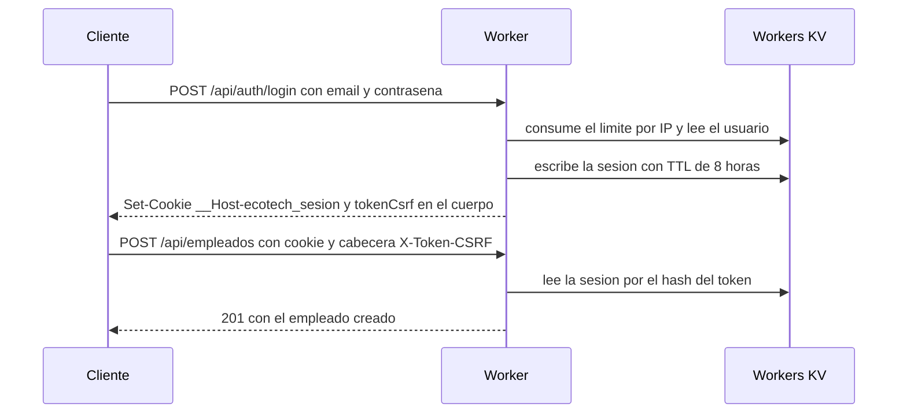
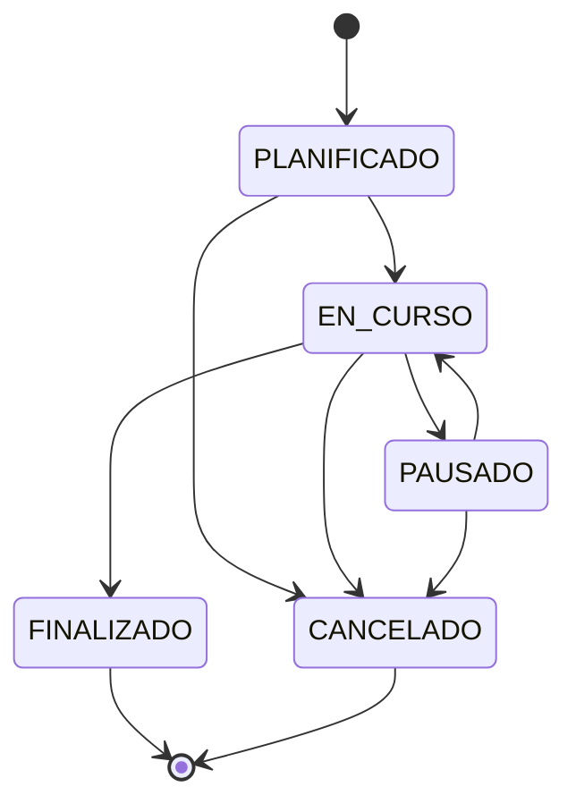
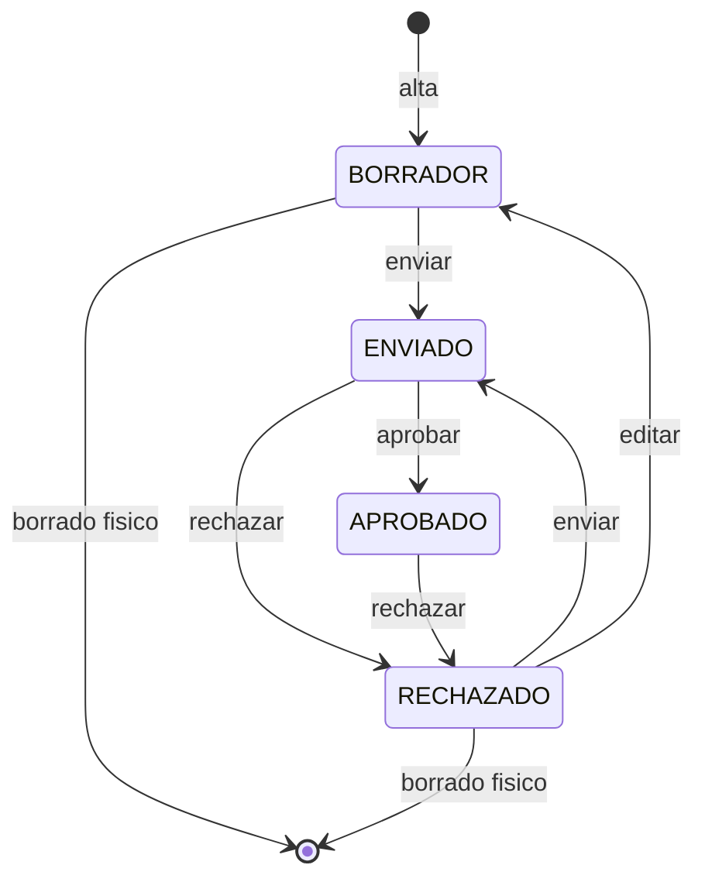

# Referencia de la API HTTP

Referencia completa de la API REST de EcoTech Solutions. Todo lo que aparece
aquí está tomado del código de `src/worker/rutas/`, `src/aplicacion/` y
`src/dominio/`, y se cita el archivo donde puede comprobarse. No hay endpoints
"previstos": lo que no está registrado en `src/worker/index.ts` no existe.

## Tabla de contenidos

- [1. Convenciones](#1-convenciones)
- [2. Códigos de error](#2-códigos-de-error)
- [3. Roles y permisos](#3-roles-y-permisos)
- [4. Índice de endpoints](#4-índice-de-endpoints)
- [5. Autenticación](#5-autenticación)
- [6. Empleados](#6-empleados)
- [7. Departamentos](#7-departamentos)
- [8. Proyectos](#8-proyectos)
- [9. Asignaciones](#9-asignaciones)
- [10. Registros de tiempo](#10-registros-de-tiempo)
- [11. Informes](#11-informes)
- [12. Sistema](#12-sistema)
- [13. Flujo completo con curl](#13-flujo-completo-con-curl)
- [14. Reglas de negocio que sorprenden](#14-reglas-de-negocio-que-sorprenden)
- [15. Limitaciones conocidas](#15-limitaciones-conocidas)

---

## 1. Convenciones

### Prefijo y reparto del tráfico

Todas las rutas cuelgan de `/api`. `wrangler.jsonc` declara
`run_worker_first: ["/api/*"]`, de modo que el Worker solo se invoca para la
API; el resto lo sirve el almacén de assets. `src/worker/index.ts` conserva
además una reserva defensiva: si llegara una petición fuera de `/api/`, la
delega en `entorno.ASSETS`.

### Envoltura de respuesta

Toda respuesta JSON de la API va envuelta. Las dos formas están definidas en
`src/compartido/tipos.ts` y las construyen `json()` y `errorARespuesta()` de
`src/worker/http.ts`.

```jsonc
// éxito
{ "ok": true, "datos": { } }

// error
{ "ok": false, "error": { "codigo": "VALIDACION", "mensaje": "…", "campos": [ ] } }
```

`campos` solo aparece cuando el error trae detalle por campo (es lo que hace
`ErrorDominio.aRespuesta()` en `src/dominio/base/errores.ts`: si el array está
vacío, la clave se omite en vez de serializarse como `[]`). Cada elemento es
`{ campo, mensaje }`.

No hay `204`: las bajas responden `200` con `{"eliminado": true}`, porque
`sinContenido()` prefiere una sola forma de éxito que el cliente tenga que
manejar (`src/worker/http.ts`).

### Autenticación por cookie

El login instala la cookie `__Host-ecotech_sesion` con `HttpOnly`, `Secure`,
`SameSite=Strict`, `Path=/` y `Max-Age=28800` (8 horas,
`DURACION_SESION_SEGUNDOS` en `src/dominio/seguridad/Sesion.ts`). El valor es un
token opaco de 32 bytes en hexadecimal; en KV se guarda su SHA-256, nunca el
token (`ServicioAutenticacion.crearSesion`).

La sesión se resuelve en cada petición, antes del enrutado
(`src/worker/index.ts`), y se invalida sola —devolviendo el estado a "anónimo"—
en cuatro casos, todos en `ServicioAutenticacion.resolverSolicitante`:

| Situación | Efecto |
| --- | --- |
| No hay cookie o su valor no es 64 hex | La petición se trata como anónima |
| `expiraEn` ya pasó | Se borra la sesión de KV |
| La huella del `User-Agent` cambió respecto a la del login | Se borra la sesión de KV |
| El usuario fue desactivado o no existe | Se borra la sesión de KV |

El rol se revalida contra el usuario real en cada petición, así que un cambio de
rol o una desactivación surten efecto de inmediato, sin esperar al vencimiento.

Si la ruta exige sesión y no hay ninguna, la respuesta es `401 NO_AUTENTICADO`
con el mensaje `Debe iniciar sesion para acceder a este recurso.`.

### Token CSRF

Los métodos `POST`, `PUT`, `PATCH` y `DELETE` pasan por dos barreras en
`src/worker/index.ts`:

1. **Origen.** Si la petición trae cabecera `Origin` y su host no coincide con
   el de la URL, se responde `403 NO_AUTORIZADO`
   (`Peticion rechazada: origen no permitido.`). Una petición sin `Origin`
   —como la de curl— pasa esta barrera.
2. **Doble envío.** Si hay sesión activa, la cabecera `X-Token-CSRF` debe traer
   exactamente el `tokenCsrf` de esa sesión, comparado en tiempo constante
   (`ServicioAutenticacion.verificarCsrf`). Si falta o no coincide:
   `403 NO_AUTORIZADO`.

El token se obtiene del cuerpo de `POST /api/auth/login` o de
`GET /api/auth/sesion` (campo `tokenCsrf`), es distinto del token de sesión y
vive mientras viva la sesión.

Consecuencia práctica: `POST /api/auth/logout` **sí** exige `X-Token-CSRF`
cuando la cookie todavía es válida, aunque la ruta esté marcada como pública.
`POST /api/auth/login` no lo exige, porque todavía no hay sesión de la que
sacarlo.

### Content-Type

Los endpoints que leen cuerpo lo hacen con `leerJson()`
(`src/worker/http.ts`), que exige que `Content-Type` contenga
`application/json` y acota el cuerpo a **64 KiB** (comprobando primero
`Content-Length` y después la longitud real del texto). Un cuerpo vacío se
interpreta como `{}`.

No todos los `POST` leen cuerpo: `/api/auth/logout`,
`/api/registros-tiempo/:id/enviar` y `/api/registros-tiempo/:id/aprobar` no
llaman a `leerJson`, de modo que no necesitan `Content-Type` (sí necesitan el
token CSRF).

> Aviso: un `Content-Type` incorrecto, un cuerpo mayor que 64 KiB o un JSON
> malformado producen un `SyntaxError`, que no es un `ErrorDominio` y por tanto
> `normalizarError` lo colapsa a **`500 ERROR_INTERNO`**, no a un 400. Está
> documentado en [Limitaciones conocidas](#15-limitaciones-conocidas).

### Validación de entradas

Los cuerpos se validan con `Esquema` (`src/dominio/validacion/Esquema.ts`), que
aplica tres reglas transversales:

- **Lista blanca estricta.** Cualquier propiedad no declarada produce
  `Campo no reconocido.` para esa clave. Es lo que impide el *mass assignment*
  (mandar `{"rol":"ADMIN_RRHH"}` en el propio perfil).
- **Todos los fallos de una vez.** El array `campos` trae cada error, no solo
  el primero.
- **Claves prohibidas.** `__proto__`, `constructor` y `prototype` se rechazan
  con `Nombre de campo no permitido.`.

Los identificadores de ruta (`:id`) también se validan antes de tocar el
almacén, con `ReglaIdentificador` (`idDeRuta` en `src/worker/rutas/comun.ts`):
un `id` malformado devuelve `400`, no `404`.

Reglas de normalización que conviene conocer, todas en
`src/dominio/validacion/Regla.ts`:

| Regla | Qué acepta | Qué normaliza |
| --- | --- | --- |
| `ReglaTexto(min, max)` | Cadena | Recorta, normaliza a NFC y **elimina caracteres de control** antes de medir longitud |
| `ReglaEmail` | Texto de 5 a 254 con forma de correo | Pasa a minúsculas |
| `ReglaTelefono` | 7 a 20 caracteres, `+`, dígitos, espacios, `-`, `()` | Recorta |
| `ReglaDocumento` | 6 a 20 alfanuméricos, `.` y `-` | Pasa a **mayúsculas** |
| `ReglaContrasena` | 12 a 128 caracteres, 3 de 4 familias, no en la lista de filtradas | No toca el valor |
| `ReglaNumero(min, max, entero?)` | Número, o cadena numérica | Redondea a 2 decimales salvo que sea entero |
| `ReglaFecha(permitirFuturo?)` | `AAAA-MM-DD` real del calendario, no anterior a `1950-01-01` | Recorta |
| `ReglaEnumerado` | Solo los literales de la lista | — |
| `ReglaIdentificador` | UUID | Pasa a minúsculas |

`ReglaFecha` rechaza fechas imposibles como `2026-02-31`, que `Date`
normalizaría en silencio.

### Cabeceras de respuesta

Toda respuesta —incluidos los errores y las descargas— lleva las cabeceras de
`CABECERAS_SEGURIDAD` (`src/worker/http.ts`): CSP cerrada con
`default-src 'none'`, `X-Content-Type-Options: nosniff`,
`Referrer-Policy: strict-origin-when-cross-origin`, `X-Frame-Options: DENY`,
`Permissions-Policy`, `Strict-Transport-Security` y
`Cross-Origin-Opener-Policy: same-origin`.

Las respuestas JSON añaden `Cache-Control: no-store, no-cache, must-revalidate,
private` y `Pragma: no-cache`. Un `429` añade `Retry-After` en segundos. Las
descargas de informes llevan `Content-Disposition: attachment` con el nombre
saneado a `[A-Za-z0-9._-]` y recortado a 120 caracteres.

No se emiten cabeceras CORS: la API está pensada para el mismo origen que sirve
la SPA.

---

## 2. Códigos de error

La jerarquía vive en `src/dominio/base/errores.ts`. La capa HTTP no interroga el
tipo concreto: pregunta a cada error por su `codigo` y su `codigoHttp`.

| Clase | `codigo` | HTTP | Cuándo se lanza | ¿Trae `campos`? |
| --- | --- | --- | --- | --- |
| `ErrorValidacion` | `VALIDACION` | 400 | La entrada no cumple el esquema, el formato o la lista blanca de un parámetro de consulta | Sí, normalmente |
| `ErrorAutenticacion` | `NO_AUTENTICADO` | 401 | Credenciales incorrectas, sesión ausente o expirada, contraseña actual errónea al cambiarla | No |
| `ErrorAutorizacion` | `NO_AUTORIZADO` | 403 | El rol no tiene el permiso, el recurso es de otra persona, falta el token CSRF, u origen no permitido | No |
| `ErrorNoEncontrado` | `NO_ENCONTRADO` | 404 | La entidad referenciada no existe; también la ruta o el método desconocidos | No |
| `ErrorConflicto` | `CONFLICTO` | 409 | Choca con un invariante de unicidad (documento, email, nombre de departamento, asignación duplicada) | No |
| `ErrorReglaNegocio` | `REGLA_NEGOCIO` | 422 | La entrada es sintácticamente válida pero viola una regla del dominio | No |
| `ErrorLimiteExcedido` | `LIMITE_EXCEDIDO` | 429 | Se agotó una ventana del limitador de tasa; añade `Retry-After` | No |
| `ErrorInterno` | `ERROR_INTERNO` | 500 | Cualquier excepción que no sea `ErrorDominio` | No |

`normalizarError` colapsa lo desconocido a `ErrorInterno` con el mensaje fijo
`Ocurrio un error inesperado.`, de modo que un fallo inesperado nunca filtra el
mensaje original ni la traza; el detalle real va al log del Worker mediante
`console.error`.

### Límites de tasa vigentes

| Ámbito | Clave | Máximo | Ventana | Dónde |
| --- | --- | --- | --- | --- |
| Login por IP | `login:ip:<ip>` | 10 intentos | 300 s | `ServicioAutenticacion` |
| Exportación de informes por usuario | `informes:<usuarioId>` | 20 | 60 s | `ServicioReportes.exportar` |
| Bloqueo por cuenta | — | 5 intentos fallidos | 15 min de bloqueo | `Usuario.registrarIntentoFallido` |

Un login correcto reinicia el contador por IP; `cambiarCredenciales` y
`registrarAccesoExitoso` levantan el bloqueo de cuenta.

---

## 3. Roles y permisos

La matriz está en `src/dominio/seguridad/PoliticaAutorizacion.ts` y es
*deny-by-default*. Los permisos efectivos del solicitante viajan en el DTO de
sesión, para que el cliente pinte el menú sin adivinarlos.

| Permiso | ADMIN_RRHH | GERENTE | EMPLEADO | AUDITOR |
| --- | :-: | :-: | :-: | :-: |
| `empleado:leer` | sí | sí | sí | sí |
| `empleado:leer_sensible` | sí | — | — | — |
| `empleado:crear` / `empleado:editar` / `empleado:eliminar` | sí | — | — | — |
| `departamento:leer` | sí | sí | sí | sí |
| `departamento:crear` / `editar` / `eliminar` | sí | — | — | — |
| `proyecto:leer` | sí | sí | sí | sí |
| `proyecto:crear` / `proyecto:editar` | sí | sí | — | — |
| `proyecto:eliminar` | sí | — | — | — |
| `asignacion:leer` | sí | sí | sí | sí |
| `asignacion:gestionar` | sí | sí | — | — |
| `tiempo:leer_propio` | sí | sí | sí | — |
| `tiempo:leer_todos` | sí | sí | — | sí |
| `tiempo:registrar` | — | sí | sí | — |
| `tiempo:aprobar` | — | sí | — | — |
| `reporte:generar` | sí | sí | — | sí |
| `reporte:nomina` | sí | — | — | — |
| `auditoria:leer` | sí | — | — | sí |
| `usuario:gestionar` | sí | — | — | — |

Dos asimetrías deliberadas y fáciles de pasar por alto:

- **ADMIN_RRHH no puede cargar ni aprobar horas** (`tiempo:registrar` y
  `tiempo:aprobar` no figuran en su fila), aunque sí las lee todas.
- **AUDITOR no tiene `tiempo:leer_propio`** porque su cuenta no representa a
  ningún empleado; tiene `tiempo:leer_todos`, que es lo que necesita.

---

## 4. Índice de endpoints

| Método | Ruta | Permiso exigido | Sesión |
| --- | --- | --- | :-: |
| POST | `/api/auth/login` | — | no |
| POST | `/api/auth/logout` | — (CSRF si hay sesión) | no |
| GET | `/api/auth/sesion` | — | sí |
| POST | `/api/auth/contrasena` | — | sí |
| GET | `/api/empleados` | `empleado:leer` | sí |
| POST | `/api/empleados` | `empleado:crear` | sí |
| GET | `/api/empleados/:id` | `empleado:leer` | sí |
| PATCH | `/api/empleados/:id` | `empleado:editar` | sí |
| DELETE | `/api/empleados/:id` | `empleado:eliminar` | sí |
| PUT | `/api/empleados/:id/departamento` | `empleado:editar` | sí |
| GET | `/api/departamentos` | `departamento:leer` | sí |
| POST | `/api/departamentos` | `departamento:crear` | sí |
| GET | `/api/departamentos/:id` | `departamento:leer` | sí |
| PATCH | `/api/departamentos/:id` | `departamento:editar` | sí |
| DELETE | `/api/departamentos/:id` | `departamento:eliminar` | sí |
| GET | `/api/proyectos` | `proyecto:leer` | sí |
| POST | `/api/proyectos` | `proyecto:crear` | sí |
| GET | `/api/proyectos/:id` | `proyecto:leer` | sí |
| PATCH | `/api/proyectos/:id` | `proyecto:editar` | sí |
| PUT | `/api/proyectos/:id/estado` | `proyecto:editar` | sí |
| DELETE | `/api/proyectos/:id` | `proyecto:eliminar` | sí |
| GET | `/api/asignaciones` | `asignacion:leer` | sí |
| POST | `/api/asignaciones` | `asignacion:gestionar` | sí |
| PATCH | `/api/asignaciones/:id` | `asignacion:gestionar` | sí |
| DELETE | `/api/asignaciones/:id` | `asignacion:gestionar` | sí |
| GET | `/api/registros-tiempo` | `tiempo:leer_todos` o `tiempo:leer_propio` | sí |
| POST | `/api/registros-tiempo` | `tiempo:registrar` | sí |
| GET | `/api/registros-tiempo/:id` | `tiempo:leer_todos` o `tiempo:leer_propio` | sí |
| PATCH | `/api/registros-tiempo/:id` | `tiempo:registrar` | sí |
| DELETE | `/api/registros-tiempo/:id` | `tiempo:registrar` | sí |
| POST | `/api/registros-tiempo/:id/enviar` | `tiempo:registrar` | sí |
| POST | `/api/registros-tiempo/:id/aprobar` | `tiempo:aprobar` | sí |
| POST | `/api/registros-tiempo/:id/rechazar` | `tiempo:aprobar` | sí |
| GET | `/api/reportes/:tipo` | `reporte:generar` (+ `reporte:nomina`) | sí |
| GET | `/api/panel` | — | sí |
| GET | `/api/auditoria` | `auditoria:leer` | sí |
| GET | `/api/salud` | — | no |

---

## 5. Autenticación

`src/worker/rutas/autenticacion.ts` · `src/aplicacion/ServicioAutenticacion.ts`



### POST /api/auth/login

Público. No exige token CSRF (todavía no hay sesión), sí la comprobación de
origen.

**Cuerpo** (`ESQUEMA_LOGIN`):

| Campo | Regla | Obligatorio |
| --- | --- | :-: |
| `email` | `ReglaEmail` | sí |
| `contrasena` | `ReglaTexto(1, 128)` | sí |

En el login **no** se aplica `ReglaContrasena`: rechazar por política una
contraseña mal escrita revelaría la política exacta y distinguiría "formato
inválido" de "credenciales incorrectas". El tope de 128 caracteres está para
evitar el DoS por PBKDF2.

**Respuesta 200**: `SesionDTO` (`src/compartido/tipos.ts`).

```jsonc
{
  "ok": true,
  "datos": {
    "usuario": { "id": "…", "email": "admin@ecotech.com", "rol": "ADMIN_RRHH",
                 "empleadoId": "…", "activo": true, "debeCambiarContrasena": false,
                 "ultimoAcceso": "…", "creadoEn": "…", "actualizadoEn": "…" },
    "permisos": ["empleado:leer", "empleado:leer_sensible", "…"],
    "empleado": { },
    "tokenCsrf": "…",
    "expiraEn": "2026-08-27T20:15:00.000Z"
  }
}
```

Más la cabecera `Set-Cookie` con la sesión. `empleado` es `null` si la cuenta no
está vinculada a ningún empleado (el caso del auditor).

**Errores**

| Situación | Respuesta |
| --- | --- |
| Falta un campo o el email no tiene forma válida | `400 VALIDACION` con `campos` |
| Email inexistente, contraseña incorrecta, cuenta inactiva o cuenta bloqueada | `401 NO_AUTENTICADO`, siempre con el mismo mensaje `Email o contrasena incorrectos.` |
| Más de 10 intentos desde la misma IP en 300 s | `429 LIMITE_EXCEDIDO` + `Retry-After` |

Los cuatro casos de 401 son deliberadamente indistinguibles: se verifica siempre
una contraseña (con un señuelo si el usuario no existe) para que el tiempo de
respuesta no permita enumerar la plantilla, y el bloqueo por cuenta no se
anuncia para que no funcione como oráculo de enumeración. Quien necesita saber
que una cuenta está bloqueada es el auditor, y para eso queda el asiento
`LOGIN_CUENTA_BLOQUEADA`.

### POST /api/auth/logout

Público, pero si la cookie sigue siendo válida **exige `X-Token-CSRF`**. No lee
cuerpo.

**Respuesta 200**: `{"cerrada": true}` más `Set-Cookie` con `Max-Age=0`. Borra
la sesión de KV. Sin cookie válida responde igual, para que el cliente pueda
limpiar su estado sin recibir un 401.

### GET /api/auth/sesión

Exige sesión. Es el punto que consulta la SPA al arrancar.

**Respuesta 200**: `SesionDTO`, igual que el login.

**Errores**: `401 NO_AUTENTICADO` sin sesión; `404 NO_ENCONTRADO` si la cuenta
desapareció del almacén entre la resolución de la sesión y la lectura.

### POST /api/auth/contraseña

Exige sesión, `X-Token-CSRF` y `Content-Type: application/json`. Cambia la
contraseña **del propio solicitante**; no existe forma de cambiar la de otro.

**Cuerpo** (`ESQUEMA_CAMBIO`):

| Campo | Regla | Obligatorio |
| --- | --- | :-: |
| `contrasenaActual` | `ReglaTexto(1, 128)` | sí |
| `contrasenaNueva` | `ReglaContrasena` | sí |

`ReglaContrasena` exige 12 a 128 caracteres, al menos tres de las cuatro
familias (minúsculas, mayúsculas, dígitos, símbolos) y que no figure en la lista
de contraseñas filtradas del propio archivo.

**Respuesta 200**: `{"actualizada": true}`. El cambio pone
`debeCambiarContrasena` en `false`, reinicia los intentos fallidos y levanta un
bloqueo vigente.

**Errores**: `401 NO_AUTENTICADO` si `contrasenaActual` no es correcta;
`400 VALIDACION` si la nueva no cumple la política o si es idéntica a la actual.

La sesión en curso **no** se invalida al cambiar la contraseña, ni tampoco las
demás sesiones abiertas de esa cuenta.

---

## 6. Empleados

`src/worker/rutas/empleados.ts` · `src/aplicacion/ServicioEmpleados.ts`

### GET /api/empleados

Permiso `empleado:leer`.

**Parámetros de consulta**

| Parámetro | Formato | Efecto |
| --- | --- | --- |
| `departamentoId` | UUID | Solo empleados de ese departamento |
| `activo` | `true` / `false` | Filtra por estado |
| `texto` | 0 a 80 caracteres | Busca en nombre, apellido, legajo y email corporativo |
| `tipoContrato` | `ASALARIADO` / `POR_HORAS` / `CONTRATISTA` | Filtra por modalidad |

`texto` **nunca** busca por documento, teléfono, dirección ni email personal:
esos datos viven cifrados en un sobre AES-GCM y descifrarlos por empleado en
cada búsqueda sería caro y expondría un canal lateral por temporización.

**Respuesta 200**: `EmpleadoDTO[]` ordenado por nombre completo con
`localeCompare(…, 'es')`.

En el listado los datos sensibles vienen **siempre enmascarados**, incluso para
ADMIN_RRHH: `datosSensibles` con `********` en los cuatro campos,
`sensiblesEnmascarados: true` y `salarioMensual`, `tarifaHora` y `topeMensual`
en `null`. El dato en claro se entrega en el detalle.

### POST /api/empleados

Permiso `empleado:crear`.

**Cuerpo** (`ESQUEMA_CREAR`):

| Campo | Regla | Obligatorio |
| --- | --- | :-: |
| `nombre` | `ReglaTexto(2, 60)` | sí |
| `apellido` | `ReglaTexto(2, 60)` | sí |
| `emailCorporativo` | `ReglaEmail` | sí |
| `tipoContrato` | `ASALARIADO` / `POR_HORAS` / `CONTRATISTA` | sí |
| `fechaInicioContrato` | `ReglaFecha(true)` — admite futuro | sí |
| `departamentoId` | UUID o `null` | no |
| `documento` | `ReglaDocumento` | sí |
| `telefono` | `ReglaTelefono` | sí |
| `direccion` | `ReglaTexto(5, 200)` | sí |
| `emailPersonal` | `ReglaEmail` | sí |
| `salarioMensual` | `ReglaNumero(0.01, 100000000)` | según contrato |
| `tarifaHora` | `ReglaNumero(0.01, 1000000)` | según contrato |
| `topeMensual` | `ReglaNumero(0.01, 100000000)` | según contrato |

Se admite fecha de inicio futura: es habitual dar de alta antes de la
incorporación efectiva.

Los campos económicos obligatorios los decide la modalidad, con la lista que
aporta `FabricaEmpleados.camposRequeridos`:

| `tipoContrato` | Campos exigidos |
| --- | --- |
| `ASALARIADO` | `salarioMensual` |
| `POR_HORAS` | `tarifaHora` |
| `CONTRATISTA` | `tarifaHora` y `topeMensual` |

El `id` (UUID) y el `legajo` (`ECO-000123`, correlativo reservado contra el
almacén) los asigna el servidor; enviarlos produce `Campo no reconocido.`.

**Respuesta 201**: `EmpleadoDTO`, con los datos sensibles en claro si el
solicitante tiene `empleado:leer_sensible`.

**Errores específicos**

| Situación | Respuesta |
| --- | --- |
| Falta un campo económico de la modalidad | `400 VALIDACION`, `Faltan datos economicos propios de un contrato <TIPO>.` |
| `departamentoId` inexistente o inactivo | `400 VALIDACION` en el campo `departamentoId` |
| Documento ya registrado | `409 CONFLICTO`, indica el legajo del duplicado |
| Email corporativo ya en uso | `409 CONFLICTO` |
| Email personal ya registrado | `409 CONFLICTO` |

El control de duplicados compara **índices ciegos HMAC** del documento y del
email personal, y el email corporativo en claro; así se detecta la duplicidad
sin descifrar la colección entera ni guardar el documento legible.

### GET /api/empleados/:id

Permiso `empleado:leer`. Devuelve `EmpleadoDTO` con los datos sensibles
descifrados si el solicitante tiene `empleado:leer_sensible` **o si la ficha es
la suya**: un empleado siempre ve sus propios datos personales completos aunque
su rol no tenga el permiso.

**Errores**: `400` si el `id` no es un UUID; `404 NO_ENCONTRADO` si no existe.
Si el sobre cifrado fue manipulado, AES-GCM falla y el error se propaga como
`500`: es detección de alteración del almacén y no se silencia.

### PATCH /api/empleados/:id

Permiso `empleado:editar`. Actualización parcial: lo que no viene, no se toca.
Admite los mismos campos que el alta (`ESQUEMA_CREAR.parcial()`).

Detalles con consecuencias:

- `tipoContrato` sigue admitido por el esquema, pero enviar uno distinto del
  actual devuelve `422 REGLA_NEGOCIO`. Se acepta en el esquema justamente para
  poder dar ese mensaje explicativo en vez de un `Campo no reconocido.`.
- Tocar cualquiera de los cuatro campos sensibles obliga a abrir el sobre,
  fusionar y volver a cerrarlo con un IV nuevo; se recalculan los índices
  ciegos y se revalida la unicidad.
- `departamentoId: null` desvincula al empleado; un id concreto exige que el
  departamento exista y esté **activo**.
- Enviar los tres campos económicos es seguro: cada subclase toma solo los que
  le competen e ignora los nulos.

**Errores**: `400` (validación, departamento inválido), `404`, `409`
(unicidad), `422` (cambio de tipo de contrato).

### DELETE /api/empleados/:id

Permiso `empleado:eliminar`. Es una **baja lógica en cascada**, descrita en
[la sección 14](#14-reglas-de-negocio-que-sorprenden).

**Respuesta 200**: `{"eliminado": true}`.

**Errores**: `422 REGLA_NEGOCIO` si el empleado ya estaba dado de baja; `404`.

### PUT /api/empleados/:id/departamento

Permiso `empleado:editar`. El cuerpo se valida en la propia ruta con un esquema
de un solo campo.

| Campo | Regla | Obligatorio |
| --- | --- | :-: |
| `departamentoId` | UUID o `null` | sí (admite `null` explícito) |

A diferencia del `PATCH`, aquí el campo **no** es opcional: un cuerpo vacío
devuelve `400 VALIDACION` con `Es obligatorio.`.

**Respuesta 200**: `EmpleadoDTO`. La entidad garantiza el invariante "un solo
departamento a la vez": el campo es escalar, asignar es reemplazar.

---

## 7. Departamentos

`src/worker/rutas/departamentos.ts` · `src/aplicacion/ServicioDepartamentos.ts`

### GET /api/departamentos

Permiso `departamento:leer`.

**Parámetros de consulta**: `activo` (`true`/`false`) y `texto` (1 a 80
caracteres, busca en nombre y descripción sin distinguir mayúsculas ni tildes).

**Respuesta 200**: un objeto con dos claves, porque la vista necesita siempre
ambas y separarlas obligaría a encadenar dos viajes.

```jsonc
{
  "ok": true,
  "datos": {
    "departamentos": [ ],
    "conteoEmpleados": { "<departamentoId>": 3 }
  }
}
```

`conteoEmpleados` cuenta **solo empleados activos** y siembra en cero todos los
departamentos existentes, para que el cliente no tenga que distinguir "sin
empleados" de "clave ausente".

### POST /api/departamentos

Permiso `departamento:crear`.

| Campo | Regla | Obligatorio |
| --- | --- | :-: |
| `nombre` | `ReglaTexto(3, 80)` | sí |
| `descripcion` | `ReglaTexto(0, 500)`, por defecto `""` | no |
| `gerenteId` | UUID o `null` | no |

**Respuesta 201**: `DepartamentoDTO`.

**Errores**: `409 CONFLICTO` si ya existe un departamento con el mismo nombre
normalizado (minúsculas y espacios colapsados), **incluidos los inactivos**;
`400 VALIDACION` en `gerenteId` si el empleado no existe o está dado de baja.

### GET /api/departamentos/:id

Permiso `departamento:leer`. `404` si no existe.

### PATCH /api/departamentos/:id

Permiso `departamento:editar`. Parcial sobre los mismos tres campos. Renombrar
revalida la unicidad excluyendo el propio id, de modo que pasar de "Ventas" a
"ventas" no cuenta como duplicado.

### DELETE /api/departamentos/:id

Permiso `departamento:eliminar`. **No hay borrado en cascada**: si quedan
empleados activos asignados la operación se rechaza con `422 REGLA_NEGOCIO`,
indicando cuántos son. Reasignar personas es una decisión de RRHH, no un efecto
colateral de un clic.

Cuando no queda nadie, la baja es lógica (`desactivar`), porque proyectos y
horas de periodos cerrados siguen apuntando a ese id.

**Respuesta 200**: `{"eliminado": true}`.

---

## 8. Proyectos

`src/worker/rutas/proyectos.ts` · `src/aplicacion/ServicioProyectos.ts`



### GET /api/proyectos

Permiso `proyecto:leer`.

**Parámetros de consulta**: `estado` (uno de los cinco literales),
`departamentoId` (UUID), `texto` (1 a 120 caracteres, busca en código, nombre y
descripción sin tildes; el código entra en la búsqueda porque es como la gente
nombra el proyecto en los correos).

**Respuesta 200**:

```jsonc
{
  "ok": true,
  "datos": {
    "proyectos": [ ],
    "horasPorProyecto": { "<proyectoId>": 128.5 }
  }
}
```

`horasPorProyecto` cuenta **solo horas aprobadas**, redondeadas a dos decimales,
con todos los proyectos sembrados en cero. Las horas en borrador o pendientes
todavía pueden cambiar y mostrarlas en la barra de consumo daría una foto que se
contradice al día siguiente.

### POST /api/proyectos

Permiso `proyecto:crear`.

| Campo | Regla | Obligatorio |
| --- | --- | :-: |
| `nombre` | `ReglaTexto(3, 120)` | sí |
| `descripcion` | `ReglaTexto(0, 1000)`, por defecto `""` | no |
| `fechaInicio` | `ReglaFecha(true)` | sí |
| `fechaFinEstimada` | `ReglaFecha(true)` o `null` | no |
| `departamentoId` | UUID o `null` | no |
| `presupuestoHoras` | `ReglaNumero(0, 100000)`, por defecto `0` | no |

`codigo` y `estado` **no figuran en el esquema**: el código lo asigna el
servidor con un correlativo (`PRY-0042`) y el proyecto siempre nace
`PLANIFICADO`. Enviarlos devuelve `400` con `Campo no reconocido.`.

A diferencia del gerente de un departamento, el departamento responsable de un
proyecto **puede estar inactivo**: un proyecto histórico puede colgar de una
unidad ya disuelta, y romper ese vínculo falsearía los informes de periodos
cerrados. Solo se exige que exista.

**Respuesta 201**: `ProyectoDTO`.

**Errores**: `400 VALIDACION` si el departamento no existe o si
`fechaFinEstimada` es anterior a `fechaInicio` (lo detecta `Proyecto.validar`).

### GET /api/proyectos/:id

Permiso `proyecto:leer`. `404` si no existe.

### PATCH /api/proyectos/:id

Permiso `proyecto:editar`. Parcial sobre los seis campos del alta. `estado` no
se toca por aquí; para eso está el endpoint siguiente.

### PUT /api/proyectos/:id/estado

Permiso `proyecto:editar`. El cuerpo se valida en la ruta:

| Campo | Regla | Obligatorio |
| --- | --- | :-: |
| `estado` | `PLANIFICADO` / `EN_CURSO` / `PAUSADO` / `FINALIZADO` / `CANCELADO` | sí |

**Respuesta 200**: `ProyectoDTO`.

**Errores**: `422 REGLA_NEGOCIO` si la transición no figura en la tabla; el
mensaje enumera las transiciones válidas desde el estado actual, o dice
`ninguna (estado terminal)`. Pedir el estado en el que ya está es un no-op que
responde `200`.

### DELETE /api/proyectos/:id

Permiso `proyecto:eliminar`. El borrado **físico** se reserva al único caso en
que no destruye historia: un proyecto sin ni un registro de tiempo ni una
asignación asociados.

| Situación | Qué hace | Respuesta |
| --- | --- | --- |
| Sin horas ni asignaciones | Borra la fila | `200 {"eliminado": true}` |
| Con horas o asignaciones, estado no terminal | Lo pasa a `CANCELADO` y lo deja | `200 {"eliminado": true}` |
| Con horas o asignaciones y ya `CANCELADO` | No hay transición que hacer; lo guarda igual | `200 {"eliminado": true}` |
| Con horas o asignaciones y `FINALIZADO` | La transición `FINALIZADO → CANCELADO` no existe | `422 REGLA_NEGOCIO` |

Es decir: un `DELETE` con éxito puede no haber borrado nada. La diferencia queda
en la auditoría, como `PROYECTO_ELIMINADO` o como `PROYECTO_CANCELADO`.

---

## 9. Asignaciones

`src/worker/rutas/asignaciones.ts` · `src/aplicacion/ServicioAsignaciones.ts`

`AsignacionProyecto` es una clase de asociación: la relación entre empleado y
proyecto tiene datos propios (rol, dedicación, desde, hasta) que no pertenecen
ni a uno ni al otro.

### GET /api/asignaciones

Permiso `asignacion:leer`.

**Parámetros de consulta**: `empleadoId` (UUID), `proyectoId` (UUID), `activa`
(`true`/`false`). Se acumulan con AND.

**Respuesta 200**: `AsignacionDTO[]`, con las vigentes primero y, dentro de cada
grupo, la incorporación más reciente arriba.

### POST /api/asignaciones

Permiso `asignacion:gestionar`.

| Campo | Regla | Obligatorio |
| --- | --- | :-: |
| `empleadoId` | UUID | sí |
| `proyectoId` | UUID | sí |
| `rolProyecto` | `LIDER_TECNICO` / `DESARROLLADOR` / `ANALISTA` / `DISENADOR` / `QA` / `CONSULTOR` | sí |
| `porcentajeDedicacion` | `ReglaNumero(1, 100)`, por defecto `100` | no |
| `fechaAsignacion` | `ReglaFecha(true)`, por defecto hoy | no |

Se admite fecha futura: planificar la incorporación de alguien al proyecto del
mes que viene es legítimo.

**Respuesta 201**: `AsignacionDTO`, con `activa: true` y
`fechaDesasignacion: null`.

**Errores específicos**

| Situación | Respuesta |
| --- | --- |
| El empleado no existe o está dado de baja | `422 REGLA_NEGOCIO` |
| El proyecto no existe | `422 REGLA_NEGOCIO` |
| El proyecto está `FINALIZADO` o `CANCELADO` | `422 REGLA_NEGOCIO`, `ya no admite incorporaciones` |
| Ya existe una asignación **activa** de esa persona a ese proyecto | `409 CONFLICTO`, indicando rol y porcentaje vigentes |
| La suma de dedicaciones activas superaría 100 | `422 REGLA_NEGOCIO`, indicando cuántos puntos quedan libres |

Una asignación **cerrada** al mismo proyecto no estorba: reincorporar a alguien
crea una línea nueva, que es lo que conserva la historia de la primera etapa.

Nótese la asimetría con la carga de horas: para asignar basta con que el
proyecto esté *abierto* (`PLANIFICADO`, `EN_CURSO` o `PAUSADO`); para imputar
horas hace falta que esté `EN_CURSO`.

### PATCH /api/asignaciones/:id

Permiso `asignacion:gestionar`. Solo se dejan tocar dos campos:

| Campo | Regla | Obligatorio |
| --- | --- | :-: |
| `rolProyecto` | enumerado de roles de proyecto | no |
| `porcentajeDedicacion` | `ReglaNumero(1, 100)` | no |

`empleadoId`, `proyectoId` y `fechaAsignacion` quedan fuera del esquema a
propósito: reapuntar una asignación cambiaría retroactivamente el vínculo que
explica las horas ya imputadas bajo ella. Enviarlos devuelve `400` con
`Campo no reconocido.`.

Un cuerpo `{}` (sin ninguno de los dos campos) devuelve el DTO sin escribir ni
auditar nada: un asiento vacío solo ensucia la traza.

**Errores**: `422 REGLA_NEGOCIO` si la asignación está cerrada, o si el nuevo
porcentaje excede la jornada disponible (el cómputo excluye la propia
asignación, de modo que subir del 40 % al 50 % no falla por contarse dos veces).

### DELETE /api/asignaciones/:id

Permiso `asignacion:gestionar`. **Cierra la participación, no borra la fila**:
las horas cargadas durante ese periodo tienen que seguir teniendo un vínculo que
las explique.

**Parámetro de consulta**: `fecha` en formato `AAAA-MM-DD`; por defecto, hoy.

**Respuesta 200**: `AsignacionDTO` con `fechaDesasignacion` puesta y
`activa: false`. Es el único `DELETE` de la API que no responde
`{"eliminado": true}`.

**Errores**: `400` si `fecha` no tiene el formato correcto; `422` si la
asignación ya estaba cerrada o si la fecha es anterior a la de alta.

---

## 10. Registros de tiempo

`src/worker/rutas/tiempo.ts` · `src/aplicacion/ServicioRegistrosTiempo.ts`



Topes definidos en `src/dominio/tiempo/RegistroTiempo.ts`: `HORAS_MINIMAS` =
0.25, `HORAS_MAXIMAS_POR_REGISTRO` = 12, `HORAS_MAXIMAS_POR_DIA` = 16.

### GET /api/registros-tiempo

Requiere `tiempo:leer_todos` o, en su defecto, `tiempo:leer_propio`.

**Parámetros de consulta**: `empleadoId`, `proyectoId` (UUID), `desde`, `hasta`
(`AAAA-MM-DD`), `estado` (`BORRADOR` / `ENVIADO` / `APROBADO` / `RECHAZADO`).

**Visibilidad**: quien solo tiene `tiempo:leer_propio` ve exclusivamente sus
horas, y el filtro lo pone el servidor **pisando** cualquier `empleadoId` que
llegue en la URL. Si esa cuenta no está vinculada a ningún empleado, la
respuesta es una lista vacía, no "todo".

**Respuesta 200**: `RegistroTiempoDTO[]`, lo más reciente primero.

### POST /api/registros-tiempo

Permiso `tiempo:registrar`.

| Campo | Regla | Obligatorio |
| --- | --- | :-: |
| `proyectoId` | UUID | sí |
| `fecha` | `ReglaFecha(false)` — **no admite futuro** | sí |
| `horas` | `ReglaNumero(0.25, 12)` | sí |
| `descripcion` | `ReglaTexto(10, 500)` | sí |
| `empleadoId` | UUID | no, y solo se honra con `tiempo:leer_todos` |

El mínimo de 10 caracteres en `descripcion` es deliberado: una descripción como
"tareas" no permite auditar nada ni sirve para facturar al cliente.

Cargar horas en nombre de otro es una operación de gerencia; para quien no tiene
`tiempo:leer_todos`, el `empleadoId` que llegue **se ignora** en silencio y se
usa el de la sesión.

**Respuesta 201**: `RegistroTiempoDTO` con `estado: "BORRADOR"`,
`aprobadoPor: null` y `motivoRechazo: null`. Nada entra al circuito de
aprobación sin que su autor lo envíe.

**Errores específicos** (todos `422 REGLA_NEGOCIO` salvo indicación)

| Situación | Mensaje |
| --- | --- |
| La cuenta no está vinculada a ningún empleado | `Su cuenta de acceso no esta vinculada a ningun empleado…` |
| El empleado no existe o está dado de baja | `…esta dado de baja y no admite carga de horas.` |
| El proyecto no existe | `El proyecto indicado no existe.` |
| El proyecto no está `EN_CURSO` | `…solo se imputan horas a proyectos EN_CURSO.` |
| No había asignación vigente ese día | `El empleado no estaba asignado a ese proyecto el <fecha>…` |
| El día superaría las 16 h | Indica cuántas horas hay ya cargadas y cuántas quedan |

Una fecha futura la rechaza el esquema con `400 VALIDACION`
(`No puede ser una fecha futura.`).

### GET /api/registros-tiempo/:id

Requiere `tiempo:leer_todos` o `tiempo:leer_propio`. Si el solicitante no ve
todas las horas y el registro no es suyo, la respuesta es
**`403 NO_AUTORIZADO`**, no `404`: el registro existe y ocultarlo no aporta nada
frente a alguien ya autenticado.

### PATCH /api/registros-tiempo/:id

Permiso `tiempo:registrar`, más propiedad del registro si no tiene
`tiempo:leer_todos`.

| Campo | Regla | Obligatorio |
| --- | --- | :-: |
| `proyectoId` | UUID | no |
| `fecha` | `ReglaFecha(false)` | no |
| `horas` | `ReglaNumero(0.25, 12)` | no |
| `descripcion` | `ReglaTexto(10, 500)` | no |

`empleadoId` queda fuera del esquema: mover un parte de una persona a otra
reescribiría el pasado de las dos.

El estado se comprueba **antes** que cualquier otra regla, para que editar un
registro ya enviado no devuelva primero un error de tope diario. Solo se editan
registros en `BORRADOR` o `RECHAZADO`; en cualquier otro estado, `422`.

Mover un parte de proyecto o de día lo somete otra vez a las reglas del alta
(proyecto `EN_CURSO`, asignación vigente, tope diario excluyendo el propio
registro). Editar un registro `RECHAZADO` lo devuelve a `BORRADOR` y limpia el
motivo del rechazo.

### DELETE /api/registros-tiempo/:id

Permiso `tiempo:registrar` más propiedad. Es un **borrado físico** —el otro caso
del sistema es el proyecto sin horas ni asignaciones—, y solo se permite en
`BORRADOR` o `RECHAZADO`: un registro que jamás computó en una nómina ni en un
informe cerrado no deja nada colgando. En `ENVIADO` o `APROBADO`,
`422 REGLA_NEGOCIO`.

**Respuesta 200**: `{"eliminado": true}`. Queda el asiento `TIEMPO_ELIMINADO`.

### POST /api/registros-tiempo/:id/enviar

Permiso `tiempo:registrar` más propiedad. No lee cuerpo. Pasa el registro a
`ENVIADO` y limpia el motivo de rechazo. Enviar uno ya `ENVIADO` es idempotente
(`200` sin cambios); enviar uno `APROBADO` devuelve `422`.

### POST /api/registros-tiempo/:id/aprobar

Permiso `tiempo:aprobar`. No lee cuerpo. Solo aprueba registros en `ENVIADO`; en
cualquier otro estado, `422`.

`aprobadoPor` se firma con el `empleadoId` del solicitante o, si su cuenta no
representa a ningún empleado, con su `usuarioId`. Si esa identidad coincide con
el autor del parte, `422 REGLA_NEGOCIO`:
`Un empleado no puede aprobar sus propios registros de horas.`

Este endpoint **no** comprueba propiedad ni jerarquía más allá de esa regla:
cualquiera con `tiempo:aprobar` puede aprobar el parte de cualquier otro, no
solo el de su equipo.

### POST /api/registros-tiempo/:id/rechazar

Permiso `tiempo:aprobar`. Exige `Content-Type: application/json`.

| Campo | Regla | Obligatorio |
| --- | --- | :-: |
| `motivo` | `ReglaTexto(5, 300)` | sí |

Se rechazan registros en `ENVIADO` **o en `APROBADO`**: es el camino para
corregir horas ya aprobadas sin reescribir el pasado en silencio. El registro
queda en `RECHAZADO` con el motivo, y el empleado puede editarlo para devolverlo
al circuito.

**Errores**: `400` si el motivo no llega o es demasiado corto; `422` si el
registro está en `BORRADOR` o ya en `RECHAZADO`.

---

## 11. Informes

`src/worker/rutas/reportes.ts` · `src/aplicacion/ServicioReportes.ts`

### GET /api/reportes/:tipo

Permiso `reporte:generar`; el tipo `nomina` exige además `reporte:nomina`.

**Tipos disponibles** (`TIPOS_REPORTE`)

| `:tipo` | Título | Columnas | Filtros que afectan al resultado |
| --- | --- | --- | --- |
| `empleados` | Listado de empleados | legajo, empleado, email corporativo, contrato, departamento, inicio, antigüedad, activo, documento, teléfono | `departamentoId` (selecciona filas). El resto no cambia nada: no hay columnas de horas |
| `departamentos` | Resumen por departamento | departamento, gerente, empleados, proyectos, horas aprobadas, activo | `desde`, `hasta`, `proyectoId`, `empleadoId` (columna de horas). `departamentoId` se ignora |
| `proyectos` | Estado de proyectos | código, proyecto, estado, departamento, inicio, fin estimado, presupuesto, horas imputadas, consumido %, personas | `departamentoId` y `proyectoId` (filas); `desde`, `hasta`, `empleadoId` (horas imputadas) |
| `horas` | Detalle de horas registradas | fecha, empleado, legajo, proyecto, rol, horas, estado, tarea | `desde`, `hasta`, `proyectoId`, `empleadoId` (filas). `departamentoId` se ignora |
| `nomina` | Nómina del periodo | legajo, empleado, contrato, departamento, horas aprobadas, modalidad, remuneración | `desde`, `hasta`, `proyectoId`, `empleadoId` (horas y remuneración). `departamentoId` se ignora |

La distinción importa: `desde`, `hasta`, `proyectoId` y `empleadoId` recortan la
colección de registros de tiempo en `ServicioReportes.reunirDatos`, antes de que
ninguna subclase la vea, así que afectan a **toda** columna calculada a partir de
horas. `departamentoId` no toca esos registros: solo lo leen
`ReporteEmpleados` y `ReporteProyectos` para seleccionar sus propias filas.

Un `:tipo` fuera de la lista devuelve `400 VALIDACION` enumerando los válidos.

**Parámetros de consulta**

| Parámetro | Formato | Por defecto |
| --- | --- | --- |
| `formato` | `json` / `csv` / `xlsx` / `pdf` | `json` |
| `desde`, `hasta` | `AAAA-MM-DD` | sin recorte |
| `departamentoId`, `proyectoId`, `empleadoId` | UUID | sin recorte |

`desde` posterior a `hasta` devuelve `400 VALIDACION` con
`El rango de fechas esta invertido.`.

Qué recorta cada filtro depende del informe; la tabla de arriba lo detalla.

**Respuesta con `formato=json`**: envoltura normal con un `ReporteDTO`
(`tipo`, `titulo`, `descripcion`, `generadoEn`, `generadoPor`, `columnas`,
`filas`, `totales`). Es lo que usa el cliente para previsualizar en pantalla.

**Respuesta con los otros formatos**: cuerpo binario, sin envoltura, con
`Content-Disposition: attachment` y nombre
`ecotech-<tipo>-<AAAA-MM-DD>.<ext>`.

| Formato | `Content-Type` | Detalles |
| --- | --- | --- |
| `csv` | `text/csv; charset=utf-8` | BOM UTF-8, separador `;`, CRLF, escapado RFC 4180 |
| `xlsx` | `application/vnd.openxmlformats-officedocument.spreadsheetml.sheet` | Escrito a mano, sin librerías |
| `pdf` | `application/pdf` | A4 apaisado, generado objeto por objeto |
| `json` (como descarga) | `application/json; charset=utf-8` | Solo se alcanza desde `ServicioReportes.exportar`; la ruta devuelve el JSON envuelto |

**Datos sensibles**: se descifran solo si el rol tiene `empleado:leer_sensible`;
si no, el informe de empleados imprime las columnas de documento y teléfono
enmascaradas. Es el mismo informe para RRHH y para gerencia, sin duplicar
clases. Un sobre que no abre no tumba el informe: ese empleado sale enmascarado.

**Errores específicos**

| Situación | Respuesta |
| --- | --- |
| `:tipo` o `formato` desconocido, rango invertido, `id` malformado | `400 VALIDACION` |
| Sin `reporte:generar` | `403 NO_AUTORIZADO` |
| `nomina` sin `reporte:nomina` | `403 NO_AUTORIZADO`, `El informe de nomina expone remuneraciones…` |
| Más de 20 exportaciones por usuario en 60 s | `429 LIMITE_EXCEDIDO` + `Retry-After` |

El límite de tasa se consume **solo en las exportaciones binarias**;
`formato=json` no pasa por el limitador.

---

## 12. Sistema

`src/worker/rutas/sistema.ts`

### GET /api/panel

Solo exige sesión: son agregados sin un dato personal, y todo rol autenticado
necesita ver el estado general al entrar. **No** exige `reporte:generar`.

**Respuesta 200**: `MetricasPanelDTO` con `totalEmpleados`, `empleadosActivos`,
`totalDepartamentos` (solo activos), `proyectosEnCurso`, `horasMesActual`,
`horasPendientesAprobacion`, `empleadosSinDepartamento`,
`proyectosSobrePresupuesto`, `horasPorProyecto[]` y `horasPorDepartamento[]`.

Dos criterios que conviene tener presentes: `horasMesActual` y
`horasPorProyecto` cuentan **solo horas aprobadas**, mientras que
`horasPendientesAprobacion` cuenta las que están en `ENVIADO`; y las horas se
imputan al departamento **del proyecto**, no al del empleado, porque es donde se
consume el presupuesto.

### GET /api/auditoría

Permiso `auditoria:leer` (ADMIN_RRHH y AUDITOR).

**Parámetros de consulta**

| Parámetro | Formato | Efecto |
| --- | --- | --- |
| `accion` | texto 1 a 80 | Coincidencia **exacta** sin distinguir mayúsculas |
| `entidad` | texto 1 a 60 | Coincidencia exacta sin distinguir mayúsculas |
| `exito` | `true` / `false` | Filtra por resultado |
| `limite` | entero 1 a 1000 | Por defecto 200 |

Un `limite` fuera del rango devuelve `400 VALIDACION` desde la ruta
(`consultaEntero`).

**Respuesta 200**: `RegistroAuditoriaDTO[]` de más reciente a más antigua.

Los asientos son de acción cerrada (`LOGIN_EXITOSO`, `EMPLEADO_CREADO`,
`TIEMPO_APROBADO`, `PROYECTO_CANCELADO`…) y el campo `detalle` nunca contiene
valores sensibles: en las ediciones se registran los **nombres** de los campos
tocados, no sus valores, para que un asiento con el domicilio en claro no anule
el cifrado en reposo.

### GET /api/salud

Público. Deliberadamente parco: no expone versiones, rutas internas ni conteos.

```jsonc
{
  "ok": true,
  "datos": {
    "estado": "operativo",
    "almacen": "workers-kv",
    "sembrado": true,
    "cifradoConClaveDeDesarrollo": false,
    "advertencia": null
  }
}
```

Si `CLAVE_MAESTRA` no está definida o tiene menos de 32 caracteres,
`cifradoConClaveDeDesarrollo` es `true` y `advertencia` explica que los datos
personales se están cifrando con una clave pública. Es el único canal por el que
ese fallo de configuración se hace visible.

---

## 13. Flujo completo con curl

Los ejemplos usan `jq` para extraer el token CSRF. La cookie lleva `Secure`, de
modo que curl solo la reenvía sobre `https://`.

Las credenciales de arranque salen de `src/aplicacion/Semilla.ts`: cuatro
cuentas (`admin@`, `gerente@`, `empleado@` y `auditor@ecotech.com`) con la
contraseña del secret `CLAVE_ADMIN_INICIAL` o, si no está definido,
`EcoTech#2026Admin`, que es pública a propósito.

```bash
BASE=https://ecotech-solutions.ejemplo.workers.dev
```

### Paso 1 — Login guardando la cookie en un fichero

```bash
RESPUESTA=$(curl -sS -c galleta-admin.txt \
  -X POST "$BASE/api/auth/login" \
  -H 'Content-Type: application/json' \
  -d '{"email":"admin@ecotech.com","contrasena":"EcoTech#2026Admin"}')

CSRF_ADMIN=$(printf '%s' "$RESPUESTA" | jq -r '.datos.tokenCsrf')
```

`galleta-admin.txt` queda con `__Host-ecotech_sesion`. El token CSRF no está en
la cookie: viaja en el cuerpo y hay que enviarlo a mano en cada mutación.

### Paso 2 — Alta de empleado (rol ADMIN_RRHH)

```bash
EMPLEADO=$(curl -sS -b galleta-admin.txt \
  -X POST "$BASE/api/empleados" \
  -H 'Content-Type: application/json' \
  -H "X-Token-CSRF: $CSRF_ADMIN" \
  -d '{
        "nombre": "Ana",
        "apellido": "Rivas",
        "emailCorporativo": "ana.rivas@ecotech.com",
        "tipoContrato": "POR_HORAS",
        "fechaInicioContrato": "2026-08-01",
        "documento": "30123456",
        "telefono": "+54 11 5555-1234",
        "direccion": "Av. Siempreviva 742, Buenos Aires",
        "emailPersonal": "ana.rivas@correo.com",
        "tarifaHora": 15200
      }')

EMPLEADO_ID=$(printf '%s' "$EMPLEADO" | jq -r '.datos.id')
```

`tarifaHora` es obligatoria porque el contrato es `POR_HORAS`; enviarla en un
`ASALARIADO` no rompe nada (la subclase ignora lo que no le compete), pero
faltar `salarioMensual` sí devolvería `400`.

### Paso 3 — Asignar a un proyecto (rol GERENTE)

La carga de horas exige `tiempo:registrar`, que ADMIN_RRHH no tiene. Se abre una
segunda sesión con la cuenta de gerencia, que además puede gestionar
asignaciones.

```bash
RESPUESTA=$(curl -sS -c galleta-gerente.txt \
  -X POST "$BASE/api/auth/login" \
  -H 'Content-Type: application/json' \
  -d '{"email":"gerente@ecotech.com","contrasena":"EcoTech#2026Admin"}')

CSRF_GERENTE=$(printf '%s' "$RESPUESTA" | jq -r '.datos.tokenCsrf')

# Un proyecto EN_CURSO: es el único estado que admite carga de horas.
PROYECTO_ID=$(curl -sS -b galleta-gerente.txt \
  "$BASE/api/proyectos?estado=EN_CURSO" | jq -r '.datos.proyectos[0].id')

curl -sS -b galleta-gerente.txt \
  -X POST "$BASE/api/asignaciones" \
  -H 'Content-Type: application/json' \
  -H "X-Token-CSRF: $CSRF_GERENTE" \
  -d "{
        \"empleadoId\": \"$EMPLEADO_ID\",
        \"proyectoId\": \"$PROYECTO_ID\",
        \"rolProyecto\": \"DESARROLLADOR\",
        \"porcentajeDedicacion\": 50,
        \"fechaAsignacion\": \"2026-08-01\"
      }"
```

Sin este paso, el registro de horas devolvería `422`: no se imputan horas a un
proyecto en el que no se participaba ese día.

### Paso 4 — Cargar horas y pasarlas por el circuito

```bash
REGISTRO=$(curl -sS -b galleta-gerente.txt \
  -X POST "$BASE/api/registros-tiempo" \
  -H 'Content-Type: application/json' \
  -H "X-Token-CSRF: $CSRF_GERENTE" \
  -d "{
        \"empleadoId\": \"$EMPLEADO_ID\",
        \"proyectoId\": \"$PROYECTO_ID\",
        \"fecha\": \"2026-08-26\",
        \"horas\": 6.5,
        \"descripcion\": \"Integracion del modulo de sensores y pruebas de campo\"
      }")

REGISTRO_ID=$(printf '%s' "$REGISTRO" | jq -r '.datos.id')

# BORRADOR -> ENVIADO. No lleva cuerpo, pero sí token CSRF.
curl -sS -b galleta-gerente.txt \
  -X POST "$BASE/api/registros-tiempo/$REGISTRO_ID/enviar" \
  -H "X-Token-CSRF: $CSRF_GERENTE"

# ENVIADO -> APROBADO. El aprobador no es el autor del parte, así que pasa.
curl -sS -b galleta-gerente.txt \
  -X POST "$BASE/api/registros-tiempo/$REGISTRO_ID/aprobar" \
  -H "X-Token-CSRF: $CSRF_GERENTE"
```

El gerente cargó horas **en nombre de** Ana (por eso el `empleadoId` del cuerpo
se honra: tiene `tiempo:leer_todos`), de modo que el autor del parte es Ana y él
puede aprobarlo. Si el gerente hubiera cargado horas propias, el `aprobar`
devolvería `422`.

Para rechazar en vez de aprobar:

```bash
curl -sS -b galleta-gerente.txt \
  -X POST "$BASE/api/registros-tiempo/$REGISTRO_ID/rechazar" \
  -H 'Content-Type: application/json' \
  -H "X-Token-CSRF: $CSRF_GERENTE" \
  -d '{"motivo":"La tarea corresponde al proyecto PRY-0003, no a este."}'
```

### Paso 5 — Descargar un informe en PDF

Las descargas son `GET`: no llevan token CSRF, solo la cookie. La nómina exige
`reporte:nomina`, que solo tiene ADMIN_RRHH, así que se usa la primera sesión.

```bash
curl -sS -b galleta-admin.txt \
  -o nomina-agosto.pdf \
  "$BASE/api/reportes/nomina?formato=pdf&desde=2026-08-01&hasta=2026-08-31"
```

Con la sesión de gerencia, el mismo comando sobre `nomina` devolvería un JSON de
error `403`; el informe que sí puede descargar es `horas`:

```bash
curl -sS -b galleta-gerente.txt \
  -o horas-agosto.xlsx \
  "$BASE/api/reportes/horas?formato=xlsx&desde=2026-08-01&hasta=2026-08-31&proyectoId=$PROYECTO_ID"
```

Para previsualizar sin descargar, basta omitir `formato` (o pedir `json`), y la
respuesta llega envuelta en `{"ok":true,"datos":{…}}`.

### Paso 6 — Cerrar sesión

```bash
curl -sS -b galleta-admin.txt \
  -X POST "$BASE/api/auth/logout" \
  -H "X-Token-CSRF: $CSRF_ADMIN"
```

Omitir la cabecera aquí devuelve `403`: la sesión sigue siendo válida, así que
la segunda barrera anti-CSRF se aplica igual.

---

## 14. Reglas de negocio que sorprenden

Reglas que la API impone y que no se deducen del nombre del endpoint. Todas
devuelven `422 REGLA_NEGOCIO` salvo donde se indique otra cosa.

### El tipo de contrato no se cambia

`PATCH /api/empleados/:id` acepta `tipoContrato` en el esquema, pero rechaza
cualquier valor distinto del actual. La modalidad determina la clase concreta
(asalariado, por horas, contratista) y con ella la fórmula de remuneración;
cambiarla en caliente dejaría la nómina de los periodos ya liquidados calculada
con otra regla. El procedimiento correcto es dar de baja el contrato y registrar
un alta nueva, que además deja dos asientos de auditoría en vez de uno ambiguo.

### La baja de empleado es lógica y en cascada

`DELETE /api/empleados/:id` no borra nada. Marca el registro como inactivo y, en
la misma operación:

1. libera la gerencia de cualquier departamento que dirigiera;
2. cierra sus asignaciones activas con fecha de hoy —o con su propia fecha de
   alta, si la asignación aún no había empezado, porque no se puede cerrar antes
   de empezar—;
3. desactiva su cuenta de acceso, si tenía una.

Un borrado físico dejaría huérfanas las horas cargadas y las asignaciones
históricas, y los informes de periodos cerrados cambiarían retroactivamente.
Repetir la baja devuelve `422`. **No existe endpoint para reactivar** a un
empleado dado de baja.

### La suma de dedicaciones no puede pasar del 100 %

Al crear o modificar una asignación se suman los porcentajes de **todas** las
asignaciones activas de esa persona, cruzando proyectos. Si el total superaría
100, la operación se rechaza con un mensaje que dice cuántos puntos quedan
libres y en cuántos proyectos está comprometida. Es un invariante entre
agregados: ninguna entidad puede sostenerlo sola, porque hay que mirar todos los
proyectos a la vez.

Al editar se excluye la propia asignación del cómputo, de modo que subir del
40 % al 50 % no falla por contarse dos veces.

### No se imputan horas sin asignación vigente ese día

La comprobación es `estabaVigenteEn(fecha)`, no `activa`. Sirve para los dos
casos: quien nunca estuvo en el equipo, y quien ya salió e intenta cargar con
fecha posterior a su baja. Una asignación cerrada **sí** justifica horas de un
día que cubría. Es lo que permite explicar, meses después, por qué una hora está
imputada donde está.

Además, el proyecto tiene que estar `EN_CURSO`: `PLANIFICADO` y `PAUSADO` valen
para asignar gente, pero no para imputar horas.

### El tope de horas es del día, no del registro

Cada registro admite entre 0.25 y 12 horas, pero el límite real es de **16 horas
por empleado y día**, sumando todos sus registros de esa fecha, en cualquier
estado —incluidos borradores y rechazados—: el tope describe cuántas horas caben
en un día, no cuántas se van a pagar. Sin este control, cuatro registros de 12
horas en proyectos distintos no violarían ningún invariante por separado.

El mensaje de error indica cuántas horas hay ya cargadas, en cuántos registros y
cuántas quedan disponibles.

### Nadie aprueba sus propias horas

`POST /api/registros-tiempo/:id/aprobar` compara la identidad del aprobador
(`empleadoId` de la sesión, o `usuarioId` si la cuenta no representa a nadie)
con el autor del parte. Si coinciden, `422`. Es separación de funciones, y
aplica también al gerente que se cargó sus propias horas.

### Los estados de proyecto no van en cualquier dirección

`FINALIZADO` y `CANCELADO` son terminales: desde ellos no hay transición
posible, ni siquiera para reabrir. Para revivir un proyecto se crea uno nuevo, de
modo que los informes de periodos cerrados nunca cambien retroactivamente. Y no
se pasa directamente de `PLANIFICADO` a `FINALIZADO`: hay que pasar por
`EN_CURSO`.

El efecto secundario menos evidente está en `DELETE /api/proyectos/:id`: si el
proyecto tiene horas o asignaciones, el borrado **se sustituye por una
cancelación** y responde `200` igual; pero si además estaba `FINALIZADO`, la
cancelación no es una transición válida y la operación falla con `422`. Un
proyecto cerrado con horas pagadas no se borra ni se cancela: se archiva tal
como quedó.

### Otras que conviene conocer

- **El nombre de un departamento queda reservado aunque esté inactivo.** La
  unicidad se comprueba contra todos, incluidos los dados de baja: reutilizar el
  nombre haría que dos unidades distintas se confundieran en los informes
  históricos (`409`).
- **Un departamento con empleados activos no se elimina** (`422`), aunque el
  resto del sistema haga bajas lógicas sin protestar.
- **Un registro aprobado no se edita.** Para corregirlo hay que rechazarlo
  primero, y ese rechazo queda en la auditoría con su motivo.
- **Una asignación cerrada no se modifica** (`422`): reescribir una
  participación finalizada falsearía las horas imputadas bajo ella.
- **El listado de empleados enmascara siempre** los datos personales y los
  parámetros de remuneración, incluso para quien tiene
  `empleado:leer_sensible`; el dato en claro solo sale por el detalle.
- **Un empleado ve su propia ficha completa** aunque su rol no tenga
  `empleado:leer_sensible`.
- **Los filtros del cliente no mandan sobre la visibilidad.** En
  `GET /api/registros-tiempo`, quien solo tiene `tiempo:leer_propio` recibe sus
  horas sin importar qué `empleadoId` ponga en la URL; y en el alta, el
  `empleadoId` del cuerpo se ignora si no tiene `tiempo:leer_todos`. Ninguna de
  las dos cosas produce error: se corrigen en silencio.

---

## 15. Limitaciones conocidas

- **Un cuerpo mal formado responde 500, no 400.** `leerJson` lanza
  `SyntaxError` cuando falta `Content-Type: application/json`, cuando el cuerpo
  supera los 64 KiB o cuando el JSON no parsea. `SyntaxError` no es un
  `ErrorDominio`, así que `normalizarError` lo convierte en `ErrorInterno` y el
  cliente recibe `500 ERROR_INTERNO` con `Ocurrio un error inesperado.` y el
  detalle real solo aparece en el log del Worker. Los rechazos de `leerJson`
  (falta de `Content-Type: application/json`, cuerpo demasiado grande, JSON mal
  formado) **sí** devuelven `400 VALIDACION`: son culpa del cliente, y
  devolverlos como 500 además ensuciaba el registro de errores con ruido que no
  lo era.
- **El 405 distingue de verdad.** Una ruta que existe con otro verbo devuelve
  `405 METODO_NO_PERMITIDO` con la cabecera `Allow` enumerando los métodos
  válidos; una ruta inexistente devuelve `404 NO_ENCONTRADO`. Ambos casos están
  cubiertos por `scripts/humo.sh`.
- **Ningún listado página.** `RepositorioKV.listar` lee la colección entera
  desde una sola clave de KV y filtra en memoria; no hay `limite`, `offset` ni
  orden configurable en empleados, departamentos, proyectos, asignaciones ni
  registros de tiempo. El único endpoint con tope es `/api/auditoria`. Con
  volúmenes de PyME es suficiente; con decenas de miles de registros, no.
- **No hay API de administración de usuarios.** El permiso `usuario:gestionar`
  está declarado en la matriz de roles pero no lo exige ningún endpoint: las
  cuentas solo se crean en la siembra (`src/aplicacion/Semilla.ts`) y no hay
  forma de dar de alta una cuenta, cambiar un rol o vincular un empleado desde
  la API.
- **`debeCambiarContrasena` no lo hace cumplir nadie.** El flag viaja en el DTO
  y la siembra lo deja en `false`; lo único que provoca cuando está en `true` es
  una recomendación en **Mi perfil**. Ninguna capa impide operar con la
  contraseña sembrada.
- **No hay endpoints de reactivación.** `Departamento.reactivar`,
  `Usuario.reactivar` y `AsignacionProyecto.reactivar` existen en el dominio,
  pero ningún servicio ni ruta los invoca: una baja lógica o una asignación
  cerrada por error no se deshacen desde la API.
- **La traza de auditoría se poda.** Se conservan los 2000 asientos más
  recientes (`MAXIMO_ASIENTOS`), porque toda la colección vive bajo una sola
  clave de KV y el valor tiene un límite duro de 25 MiB. Es una traza operativa,
  no un archivo legal permanente.
- **El filtro `departamentoId` de informes es parcial.** Solo lo aplican los
  informes de empleados y de proyectos; en `horas`, `nomina` y `departamentos`
  se ignora, porque `ServicioReportes.reunirDatos` no filtra registros por
  departamento y esas tres subclases no leen `filtros.departamentoId`.
- **El limitador de tasa es eventualmente consistente.** Se apoya en KV, así que
  un atacante muy distribuido puede colar algunos intentos de más antes de que
  el contador se propague. Es una segunda línea; la primera es el bloqueo por
  cuenta, que sí es exacto porque vive junto al dato del usuario.
- **Las exportaciones se generan enteras en memoria.** No hay paginación ni
  streaming: un informe de miles de filas se arma completo antes de responder, y
  por eso existe el límite de 20 exportaciones por minuto y usuario.
- **Sin CORS.** No se emiten cabeceras `Access-Control-*`, de modo que la API
  solo es consumible desde el mismo origen que sirve la SPA; y toda petición que
  muta datos con una cabecera `Origin` de otro host se rechaza con `403`.
