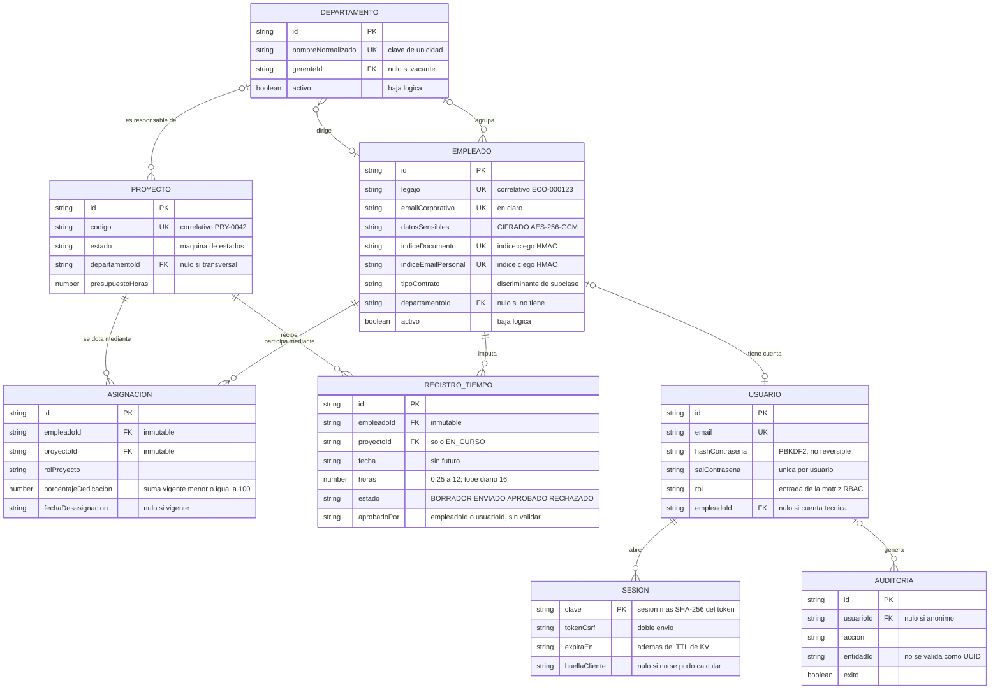

# Modelo de datos sobre Workers KV

EcoTech Solutions persiste todo su estado en un único namespace de Workers KV
(`ECOTECH_KV`, declarado en `wrangler.jsonc`). No hay base de datos relacional,
ni ORM, ni migraciones que ejecutar al desplegar. Este documento describe qué
claves existen, qué forma tiene cada valor, qué garantías da y cuáles no da el
almacén, y quién sostiene los invariantes que en SQL sostendría el motor.

Todo lo que se afirma aquí se puede comprobar en el código; se citan las rutas.
Las cifras de tamaño están medidas sobre el almacén local que deja `wrangler dev`
tras la siembra (`.wrangler/state/v3/kv/23f56c5aab26495994322da9c054565f/blobs/`).

## Tabla de contenidos

- [1. Por qué no hay base de datos relacional](#1-por-qué-no-hay-base-de-datos-relacional)
- [2. Mapa de claves](#2-mapa-de-claves)
- [3. Un documento por colección](#3-un-documento-por-colección)
- [4. Consistencia eventual](#4-consistencia-eventual)
- [5. Esquema de cada colección](#5-esquema-de-cada-colección)
- [6. Integridad referencial](#6-integridad-referencial)
- [7. Diagrama entidad-relación](#7-diagrama-entidad-relación)
- [8. Migraciones](#8-migraciones)
- [9. Limitaciones asumidas](#9-limitaciones-asumidas)

---

## 1. Por qué no hay base de datos relacional

La decisión está tomada en `wrangler.jsonc`: el archivo declara `kv_namespaces`
y nada más. No hay bloque `d1_databases`, ni `hyperdrive`, ni ninguna otra
vinculación de datos.

```jsonc
// wrangler.jsonc
"kv_namespaces": [
  { "binding": "ECOTECH_KV", "id": "23f56c5aab26495994322da9c054565f" }
]
```

El motivo es el modelo de ejecución. Un Worker no es un proceso de larga vida:
se instancia por petición, en cualquiera de los centros de datos del borde, sin
estado compartido fiable entre invocaciones. Un pool de conexiones a Postgres no
tiene dónde vivir en ese modelo, y una base regional convertiría cada petición
del borde en un viaje de ida y vuelta a una única región. KV, en cambio, se lee
desde el borde y no cuesta nada mientras nadie lo consulta.

El precio es que **el almacén no aporta ninguna de las garantías que uno da por
supuestas en SQL**. Cada una hay que reponerla en el código:

| Capacidad relacional | Qué hay en su lugar | Dónde |
| --- | --- | --- |
| `JOIN` | Se leen las dos colecciones enteras y se cruzan en memoria | `ServicioDepartamentos.conteoEmpleados`, `ServicioProyectos.horasPorProyecto` |
| `FOREIGN KEY` | Comprobación explícita en el servicio antes de escribir | Apartado [6](#6-integridad-referencial) |
| `UNIQUE` | Recorrido completo de la colección comparando valor a valor | `ServicioEmpleados.exigirUnicidad`, `ServicioDepartamentos.exigirNombreDisponible` |
| `CHECK` | `validar()` de la entidad, que `RepositorioKV.guardar` invoca antes de persistir | `src/dominio/base/Entidad.ts` |
| Transacción | Nada. Son escrituras sucesivas e independientes | `ServicioEmpleados.eliminar` hace cuatro |
| Índice / `ORDER BY` | `Array.prototype.sort` sobre lo ya leído | `ServicioEmpleados.listar` |
| `LIMIT` / paginación | `slice` después de leerlo todo, y solo en auditoría | `ServicioAuditoria.listar` |
| Índice de texto | `String.prototype.includes` sobre texto normalizado en memoria | `ServicioProyectos.listar`, `ServicioDepartamentos.listar` |
| `SEQUENCE` | Contador propio en una clave aparte | `AlmacenKV.siguienteCorrelativo` |

Qué significa en la práctica, sin adornos:

- **Toda consulta lee la colección entera.** Filtrar por departamento no ahorra
  nada: `RepositorioKV.listar` deserializa el mapa completo, rehidrata cada
  registro a su objeto de dominio y recién entonces aplica el predicado. El
  filtro es comodidad de la API, no una optimización de acceso.
- **Comprobar unicidad cuesta una lectura completa.** `exigirUnicidad` recorre
  todos los empleados en cada alta y en cada edición que toque el documento, el
  email personal o el corporativo.
- **Una operación que toca varias colecciones puede quedar a medias.** La baja de
  un empleado escribe departamentos, asignaciones, usuarios y empleados en cuatro
  llamadas separadas (`ServicioEmpleados.eliminar`); si el Worker se corta entre
  la segunda y la tercera, las asignaciones quedan cerradas y el empleado sigue
  activo. No hay rollback.
- **No hay paginación real.** `GET /api/empleados` devuelve todos los empleados
  que pasen el filtro. La única colección con techo es la auditoría, y lo tiene
  porque se poda al escribir (apartado 3).

A cambio: cero infraestructura que administrar, cero coste en reposo, lectura
replicada en el borde, y ningún paso de migración en el despliegue — algo que
importa porque en Workers **no existe un momento de "post-despliegue"** donde
correr scripts. Por eso la siembra inicial es perezosa y se dispara en la primera
petición a la API (`Semilla.ejecutarSiHaceFalta`, invocado desde
`src/worker/index.ts`).

---

## 2. Mapa de claves

Cinco familias de claves, y ninguna más. El espacio de nombres es plano: KV no
tiene tablas, así que el prefijo es lo único que separa un tipo de dato de otro.

| Clave | Forma del valor | TTL | Quién escribe |
| --- | --- | --- | --- |
| `col:<coleccion>` | `Record<string, Estado*>` — mapa de `id` a estado persistido | ninguno | `AlmacenKV.mutarColeccion`, llamado por `RepositorioKV.guardar` / `guardarVarias` / `eliminar` |
| `sesion:<sha256(token)>` | `DatosSesion` (`src/dominio/seguridad/Sesion.ts`) | `DURACION_SESION_SEGUNDOS` = 28 800 s (8 h) | `ServicioAutenticacion.crearSesion`; la borran `cerrarSesion` y `resolverSolicitante` |
| `contador:<nombre>` | `{ valor: number }` | ninguno | `AlmacenKV.siguienteCorrelativo`; `Semilla` fija el valor inicial |
| `limite:<clave>` | `{ inicio: number, conteo: number }` | **ninguno** (ver nota) | `LimitadorTasa.consumir`; la borra `LimitadorTasa.reiniciar` |
| `sistema:sembrado` | `{ hecho: true, fecha: string }` | ninguno | `Semilla.ejecutarSiHaceFalta` |

Las claves concretas que el sistema llega a escribir:

| Clave concreta | Contenido |
| --- | --- |
| `col:empleados` | `EstadoEmpleado` de las tres modalidades de contrato |
| `col:departamentos` | `EstadoDepartamento` |
| `col:proyectos` | `EstadoProyectoPersistido` |
| `col:asignaciones` | `EstadoAsignacion` |
| `col:registros-tiempo` | `EstadoRegistroTiempo` |
| `col:usuarios` | `EstadoUsuario` |
| `col:auditoria` | `EstadoRegistroAuditoria`, podado a 2 000 asientos |
| `contador:legajo` | Correlativo de `ECO-000123` (`formatearLegajo`) |
| `contador:proyecto` | Correlativo de `PRY-0042` (`formatearCodigoProyecto`) |
| `limite:login:ip:<ip>` | Ventana de intentos de login por dirección (10 / 300 s) |
| `limite:informes:<usuarioId>` | Ventana de generación de informes por usuario |

Los nombres de colección no son literales sueltos: los fija `Contexto` al
construir cada repositorio (`'empleados'`, `'registros-tiempo'`, …), y
`AlmacenKV.claveColeccion` les antepone el prefijo. La única excepción es
`ServicioAuditoria`, que escribe con `mutarColeccion('auditoria')` directamente
y por eso repite la constante `COLECCION_AUDITORIA` con un comentario que avisa
de que debe coincidir con la de `Contexto.auditoria`.

Volcado real del almacén local tras la siembra y unas cuantas peticiones — son
trece claves, no trece mil:

```
col:empleados          col:departamentos     col:proyectos
col:asignaciones       col:registros-tiempo  col:usuarios
col:auditoria          contador:legajo       contador:proyecto
sistema:sembrado       limite:informes:84a0…  sesion:e9d2…  sesion:998b…
```

### Nota sobre el TTL de `limite:`

El comentario de cabecera de `LimitadorTasa` dice que se apoya «en el TTL nativo
de KV, de modo que los contadores caducan solos». **El código no lo hace.**
`consumir` escribe a través de `AlmacenKV.mutar`, y `mutar` llama a
`escribir(clave, siguiente)` sin el tercer argumento, así que no se envía
`expirationTtl`. La caducidad de la ventana es lógica —se compara `inicio`
contra `ahora` dentro del mutador—, pero la clave permanece en KV hasta que
alguien la borre. En un login correcto la borra `reiniciar`; en un login que
nunca acierta, y en las claves `limite:informes:*`, no la borra nadie.

Se verifica en el almacén local: las tres claves `sesion:*` tienen un valor de
expiración, `limite:informes:*` tiene `null`. El efecto práctico es acumulación
lenta de claves muertas, no un fallo de seguridad: la ventana sigue midiéndose
bien.

---

## 3. Un documento por colección

`AlmacenKV` no guarda un registro por clave, sino la colección entera bajo una
sola clave. La justificación es aritmética y está en el comentario de cabecera
de la clase: **KV cobra y limita por operación, no por byte.**

### El cálculo

| Operación | Con una clave por registro | Con una clave por colección |
| --- | --- | --- |
| Listar N empleados | 1 `list` + N `get` | **1 lectura** |
| Obtener uno por id | 1 `get` | 1 lectura |
| Guardar uno | 1 `put` | 1 lectura + 1 escritura |
| Guardar M de golpe | M `put` | 1 lectura + 1 escritura |
| Contar con filtro | 1 `list` + N `get` | 1 lectura |
| Comprobar unicidad | 1 `list` + N `get` | 1 lectura |

Para el listado de empleados de una PyME —una pantalla que se abre decenas de
veces al día— la diferencia es entre una operación y doscientas. `guardarVarias`
lleva el mismo argumento al extremo: la siembra completa (10 empleados,
5 departamentos, 6 proyectos, 14 asignaciones, 149 registros de tiempo y
4 usuarios) son **seis escrituras**, una por colección — las seis llamadas a
`guardarVarias` del final de `Semilla.sembrar`.

El coste está del otro lado: guardar un solo registro obliga a leer y reescribir
la colección entera. Con `col:registros-tiempo` en 68 KB, cada parte de horas
que se carga mueve 68 KB de ida y de vuelta.

### El techo de 25 MiB

KV admite como máximo **25 MiB por valor** (el límite que citan tanto `AlmacenKV`
como `ServicioAuditoria`). Como una colección entera es un solo valor, ese
límite es el techo del sistema. Tamaños medidos sobre el almacén local ya
sembrado:

| Colección | Registros | Bytes | Bytes/registro | Registros en 25 MiB |
| --- | ---: | ---: | ---: | ---: |
| `col:empleados` | 11 | 9 945 | 904 | ≈ 29 000 |
| `col:registros-tiempo` | 149 | 67 984 | 456 | ≈ 57 000 |
| `col:asignaciones` | 15 | 5 697 | 380 | ≈ 69 000 |
| `col:auditoria` | 23 | 9 158 | 398 | ≈ 65 000 |
| `col:proyectos` | 6 | 2 811 | 469 | ≈ 55 000 |
| `col:usuarios` | 4 | 2 057 | 514 | ≈ 50 000 |
| `col:departamentos` | 5 | 1 888 | 378 | ≈ 69 000 |

Los recuentos no son exactamente los de la siembra: el almacén medido incluye
además los pocos registros que crea `scripts/humo.sh` (un empleado, una
asignación y los asientos de auditoría de la propia ejecución).

El empleado es el registro más pesado porque arrastra el sobre AES-GCM de los
datos personales (~250 caracteres en base64) más dos índices HMAC de 64
caracteres hexadecimales cada uno.

El orden de magnitud es de **decenas de miles de registros por colección**, que
es lo que se decía en el comentario del código. Traducido a vida útil:

- Empleados y departamentos no son el problema. Una empresa con 29 000 fichas de
  empleado tiene departamentos de nómina, no un Worker.
- **`col:registros-tiempo` sí lo es.** Cien empleados cargando 20 partes al mes
  producen 2 000 registros mensuales: el techo llega en unos **28 meses**. No hay
  archivado ni particionado por período; cuando la colección se acerque a
  25 MiB, todas las escrituras de horas fallarán a la vez.
- La auditoría ya tiene la solución que a las horas les falta: `ServicioAuditoria`
  poda a `MAXIMO_ASIENTOS = 2000` en cada alta, conservando los más recientes.
  Es una traza operativa, no un archivo legal.

### El último en escribir gana

`AlmacenKV.mutar` implementa lectura-modificación-escritura y serializa las
operaciones sobre la misma clave con el mapa `enVuelo`. Eso evita que dos
mutaciones concurrentes **de la misma instancia** se pisen.

El alcance de esa protección es más corto de lo que parece. `Contexto` construye
`new AlmacenKV(entorno.ECOTECH_KV)` en su constructor, y `src/worker/index.ts`
construye un `Contexto` por petición. Es decir: **`enVuelo` serializa dentro de
una petición, no entre peticiones.** Dos peticiones simultáneas que den de alta
dos empleados distintos hacen cada una su lectura, añaden su registro al mapa que
leyeron y escriben; la segunda escritura borra al empleado de la primera.

Es una pérdida de datos silenciosa, sin error ni aviso. Se asume por el perfil de
carga: en una empresa de este tamaño, dos altas simultáneas sobre la misma
colección son improbables, y las escrituras frecuentes (partes de horas) las
hace cada empleado sobre su propio registro. Pero es real, y quien mantenga esto
debe saberlo antes de que aparezca.

---

## 4. Consistencia eventual

### Qué es

KV replica cada escritura a los centros de datos que la necesiten, pero no de
forma instantánea. Durante un intervalo, una lectura desde otro punto del borde
puede devolver el valor anterior. No hay lectura fuerte ni transacción: es el
modelo que la propia clase `AlmacenKV` documenta en su comentario de cabecera.

### Cómo se manifiesta para el usuario

| Situación | Qué ve |
| --- | --- |
| Da de alta un empleado y el listado se recarga desde otro centro de datos | La ficha nueva no aparece; al refrescar unos segundos después, sí |
| Dos personas editan departamentos distintos de la misma colección a la vez | El cambio de una desaparece (el mecanismo es el del apartado 3, no la replicación) |
| Un atacante muy distribuido prueba contraseñas desde muchas IP | El contador de `LimitadorTasa` se propaga con retraso y deja pasar algunos intentos de más — está reconocido en el comentario de la clase, que remite al bloqueo por cuenta de `Usuario` como defensa exacta |
| Se cierra sesión y se reintenta con la cookie vieja desde otro punto | La sesión ya borrada podría resolverse una vez más antes de que se propague el borrado |

### Mitigación 1: caché de escritura directa

`AlmacenKV` mantiene un `Map` interno con `TTL_CACHE_MS = 5000`. `escribir` y
`borrar` actualizan esa caché con el valor nuevo, de modo que las lecturas
posteriores **de la misma instancia** devuelven lo recién escrito sin consultar
KV.

```ts
// src/infraestructura/AlmacenKV.ts
async escribir<T>(clave: string, valor: T, ttlSegundos?: number): Promise<void> {
  const opciones = ttlSegundos ? { expirationTtl: Math.max(60, ttlSegundos) } : undefined;
  await this.kv.put(clave, JSON.stringify(valor), opciones);
  this.cache.set(clave, { valor, expira: this.ahora() + AlmacenKV.TTL_CACHE_MS });
}
```

El comentario de la clase la llama «caché por isolate». **No lo es**: el objeto
se crea en el constructor de `Contexto`, que se instancia una vez por petición,
así que la caché vive lo que dura esa petición y se descarta al terminar. Los
5 segundos de TTL nunca llegan a agotarse en una petición normal.

Lo que sí cubre —y no es poco— es la lectura-tras-escritura *dentro de una misma
petición*, que es donde el sistema la necesita de verdad:

- `ServicioEmpleados.crear` comprueba unicidad (lectura), escribe y después
  compone el DTO; todo con datos coherentes.
- `ServicioEmpleados.eliminar` escribe departamentos, asignaciones, usuarios y
  empleados en cadena, leyendo entre medias.
- `Semilla.ejecutarSiHaceFalta` consulta `sistema:sembrado` y escribe seis
  colecciones sin releer nada obsoleto.
- La auditoría, que se escribe al final de casi toda operación, ve la colección
  tal como quedó tras la poda anterior de la misma petición.

Entre peticiones no protege nada. La petición siguiente construye un `Contexto`
nuevo, con una caché vacía, y va a KV.

### Mitigación 2: las mutaciones devuelven la entidad actualizada

Ningún extremo que muta responde `204` con el cuerpo vacío salvo los borrados.
`POST /api/empleados` devuelve el `EmpleadoDTO` recién creado, `PATCH` devuelve
la ficha ya modificada, `POST /api/registros-tiempo/:id/aprobar` devuelve el
registro con su nuevo estado. Se puede comprobar en `src/worker/rutas/`: todas
esas rutas terminan en `json(await servicio.…)`.

Esa respuesta se compone a partir del objeto de dominio que acaba de escribirse
en memoria, no de una relectura, de modo que **un cliente puede actualizar su
vista sin volver a consultar** y así no exponerse a leer un valor sin propagar.

Ahora la parte honesta: **la SPA incluida en `src/cliente/` no aprovecha esa
respuesta.** Todas las vistas descartan el DTO devuelto y recargan la lista
entera (`await this.cargar()` en `VistaEmpleados` y `VistaDepartamentos`,
`await this.refrescar()` en `VistaHoras`). Es decir, la mitigación existe en la
API y está disponible para cualquier consumidor, pero el cliente propio del
proyecto vuelve a leer y, por tanto, sigue expuesto a ver un instante de datos
viejos justo después de guardar. Corregirlo es reemplazar la recarga por la
inserción del DTO devuelto en la lista local.

---

## 5. Esquema de cada colección

Todos los estados extienden `EstadoEntidad` (`src/dominio/base/Entidad.ts`), que
aporta los tres campos comunes:

| Campo | Tipo | Nota |
| --- | --- | --- |
| `id` | `string` | UUID v4 de `crypto.randomUUID()`. No es autoincremental a propósito: no revela volumen ni orden de alta |
| `creadoEn` | `string` | ISO 8601 completo. Lo fija el constructor de `Entidad` |
| `actualizadoEn` | `string` | ISO 8601. Lo refresca `tocar()`, que invoca toda mutación |

En las tablas siguientes se omiten esos tres. La clave del mapa es siempre el
`id`, duplicado dentro del valor.

### `col:empleados`

Estado unificado de las tres subclases (`EstadoEmpleado` extiende
`EstadoPersona`). Es la única colección con datos protegidos.

| Campo | Tipo | Nota |
| --- | --- | --- |
| `nombre` | `string` | Mínimo 2 caracteres (`Persona.validar`) |
| `apellido` | `string` | Mínimo 2 caracteres |
| `emailCorporativo` | `string` | En claro: no se considera dato sensible. Normalizado a minúsculas por `ReglaEmail`. Único (comprobado en servicio) |
| **`datosSensibles`** | `SobreCifrado` | **CIFRADO — AES-256-GCM.** `{ v: 1, iv: base64, ct: base64 }`. Contiene `documento`, `telefono`, `direccion` y `emailPersonal` serializados en un único JSON. La entidad nunca ve el texto plano |
| **`indiceDocumento`** | `string` | **ÍNDICE CIEGO — HMAC-SHA256**, 64 hex. Permite detectar documentos duplicados sin descifrar ni almacenar el documento |
| **`indiceEmailPersonal`** | `string` | **ÍNDICE CIEGO — HMAC-SHA256**, 64 hex. Mismo propósito para el email personal |
| `legajo` | `string` | `ECO-000123`. Del correlativo `contador:legajo`, no del recuento de registros |
| `tipoContrato` | `'ASALARIADO' \| 'POR_HORAS' \| 'CONTRATISTA'` | **Discriminante de subclase.** `FabricaEmpleados.rehidratar` lo usa para decidir qué clase construir. Inmutable tras el alta (`ServicioEmpleados.actualizar` lo rechaza con 422) |
| `fechaInicioContrato` | `string` | `AAAA-MM-DD` |
| `departamentoId` | `string \| null` | Campo escalar, no colección: el invariante «un solo departamento a la vez» se cumple por construcción |
| `activo` | `boolean` | Baja lógica. `desactivar()` lo pone en `false` y anula `departamentoId` |
| `salarioMensual` | `number \| null` | Solo lo usa `EmpleadoAsalariado`; en las otras dos subclases se persiste `null` |
| `tarifaHora` | `number \| null` | `EmpleadoPorHoras` y `Contratista` |
| `topeMensual` | `number \| null` | Solo `Contratista` |

Los tres campos económicos conviven en un estado plano porque `Empleado.aEstado`
compone `...this.parametrosRemuneracion()`, y cada subclase devuelve `null` en
lo que no le compete. Es lo que permite que las tres modalidades compartan una
sola colección sin campos condicionales.

Las huellas HMAC y el sobre se derivan de claves distintas por HKDF
(`ServicioCripto.derivar`, propósitos `'cifrado-datos-personales'` e
`'indice-ciego'`), de modo que comprometer una no compromete la otra. El detalle
criptográfico está en [06 — Seguridad](06-seguridad.md).

### `col:departamentos`

| Campo | Tipo | Nota |
| --- | --- | --- |
| `nombre` | `string` | De 3 a 80 caracteres |
| `nombreNormalizado` | `string` | Minúsculas y espacios colapsados (`Departamento.normalizarNombre`). Es la clave de unicidad, y se persiste para no recalcularla en cada comparación |
| `descripcion` | `string` | Hasta 500 caracteres |
| `gerenteId` | `string \| null` | Id de un `Empleado`. **Asociación, no herencia**: el gerente sigue siendo un empleado normal. `null` = puesto vacante |
| `activo` | `boolean` | Baja lógica; `desactivar()` también vacía `gerenteId` |

### `col:proyectos`

| Campo | Tipo | Nota |
| --- | --- | --- |
| `codigo` | `string` | `PRY-0042`. Del correlativo `contador:proyecto`. El cliente no puede enviarlo: no figura en `ESQUEMA_PROYECTO` |
| `nombre` | `string` | Mínimo 3 caracteres |
| `descripcion` | `string` | Hasta 1 000 caracteres |
| `fechaInicio` | `string` | `AAAA-MM-DD` |
| `fechaFinEstimada` | `string \| null` | Si existe, no puede ser anterior a `fechaInicio` (`Proyecto.validar`) |
| `estado` | `'PLANIFICADO' \| 'EN_CURSO' \| 'PAUSADO' \| 'FINALIZADO' \| 'CANCELADO'` | Solo cambia por `cambiarEstado`, contra la tabla `TRANSICIONES`. `FINALIZADO` y `CANCELADO` son terminales |
| `departamentoId` | `string \| null` | `null` = proyecto transversal. Se admite apuntar a un departamento **inactivo** (decisión explícita de `ServicioProyectos.resolverDepartamento`) |
| `presupuestoHoras` | `number` | ≥ 0. `0` desactiva el cálculo de consumo |

### `col:asignaciones`

Clase de asociación entre empleado y proyecto: la relación tiene datos propios,
así que es una entidad con identidad y no una lista de identificadores.

| Campo | Tipo | Nota |
| --- | --- | --- |
| `empleadoId` | `string` | Inmutable tras el alta: no figura en `ESQUEMA_ACTUALIZAR` |
| `proyectoId` | `string` | Inmutable tras el alta, por el mismo motivo |
| `rolProyecto` | `'LIDER_TECNICO' \| 'DESARROLLADOR' \| 'ANALISTA' \| 'DISENADOR' \| 'QA' \| 'CONSULTOR'` | Editable mientras la asignación esté vigente |
| `porcentajeDedicacion` | `number` | De 1 a 100. La suma de las vigentes de un empleado no puede pasar de 100 (invariante del servicio) |
| `fechaAsignacion` | `string` | `AAAA-MM-DD`. Se admite futura: planificar una incorporación es legítimo |
| `fechaDesasignacion` | `string \| null` | `null` = vigente. Cerrar **no borra**: la asignación es lo que explica las horas ya imputadas |

### `col:registros-tiempo`

| Campo | Tipo | Nota |
| --- | --- | --- |
| `empleadoId` | `string` | Inmutable: mover un parte de una persona a otra reescribiría el pasado de las dos |
| `proyectoId` | `string` | Editable solo en `BORRADOR` o `RECHAZADO`, y revalidando asignación y estado del proyecto |
| `fecha` | `string` | `AAAA-MM-DD`. No admite futuro |
| `horas` | `number` | De 0,25 a 12 por registro; el tope de 16 h por día lo impone el servicio sumando la jornada |
| `descripcion` | `string` | De 10 a 500 caracteres. El mínimo es deliberado: «tareas» no permite auditar nada |
| `estado` | `'BORRADOR' \| 'ENVIADO' \| 'APROBADO' \| 'RECHAZADO'` | Solo `APROBADO` computa en nómina e informes de costo |
| `aprobadoPor` | `string \| null` | Identidad de quien aprobó o rechazó. **Puede ser un `empleadoId` o un `usuarioId`**: `ServicioRegistrosTiempo.identidadAprobador` prefiere el primero y recurre al segundo para cuentas sin empleado vinculado |
| `motivoRechazo` | `string \| null` | Obligatorio al rechazar (mínimo 5 caracteres). Se limpia al reenviar |

### `col:usuarios`

| Campo | Tipo | Nota |
| --- | --- | --- |
| `email` | `string` | Identificador de acceso. La búsqueda de login es un recorrido de la colección (`buscarUno`) |
| `hashContrasena` | `string` | PBKDF2-HMAC-SHA256, 100 000 iteraciones, 256 bits en hexadecimal. **No es reversible**: no es cifrado, es derivación |
| `salContrasena` | `string` | 16 bytes en hexadecimal, únicos por usuario |
| `rol` | `'ADMIN_RRHH' \| 'GERENTE' \| 'EMPLEADO' \| 'AUDITOR'` | Entrada de la matriz RBAC de `PoliticaAutorizacion` |
| `empleadoId` | `string \| null` | Asociación **0..1**: hay empleados sin cuenta y cuentas sin empleado (el auditor externo sembrado no tiene ficha) |
| `activo` | `boolean` | La baja del empleado desactiva su cuenta en cascada |
| `debeCambiarContrasena` | `boolean` | Lo pone la siembra. **Solo lo hace cumplir el cliente** (`src/cliente/Aplicacion.ts`); la API no lo comprueba |
| `ultimoAcceso` | `string \| null` | ISO. Lo fija `registrarAccesoExitoso` |
| `intentosFallidos` | `number` | Se reinicia a 0 al bloquear y al acertar |
| `bloqueadoHasta` | `string \| null` | ISO. 15 minutos tras 5 fallos. Temporal a propósito: un bloqueo permanente sería una denegación de servicio contra el empleado |

`hashContrasena` y `salContrasena` no tienen `getter` público: se salen de la
entidad por `aEstado()` (que consume el repositorio) o por
`credencialesParaVerificar()`, que existe como método justamente para que
cualquier uso aparezca en una búsqueda del código.

### `col:auditoria`

Asientos inmutables: `RegistroAuditoria` no expone ningún método de mutación.

| Campo | Tipo | Nota |
| --- | --- | --- |
| `usuarioId` | `string \| null` | `null` en eventos anónimos (un login rechazado) |
| `emailUsuario` | `string \| null` | Desnormalizado: si la cuenta se borra, el asiento sigue diciendo quién fue |
| `accion` | `string` | Clave cerrada: `LOGIN_EXITOSO`, `EMPLEADO_CREADO`, `TIEMPO_APROBADO`… |
| `entidad` | `string` | Nombre de la clase afectada |
| `entidadId` | `string \| null` | **No se valida como UUID**: hay asientos que referencian cosas que no son entidades (el email de un login fallido) |
| `detalle` | `string` | Recortado a 300 caracteres. Se registran los campos tocados, **nunca sus valores**: volcar el domicilio aquí anularía el cifrado en reposo |
| `exito` | `boolean` | Los fallos son justo lo que interesa detectar |
| `ip` | `string \| null` | Del solicitante, si lo había |

### `sesion:<hash>` — fuera de las colecciones

La sesión no vive en un `col:` a propósito, y `DatosSesion` no extiende
`EstadoEntidad`. Validar una sesión es una lectura directa por clave, no un
recorrido de colección.

| Campo | Tipo | Nota |
| --- | --- | --- |
| `usuarioId` | `string` | |
| `email` | `string` | |
| `rol` | `Rol` | Desnormalizado para autorizar sin leer el usuario. `resolverSolicitante` lo revalida igualmente contra `col:usuarios` en cada petición, de modo que un cambio de rol surte efecto de inmediato |
| `empleadoId` | `string \| null` | |
| `tokenCsrf` | `string` | 24 bytes aleatorios, distinto del token de sesión. Doble envío cookie + cabecera `X-Token-CSRF` |
| `creadaEn` / `expiraEn` | `string` | ISO. Además del TTL de KV, `sesionExpirada` lo comprueba en cada petición |
| `huellaCliente` | `string \| null` | Si cambia, se invalida la sesión: indica token reutilizado desde otro cliente |

La clave contiene el **SHA-256 del token**, no el token. Un volcado del almacén
no permite suplantar a nadie sin invertir SHA-256, y el token solo existe en la
respuesta del login y en la cookie del navegador.

---

## 6. Integridad referencial

En KV no existe. Todas las referencias entre colecciones son identificadores
sueltos que nadie valida al escribir; quien las sostiene son los servicios de
`src/aplicacion/`, antes de persistir. Las entidades no pueden hacerlo: exigiría
consultar otro repositorio, y el dominio no conoce la persistencia.

| Comprobación | Dónde | Qué pasaría sin ella |
| --- | --- | --- |
| El departamento de un empleado existe y está **activo** | `ServicioEmpleados.exigirDepartamentoValido` | Empleados colgando de un id inexistente; los informes por departamento perderían gente sin avisar |
| No hay dos empleados con el mismo documento, email personal o email corporativo | `ServicioEmpleados.exigirUnicidad` (por índice ciego, sin descifrar) | La duplicidad de fichas que motiva el sistema: la misma persona cargada dos veces con el documento escrito distinto |
| El gerente de un departamento existe y está activo | `ServicioDepartamentos.resolverGerente` | Un departamento dirigido por alguien que ya no trabaja en la empresa, o por un id inventado |
| El nombre de departamento no se repite (incluidos los inactivos) | `ServicioDepartamentos.exigirNombreDisponible` | Dos unidades distintas indistinguibles en los informes históricos |
| Un departamento con empleados activos no se da de baja | `ServicioDepartamentos.eliminar` | Gente que sigue trabajando sin pertenencia organizativa; los informes por departamento descuadran sin que nadie lo haya decidido |
| El departamento de un proyecto existe (se admite inactivo) | `ServicioProyectos.resolverDepartamento` | Proyectos apuntando a un id inexistente. Se admite el inactivo a propósito: un proyecto histórico puede colgar de una unidad ya disuelta |
| Un proyecto con horas o asignaciones no se borra: se **cancela** | `ServicioProyectos.eliminar` | Partes de horas aprobados sin proyecto que los explique; informes de períodos cerrados que dejan de cuadrar |
| Los dos extremos de una asignación existen; el empleado está activo y el proyecto abierto | `ServicioAsignaciones.asignar` | Equipos con fantasmas, e incorporaciones a proyectos ya cerrados |
| No hay dos asignaciones **vigentes** del mismo par empleado-proyecto | `ServicioAsignaciones.asignar` | Imposible saber cuál de las dos explica una hora imputada, y la dedicación se contaría doble |
| La suma de dedicaciones vigentes de un empleado no pasa de 100 | `ServicioAsignaciones.exigirDedicacionDisponible` | El error de asignación del enunciado: la misma persona al 60 % en tres proyectos, y tres jefes creyendo contar con ella |
| Toda hora imputada tiene detrás una asignación **vigente en esa fecha** | `ServicioRegistrosTiempo.exigirAsignacionVigente` (usa `estabaVigenteEn`, no `activa`) | Horas imputadas a proyectos en los que la persona nunca participó, o participó en otro período |
| El proyecto de un parte de horas está `EN_CURSO` | `ServicioRegistrosTiempo.exigirProyectoConCargaAbierta` | Costes que aparecen en proyectos ya liquidados |
| El total de horas de un empleado en un día no pasa de 16 | `ServicioRegistrosTiempo.exigirTopeDiario` | Cuatro partes de 12 h en cuatro proyectos el mismo día, ninguno inválido por separado |
| Nadie aprueba sus propias horas | `RegistroTiempo.aprobar` (invariante de la entidad, comparando identidades) | Separación de funciones inexistente: el circuito de aprobación sería decorativo |
| Al dar de baja un empleado se liberan sus gerencias, se cierran sus asignaciones y se desactiva su cuenta | `ServicioEmpleados.eliminar` | Punteros colgando por tres colecciones, y un exempleado con sesión válida |

### Lo que no se comprueba

Por honestidad, las referencias que hoy nadie valida:

- **`RegistroTiempo.aprobadoPor`** no se contrasta contra ninguna colección, y
  además puede contener un `empleadoId` o un `usuarioId` según quién apruebe.
  Resolverlo para mostrarlo exige probar en las dos colecciones.
- **`Usuario.empleadoId`** no tiene ruta de mantenimiento: no hay ningún
  `/api/usuarios` registrado en `src/worker/index.ts`, pese a que el permiso
  `usuario:gestionar` existe en la matriz RBAC. Las cuentas solo las crea
  `Semilla`. Tampoco hay nada que impida que dos usuarios apunten al mismo
  empleado.
- **Un empleado puede dirigir varios departamentos**: `designarGerente` no
  comprueba si ya gerencia otro.
- **Un departamento con proyectos sí se puede desactivar**: `eliminar` solo
  cuenta empleados activos. Es coherente con la baja lógica (el id sigue
  resolviéndose), pero no es una comprobación, es una ausencia.
- **Nada es atómico.** Las cascadas son escrituras sucesivas sobre colecciones
  distintas; un corte a mitad deja el sistema en un estado intermedio válido
  para KV e incoherente para el negocio.

---

## 7. Diagrama entidad-relación

Las cardinalidades salen del código, no del modelo ideal: son las que los
servicios hacen cumplir hoy.



Dos relaciones merecen comentario:

- **`EMPLEADO |o--o| USUARIO`**: la asociación opcional en ambos extremos es la
  corrección del error de modelado más frecuente (`Usuario extends Empleado`).
  Hay empleados sin cuenta —un operario cuyas horas carga su supervisor— y
  cuentas sin empleado —el auditor externo sembrado—. El `0..1` del lado del
  usuario no está impuesto por código: es como lo deja `Semilla`.
- **La aprobación de horas no aparece como relación.** `aprobadoPor` es un
  identificador que puede apuntar a dos colecciones distintas, así que dibujarlo
  como clave foránea sería mentir sobre lo que el código garantiza.

---

## 8. Migraciones

### Lo que sí está previsto

**El sobre cifrado lleva versión.** `SobreCifrado` declara `v: 1` junto al IV y
al texto cifrado:

```ts
// src/infraestructura/ServicioCripto.ts
export interface SobreCifrado {
  /** Version del esquema, para poder rotar algoritmo sin romper lo ya guardado. */
  v: 1;
  iv: string;
  ct: string;
}
```

La idea es que un cambio de algoritmo escriba `v: 2` y que `descifrar` ramifique
según el valor leído, dejando los sobres viejos legibles. El formato está
preparado; **el código todavía no**: `descifrar` no lee `sobre.v` en ningún
momento, va directo a AES-GCM con la clave actual. Convertirlo en un mecanismo de
migración real es añadir esa rama, no rediseñar nada.

**La siembra es idempotente por marca.** `sistema:sembrado` es lo que impide que
la primera petición de cada arranque vuelva a sembrar. Es el gancho disponible
para una migración de arranque: la comprobación ya se hace en cada petición
(servida por la caché de la petición), y ahí es donde encajaría una versión de
esquema global.

**La rehidratación tolera campos ausentes.** El patrón ya está en uso:

```ts
// src/dominio/personas/EmpleadoAsalariado.ts
this._salarioMensual = estado.salarioMensual ?? 0;
```

Añadir un campo opcional con reserva en el constructor de la entidad es una
migración perezosa completa: los registros viejos se leen con el valor por
defecto y adoptan el campo nuevo la próxima vez que se guarden, porque
`aEstado()` reescribe el registro entero.

### Lo que no está resuelto

- **No hay versión de esquema por registro.** `EstadoEntidad` tiene `id`,
  `creadoEn` y `actualizadoEn`, y nada más. Ante un registro no se puede saber
  con qué forma se escribió; solo inferirlo por qué campos trae.
- **No hay ejecutor de migraciones.** No existe ningún código que recorra una
  colección y la reescriba. `Semilla` solo actúa si la marca no está, y escribe
  desde cero: no sirve para transformar datos existentes.
- **Una migración perezosa no termina nunca sola.** Los registros que nadie
  vuelve a guardar conservan la forma vieja indefinidamente. Un empleado dado de
  baja hace dos años no se reescribe jamás.
- **Renombrar o eliminar un campo deja basura.** Desaparece solo de los
  registros que se vuelvan a guardar; el resto conserva la clave huérfana dentro
  del JSON, ocupando sitio en un valor con techo de 25 MiB.
- **Rotar `CLAVE_MAESTRA` rompe los datos.** Las subclaves se derivan por HKDF
  con sal fija `'ecotech-solutions-v1'` a partir del secret. Cambiar el secret
  vuelve **indescifrables todos los sobres existentes** y, además, **cambia todos
  los índices ciegos**, con lo que el control de duplicados deja de reconocer a
  los empleados ya cargados. No hay rutina de recifrado: haría falta descifrar
  con la clave vieja y volver a cifrar con la nueva, y hoy no existe ningún punto
  del código donde convivan las dos.
- **Renombrar una colección deja la clave vieja huérfana.** Cambiar
  `'registros-tiempo'` en `Contexto` haría que el sistema empezara a leer una
  clave vacía, sin error y sin datos. No hay copia ni alias.
- **No hay copia de seguridad.** Los exportadores (`csv`, `xlsx`, `pdf`, `json`)
  producen informes, no un volcado del almacén: sus columnas son las que define
  cada clase `Reporte`, no el estado persistido. Recuperar un registro borrado
  por un «último en escribir gana» no es posible.

### El procedimiento hoy

Sin herramientas propias, lo único disponible es el CLI de Wrangler operando
sobre el JSON a mano:

```bash
# Volcar una colección a un archivo
npx wrangler kv key get "col:empleados" --binding ECOTECH_KV --remote > empleados.json

# ... transformarla con el script que haga falta ...

# Volver a escribirla
npx wrangler kv key put "col:empleados" --path empleados.json --binding ECOTECH_KV --remote
```

Con una advertencia que no conviene pasar por alto: entre el `get` y el `put`
cualquier escritura del sistema en esa colección se pierde. Para una migración
real hay que hacerlo con el Worker fuera de servicio.

---

## 9. Limitaciones asumidas

Resumen de los compromisos que el modelo acepta, cada uno explicado arriba:

| Limitación | Alcance |
| --- | --- |
| Último en escribir gana | Dos peticiones concurrentes sobre la misma colección: una pierde su cambio, sin error |
| Techo de 25 MiB por colección | `col:registros-tiempo` llega en unos 28 meses con 100 empleados; no hay archivado |
| Toda lectura trae la colección entera | Sin paginación ni índices; el filtro es en memoria, después de leerlo todo |
| Sin transacciones | Las cascadas (baja de empleado) pueden quedar a medias |
| Caché de escritura por petición, no por isolate | Solo cubre lectura-tras-escritura dentro de la misma petición |
| El cliente propio no aprovecha el DTO devuelto | La SPA recarga tras cada mutación y sigue expuesta a consistencia eventual |
| `limite:*` sin TTL | Las claves de limitación se acumulan salvo que `reiniciar` las borre |
| Auditoría podada a 2 000 asientos | Traza operativa; para conservar más hay que exportar periódicamente |
| Sobre cifrado versionado pero sin lector de versión | `v` se escribe y nunca se lee |
| Sin rotación de clave maestra ni copia de seguridad | Cambiar `CLAVE_MAESTRA` inutiliza los datos personales ya cifrados |

---

**Documentos relacionados:** [05 — Arquitectura](05-arquitectura.md) (capas y
ciclo de vida de una petición), [06 — Seguridad](06-seguridad.md) (cifrado,
índices ciegos y RBAC), [07 — Referencia de la API](07-api.md) (qué extremo toca
cada colección).
