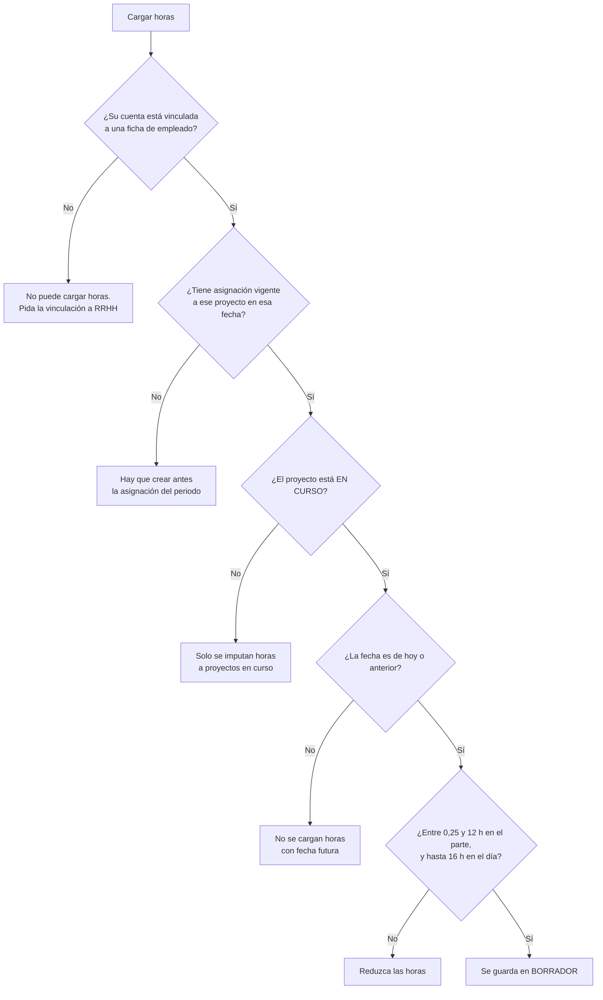
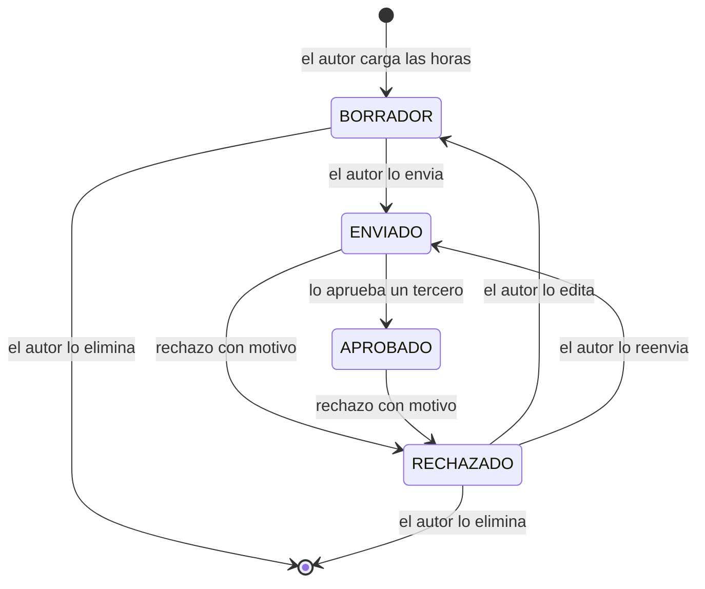

# Manual de usuario

Guía de uso del Sistema de Gestión Interna de EcoTech Solutions para quien lo va
a operar: personal de Recursos Humanos, gerencia, empleados y auditoría. No
explica el código; para eso están [05 — Arquitectura](05-arquitectura.md) y
[07 — Referencia de la API](07-api.md).

## Contenido

- [1. Ingreso al sistema](#1-ingreso-al-sistema)
  - [1.1 Credenciales de demostración](#11-credenciales-de-demostración)
  - [1.2 Cambio obligatorio de contraseña](#12-cambio-obligatorio-de-contraseña)
  - [1.3 Bloqueos, expiración y cierre de sesión](#13-bloqueos-expiración-y-cierre-de-sesión)
- [2. Los cuatro roles](#2-los-cuatro-roles)
  - [2.1 Qué módulo ve cada rol](#21-qué-módulo-ve-cada-rol)
  - [2.2 Qué puede hacer cada rol](#22-qué-puede-hacer-cada-rol)
- [3. Los módulos, tarea por tarea](#3-los-módulos-tarea-por-tarea)
  - [3.1 Panel](#31-panel)
  - [3.2 Empleados](#32-empleados)
  - [3.3 Departamentos](#33-departamentos)
  - [3.4 Proyectos](#34-proyectos)
  - [3.5 Asignaciones](#35-asignaciones)
  - [3.6 Registro de horas](#36-registro-de-horas)
  - [3.7 Informes](#37-informes)
  - [3.8 Auditoría](#38-auditoría)
  - [3.9 Mi perfil](#39-mi-perfil)
- [4. El circuito de aprobación de horas](#4-el-circuito-de-aprobación-de-horas)
- [5. Preguntas frecuentes](#5-preguntas-frecuentes)
- [6. Lo que el sistema no hace](#6-lo-que-el-sistema-no-hace)

---

## Uso en teléfono y tablet

El sistema funciona igual en pantallas chicas, con dos diferencias visibles:

- **El menú pasa abajo.** Por debajo de 900 px la barra lateral se convierte en
  una barra inferior desplazable, al alcance del pulgar.
- **Los listados dejan de ser tablas.** Una ficha de empleado tiene ocho
  columnas y una de proyecto diez: en un teléfono eso obligaría a desplazarse de
  lado para leer cada fila. Por debajo de 900 px cada fila se muestra como una
  ficha apilada, con el nombre de cada campo a la izquierda y su valor a la
  derecha, y los botones de acción al final. No se oculta ninguna columna.

En el panel, las tarjetas de indicadores se reparten de a dos por fila en
teléfono para que el resumen entre de un vistazo.

## 1. Ingreso al sistema

La aplicación se abre en el navegador, en la dirección donde está publicado el
Worker. La primera pantalla es la de ingreso (`src/cliente/vistas/VistaLogin.ts`):
email corporativo y contraseña. No hay registro público: las cuentas las crea el
sistema en la siembra inicial.

Una vez dentro, la navegación es un menú lateral fijo con los módulos que su rol
habilita, una cabecera con su email y su rol, y el botón **Salir**. La dirección
del navegador cambia por fragmento (`#/empleados`, `#/horas`), de modo que se
puede recargar la página o guardar un enlace a un módulo concreto.

### 1.1 Credenciales de demostración

Un despliegue recién sembrado trae cuatro cuentas, una por rol. Las muestra la
propia pantalla de ingreso:

| Cuenta | Rol | Vinculada a la ficha de |
|---|---|---|
| `admin@ecotech.com` | Administración de RRHH | Valeria Sandoval (Recursos Humanos) |
| `gerente@ecotech.com` | Gerencia | Martín Quiroga (Desarrollo Sostenible) |
| `empleado@ecotech.com` | Empleado | Camila Bustos (Desarrollo Sostenible) |
| `auditor@ecotech.com` | Auditoría | ninguna ficha de empleado |

La contraseña inicial es la misma para las cuatro:

```
EcoTech#2026Admin
```

Estas credenciales son de demostración y están publicadas en el repositorio
(`src/aplicacion/Semilla.ts`). Sirven para probar el sistema, nunca para operarlo
con datos reales. En un despliegue de producción se define el secreto
`CLAVE_ADMIN_INICIAL` antes del primer arranque y esa contraseña es la que se
siembra en su lugar; véase [10 — Despliegue](10-despliegue.md).

> **El sistema obliga a cambiar la contraseña en el primer ingreso.** Las cuatro
> cuentas se siembran con la marca `debeCambiarContrasena`. Mientras esa marca
> siga puesta, la aplicación desvía cualquier navegación a **Mi perfil** y avisa
> «Debe cambiar la contraseña inicial antes de continuar.». No se puede usar
> ningún otro módulo hasta rotarla.

### 1.2 Cambio obligatorio de contraseña

En **Mi perfil → Cambiar contraseña** hay tres campos: la contraseña actual, la
nueva y su repetición. La repetición no viaja al servidor: es un control de la
pantalla para evitar guardar una clave mal tecleada.

La contraseña nueva tiene que cumplir la política de
`src/dominio/validacion/Regla.ts` (`ReglaContrasena`):

| Requisito | Valor |
|---|---|
| Longitud mínima | 12 caracteres |
| Longitud máxima | 128 caracteres |
| Variedad | al menos **tres** de estas cuatro familias: minúsculas, mayúsculas, números, símbolos |
| Contraseñas prohibidas | una lista corta de claves obvias (`password1234`, `contrasena12`, `ecotech12345`…) |
| Además | tiene que ser distinta de la actual, y la actual tiene que ser correcta |

Al guardarla, la sesión se relee y desaparece el desvío forzoso a Mi perfil.
El cambio queda asentado en la auditoría como `CAMBIO_CONTRASENA`; un intento con
la contraseña actual equivocada queda como `CAMBIO_CONTRASENA_FALLIDO`.

### 1.3 Bloqueos, expiración y cierre de sesión

- **Intentos fallidos.** El sistema limita los intentos de ingreso a 10 por
  dirección IP cada 5 minutos (`src/aplicacion/ServicioAutenticacion.ts`), y
  además bloquea la cuenta concreta durante 15 minutos tras 5 fallos seguidos
  (`src/dominio/seguridad/Usuario.ts`). En los dos casos
  el mensaje que se ve es el mismo, «Email o contraseña incorrectos.», sin
  distinguir si el email existe o si la cuenta está bloqueada: es deliberado.
  Quien necesita saber que una cuenta está bloqueada lo ve en la auditoría, en
  los asientos `LOGIN_CUENTA_BLOQUEADA` y `LOGIN_BLOQUEADO_POR_TASA`.
- **Duración de la sesión.** Ocho horas (`DURACION_SESION_SEGUNDOS` en
  `src/dominio/seguridad/Sesion.ts`). Cuando caduca, la aplicación avisa «La
  sesión expiro. Vuelva a ingresar.» y vuelve a la pantalla de ingreso. El
  trabajo sin guardar de un formulario abierto se pierde.
- **Cambio de rol o baja en caliente.** El rol se revalida contra la cuenta real
  en cada petición: si RRHH cambia un rol o desactiva una cuenta, la sesión en
  curso lo refleja de inmediato, sin esperar a que expire.
- **Salir.** El botón **Salir** de la cabecera borra la sesión en el servidor.
  Es lo que hay que usar en un equipo compartido; cerrar la pestaña no la
  invalida.

---

## 2. Los cuatro roles

El control de acceso es una matriz cerrada de rol a permisos
(`src/dominio/seguridad/PoliticaAutorizacion.ts`): un rol solo puede lo que
figura explícitamente en esa lista. El menú lateral se construye a partir de los
permisos de la sesión, así que cada persona ve únicamente los módulos que puede
usar. Ocultar un botón es una comodidad, no la protección: el servidor vuelve a
comprobar el permiso en cada operación.

### 2.1 Qué módulo ve cada rol

| Módulo | Administración de RRHH | Gerencia | Empleado | Auditoría |
|---|---|---|---|---|
| Panel | Sí | Sí | Sí | Sí |
| Empleados | Sí, con datos personales | Sí, enmascarado | Sí, enmascarado | Sí, enmascarado |
| Departamentos | Sí | Sí | Sí | Sí |
| Proyectos | Sí | Sí | Sí | Sí |
| Asignaciones | Sí | Sí | Sí | Sí |
| Registro de horas | Sí, de todos | Sí, de todos | Solo las propias | Sí, de todos |
| Informes | Sí, incluida la nómina | Sí, sin nómina | **No aparece** | Sí, sin nómina |
| Auditoría | Sí | **No aparece** | **No aparece** | Sí |
| Mi perfil | Sí | Sí | Sí | Sí |

Cada persona puede comprobar sus propios permisos en **Mi perfil → Permisos de
su rol**, donde cada permiso aparece con una frase que explica qué habilita.

### 2.2 Qué puede hacer cada rol

| Acción | RRHH | Gerencia | Empleado | Auditoría |
|---|---|---|---|---|
| Ver la ficha de un empleado con documento, teléfono, dirección y remuneración | Sí | No | Solo la suya | No |
| Alta, edición y baja de empleados | Sí | No | No | No |
| Crear, editar y dar de baja departamentos | Sí | No | No | No |
| Crear y editar proyectos, cambiar su estado | Sí | Sí | No | No |
| Dar de baja o cancelar un proyecto | Sí | No | No | No |
| Asignar personas a proyectos y cerrar participaciones | Sí | Sí | No | No |
| Cargar horas propias y enviarlas a aprobación | **No** | Sí | Sí | No |
| Aprobar o rechazar partes de horas | **No** | Sí | No | No |
| Generar y exportar informes | Sí | Sí | No | Sí |
| Generar el informe de nómina (importes) | Sí | No | No | No |
| Consultar la traza de auditoría | Sí | No | No | Sí |

Dos asimetrías conviene tenerlas presentes desde el principio, porque no son
errores sino separación de funciones:

- **Recursos Humanos no carga ni aprueba horas.** Ve todos los partes y los usa
  para la nómina, pero no participa en el circuito de aprobación.
- **Gerencia no ve datos personales ni nómina.** Aprueba las horas de su gente y
  gestiona proyectos, pero el documento, el domicilio y el salario de un empleado
  le llegan enmascarados.

---

## 3. Los módulos, tarea por tarea

### 3.1 Panel

Es la pantalla de inicio y la única sin permisos: cualquiera que entre aterriza
aquí (`src/cliente/vistas/VistaPanel.ts`). Muestra solo agregados, ni un dato de
persona.

Seis indicadores:

| Indicador | Qué cuenta |
|---|---|
| Empleados activos | Activos sobre el total de fichas |
| Departamentos | Unidades del organigrama |
| Proyectos en curso | Proyectos en estado `EN_CURSO` |
| Horas del mes en curso | Horas **aprobadas** desde el día 1 del mes |
| Horas pendientes de aprobación | Horas en estado `ENVIADO`, esperando revisión |
| Empleados sin departamento | Activos que no cuentan en los repartos por unidad |

Debajo, dos tablas con el reparto de **horas aprobadas** por proyecto y por
departamento. La barra de cada fila se mide contra el valor más alto de la lista,
no contra el total: sirve para comparar entre sí, no para leer un porcentaje.

Cuando hay algo concreto que corregir aparece un recuadro de aviso: empleados sin
departamento asignado, o proyectos con más horas registradas que las
presupuestadas. Si no hay nada que revisar, el recuadro no se pinta.

Quien puede cargar horas (gerencia y empleados) tiene además un botón **Registrar
horas** que lleva directamente al módulo correspondiente.

### 3.2 Empleados

Listado de la plantilla con búsqueda por nombre, legajo o email, y filtros por
departamento, tipo de contrato y estado (`src/cliente/vistas/VistaEmpleados.ts`).

**Consultar una ficha.** Botón **Ver** de la fila. El listado nunca trae los
datos personales: siempre llegan enmascarados, incluso para RRHH, porque
descifrarlos fila por fila sería caro y una pantalla de listado no necesita el
domicilio de nadie. La ficha completa se pide por separado, y ahí sí se descifran
si quien mira tiene el permiso `empleado:leer_sensible` **o si es su propia
ficha**. Cuando no lo tiene, la ficha muestra un aviso explícito: «Datos
personales ocultos». Lo que se ve en su lugar (`********`) no es el dato real.

**Dar de alta a alguien.** Botón **Nuevo empleado** (requiere `empleado:crear`).
Pide nombre, apellido, email corporativo, tipo de contrato, fecha de ingreso,
departamento y los datos personales (documento, teléfono, dirección y email
personal). Los campos económicos que se envían dependen de la modalidad:

| Tipo de contrato | Campos económicos que se piden |
|---|---|
| Asalariado | Salario mensual |
| Por horas | Tarifa por hora |
| Contratista | Tarifa por hora y tope mensual |

Los tres campos se pintan siempre, porque puede cambiar de modalidad mientras
rellena el formulario, pero solo viajan los que la modalidad admite. El sistema
rechaza el alta si ya existe un empleado con el mismo documento, el mismo email
personal o el mismo email corporativo, aunque esté dado de baja.

**Editar.** Botón **Editar** (requiere `empleado:editar`). Se envía solo lo que
cambió. El **tipo de contrato no se puede cambiar**: aparece en solo lectura, con
la nota de que hay que dar de baja el contrato y registrar un alta nueva. Si sus
datos personales llegan enmascarados, esos campos no se pintan siquiera: editar
sobre asteriscos sobrescribiría el dato real.

**Dar de baja.** Botón **Dar de baja** (requiere `empleado:eliminar`; solo
aparece sobre empleados activos). Es una baja **lógica** y arrastra tres efectos,
que el diálogo de confirmación enumera antes de ejecutar:

1. se cierran con fecha de hoy todas sus asignaciones a proyectos vigentes,
2. queda vacante la gerencia de cualquier departamento que dirigiera,
3. se desactiva su cuenta de acceso.

La ficha y las horas ya imputadas se conservan. **No hay reactivación**: ni la
API ni la interfaz exponen forma de volver a activar a un empleado dado de baja.

### 3.3 Departamentos

Organigrama con búsqueda por nombre o descripción y filtro por estado
(`src/cliente/vistas/VistaDepartamentos.ts`). La tabla trae el conteo de
empleados activos de cada unidad ya calculado.

**Crear o editar** (permisos `departamento:crear` / `departamento:editar`): nombre,
descripción y gerente. Reglas que aplica el servidor
(`src/aplicacion/ServicioDepartamentos.ts`):

- El nombre es único, comparado sin distinguir mayúsculas ni tildes, y **también
  frente a departamentos dados de baja**: un nombre retirado sigue reservado para
  que dos unidades distintas no se confundan en los informes históricos.
- El gerente tiene que ser un empleado existente y **activo**. El desplegable
  solo ofrece gente activa; el gerente actual se conserva en la lista aunque ya
  no lo esté, para no perderlo al guardar otro campo.
- Un departamento puede quedar **Vacante**, sin gerente, mientras se cubre el
  puesto.

**Dar de baja** (permiso `departamento:eliminar`): botón **Eliminar**. Es una baja
lógica —los proyectos y las horas de periodos cerrados siguen apuntando a ese
identificador y necesitan poder resolverlo— y **se rechaza si el departamento
tiene empleados activos**. Hay que reasignarlos primero desde el módulo de
empleados. El mensaje del rechazo dice cuántas personas hay que mover.

### 3.4 Proyectos

Cartera completa con el consumo de horas frente al presupuesto aprobado
(`src/cliente/vistas/VistaProyectos.ts`). Filtros por texto (código o nombre),
estado y departamento. La columna **Imputadas** cuenta solo horas aprobadas, y la
columna **Consumo** es la proporción respecto del presupuesto; al pasar el ratón
por la barra se lee el porcentaje exacto.

**Crear y editar** (permisos `proyecto:crear` / `proyecto:editar`): nombre,
descripción, fecha de inicio, fin estimado (opcional), departamento responsable y
presupuesto en horas. El código del proyecto lo asigna el sistema.

**Cambiar de estado.** Botón **Cambiar estado**. El ciclo de vida está cerrado y
lo comprueba el servidor (`src/dominio/organizacion/Proyecto.ts`):

| Estado actual | Puede pasar a |
|---|---|
| Planificado | En curso, Cancelado |
| En curso | Pausado, Finalizado, Cancelado |
| Pausado | En curso, Cancelado |
| Finalizado | ninguno (estado terminal) |
| Cancelado | ninguno (estado terminal) |

El desplegable ofrece los cinco estados; si elige uno al que no se puede llegar,
el sistema lo rechaza y dice cuáles eran las transiciones válidas.

Dos consecuencias prácticas del estado:

- **Solo un proyecto `EN_CURSO` admite carga de horas.**
- Los proyectos **planificados, en curso o pausados** admiten incorporar gente;
  los finalizados y cancelados, no.

**Dar de baja** (permiso `proyecto:eliminar`): si el proyecto tiene horas
imputadas o asignaciones —aunque estén cerradas— **no se borra: pasa a
Cancelado**, porque borrarlo dejaría sin justificante las horas ya cargadas. Solo
un proyecto sin ninguna dependencia se elimina de verdad.

### 3.5 Asignaciones

Quién participa en qué proyecto, con qué rol y con cuánta dedicación
(`src/cliente/vistas/VistaAsignaciones.ts`). Filtros por proyecto, empleado y
vigencia (vigentes, cerradas o todas; por defecto solo las vigentes).

**Asignar** (permiso `asignacion:gestionar`): empleado, proyecto, rol en el
proyecto, dedicación en porcentaje y fecha de inicio. El desplegable de empleados
solo lista activos; el de proyectos, solo los planificados, en curso o pausados.
La fecha puede ser futura: planificar una incorporación del mes que viene es
legítimo.

Reglas que aplica el servidor (`src/aplicacion/ServicioAsignaciones.ts`):

- **La suma de dedicaciones vigentes de una persona no puede pasar del 100 %.**
  Si se pasa, el mensaje dice cuánto tiene ya comprometido, en cuántos proyectos
  y cuántos puntos quedan libres.
- Una persona no puede tener **dos asignaciones vigentes al mismo proyecto**. Si
  la anterior está cerrada, sí: reincorporar a alguien crea una línea nueva y
  conserva la historia de la primera etapa.

**Editar**: solo el rol y la dedicación, y solo sobre asignaciones vigentes. El
empleado, el proyecto y la fecha de alta no se tocan: reapuntar una asignación
cambiaría retroactivamente el vínculo que explica las horas ya imputadas bajo
ella. Al recalcular la disponibilidad no se cuenta la dedicación actual de esa
misma asignación, de modo que subir del 40 % al 50 % no falla sin motivo.

**Desasignar**: cierra la participación con la fecha de hoy. **No la borra.** La
fila sigue en el listado marcada como *Cerrada*, porque es lo que justifica las
horas que se imputaron mientras estuvo vigente. Una asignación cerrada no admite
ninguna acción.

### 3.6 Registro de horas

El módulo con más reglas detrás (`src/cliente/vistas/VistaHoras.ts`). Quien tiene
`tiempo:leer_todos` (RRHH, gerencia, auditoría) ve los partes de toda la
organización y dispone de un filtro adicional por empleado; un empleado ve
exclusivamente los suyos, y ese filtro lo impone el servidor, no la pantalla.

Filtros: **Desde** y **Hasta** (por defecto, el mes en curso), proyecto, estado
y —si corresponde— empleado. Arriba se resumen las horas del periodo, las
aprobadas y las pendientes.

**Cargar horas** (permiso `tiempo:registrar`; solo gerencia y empleados). El
desplegable de proyectos ofrece únicamente aquellos en los que usted tiene una
asignación vigente. Los controles que se aplican:



La descripción es obligatoria y necesita **al menos 10 caracteres** (máximo 500):
es lo que lee quien aprueba y lo que permite auditar el parte meses después. El
tope de 16 horas es del **día completo**, sumando todos los proyectos y todos los
estados, incluidos borradores y rechazados; el mensaje de error dice cuántas
horas quedan disponibles esa jornada.

**Editar un parte.** Solo en estado Borrador o Rechazado. El proyecto aparece en
solo lectura: para imputar a otro proyecto hay que eliminar el borrador y
cargarlo de nuevo. Editar un parte rechazado lo devuelve automáticamente a
Borrador y borra el motivo del rechazo.

**Eliminar.** Solo borradores y rechazados, y el borrado es definitivo. Un parte
que ya entró al circuito no se borra; queda el asiento de auditoría de que
existió y quién lo borró.

**Enviar, aprobar y rechazar**: véase [el apartado 4](#4-el-circuito-de-aprobación-de-horas).

### 3.7 Informes

Cinco informes, con previsualización en pantalla y descarga en PDF, Excel o CSV
(`src/cliente/vistas/VistaReportes.ts`). Requiere el permiso `reporte:generar`;
el módulo no aparece para el rol Empleado.

| Informe | Qué contiene |
|---|---|
| Empleados | Plantilla con su contrato, departamento y antigüedad |
| Departamentos | Dotación, proyectos y horas aprobadas de cada unidad |
| Proyectos | Cartera con su consumo de presupuesto y equipo asignado |
| Horas | Detalle de los partes del periodo, con proyecto, rol y estado |
| Nómina | Remuneración bruta de cada empleado activo según su modalidad |

**La nómina exige el permiso `reporte:nomina`**, que solo tiene Administración de
RRHH. Para el resto ni siquiera aparece en el desplegable, y pedirla a mano por
la dirección devuelve un rechazo explícito.

Procedimiento: elija el informe, ajuste los filtros, pulse **Previsualizar** y,
cuando el resultado sea el esperado, **Descargar PDF / Excel / CSV**. La
previsualización muestra el título, quién y cuándo lo generó, las filas y una
fila final de totales.

Dos cosas que conviene saber para no interpretar mal un informe:

- **Solo las horas aprobadas computan** en los informes de departamentos,
  proyectos y nómina. Un parte enviado y sin revisar no suma en ninguno.
- El informe de **Empleados** trae dos columnas protegidas, documento y
  teléfono, y las muestra **enmascaradas** a quien no tiene
  `empleado:leer_sensible`: es el mismo informe para las dos audiencias, sin una
  versión «sin datos sensibles» que mantener aparte. El de **Nómina** no
  enmascara nada, porque el permiso `reporte:nomina` ya decide quién puede
  pedirlo.

Los filtros no se aplican por igual a todos los informes:

| Filtro | Informes que lo tienen en cuenta |
|---|---|
| Desde / Hasta | Departamentos, Proyectos, Horas y Nómina (filtran los partes de horas) |
| Proyecto | Proyectos, y los partes de horas de Departamentos, Horas y Nómina |
| Departamento | **Solo** Empleados y Proyectos |

Las exportaciones están limitadas a 20 por usuario y minuto; superarlo devuelve
«Demasiados informes seguidos. Espere unos segundos.».

### 3.8 Auditoría

Traza de quién hizo qué y cuándo (`src/cliente/vistas/VistaAuditoria.ts`).
Requiere `auditoria:leer`: solo la ven Administración de RRHH y Auditoría.

Cada operación que cambia algo deja un asiento con autor, momento exacto, entidad
afectada, detalle y dirección IP. **También quedan los intentos que no
prosperaron**: accesos denegados, ingresos fallidos, reglas de negocio que
cortaron una operación. Son los que permiten distinguir un error honesto de un
intento repetido. La traza no se puede editar ni borrar desde la aplicación.

Filtros:

- **Acción**: coincidencia **exacta**, sin distinguir mayúsculas. No es una
  búsqueda por fragmento: escriba la acción completa, por ejemplo `LOGIN_FALLIDO`
  o `TIEMPO_APROBADO`.
- **Entidad**: Empleado, Departamento, Proyecto, Asignación a proyecto, Registro
  de tiempo, Informe o Usuario.
- **Resultado**: éxitos, fallos o ambos.
- **Cuántos**: 100, 200 o 500 asientos, siempre del más reciente hacia atrás.

Un asiento sin usuario aparece como `anonimo`: corresponde a una operación
anterior a la autenticación, típicamente un ingreso fallido.

### 3.9 Mi perfil

Reúne lo que el sistema sabe de usted (`src/cliente/vistas/VistaPerfil.ts`) en
cinco tarjetas:

1. **Cuenta**: email, rol, último acceso y cuándo expira la sesión actual.
2. **Ficha de empleado**: legajo, nombre, email corporativo, tipo de contrato,
   departamento, fecha de ingreso y situación. Solo si su cuenta está vinculada a
   una ficha; la cuenta de auditoría de la demostración, por ejemplo, no lo está.
3. **Datos personales**: documento, teléfono, dirección y email personal. Usted
   ve siempre los suyos completos, aunque su rol no tenga permiso para ver los de
   otros.
4. **Cambiar contraseña**: véase [1.2](#12-cambio-obligatorio-de-contraseña).
5. **Permisos de su rol**: la lista literal de lo que su rol habilita, cada
   permiso con su explicación. Todo lo que no figure ahí lo rechaza el servidor,
   aunque se llegue a la dirección a mano.

---

## 4. El circuito de aprobación de horas

Un parte de horas no es una celda editable: recorre cuatro estados, y cada
movimiento tiene un responsable distinto. Es lo que sustituye a la planilla
compartida y lo que permite explicar, meses después, por qué una hora se pagó o
no se pagó.



### Qué significa cada estado

| Estado | Qué significa | Quién puede tocarlo |
|---|---|---|
| **Borrador** | Recién cargado. Todavía no lo ha visto nadie. No computa en ningún informe. | Su autor lo edita, lo elimina o lo envía |
| **Enviado** | Está en manos de un aprobador. **El autor ya no lo puede editar ni borrar.** Cuenta en el indicador «Horas pendientes de aprobación» del panel. | Quien tiene `tiempo:aprobar` lo aprueba o lo rechaza |
| **Aprobado** | Validado. **Es el único estado que suma** en la nómina, en el consumo de los proyectos y en los informes de costo. | Solo se puede rechazar; no se edita |
| **Rechazado** | Devuelto a su autor con un motivo obligatorio, visible bajo el estado en el listado. No computa. | Su autor lo corrige (vuelve a Borrador), lo reenvía tal cual o lo elimina |

### Quién mueve cada transición

| Transición | Quién la puede hacer | Condiciones |
|---|---|---|
| Crear → Borrador | Gerencia y empleados (`tiempo:registrar`) | Asignación vigente, proyecto en curso, fecha no futura, topes de horas |
| Borrador → Enviado | El autor del parte. Quien ve las horas de todos puede además enviar un parte ajeno que aún no salió a revisar | El parte tiene que pasar de nuevo sus validaciones |
| Enviado → Aprobado | Gerencia (`tiempo:aprobar`) | **El aprobador no puede ser el autor del parte** |
| Enviado → Rechazado | Gerencia (`tiempo:aprobar`) | Motivo obligatorio, mínimo 5 caracteres |
| Aprobado → Rechazado | Gerencia (`tiempo:aprobar`) | Motivo obligatorio. Es la única forma de corregir un parte ya aprobado |
| Rechazado → Borrador | El autor, al editarlo | Al editar se borra el motivo del rechazo |
| Borrador o Rechazado → eliminado | El autor | Un parte enviado o aprobado no se puede eliminar |

Tres consecuencias de diseño que no son negociables desde la interfaz:

- **Nadie aprueba sus propias horas.** El sistema compara la identidad de quien
  aprueba con la del autor del parte y corta la operación.
- **Un parte aprobado no se edita.** Para corregirlo hay que rechazarlo antes, y
  ese rechazo queda escrito, con su motivo, en la auditoría.
- **El motivo del rechazo es obligatorio.** Lo lee quien cargó las horas y queda
  en la traza: así siempre está escrito por qué una hora no se pagó.

---

## 5. Preguntas frecuentes

Cada apartado empieza con el mensaje literal que devuelve el sistema, para que
sea fácil reconocerlo.

### «No puedo asignar a esta persona a otro proyecto»

```
El empleado ya tiene comprometido el 100% de su jornada en 1 proyecto(s)
activo(s). Solo quedan 0 puntos disponibles y se pidieron 50. Reduzca la
dedicacion o cierre alguna de las asignaciones vigentes.
```

La suma de las dedicaciones **vigentes** de una persona no puede pasar de 100
puntos. No es un límite por proyecto sino por persona, y por eso solo se ve
mirando todas sus asignaciones a la vez: es exactamente el problema que traía
tener una planilla por proyecto.

Qué hacer, en orden de preferencia:

1. Bajar la dedicación pedida a los puntos que el mensaje dice que quedan libres.
2. Reducir la dedicación de alguna asignación vigente (**Asignaciones → Editar**).
3. Cerrar una participación que ya terminó (**Asignaciones → Desasignar**). Al
   cerrarla, sus puntos quedan libres de inmediato.

Otros dos rechazos del mismo módulo, con causa distinta:

- «*… ya participa en el proyecto … Modifique esa asignación en lugar de crear
  una segunda*»: ya existe una asignación **vigente** de esa persona a ese
  proyecto. Edite la existente.
- «*El proyecto … esta FINALIZADO y ya no admite incorporaciones*»: un proyecto
  finalizado o cancelado no admite gente nueva.

### «No me deja cargar horas en este proyecto»

Hay dos causas, con dos mensajes distintos.

**Falta la asignación vigente en esa fecha:**

```
El empleado no estaba asignado a ese proyecto el 2026-07-14, de modo que no
puede imputarle horas. Cree primero la asignacion correspondiente al periodo.
```

Toda hora tiene que estar respaldada por una participación **vigente el día del
parte**, no hoy. Le pasa tanto a quien nunca estuvo en el equipo como a quien ya
salió y carga con fecha posterior a su baja. La solución es que alguien con
permiso de gestión de asignaciones cree la participación que cubre ese periodo.

**El proyecto no está en curso:**

```
El proyecto PRY-0004 esta PLANIFICADO y solo se imputan horas a proyectos
EN_CURSO. Si el trabajo se hizo, reactive el proyecto antes de cargarlas.
```

Solo el estado `EN_CURSO` admite carga. Un proyecto planificado, pausado,
finalizado o cancelado, no. Si el trabajo realmente se hizo, hay que pasar el
proyecto a En curso (**Proyectos → Cambiar estado**) y volver a cargar.

Además, si el desplegable de proyectos aparece vacío al pulsar **Cargar horas**,
el aviso es «No tiene ninguna asignación vigente, de modo que no hay proyectos a
los que imputar horas.»: no está asignado a nada.

### «No puedo borrar el departamento»

```
No se puede eliminar el departamento "Operaciones": tiene 3 empleados activos
asignados. Reasigne esas personas a otro departamento antes de darlo de baja.
```

No hay borrado en cascada, y es deliberado: hacer desaparecer en silencio la
pertenencia organizativa de gente que sigue trabajando descuadraría los informes
por departamento sin que nadie lo hubiera decidido.

Procedimiento: vaya a **Empleados**, filtre por ese departamento, y en cada ficha
(**Editar → Departamento**) muévalos a otra unidad o déjelos «Sin asignar».
Cuando no quede nadie activo, la baja funciona. Es una baja lógica: el
departamento queda *Inactivo* y sigue resolviéndose en los informes históricos.

Dos avisos relacionados:

- El nombre de un departamento dado de baja **sigue reservado**: crear otro con
  el mismo nombre devuelve «Ya existe un departamento llamado "…"».
- Un departamento inactivo no se puede reactivar desde la aplicación.

### «No veo los datos personales de los empleados»

En la ficha aparece el recuadro «Datos personales ocultos» y los campos muestran
`********`. No es un fallo de carga ni un dato sin cargar: **su rol no tiene el
permiso `empleado:leer_sensible`**, que solo posee Administración de RRHH.

Qué queda oculto: documento, teléfono, dirección, email personal, salario
mensual, tarifa por hora y tope mensual. Esos datos se guardan cifrados y solo
se descifran para quien tiene el permiso.

Tres precisiones:

- **Sus propios datos los ve siempre**, aunque su rol no tenga el permiso: en
  **Mi perfil → Datos personales** y en su propia ficha.
- En el **listado** los datos llegan enmascarados **para todo el mundo**,
  incluida RRHH. Hay que abrir la ficha con **Ver** para verlos.
- En los informes ocurre lo mismo: el informe de Empleados sale con esas celdas
  enmascaradas para quien no tiene el permiso.

Si necesita el dato para su trabajo, la vía es pedir a RRHH que revise su rol;
no hay forma de forzarlo desde la interfaz.

### «No puedo aprobar mis horas»

```
Un empleado no puede aprobar sus propios registros de horas.
```

Es separación de funciones, no un error. Un gerente carga sus propias horas como
cualquier otra persona, pero quien las valida tiene que ser un tercero con el
permiso `tiempo:aprobar`.

Sí, el botón **Aprobar** aparece igualmente sobre sus propios partes enviados
—la pantalla decide los botones por rol, no por autoría—, y falla al pulsarlo. Es
una aspereza conocida de la interfaz.

Qué hacer: envíe el parte y pida a otro gerente que lo apruebe. Si en el
departamento no hay otra persona con permiso de aprobación, hay que darle el rol
Gerencia a alguien más; RRHH **no** puede aprobar horas.

Mensajes vecinos del mismo módulo:

- «*Solo se aprueban registros enviados. Este está en estado BORRADOR.*»: el
  parte todavía no se envió. Primero **Enviar**.
- «*El registro está en estado ENVIADO y ya no admite ediciones. Para corregirlo,
  un aprobador debe rechazarlo primero…*»: al enviarlo queda congelado para su
  autor. Pida el rechazo, corríjalo y vuelva a enviarlo.
- «*No se puede eliminar un registro en estado APROBADO…*»: los partes revisados
  no se borran.
- «*El 2026-07-14 ya hay 14 h cargadas en 2 registro(s) y el tope diario es de
  16 h…*»: el tope es de la jornada completa, sumando proyectos y estados. El
  mensaje dice cuántas horas quedan libres ese día.

### «Entré y no veo ningún módulo»

Si la pantalla dice «Su usuario no tiene acceso a ningún módulo. Contacte con
Recursos Humanos.», la cuenta tiene un rol sin permisos efectivos. Es una
situación anómala: los cuatro roles del sistema habilitan al menos el Panel y Mi
perfil.

### «Cargo horas y me dice que mi cuenta no está vinculada»

```
Su cuenta de acceso no esta vinculada a ningun empleado, de modo que no puede
cargar horas propias. Solicite la vinculacion a Recursos Humanos.
```

Hay cuentas que no representan a una persona de la plantilla —la de auditoría de
la demostración, por ejemplo—. Pueden entrar y consultar, pero no tienen partes
de horas propios. La vinculación entre cuenta y ficha de empleado no se puede
cambiar desde la interfaz.

---

## 6. Lo que el sistema no hace

Un manual que solo enumera funciones no sirve para planificar el trabajo. Estas
son las carencias reales de esta versión, verificadas en el código:

- **No hay recuperación de contraseña.** No existe «olvidé mi contraseña»: el
  único cambio posible es desde **Mi perfil**, y exige conocer la contraseña
  actual. Si alguien se queda fuera, no hay procedimiento en la aplicación para
  devolverle el acceso.
- **No hay módulo de gestión de usuarios.** El permiso `usuario:gestionar` existe
  en la matriz de roles, pero ninguna pantalla ni ningún endpoint lo usan: las
  cuentas, sus roles y su vinculación con las fichas de empleado se fijan en la
  siembra inicial y no se editan desde la aplicación.
- **No hay reactivación.** Ni de empleados ni de departamentos dados de baja.
- **No hay notificaciones.** Nadie avisa al aprobador de que tiene partes
  esperando ni al empleado de que le rechazaron uno. El único indicio es el
  contador «Horas pendientes de aprobación» del panel y el motivo que aparece
  bajo el estado en el listado de horas.
- **RRHH no participa en el circuito de horas.** Ve todos los partes, pero no
  puede cargar ni aprobar ninguno. Si la organización necesita que lo haga, hay
  que cambiar la matriz de permisos.
- **El filtro Departamento de los informes solo lo aplican dos de los cinco
  informes** (Empleados y Proyectos). En Horas, Nómina y Departamentos se acepta
  pero no cambia el resultado.
- **El diálogo de cambio de estado de un proyecto ofrece los cinco estados**,
  también los inalcanzables; el rechazo llega al confirmar.
- **La búsqueda de la auditoría es por coincidencia exacta**, no por fragmento.
- **La sesión no se renueva con la actividad**: caduca a las ocho horas de
  haberse abierto, se esté trabajando o no.
