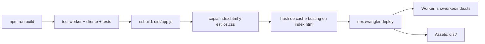

# Despliegue y operación

Cómo poner el sistema en producción sobre Cloudflare Workers, qué secretos hace
falta definir antes del primer arranque, cómo comprobar que el despliegue quedó
sano y qué operaciones admite el almacén una vez en marcha.

El sistema no usa base de datos relacional: toda la persistencia es un namespace
de **Workers KV**, y el frontend son archivos estáticos servidos por el almacén
de assets del mismo Worker. No hay servidor que administrar, ni migraciones, ni
paso de post-despliegue: eso simplifica la operación y, a cambio, concentra toda
la configuración en cuatro sitios —`wrangler.jsonc`, el binding de KV y dos
secretos—.

## Contenido

- [1. Requisitos](#1-requisitos)
- [2. La configuración de `wrangler.jsonc`](#2-la-configuración-de-wranglerjsonc)
- [3. Crear el namespace de KV](#3-crear-el-namespace-de-kv)
- [4. Secretos](#4-secretos)
  - [4.1 `CLAVE_MAESTRA` (obligatorio)](#41-clave_maestra-obligatorio)
  - [4.2 `CLAVE_ADMIN_INICIAL` (opcional, pero recomendado)](#42-clave_admin_inicial-opcional-pero-recomendado)
- [5. Desplegar](#5-desplegar)
  - [5.1 Integración con GitHub](#51-integración-con-github)
  - [5.2 Despliegue manual](#52-despliegue-manual)
- [6. Desarrollo local](#6-desarrollo-local)
- [7. Verificación posterior al despliegue](#7-verificación-posterior-al-despliegue)
- [8. Operación](#8-operación)
  - [8.1 Mapa de claves de KV](#81-mapa-de-claves-de-kv)
  - [8.2 Inspeccionar KV](#82-inspeccionar-kv)
  - [8.3 Reiniciar la siembra](#83-reiniciar-la-siembra)
- [9. Rotación de la clave maestra](#9-rotación-de-la-clave-maestra)
- [10. Resumen de comandos](#10-resumen-de-comandos)

---

## 1. Requisitos

| Requisito | Detalle |
|---|---|
| Cuenta de Cloudflare | Con Workers habilitado y permiso para crear namespaces de KV. Se necesita el `account_id` de esa cuenta, que `wrangler login` resuelve solo |
| Node.js | **20 o superior** (`engines.node` en `package.json`). El script de construcción usa `readdir` recursivo y `node --test` |
| npm | El que venga con Node 20 |
| Wrangler | Declarado como dependencia de desarrollo (`wrangler: ^4.0.0`). No hace falta instalarlo global: se invoca con `npx wrangler …` y se usa la versión del proyecto |
| Namespace de KV | Uno, con el binding `ECOTECH_KV`. Véase el [apartado 3](#3-crear-el-namespace-de-kv) |

Instalación inicial del repositorio y autenticación:

```bash
npm install
npx wrangler login     # abre el navegador y autoriza la cuenta
npx wrangler whoami    # confirma con qué cuenta se va a desplegar
```

No hay dependencias en tiempo de ejecución: el bundle del Worker y el del
navegador se compilan con esbuild a partir del propio código
(`scripts/build.mjs`). Todo lo que hay en `devDependencies` es herramienta de
construcción.

## 2. La configuración de `wrangler.jsonc`

El archivo completo son treinta líneas y cada bloque decide algo que se nota en
producción:

```jsonc
{
  "$schema": "node_modules/wrangler/config-schema.json",
  "name": "ecotech-solutions",
  "main": "src/worker/index.ts",
  "compatibility_date": "2026-08-26",

  "assets": {
    "directory": "./dist",
    "binding": "ASSETS",
    "not_found_handling": "single-page-application",
    "run_worker_first": ["/api/*"]
  },

  "kv_namespaces": [
    { "binding": "ECOTECH_KV", "id": "23f56c5aab26495994322da9c054565f" }
  ],

  "vars": { "ENTORNO": "produccion" },

  "observability": { "enabled": true }
}
```

| Clave | Qué hace |
|---|---|
| `$schema` | Apunta al esquema JSON que trae el propio wrangler, para que el editor valide el archivo mientras se escribe. No afecta al despliegue |
| `name` | Nombre del Worker. Determina el subdominio `ecotech-solutions.ianypico.workers.dev` y es el identificador con el que aparece en el panel. Cambiarlo crea un Worker nuevo, no renombra el existente |
| `main` | Punto de entrada: `src/worker/index.ts`. Wrangler lo compila con esbuild en el momento del despliegue; el TypeScript del servidor no pasa por `scripts/build.mjs`, que solo construye el cliente |
| `compatibility_date` | Fija la fecha de comportamiento del runtime. Congelarla es lo que garantiza que un despliegue de dentro de un año se comporte igual que el de hoy. Subirla es una decisión consciente, no algo que deba hacerse «para estar al día» |

### El bloque `assets`

| Clave | Qué hace |
|---|---|
| `directory: "./dist"` | Carpeta que wrangler sube como assets estáticos. La produce `npm run build`; **está en `.gitignore`**, así que tiene que construirse antes de cada despliegue |
| `binding: "ASSETS"` | Expone el almacén de assets al código del Worker como `entorno.ASSETS`. `src/worker/index.ts` lo usa como red de seguridad: si por un cambio de configuración llegara al Worker algo que no empieza por `/api/`, lo delega en los assets en vez de devolver un 404 de API |
| `not_found_handling: "single-page-application"` | Cualquier ruta sin archivo correspondiente devuelve `index.html`. Es lo que hace que recargar la página en `#/empleados` funcione |
| `run_worker_first: ["/api/*"]` | **Solo las rutas de la API invocan el Worker.** Todo lo demás lo sirve el borde directamente desde el almacén de assets, sin consumir una invocación. Es la razón por la que servir el frontend no cuesta nada |

### El binding de KV

```jsonc
"kv_namespaces": [
  { "binding": "ECOTECH_KV", "id": "23f56c5aab26495994322da9c054565f" }
]
```

`binding` es el nombre con el que el código accede al almacén: aparece en
`src/aplicacion/Contexto.ts` como `entorno.ECOTECH_KV` y es lo único que
`AlmacenKV` necesita. **El nombre del binding no se cambia**; el que cambia en
cada despliegue nuevo es el `id`, que identifica al namespace concreto dentro de
la cuenta de Cloudflare. El identificador que trae el repositorio es el del
entorno de referencia y no sirve en otra cuenta: hay que sustituirlo por el
propio, como se explica en el apartado siguiente.

### `vars` y `observability`

- `vars.ENTORNO` se inyecta como variable de entorno en texto plano y está
  declarada en la interfaz `Entorno` de `src/aplicacion/Contexto.ts`, pero
  **ningún código la lee**. Está para poder distinguir entornos en el futuro; hoy
  no cambia ningún comportamiento. Las variables de `vars` son públicas: no sirven
  para secretos.
- `observability.enabled: true` activa la recolección de logs e invocaciones del
  Worker, que se consultan en el panel de Cloudflare (**Workers & Pages → el
  Worker → Logs**) o en vivo con `npx wrangler tail`. Sin esto, un error 500 en
  producción no deja rastro consultable.

## 3. Crear el namespace de KV

```bash
npx wrangler kv namespace create ECOTECH_KV
```

El comando imprime el fragmento de configuración con el identificador recién
creado, algo como:

```
[[kv_namespaces]]
binding = "ECOTECH_KV"
id = "a1b2c3d4e5f60718293a4b5c6d7e8f90"
```

Ese `id` —y solo el `id`— es lo que hay que pegar en `wrangler.jsonc`, dentro del
bloque `kv_namespaces`, sustituyendo el que viene en el repositorio:

```jsonc
"kv_namespaces": [
  { "binding": "ECOTECH_KV", "id": "a1b2c3d4e5f60718293a4b5c6d7e8f90" }
]
```

No hay que crear ninguna clave a mano: la siembra inicial las escribe sola en la
primera petición a `/api/*` (véase el [apartado 7](#7-verificación-posterior-al-despliegue)).

Para comprobar qué namespaces existen en la cuenta:

```bash
npx wrangler kv namespace list
```

## 4. Secretos

Los secretos no van en `wrangler.jsonc` ni en el repositorio: se guardan cifrados
en Cloudflare y se inyectan en el Worker en tiempo de ejecución. Son dos, uno
obligatorio y uno opcional.

### 4.1 `CLAVE_MAESTRA` (obligatorio)

Es la clave de la que `ServicioCripto` deriva, por HKDF, dos subclaves
independientes (`src/infraestructura/ServicioCripto.ts`):

- una clave **AES-256-GCM** con la que se cifran los datos personales de cada
  empleado (documento, teléfono, dirección y email personal);
- una clave **HMAC-SHA256** con la que se calculan los índices ciegos que
  detectan empleados duplicados sin guardar el documento en claro.

Genere un valor aleatorio y defínalo:

```bash
openssl rand -base64 48
npx wrangler secret put CLAVE_MAESTRA
# pegue el valor generado cuando lo pida y pulse Intro
```

El valor tiene que tener **al menos 32 caracteres**; `openssl rand -base64 48`
produce 64. Guárdelo en el gestor de contraseñas de la organización antes de
pegarlo: Cloudflare no permite volver a leerlo, solo sustituirlo.

> ### Qué pasa si no define `CLAVE_MAESTRA`
>
> **El sistema arranca igual, y ese es el problema.** Si el secreto falta o tiene
> menos de 32 caracteres, `Contexto.resolverClaveMaestra` cae a una clave de
> desarrollo escrita en el propio repositorio:
>
> ```
> ecotech-clave-de-desarrollo-no-apta-para-produccion-0001
> ```
>
> Consecuencias, todas simultáneas:
>
> - **Los datos personales quedan cifrados con una clave pública.** Cualquiera
>   que obtenga un volcado del namespace de KV —o que tenga acceso de lectura al
>   panel de Cloudflare— puede descifrarlos con el valor que está en el código.
>   El cifrado deja de proteger nada.
> - **Los índices ciegos también son reproducibles**, así que la detección de
>   duplicados por documento se puede correlacionar desde fuera.
> - **Definir el secreto más tarde no arregla lo ya escrito.** Los sobres
>   cifrados con la clave vieja dejan de abrirse (AES-GCM falla la verificación
>   de autenticidad) y los índices ciegos cambian. Es exactamente el escenario
>   del [apartado 9](#9-rotación-de-la-clave-maestra).
>
> El sistema no lo silencia: `GET /api/salud` devuelve
> `"cifradoConClaveDeDesarrollo": true` junto a una advertencia en texto, y esa
> comprobación es parte obligatoria de la verificación posterior al despliegue.
>
> **Defina `CLAVE_MAESTRA` antes de la primera petición al Worker recién
> desplegado**, porque esa primera petición es la que dispara la siembra y cifra
> los diez empleados de ejemplo.

### 4.2 `CLAVE_ADMIN_INICIAL` (opcional, pero recomendado)

Contraseña con la que se siembran las cuatro cuentas del primer arranque:

```bash
npx wrangler secret put CLAVE_ADMIN_INICIAL
```

Si no se define, `src/aplicacion/Semilla.ts` usa la constante
`CLAVE_ADMIN_POR_DEFECTO`, que es `EcoTech#2026Admin` y está publicada en el
repositorio. En los dos casos las cuentas quedan marcadas con
`debeCambiarContrasena`, de modo que el sistema obliga a rotarla en el primer
ingreso; definir el secreto evita además la ventana en la que la contraseña
sembrada es pública.

El valor tiene que cumplir la política de contraseñas del sistema si quiere
poder reutilizarse: 12 caracteres como mínimo y tres familias de caracteres.

### Gestión de secretos

```bash
npx wrangler secret list             # qué secretos hay definidos (no sus valores)
npx wrangler secret put NOMBRE       # crear o sustituir
npx wrangler secret delete NOMBRE    # eliminar
```

Los secretos son por Worker y sobreviven a los despliegues: no hay que volver a
definirlos en cada `wrangler deploy`.

## 5. Desplegar

El despliegue tiene dos pasos que no se pueden invertir: primero construir el
frontend en `dist/`, después publicar. Wrangler sube el contenido de `dist/` tal
cual lo encuentra; si no se construyó, sube una carpeta vacía o —peor— la de un
build anterior.



`npm run build` encadena `npm run typecheck` —que compila los tres proyectos de
TypeScript: worker, cliente y pruebas— y `node scripts/build.mjs`. Si la
comprobación de tipos falla, el build se detiene y no hay despliegue. El script
de construcción vacía `dist/` en cada ejecución, para no dejar en el borde
archivos de builds anteriores que ya nadie referencia, y añade un `?v=<hash>` a
`app.js` y `estilos.css` en el HTML, de modo que un despliegue nuevo no se sirva
desde la caché del navegador.

### 5.1 Integración con GitHub

El flujo previsto es la integración de Cloudflare con el repositorio (**Workers
Builds**): al hacer *merge* a `main`, Cloudflare clona el repositorio, ejecuta el
comando de construcción y despliega.

Configuración, en el panel de Cloudflare, dentro de los ajustes del Worker y
su apartado de compilación:

| Campo | Valor |
|---|---|
| Repositorio | El repositorio de GitHub del proyecto |
| Rama de producción | `main` |
| Comando de construcción | `npm run build` |
| Comando de despliegue | `npx wrangler deploy` |
| Directorio raíz | la raíz del repositorio |

Con esa configuración, cada *merge* a `main` reconstruye `dist/` y publica. Los
commits a otras ramas no despliegan a producción.

> **No hay ningún workflow de GitHub Actions en el repositorio**: no existe
> `.github/workflows/`. La integración se configura en el panel de Cloudflare y
> vive allí, no en el código. Si prefiere GitHub Actions, tendrá que escribir el
> workflow y añadir un token de API de Cloudflare como secreto del repositorio;
> el proyecto no lo trae hecho.

### 5.2 Despliegue manual

Desde una máquina autenticada con `wrangler login`:

```bash
npm run deploy
```

que es exactamente `npm run build && wrangler deploy`. Es la vía para el primer
despliegue —cuando todavía no hay integración configurada—, para publicar desde
una rama y para cualquier situación en la que haga falta desplegar sin pasar por
`main`.

Wrangler imprime al terminar la URL del Worker y el identificador de la versión
publicada.

## 6. Desarrollo local

```bash
npm install
npm run build          # hace falta: wrangler dev sirve dist/ como assets
npx wrangler dev       # http://localhost:8787
```

`wrangler dev` levanta el runtime de Workers en local con un KV simulado, cuyo
estado persiste entre ejecuciones en `.wrangler/` (carpeta ignorada por git). Es
un almacén distinto del de producción: lo que se escriba en local no toca los
datos publicados, y la siembra se ejecuta de nuevo la primera vez.

Los secretos en local **no** se leen de Cloudflare, sino del archivo `.dev.vars`
en la raíz del proyecto:

```
CLAVE_MAESTRA=una-clave-local-de-al-menos-32-caracteres
CLAVE_ADMIN_INICIAL=UnaClaveLocal#2026
```

> **`.dev.vars` no se sube nunca.** Está en `.gitignore`, junto con `.dev.vars.*`.
> Contiene material criptográfico y no tiene equivalente cifrado: si acaba en el
> repositorio, hay que rotar la clave, no basta con borrar el archivo. Cada
> persona del equipo mantiene el suyo; no se comparte por correo ni por chat.

Sin `.dev.vars`, el entorno local arranca igualmente con la clave de desarrollo y
`GET /api/salud` lo reporta. Para desarrollar es aceptable; conviene aun así
definir una clave local, porque es la única forma de practicar el flujo real
antes de tocar producción.

Pruebas:

```bash
npm test          # construye las pruebas y las ejecuta con node --test
npm run typecheck # solo comprobación de tipos, sin construir
```

## 7. Verificación posterior al despliegue

La sonda de estado es pública y deliberadamente parca (`src/worker/rutas/sistema.ts`):
dice si el sistema está sembrado y si el cifrado usa la clave de desarrollo, y
nada más. No expone versiones, rutas internas ni conteos.

```bash
curl -s https://ecotech-solutions.ianypico.workers.dev/api/salud
```

Respuesta esperada de un despliegue sano —toda la API envuelve el resultado en
`{ "ok": true, "datos": … }`—:

```json
{
  "ok": true,
  "datos": {
    "estado": "operativo",
    "almacen": "workers-kv",
    "sembrado": true,
    "cifradoConClaveDeDesarrollo": false,
    "advertencia": null
  }
}
```

Cómo leer cada campo:

| Campo | Valor esperado | Si no es ese |
|---|---|---|
| `estado` | `"operativo"` | El Worker respondió: el runtime y el enrutador están en pie |
| `almacen` | `"workers-kv"` | Es una constante; su presencia confirma que la respuesta viene de esta aplicación |
| `sembrado` | `true` | Si es `false`, la siembra todavía no corrió. **Es normal en la primerísima llamada**: la siembra se dispara de forma perezosa en la primera petición a `/api/*`. Repita la llamada; si sigue en `false`, el binding `ECOTECH_KV` apunta a un namespace al que el Worker no puede escribir |
| `cifradoConClaveDeDesarrollo` | **`false`** | Si es `true`, **el secreto `CLAVE_MAESTRA` no está definido o tiene menos de 32 caracteres**. Deténgase aquí: no cargue datos reales. Defina el secreto, redespliegue y —si ya hubo siembra— reinicie la siembra según el [apartado 8.3](#83-reiniciar-la-siembra) |
| `advertencia` | `null` | Cuando `cifradoConClaveDeDesarrollo` es `true`, trae el texto «Defina el secret CLAVE_MAESTRA: los datos personales se estan cifrando con una clave publica.» |

Comprobación en una línea, apta para un script de post-despliegue:

```bash
curl -s https://<host>/api/salud | grep -q '"cifradoConClaveDeDesarrollo":false' \
  && echo "OK: clave maestra configurada" \
  || echo "FALLO: se esta usando la clave de desarrollo"
```

Verificaciones complementarias:

1. **El frontend se sirve.** Abra la raíz del sitio en el navegador: debe
   aparecer la pantalla de ingreso. Si devuelve 404, `dist/` estaba vacío en el
   despliegue: reconstruya y vuelva a publicar.
2. **El ingreso funciona.** Entre con `admin@ecotech.com` y la contraseña
   sembrada. El sistema debe desviarle a **Mi perfil** para cambiarla.
3. **Los logs llegan.** `npx wrangler tail` y una petición cualquiera: con
   `observability` activada, la invocación aparece en el flujo.

## 8. Operación

### 8.1 Mapa de claves de KV

Conviene conocerlo antes de tocar nada desde el panel. `AlmacenKV` guarda **una
colección entera por clave**, no un registro por clave: KV cobra y limita por
operación, así que leer los diez empleados cuesta una sola lectura.

| Clave | Contenido |
|---|---|
| `col:empleados` | Todas las fichas de empleado, como mapa `id → estado`. Los datos personales viajan dentro como sobres cifrados |
| `col:departamentos` | Todos los departamentos |
| `col:proyectos` | Todos los proyectos |
| `col:asignaciones` | Todas las asignaciones a proyectos, vigentes y cerradas |
| `col:registros-tiempo` | Todos los partes de horas |
| `col:usuarios` | Las cuentas de acceso, con el hash PBKDF2 y la sal de cada contraseña |
| `col:auditoria` | La traza de auditoría |
| `sistema:sembrado` | Marca `{ hecho: true, fecha }` que impide que la siembra se repita |
| `contador:legajo`, `contador:proyecto` | Correlativos de `ECO-000001` y `PRY-0001` |
| `sesion:<hash>` | Una sesión activa, con TTL de 8 horas. KV las borra solas al expirar |
| `limite:<clave>` | Contadores del limitador de tasa (intentos de ingreso por IP, exportaciones de informes por usuario) |

Dos consecuencias operativas de este diseño:

- **Las escrituras concurrentes sobre la misma colección siguen el modelo «último
  en escribir gana».** Es aceptable para el volumen de una PyME y está asumido en
  el diseño, pero significa que dos altas simultáneas de empleado, servidas por
  isolates distintos, podrían perder una.
- **KV es eventualmente consistente entre centros de datos.** Un cambio hecho
  desde el panel puede tardar en verse en el Worker; además `AlmacenKV` mantiene
  una caché de 5 segundos por isolate.

### 8.2 Inspeccionar KV

**Desde el panel de Cloudflare**: el apartado de KV (hoy bajo *Storage &
Databases*), el namespace y su listado de claves. Desde ahí se ve el valor JSON
de cada una y se puede editar o borrar. Es la vía cómoda para mirar; para
editar, tenga presente que no hay validación: un JSON mal formado en
`col:empleados` deja el módulo de empleados devolviendo error hasta que se
corrija.

**Desde la línea de comandos**, con el identificador del namespace:

```bash
# listar claves
npx wrangler kv key list --namespace-id=<id>

# leer una coleccion completa
npx wrangler kv key get --namespace-id=<id> "col:empleados"

# comprobar la marca de siembra
npx wrangler kv key get --namespace-id=<id> "sistema:sembrado"
```

Los datos personales de `col:empleados` aparecen como sobres
`{"v":1,"iv":"…","ct":"…"}`: no son legibles sin la clave maestra, que es
precisamente el objetivo.

### 8.3 Reiniciar la siembra

Sirve para volver a un sistema de demostración limpio, o para rehacer los datos
después de haber cambiado la clave maestra.

> ### Esto destruye los datos
>
> Borrar las colecciones elimina **todos** los empleados, departamentos,
> proyectos, asignaciones, partes de horas, cuentas de acceso y la traza de
> auditoría completa. **No hay copia de seguridad automática y la operación no se
> puede deshacer.** Si hay algún dato real, exporte antes las colecciones con
> `wrangler kv key get` y guarde el JSON en un lugar seguro.
>
> Nunca lo haga sobre el namespace de producción sin una decisión explícita y
> documentada. Si solo quiere probar, cree un namespace aparte y apunte
> `wrangler.jsonc` a él.

Procedimiento:

```bash
NS=<id-del-namespace>

# 1. Exportar, por si acaso
for c in empleados departamentos proyectos asignaciones registros-tiempo usuarios auditoria; do
  npx wrangler kv key get --namespace-id=$NS "col:$c" > "respaldo-$c.json"
done

# 2. Borrar las colecciones y los contadores
for c in empleados departamentos proyectos asignaciones registros-tiempo usuarios auditoria; do
  npx wrangler kv key delete --namespace-id=$NS "col:$c"
done
npx wrangler kv key delete --namespace-id=$NS "contador:legajo"
npx wrangler kv key delete --namespace-id=$NS "contador:proyecto"

# 3. Borrar la marca que impide repetir la siembra
npx wrangler kv key delete --namespace-id=$NS "sistema:sembrado"
```

En la siguiente petición a `/api/*`, `Semilla.ejecutarSiHaceFalta()` detecta que
la marca no está y vuelve a sembrar: cinco departamentos, diez empleados, seis
proyectos, sus asignaciones y seis semanas de partes de horas. Compruébelo con
`GET /api/salud`, que debe volver a decir `"sembrado": true`.

Notas:

- **Borrar `sistema:sembrado` sin borrar las colecciones duplica los datos**: la
  siembra vuelve a correr y escribe otro juego completo de entidades con
  identificadores nuevos. Los dos pasos van juntos.
- Las sesiones abiertas (`sesion:*`) dejan de resolver en cuanto desaparece
  `col:usuarios`, así que todo el mundo vuelve a la pantalla de ingreso. No hace
  falta borrarlas a mano; caducan solas.
- La siembra usa la clave maestra **vigente en ese momento** para cifrar los
  datos personales de los empleados de ejemplo.

## 9. Rotación de la clave maestra

**La rotación no está automatizada.** El sistema deriva sus claves de
`CLAVE_MAESTRA` en cada petición y no guarda ninguna referencia a qué clave se
usó para escribir cada sobre: `SobreCifrado` lleva un campo `v` para versionar el
*algoritmo*, no la clave.

### Qué pasa si se cambia el secreto sin más

Sustituir `CLAVE_MAESTRA` con `wrangler secret put` y redesplegar deja el sistema
en este estado:

| Dato | Efecto |
|---|---|
| Datos personales ya cifrados (`documento`, `telefono`, `direccion`, `emailPersonal`) | **Ilegibles.** AES-GCM falla la verificación de autenticidad y el descifrado lanza error |
| Índices ciegos (`indiceDocumento`, `indiceEmailPersonal`) | Quedan calculados con la clave vieja: **la detección de duplicados deja de funcionar** y podrían darse de alta dos veces las mismas personas |
| Contraseñas de las cuentas | **Intactas.** Se guardan con PBKDF2 y una sal por usuario, sin relación con la clave maestra. Nadie pierde el acceso |
| Sesiones activas | Intactas. El token se identifica por su hash SHA-256, que tampoco depende de la clave maestra |
| Resto de campos (nombre, legajo, contratos, proyectos, horas, auditoría) | Intactos: no están cifrados |

Cómo se manifiesta en la aplicación: la ficha de un empleado devuelve un error de
servidor al intentar abrir su sobre —el fallo se propaga a propósito, porque un
sobre que no abre también puede significar que el almacén fue manipulado—, y los
informes muestran a esos empleados con los datos enmascarados, porque
`ServicioReportes` captura el fallo por empleado para no tumbar el informe entero.

### Procedimiento manual

No hay comando para esto; hay que escribirlo. El guion es siempre el mismo:

1. **Ponga el sistema fuera de uso** mientras dure la operación. No hay modo
   mantenimiento: la vía práctica es avisar y hacerlo en una ventana de baja
   actividad, porque una escritura concurrente sobre `col:empleados` durante la
   migración se perdería.
2. **Exporte** `col:empleados` con `npx wrangler kv key get`.
3. **Descifre con la clave vieja y vuelva a cifrar con la nueva**, fuera de línea,
   con un script que use las mismas primitivas que `src/infraestructura/ServicioCripto.ts`:
   HKDF-SHA256 con sal `ecotech-solutions-v1` e `info` `cifrado-datos-personales`
   para la clave AES-GCM, e `info` `indice-ciego` para la clave HMAC.
4. **Recalcule los índices ciegos** `indiceDocumento` e `indiceEmailPersonal` de
   cada empleado con la clave HMAC derivada de la clave nueva. Si se omite este
   paso, el cifrado queda bien pero la unicidad se rompe en silencio.
5. **Defina el secreto nuevo** (`npx wrangler secret put CLAVE_MAESTRA`) y
   **escriba de vuelta** la colección migrada
   (`npx wrangler kv key put --namespace-id=<id> "col:empleados" --path=…`).
6. **Verifique**: `GET /api/salud` con `cifradoConClaveDeDesarrollo: false`, abra
   la ficha de dos o tres empleados y compruebe que los datos personales se leen,
   e intente dar de alta a alguien con un documento ya existente para confirmar
   que la detección de duplicados sigue viva.

Si los datos son de demostración y no hay nada que conservar, la alternativa
razonable es no migrar nada: defina la clave nueva y **reinicie la siembra**
según el [apartado 8.3](#83-reiniciar-la-siembra).

**Limitación asumida:** el sistema no soporta dos claves activas a la vez, así
que no hay rotación sin ventana de indisponibilidad. Un diseño con una clave de
cifrado por registro, envuelta a su vez con la clave maestra, permitiría rotar
reescribiendo solo las envolturas; no es lo que hay implementado, y decirlo aquí
es más útil que sugerir que la operación es trivial.

## 10. Resumen de comandos

| Objetivo | Comando |
|---|---|
| Instalar dependencias | `npm install` |
| Autenticar wrangler | `npx wrangler login` |
| Crear el namespace de KV | `npx wrangler kv namespace create ECOTECH_KV` |
| Definir la clave maestra | `openssl rand -base64 48` y `npx wrangler secret put CLAVE_MAESTRA` |
| Definir la contraseña inicial | `npx wrangler secret put CLAVE_ADMIN_INICIAL` |
| Ver qué secretos hay | `npx wrangler secret list` |
| Comprobar tipos | `npm run typecheck` |
| Ejecutar las pruebas | `npm test` |
| Construir el frontend | `npm run build` |
| Desplegar | `npm run deploy` |
| Entorno local | `npx wrangler dev` |
| Logs en vivo | `npx wrangler tail` |
| Estado del sistema | `curl -s https://<host>/api/salud` |
| Listar claves de KV | `npx wrangler kv key list --namespace-id=<id>` |
| Leer una clave | `npx wrangler kv key get --namespace-id=<id> "col:empleados"` |
| Borrar una clave | `npx wrangler kv key delete --namespace-id=<id> "sistema:sembrado"` |
