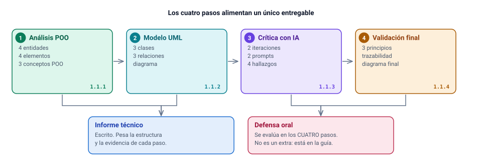
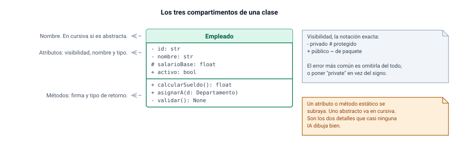

# Paso 1: análisis del problema desde la POO

Este es el paso que menos se parece a programar y el que más ordena todo lo que
viene después. No hay diagrama, no hay código, no hay herramienta que lo genere
por ti en un clic. Hay un enunciado en prosa, un lápiz y un criterio: decidir qué
cosas del texto merecen ser una clase y por qué.

El Paso 1 responde al criterio **1.1.1 — Analiza los fundamentos de la
programación orientada a objetos en contextos de análisis conceptual**. Produce
cinco piezas de evidencia (cuatro escritas y una oral) que aterrizan en la
sección *Análisis del problema* del Desarrollo de tu informe.

:::clave Lo que se evalúa en este paso
Que sepas mirar un dominio escrito en castellano y sacar de ahí entidades,
atributos, responsabilidades y objetos concretos, explicando **con qué criterio**
decidiste cada cosa, y conectando al menos tres elementos del caso con los
pilares de la POO. No se evalúa que aciertes la lista "correcta": se evalúa que
tengas un método y que lo puedas defender hablando.
:::

---

## Qué pide la guía

La guía abre el paso con una sola frase de encuadre:

> Paso 1: Análisis inicial del problema desde la POO (1.1.1)
> Deberás interpretar la problemática planteada, aplicando los fundamentos de la
> programación orientada a objetos en un contexto de análisis conceptual.

Y después lista cinco *Acciones para desarrollar*. Estas cinco viñetas son, en la
práctica, la única rúbrica observable de este paso: la Rúbrica N°1 se declara
como instrumento oficial pero no viene adjunta. Trátalas como cinco indicadores
con nota propia.

**Viñeta 1.**

> Identifica al menos 4 entidades relevantes del dominio (empleados,
> departamentos, proyectos, etc.), clasificándolas como entidades principales de
> la problemática.

**Viñeta 2.**

> Describe al menos 4 elementos del problema, indicando para cada una sus
> atributos, posibles objetos y al menos 1 responsabilidad asociada al caso.

**Viñeta 3.**

> Relaciona al menos 3 conceptos del problema con fundamentos de POO
> (encapsulamiento, abstracción, herencia, entre otros).

**Viñeta 4.**

> Explica cómo el enfoque orientado a objetos permite estructurar la solución del
> sistema, justificando como este modelo afecta al mismo.

**Viñeta 5, la oral.**

> Expone oralmente, utilizando vocabulario técnico preciso, el análisis
> conceptual del problema, justificando de forma clara cómo se seleccionaron las
> entidades principales y cómo los pilares fundamentales de la POO (abstracción,
> encapsulamiento) dan respuesta a las necesidades del caso planteado.

### La tabla de mínimos de este paso

| Indicador | Mínimo exigido | Forma de evidencia | Dónde va en el informe |
|---|:--:|---|---|
| Entidades relevantes del dominio, clasificadas como principales | **4** | Listado o tabla | Desarrollo, *Análisis del problema* |
| Elementos del problema descritos con atributos + posibles objetos + responsabilidad | **4** (los tres datos en cada uno) | Tabla de 4 columnas | Desarrollo, *Análisis del problema* |
| Conceptos del problema vinculados a fundamentos de POO | **3** | Tabla concepto → pilar → justificación | Desarrollo, *Análisis del problema* |
| Explicación de cómo el enfoque OO estructura la solución | **1** desarrollo argumentado | Prosa, apoyada en tabla | Desarrollo, *Análisis del problema* |
| Exposición oral del análisis conceptual | **1** intervención | Oral, ante el docente | Defensa |
| Dolores del caso abordados (viene del enunciado, no del paso) | **5** | Prosa o tabla | Introducción y *Análisis del problema* |

:::aviso El mínimo operativo no es el mínimo literal
El Paso 1 pide 4 entidades y el Paso 2 pide 3 clases. Literalmente podrías
analizar cuatro y modelar tres. No lo hagas: el Paso 3 te va a pedir contrastar
el modelo de la IA con **tu análisis propio**, y una incoherencia entre ambos es
justamente lo que ahí se mira. El mínimo operativo es el mayor de todos: al
menos 4 en el análisis, 4 en tu diagrama, 4 en las iteraciones con IA y 4 en el
modelo final. Si alguna entidad del Paso 1 no llega a ser clase, dilo en una
línea y explica por qué. Esa línea suma.
:::

---

## Cómo razonarlo

El error de base es creer que las entidades "están" en el enunciado y que la
tarea es encontrarlas. No están: hay sustantivos, y algunos merecen ser clases.
La diferencia entre un análisis de 7 y uno de 4 es que el primero tiene un
**filtro explícito** y el segundo tiene una lista.

### Primero: subraya sustantivos, sin filtrar

Lee el enunciado de EcoTech dos veces. La primera con un lápiz para los
**sustantivos**; la segunda con otro para los **verbos**. Los sustantivos son
candidatos a entidad o a atributo. Los verbos son candidatos a responsabilidad, y
casi siempre le pertenecen a alguno de los sustantivos que ya subrayaste.

De la lectura del caso sale una lista bruta parecida a esta. No la ordenes
todavía, no descartes nada:

- empleado, departamento, proyecto, gerente, administrador de recursos humanos, usuario
- nombre, dirección, teléfono, correo electrónico, fecha de inicio de contrato, salario, ID único
- registro de tiempo, fecha, horas trabajadas, descripción de tareas
- informe, formato PDF, formato Excel
- contraseña, módulo, permiso, dato personal, cifrado, validación de entradas

Verbos subrayados: registrar, asignar automáticamente, crear, editar, buscar,
eliminar, asignar, reasignar, ingresar, desasignar, generar, exportar, autenticar,
autorizar, almacenar de forma segura, validar.

### Segundo: pasa cada candidato por tres pruebas

Un candidato asciende a entidad si supera las tres. Si falla alguna, no es
entidad, pero **sigue existiendo en el modelo**: será atributo, objeto de valor,
enumeración o rol. Descartar bien vale tanto como identificar bien.

| Prueba | Pregunta que te haces | Ejemplo que la pasa | Ejemplo que la falla |
|---|---|---|---|
| **Identidad** | Si dos ejemplares tienen exactamente los mismos valores, ¿son la misma cosa? | Dos empleados llamados igual, con la misma fecha de ingreso, **siguen siendo dos personas distintas**: necesitan un ID que las separe | Dos direcciones con la misma calle, número y comuna **son la misma dirección**: no necesita ID propio |
| **Estado** | ¿Tiene datos propios que cambian con el tiempo y que hay que conservar? | Un proyecto cambia de descripción, de fecha, de equipo | El formato PDF no tiene estado: es una opción de un conjunto cerrado |
| **Comportamiento** | ¿El enunciado le pide *hacer* algo, o le impone reglas que alguien debe hacer cumplir? | Un registro de tiempo debe validar sus horas y quedar asociado a un empleado y a un proyecto | "Nombre" no hace nada: es un dato que otro objeto custodia |

Una cuarta prueba, más fina, resuelve los casos dudosos: **ciclo de vida**. ¿Esta
cosa nace, cambia y termina de forma independiente? Un departamento se crea, se
edita, se busca y se elimina — el enunciado lo dice con esas cuatro operaciones.
Un salario no: nace y muere con el empleado que lo tiene.

:::ejemplo El filtro aplicado, con veredicto
| Candidato | Identidad | Estado | Comportamiento | Veredicto |
|---|:--:|:--:|:--:|---|
| Empleado | sí | sí | sí | **Entidad principal** |
| Departamento | sí | sí | sí | **Entidad principal** |
| Proyecto | sí | sí | sí | **Entidad principal** |
| Registro de tiempo | sí | sí | sí | **Entidad principal** |
| Usuario (credenciales y rol) | sí | sí | sí | **Entidad**, separable de Empleado |
| Salario | no | no | no | **Atributo** de Empleado, protegido |
| Dirección, teléfono, correo | no | no | no | **Atributos** (o un objeto de valor "datos de contacto") |
| Gerente | no | no | no | **Rol** que ocupa un Empleado: se modela como asociación |
| Rol y permiso | no | no | no | **Enumeración** y matriz fija de autorización |
| Formato PDF / Excel | no | no | no | **Enumeración** de formatos de exportación |
| Sistema, GestorGeneral | no | sí | sí | **Descartada**: clase-dios, no es del dominio |
:::

### Tercero: reconoce lo que el enunciado no nombra

Hay entidades que no aparecen como sustantivo y que el dominio exige igual. La
señal es una relación de muchos a muchos que **tiene datos propios**.

El enunciado dice que un empleado puede estar en varios proyectos y que un
proyecto tiene varios empleados. Ahora pregúntate dónde vive el rol con que esa
persona participa en ese proyecto, o el porcentaje de jornada que le dedica, o
desde qué fecha. No es un dato del empleado (cambia según el proyecto) ni del
proyecto (cambia según la persona). Pertenece al **vínculo**. Eso es una entidad
nueva —llámala `AsignacionProyecto`— y es la que casi nadie ve en un primer
modelado.

### Cuarto: la forma de una entidad ya es la forma de una clase

Cuando describes una entidad con su nombre, sus atributos y sus
responsabilidades, estás rellenando los tres compartimentos de una clase UML sin
haber dibujado nada. Por eso este paso alimenta directamente al siguiente.

:::nota Todavía no nombres lenguaje ni almacenamiento
El análisis conceptual es independiente de la tecnología. No escribas "usaré una
base de datos MySQL" ni "esto va en una lista de Python" en el Paso 1. Aquí se
habla de empleados, contratos y horas. La tecnología entra en el Paso 4, cuando
tengas que defender la viabilidad técnica. Mantener limpio ese límite es en sí
mismo una demostración de abstracción.
:::

---

## Cómo hacerlo paso a paso

1. **Lee el enunciado completo dos veces** y subraya sustantivos en una pasada y verbos en la otra. No saltes esta parte: el resto depende de tenerla.
2. **Arma la lista bruta de candidatos.** Veinte o veinticinco es normal. Si tienes cinco, no leíste los requisitos del sistema, solo el planteamiento.
3. **Aplica las tres pruebas a cada candidato** y anota el veredicto, incluidos los descartes. Guarda esta tabla: es material de defensa oral.
4. **Selecciona tus entidades principales.** Mínimo cuatro; con este caso te van a salir seis o siete sin forzar nada.
5. **Escribe la Tabla A** con cuatro columnas: entidad, atributos, posibles objetos y responsabilidad. Una fila por entidad.
6. **Inventa las instancias.** "Posibles objetos" significa objetos: ejemplares concretos con valores. Usa los nombres de departamento que aparecen en el propio enunciado (Desarrollo Sostenible, Investigación y Desarrollo, Ventas, Recursos Humanos). Cuesta cero y demuestra lectura atenta.
7. **Redacta las responsabilidades como verbos**, no como datos: "valida que las horas del día no superen 24", no "tiene horas".
8. **Escribe la Tabla B** con los cinco elementos del problema que declara la empresa, cada uno con su causa técnica y la entidad o mecanismo que lo resuelve. Y pon una frase puente entre A y B.
9. **Escribe la Tabla C**: al menos tres conceptos del caso vinculados a un fundamento de la POO, cada uno con un ejemplo del propio EcoTech, no con una definición de manual.
10. **Redacta el párrafo del enfoque OO**: cómo estructurar por objetos cambia el sistema respecto de las hojas de cálculo que la empresa usa hoy.
11. **Prepara los noventa segundos de defensa oral** y dilos en voz alta al menos una vez, cronometrados.
12. **Cuenta con el dedo**: 4 entidades, 4 elementos con sus tres datos, 3 conceptos, 5 dolores. Si un número no está, el indicador no está.

---

## Respuesta modelo

:::aviso Esto es un ejemplo del que aprender la forma y el nivel
Lo que sigue está trabajado y completo a propósito, para que veas hasta dónde
llega un análisis que aprueba con holgura. **No es un texto para copiar y
entregar.** Tienes que rehacerlo con tus propias entidades, tus propias
instancias y tus propias razones: la defensa oral existe exactamente para
distinguir una cosa de la otra, y una tabla que no puedes explicar en voz alta
juega en tu contra, no a favor.
:::

### Tabla A — Entidades principales del dominio

Cuatro es el mínimo; aquí van seis porque el enunciado las obliga. La columna
*Posibles objetos* contiene **instancias**, con valores concretos.

| Entidad | Atributos | Posibles objetos (instancias) | Responsabilidad asociada al caso |
|---|---|---|---|
| **Empleado** | id (único, automático), nombre, dirección, teléfono, correo, fecha de inicio de contrato, salario, estado | `EMP-000001` Ana Pérez, contrato asalariado, ingreso 2024-03-01; `EMP-000007` Luis Kaufmann, por horas, ingreso 2025-01-06 | Custodiar sus datos personales y calcular su remuneración mensual según su modalidad de contrato |
| **Departamento** | id, nombre, gerente asociado | `DEP-000001` Desarrollo Sostenible, gerente `EMP-000007`; `DEP-000003` Recursos Humanos, gerente `EMP-000012` | Mantener la lista de empleados que le pertenecen y garantizar que tenga un gerente vigente |
| **Proyecto** | id, nombre, descripción, fecha de inicio, estado | `PRO-000002` Planta solar comunitaria, inicio 2025-01-15; `PRO-000005` Sensores de calidad del aire, inicio 2025-06-02 | Controlar qué empleados están asignados y aceptar horas solo mientras esté abierto |
| **RegistroTiempo** | id, fecha, cantidad de horas, descripción de tareas, estado, empleado, proyecto | `REG-000114` de `EMP-000001` en `PRO-000002`, 2025-08-04, 6,5 h, "revisión de la especificación de inversores" | Validar que las horas sean posibles y conservar quién las cargó, cuándo y quién las aprobó |
| **AsignacionProyecto** | id, empleado, proyecto, rol en el proyecto, dedicación, fecha de asignación, fecha de desasignación | `ASG-000031`: `EMP-000001` en `PRO-000002`, rol "analista", 40 % de jornada, desde 2025-02-01 | Impedir que la dedicación acumulada de un empleado supere el 100 % de su jornada |
| **Usuario** | id, nombre de usuario, hash de contraseña, sal, rol, empleado asociado | `USU-000004` a.perez, rol RRHH, vinculado a `EMP-000001` | Verificar credenciales y autorizar el acceso solo a los módulos de su rol |

**Entidades descartadas, y por qué.** Esta lista es tan evaluable como la
anterior, porque demuestra criterio y no inventario:

- **Gerente** no es una entidad: es un *rol que se ocupa y se deja*. La misma persona sigue siendo el mismo empleado, con su legajo y sus horas, antes y después de dirigir un departamento. Se modela como la asociación `Departamento → Empleado` con el nombre de rol `gerente`.
- **Rol** y **Permiso** son un conjunto cerrado y conocido de valores, no cosas con ciclo de vida. Se modelan como enumeración y como una matriz fija de autorización. Convertirlos en entidades editables agrega tres pantallas para expresar algo que cabe en veinte líneas.
- **Datos personales** es un objeto de valor: no tiene identidad fuera de la persona que los posee. Se modela como un bloque protegido dentro de Empleado.
- **Informe** tampoco es una entidad del dominio: no se conserva, se calcula cada vez a partir de las entidades que consulta, y por eso no pasa las pruebas de identidad ni de estado. Aun así necesita clase propia —una familia `Reporte`, con la exportación a PDF o Excel como eje aparte—, porque las reglas de cálculo tienen que estar escritas una sola vez. Por eso aparece en la Tabla B como responsable de los reportes confiables y por eso reaparece en la matriz de trazabilidad del Paso 4, como `Reporte` y su `Exportador`.
- **Sistema** o **GestorGeneral** no existe en el dominio. Es la clase que "coordina todo", el antipatrón más frecuente de los modelos generados automáticamente, y termina siendo un programa procedural con sintaxis de objetos.

### Tabla B — Los elementos del problema declarados por la empresa

La guía pide "4 elementos del problema" sin definir qué es un elemento. El
enunciado, en cambio, sí enumera cinco síntomas explícitos. Cubrir ambas lecturas
cuesta media página y te asegura el indicador (más sobre esto en
*Ambigüedades*).

| Elemento del problema | Causa técnica real | Qué exige del modelo | Entidad que se hace cargo |
|---|---|---|---|
| Duplicidad de información de empleados | No existe noción de identidad: cada planilla tiene su propia fila para la misma persona | Un identificador único generado por el sistema y una comprobación de unicidad sobre correo o documento | Empleado |
| Errores en la asignación de personal a proyectos | El vínculo empleado-proyecto es texto libre en una celda, sin reglas | Una relación explícita, con atributos propios y con reglas verificables (dedicación, vigencia) | AsignacionProyecto |
| Falta de trazabilidad en el registro de horas | Una celda editable no conserva quién la escribió, cuándo, ni si alguien la revisó | Un ciclo de vida con estados y transiciones controladas, más registro de quién aprueba | RegistroTiempo |
| Problemas en la generación de reportes confiables | Cada informe se arma a mano, con criterios distintos cada vez | Una definición única por informe, con las reglas de cálculo escritas una sola vez | Reporte (y las entidades que consulta) |
| Riesgos en la seguridad de los datos personales | Los datos viven en claro en archivos que cualquiera con acceso abre | Separar el dato personal del dato laboral, protegerlo y condicionar su lectura a un permiso | Empleado y Usuario |

> Frase puente que conviene escribir explícitamente en el informe: cada elemento
> del problema de la Tabla B se materializa en una o más de las entidades de la
> Tabla A; ninguna entidad se incorporó al modelo sin un problema del enunciado
> que la justifique.

Y la observación que da nivel al análisis: **ninguno de los cinco se resuelve
guardando los mismos datos en otro sitio.** Los cinco se resuelven poniendo
reglas donde antes solo había campos. Una clase es exactamente eso: datos más las
reglas que los gobiernan, indivisibles.

### Tabla C — Conceptos del caso vinculados a fundamentos de la POO

El mínimo son tres. Lo que se mide no es que sepas la definición, sino que la
apliques a **este** caso. Compara la columna de la derecha con lo que diría un
manual y verás la diferencia.

| Concepto del problema | Fundamento POO | Cómo se aplica en EcoTech |
|---|---|---|
| **El salario del empleado** | Encapsulamiento | El salario es el dato más sensible del sistema y hoy vive en una celda que cualquiera sobreescribe. En el modelo es un atributo privado sin setter público: cambia solo mediante una operación con nombre de negocio, `aplicarAumento(porcentaje, motivo)`, que rechaza montos negativos, exige permiso de RRHH y deja constancia de quién lo hizo. Un `setSalario(-100)` sería posible; `aplicarAumento` no lo es |
| **Los tres tipos de contrato** (asalariado, por horas, contratista) | Herencia y polimorfismo | Comparten identidad, contacto, departamento y horas: todo eso vive una sola vez en `Empleado`. Lo único que difiere es la fórmula de remuneración, declarada abstracta en la clase base y resuelta por cada subclase. La alternativa —un campo `tipo` y un `switch` en `calcularSueldo()`— reaparece en la nómina, en el alta y en los informes, y basta olvidar uno para producir un error de cálculo silencioso, que es el mismo fallo que la empresa ya sufre con las planillas |
| **El dato personal frente al dato laboral** | Abstracción | `Persona` define qué sabe hacer cualquier persona del sistema —identificarse, ser contactada, proteger sus datos— sin decir si es empleado, gerente o contratista. Sobre esa base, `Empleado` agrega el vínculo laboral. La separación no es estética: el dato personal está sujeto a normativa de privacidad y a otro régimen de acceso que el legajo o el proyecto |
| **El informe exportable** | Abstracción y polimorfismo | Todo informe hace lo mismo a alto nivel: definir columnas, construir filas, calcular totales. Eso se declara una vez; cada informe concreto (empleados, proyectos, departamentos, horas) rellena los pasos. La exportación es otro eje independiente: PDF y Excel implementan un mismo contrato. Cuatro informes por dos formatos son ocho combinaciones sin un solo condicional |
| **La asignación a proyectos** | Abstracción de una relación | Modelar la participación como una clase propia y no como una línea suelta permite hacerle preguntas al vínculo: cuánta jornada tiene comprometida esta persona, desde cuándo, en qué rol. Al desasignar no se borra la fila: se cierra con fecha, y las horas cargadas en ese período conservan un vínculo que las explica |

### Explicación: cómo el enfoque OO estructura la solución

Este es el cuarto indicador y el que más gente responde con generalidades. La
pregunta no es "qué es la POO", es **qué le pasa a este sistema por estar
organizado en objetos**. Se responde comparando con lo que hay hoy.

Hoy EcoTech tiene hojas de cálculo: estructuras donde los datos están separados
de las reglas que deberían protegerlos. La regla "un empleado pertenece a un solo
departamento" no vive en ninguna parte; vive en la cabeza de quien llena la
planilla. Cuando esa persona se equivoca o se va, la regla desaparece.

Organizar la solución en objetos hace tres cosas concretas:

1. **Pone cada regla junto al dato que gobierna, y una sola vez.** La validación de horas está dentro de `RegistroTiempo`, no repartida entre cinco pantallas. Cambiar la regla es cambiar un método, no auditar el sistema completo.
2. **Convierte las relaciones del enunciado en estructura verificable.** "Cada empleado solo puede pertenecer a un departamento a la vez" deja de ser una frase del documento y pasa a ser una multiplicidad que el modelo impide violar.
3. **Aísla lo que varía de lo que no.** Los tres tipos de contrato varían solo en una fórmula; el resto del sistema no se entera. Agregar una cuarta modalidad es agregar una clase, no tocar la nómina, el alta y los informes.

Y el efecto sobre los cinco dolores, que es lo que la guía pide justificar:

| Dolor declarado | Qué lo elimina en el modelo orientado a objetos |
|---|---|
| Duplicidad de empleados | La identidad deja de depender de una fila: el sistema genera el ID y ninguna operación crea un empleado sin pasar por la comprobación de unicidad |
| Errores de asignación | La asignación es un objeto con reglas propias: no se puede asignar a un proyecto cerrado ni comprometer más del 100 % de la jornada |
| Falta de trazabilidad de horas | El registro tiene estados y transiciones controladas; una vez aprobado no se edita sin rechazarlo primero, y nadie aprueba sus propias horas |
| Reportes poco confiables | Las reglas de cálculo se escriben una vez en la clase del informe; dos personas que piden el mismo reporte obtienen el mismo número |
| Riesgo sobre datos personales | Los datos sensibles quedan encapsulados y su lectura depende de un permiso, no de quién tenga el archivo |

### La acción oral de este paso

La quinta viñeta es oral y se rinde ante el docente. Textual:

> Expone oralmente, utilizando vocabulario técnico preciso, el análisis
> conceptual del problema, justificando de forma clara cómo se seleccionaron las
> entidades principales y cómo los pilares fundamentales de la POO (abstracción,
> encapsulamiento) dan respuesta a las necesidades del caso planteado.

Fíjate en los dos "cómo". No te van a pedir la lista de entidades: te van a pedir
**el criterio** con que la armaste, y **el mecanismo** por el que abstracción y
encapsulamiento resuelven algo concreto. Tres cosas tienes que poder decir sin
leer:

1. El criterio de selección, con nombre: identidad propia, estado y comportamiento, más ciclo de vida para los casos dudosos.
2. Al menos un descarte con su razón. Gerente es el mejor, porque es contraintuitivo y demuestra que distingues rol de entidad.
3. Un pilar aterrizado en un dolor del caso, con el ejemplo concreto. El salario para encapsulamiento; la separación persona/empleado para abstracción.

:::ejemplo Noventa segundos de apertura, como forma a imitar
Apliqué dos pruebas a cada candidato del enunciado: identidad propia —dos
objetos con los mismos valores no son el mismo objeto— y ciclo de vida propio.
Con eso quedaron seis entidades principales: Empleado, Departamento, Proyecto,
RegistroTiempo, AsignacionProyecto y Usuario. Tanto o más importante es lo que
descarté: Gerente no es una entidad sino un rol que se ocupa y se deja, así que
lo modelé como una asociación desde Departamento hacia Empleado; los roles y
permisos son un conjunto cerrado de valores, no cosas con ciclo de vida, así que
son una enumeración. La entidad que no aparece como sustantivo en el enunciado y
que sostiene medio modelo es AsignacionProyecto: la relación entre empleado y
proyecto tiene atributos propios —rol, dedicación, fechas— que no pertenecen ni
al empleado ni al proyecto, y sin ella no hay forma de impedir que alguien quede
asignado al 200 % de su jornada, que es literalmente el segundo problema que
declara la empresa.

Dilo con tus entidades y tus razones. Si esta versión no coincide con lo que
escribiste en tu informe, la que hay que cambiar es esta, no la tuya.
:::

---

## Versión avanzada

:::avanzado El matiz que separa un 7 de un 5
Un análisis de 5 entrega la lista que el enunciado ya trae —empleado,
departamento, proyecto, registro de tiempo— con atributos copiados y una
definición de encapsulamiento sacada de un manual. Cumple los mínimos y no
demuestra criterio. Lo que sube la nota son cinco movimientos, todos baratos:

1. **Documenta los descartes.** Una tabla de cuatro candidatos rechazados con su razón vale más que cuatro entidades más. Modelar bien es sobre todo decidir qué dejar afuera, y es el terreno donde la defensa oral se gana.
2. **Descubre la entidad que no está escrita.** `AsignacionProyecto` no aparece como sustantivo en el enunciado; aparece cuando te preguntas dónde vive el porcentaje de dedicación. Encontrarla y explicarla es la señal más clara de que analizaste en vez de transcribir.
3. **Distingue entidad de objeto de valor.** Que digas "la dirección no necesita identidad porque dos direcciones iguales son la misma dirección" demuestra en una frase que manejas un concepto que no está en la guía.
4. **Ancla cada entidad a una cita del enunciado.** "Se debe asignar automáticamente un ID único a cada empleado" justifica que la generación de identidad viva en la clase base y no en cada clase. Un análisis que cita el requisito que lo obliga no se puede acusar de arbitrario.
5. **Cierra el círculo con el Paso 4 desde ya.** Si en la Tabla B pones una columna con la entidad responsable, ya tienes la mitad de la matriz de trazabilidad que el Paso 4 va a exigir. Es el mismo trabajo, hecho una vez.

Y un sexto, más sutil: **nombra el límite del análisis**. Una frase como "este
análisis es independiente del lenguaje y del mecanismo de persistencia; ambas
decisiones se justifican en el diseño final" demuestra que entiendes qué es
abstracción mejor que cualquier definición que puedas escribir.
:::

---

## Ambigüedades de este paso

**"4 entidades relevantes" contra "4 elementos del problema".** Las dos primeras
viñetas piden "al menos 4" de algo con nombres distintos, y la guía nunca define
qué es un "elemento del problema". La concordancia gramatical ("indicando para
cada **una**") sugiere que reenvía a las entidades; pero "elemento del problema"
también se lee como los cinco síntomas que el enunciado enumera. **Cubre ambas
lecturas**: Tabla A con entidades y sus tres columnas, Tabla B con los cinco
síntomas mapeados a la entidad que los resuelve, y una frase puente entre ambas.
Si el docente entendía que eran lo mismo, la Tabla B no resta: se lee como
trazabilidad temprana y te sirve entera para el Paso 4.

**"Posibles objetos".** En vocabulario POO, un objeto es una instancia con
valores concretos. Pero la expresión también se puede leer coloquialmente como
"clases candidatas", que es como se responde por inercia. Pon instancias con
valores —`EMP-000001` Ana Pérez, contrato asalariado, ingreso 2024-03-01— y
agrega media línea diciendo de qué clase es instancia cada ejemplo. Con eso
cubres las dos lecturas y de paso evidencias la distinción clase-objeto, que es
exactamente lo que el criterio 1.1.1 mide.

**"Clasificándolas como entidades principales".** Clasificar implica que hay
categorías. La guía no dice cuáles. La lectura segura es distinguir entidades
principales (las del dominio, con identidad y ciclo de vida) de elementos
secundarios (objetos de valor, enumeraciones, roles). Justamente lo que produce
tu tabla de descartes.

**El mínimo de 4 contra el de 3 del Paso 2.** Ya tratado arriba: usa 4 en todas
partes y explica el destino de cada entidad en el modelo final.

**La Rúbrica N°1 no está adjunta.** Se declara como instrumento de evaluación y
se manda a revisarla en el AAI, pero no viene en el paquete. Lo único que puedes
usar como rúbrica son estas cinco viñetas. Trátalas como cinco indicadores con
nota propia y no dejes ninguno sin párrafo visible en el informe.

**El lenguaje.** La guía dice que la ES1 es un informe de "una solución de
software en Python". El Paso 1 no menciona lenguaje en ninguna de sus viñetas, y
no debe hacerlo: el análisis conceptual es previo a esa decisión. Si tu sistema
de referencia está escrito en otro lenguaje, este paso no tiene ningún conflicto
—las entidades son las mismas— y la discusión se resuelve en el Paso 4, donde sí
te van a pedir defender la viabilidad técnica en Python.

---

## Errores que hunden este paso

:::trampa Confundir un atributo con una entidad
Crear una clase `Salario`, una clase `Nombre` o una clase `Fecha` porque son
sustantivos del enunciado. Ninguno tiene identidad propia ni ciclo de vida: son
datos que otro objeto custodia. El síntoma es un modelo con doce clases que en
realidad tiene cuatro. Aplica la prueba del gemelo antes de promover cualquier
sustantivo.
:::

:::trampa Poner el nombre de la clase en la columna "posibles objetos"
Escribir "Empleado" donde se pedía una instancia. Es el indicador más barato de
perder y de ganar del paso completo: se arregla con una columna de tabla. Y su
efecto colateral es peor que el punto perdido, porque sugiere que no dominas la
distinción clase-objeto, que es la base del criterio 1.1.1.
:::

:::trampa Definiciones de manual en vez de análisis del caso
"El encapsulamiento consiste en ocultar los detalles internos de un objeto,
exponiendo solo lo necesario mediante una interfaz pública." Es correcto y no
vale nada: no menciona EcoTech. La viñeta pide **relacionar conceptos del
problema** con fundamentos de POO. Sin el salario, el contrato o las horas en la
frase, no hay relación, hay copia. Contrapregunta que te van a hacer: "ya, ¿y
dónde está eso en tu caso?".
:::

:::trampa Responder "encapsulamiento es poner todo privado y hacer getters y setters"
Es la respuesta que más se escucha y describe un modelo anémico: los datos en
una clase y las reglas en otra parte donde nadie las protege. Un `setSalario(-100)`
público deja la clase igual de expuesta, solo que con el triple de código. El
docente lanza este anzuelo a propósito. La respuesta buena es que el estado
interno cambia solo mediante operaciones con nombre de negocio.
:::

:::trampa Dejar afuera uno de los cinco dolores
El que casi siempre se cae es el quinto, la seguridad de los datos personales,
porque no se parece a los otros cuatro. Pero está en el enunciado con el mismo
rango, y además hay tres requisitos del sistema dedicados a seguridad
(autenticación, cifrado, validación de entradas). Un análisis que no lo aborda
deja fuera un tercio del caso en una asignatura que se llama Programación
Orientada a Objeto **Seguro**.
:::

:::trampa Escribir el análisis después de tener el diagrama de la IA
Si le pides el modelo a una herramienta y luego redactas el "análisis propio"
hacia atrás, se nota: el análisis queda idéntico a la propuesta de la IA y el
Paso 3 se queda sin nada que contrastar. La guía lo sanciona explícitamente:
*"La entrega de resultados generados exclusivamente por IA, sin análisis ni
ajustes, será considerada insuficiente."* El orden de los pasos es parte de lo
que se evalúa.
:::

:::trampa Traer el análisis desde un sistema ya implementado, con rutas de archivo
Si ya tienes el sistema construido, la tentación es pegar el análisis técnico
que escribiste para el repositorio. No funciona por dos razones. Primero, la
Unidad 1 pide **modelar**, y un texto lleno de rutas de archivo, nombres de
clases en inglés y detalles de infraestructura no evidencia análisis conceptual:
evidencia un producto terminado del que no se ve el razonamiento. Segundo, es
justo el tipo de material que hace sospechar autoría de IA. Reescribe el
análisis en lenguaje de dominio —empleados, contratos, horas— y guarda las rutas
para el Paso 4, si acaso.
:::

:::trampa Entregar un enlace en vez de un documento
El entregable es **un archivo Word o PDF subido al AAI**. Un enlace a un
repositorio o a un documento en la nube no es evidencia entregada, y la guía es
categórica: *"NO SE RECIBIRÁN ENTREGAS POR CORREO."* Todo lo que quieras que se
evalúe tiene que estar dentro del archivo: tablas, diagramas e imágenes
incluidas.
:::

---

## Para aprender más

**Practica el filtro en otro dominio.** El método vale más que el resultado, y se
entrena en veinte minutos: toma un enunciado distinto —una veterinaria, una
biblioteca de barrio, un taller mecánico— y aplica las tres pruebas a sus
sustantivos. Si en el taller mecánico descubres que "Orden de trabajo" es una
entidad y "Patente" es un atributo, el método ya es tuyo y no vas a depender de
haber memorizado el caso EcoTech.

**Busca la clase de asociación en cada relación de muchos a muchos.** Cada vez
que dos entidades se relacionen N a M, pregúntate si el vínculo tiene datos
propios. La respuesta es que sí más veces de las que parece, y ahí está siempre
la entidad que nadie ve.

**Bibliografía de la asignatura**, que además necesitas citar en APA en la
sección de Referencias del informe:

- Jiménez de Parga, C. (2021). *UML: arquitectura de aplicaciones en Java, C++ y Python* (1.ª ed.). Ra-Ma. Es la referencia directa para la notación y para el vocabulario de entidad, atributo y relación.
- Sánchez Palacio, A. (2025). *ChatGPT y OpenAI: desarrollo y uso de herramientas de inteligencia artificial generativa*. RA-MA Editorial. Te sirve sobre todo para el Paso 3, cuando tengas que documentar prompts y evaluar críticamente lo que la herramienta produce.

**Lo que sigue.** Con las entidades identificadas y sus responsabilidades
escritas, ya tienes el contenido de los tres compartimentos de cada clase. El
[Paso 2](04-paso-2-modelo-uml.html) convierte esa tabla en notación UML: tipos,
visibilidad, relaciones y multiplicidades. Y si quieres revisar la cuenta
completa de mínimos de toda la evaluación antes de seguir, está en
[Qué pide la evaluación](01-que-pide-la-evaluacion.html).
