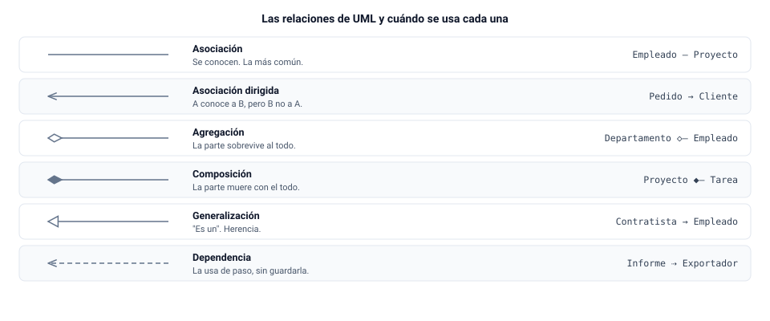
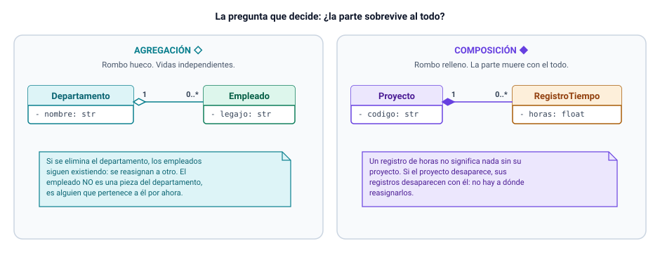
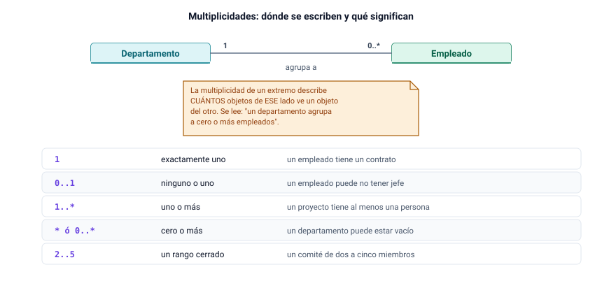
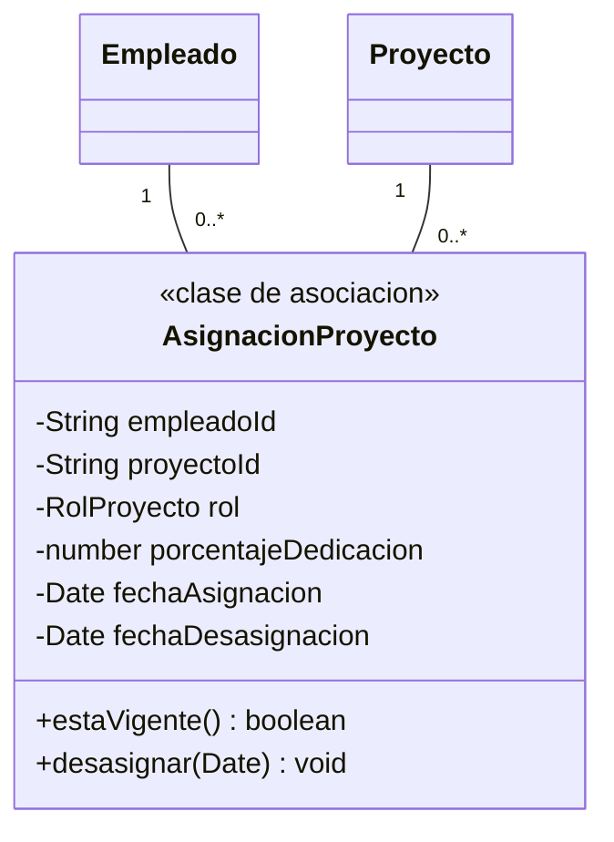
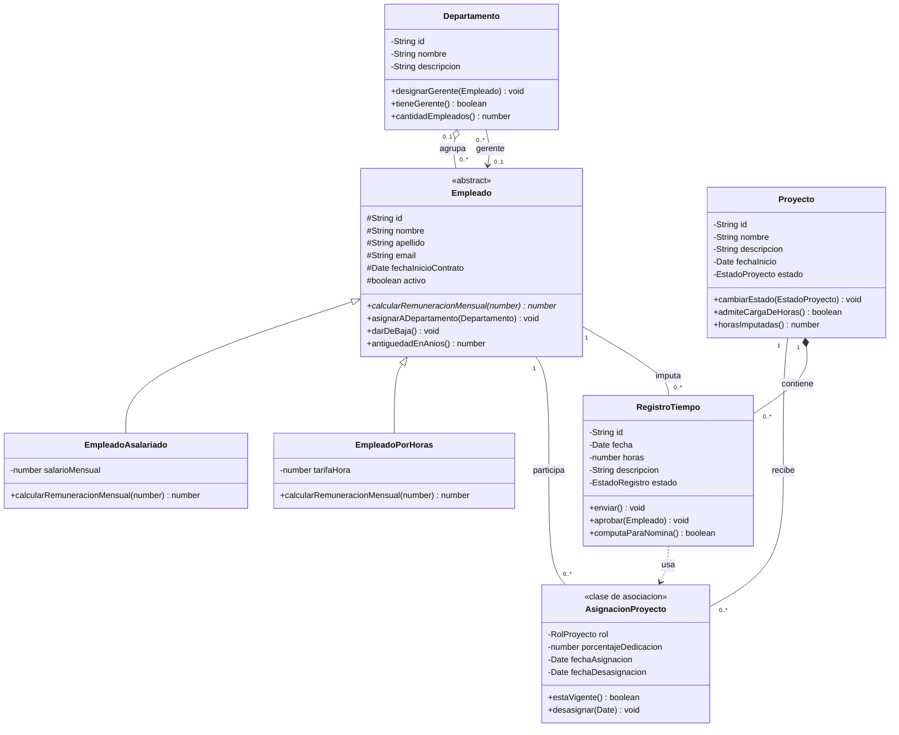

# Paso 2: el diagrama de clases UML

El Paso 1 te dejó una lista de entidades y responsabilidades escritas en prosa. El Paso 2 las convierte en un dibujo con notación estándar. Es el paso donde se mide lo más barato de corregir y lo más caro de discutir después: si la flecha es la correcta, si el rombo está en el extremo correcto, si la multiplicidad dice lo que el enunciado dice. Un diagrama bonito con la flecha equivocada puntúa peor que uno feo con la flecha correcta.

Este documento no te entrega un diagrama para copiar. Te entrega el método con el que se decide cada línea, un modelo trabajado como ejemplo del nivel esperado, y las preguntas que ese modelo tiene que aguantar en voz alta.

---

## 1. Qué pide exactamente el Paso 2

La guía lo enuncia así, y conviene leerlo entero antes de dibujar nada:

> Deberás construir un modelo representacional del sistema utilizando la notación
> estándar UML y definiendo correctamente las relaciones estructurales.
>
> Identificar y definir al menos 3 clases principales del sistema.
> Establecer atributos y métodos relevantes para cada clase.
> Determinar al menos 3 relaciones entre las clases del sistema, especificando su
> tipo y multiplicidad: Asociación. Dependencia. Agregación y/o composición.
> Generalización (herencia).
> Elaborar un diagrama de clases mediante notación UML, asegurando una
> organización clara, coherente y comprensible del modelo.

A eso se suman las **consideraciones técnicas** del enunciado, que no están en el Paso 2 pero se corrigen sobre el mismo diagrama. Esta es la tabla completa de lo que alguien va a contar con el dedo:

| Origen | Qué exige | Mínimo | Dónde se ve |
|---|---|:--:|---|
| 1.1.2 | Clases principales identificadas y definidas | 3 | Diagrama |
| 1.1.2 | Atributos y métodos relevantes en cada clase | todas | Diagrama |
| 1.1.2 | Relaciones con **tipo y multiplicidad** | 3 | Diagrama + tabla |
| 1.1.2 | Diagrama en notación UML, organización clara | 1 | Figura del informe |
| Situación | Clases, atributos, métodos **y** relaciones definidos | 4 elementos | Diagrama |
| Técnica | Clases para empleados, departamentos, proyectos y registros de tiempo | 4 clases | Diagrama |
| Técnica | Herencia y polimorfismo "de manera efectiva" | 1 jerarquía + 1 método polimórfico | Diagrama |
| Técnica | Uso de una base de datos | mencionado | Texto o capa en el modelo |
| Técnica | Interfaz de usuario | mencionado | Texto o capa en el modelo |
| 1.1.2 oral | Explicar la arquitectura y el propósito de cada relación | — | Defensa |

:::clave Lo que se evalúa en el Paso 2, en una frase
Un diagrama de clases en notación UML correcta, con las cuatro clases obligatorias del enunciado, atributos y métodos con visibilidad y tipo, al menos tres relaciones con su tipo y su multiplicidad, una jerarquía de herencia que sirva para algo, y la capacidad de explicar en voz alta por qué cada línea es esa línea y no otra.
:::

Este paso aterriza en la sección **Diseño del sistema** del informe, como *modelo inicial*. Ojo con la palabra: la guía usa "modelo inicial" en dos sentidos distintos (el tuyo del Paso 2 y el generado por la IA en el Paso 3), y eso está tratado en [las ambigüedades](02-ambiguedades-y-riesgos.html). La lectura segura es rotular las figuras sin ambigüedad: *Figura 2. Modelo estructural propio (Paso 2)* y *Figura 3. Propuesta generada por IA, iteración 1 (Paso 3)*.

:::trampa "Al menos 3 relaciones" y una lista de cuatro tipos
El bullet pide un número y después enumera cuatro categorías. Cubre las cuatro: son cuatro líneas de diagrama y no hay razón para arriesgar un indicador entero por ahorrarte una. La que sistemáticamente se olvida es la **dependencia**, porque no aparece sola en un diagrama de dominio: hay que ir a buscarla.

Y ojo con la trampa dentro de la trampa: la guía pide "tipo y multiplicidad" para todas, pero en UML estándar **la generalización y la dependencia no llevan multiplicidad**. Si se la pones, es un error de notación. Si no se la pones, parece incumplimiento. La salida es la tabla de relaciones con un "no aplica" **razonado** en la celda de multiplicidad de esas dos filas: en la generalización, *"no aplica: relaciona clasificadores, no instancias"*; en la dependencia, *"no aplica: relación de uso, no estructural; la multiplicidad se define solo en asociaciones, agregaciones y composiciones"*.
:::

---

## 2. Qué merece una caja, y cómo se dibuja


Una clase es un rectángulo con tres compartimentos: nombre, atributos, operaciones. El nombre va **en singular y en PascalCase** (`Empleado`, `RegistroTiempo`; nunca `empleados` ni `registro_tiempo`), centrado, y en *cursiva* si la clase es abstracta. Sobre el nombre pueden ir estereotipos entre comillas angulares: «abstract», «enumeration», «interface».

Un compartimento vacío y un compartimento omitido no son lo mismo: vacío afirma que la clase no tiene miembros, omitido dice que no se muestran. Si haces una vista de contexto sin atributos, dilo en el pie de figura.

### Visibilidad: los cuatro signos

| Signo | Significa | Se usa para |
|:--:|---|---|
| `+` | público | Las operaciones que forman el contrato de la clase |
| `-` | privado | Casi todos los atributos, y los métodos auxiliares |
| `#` | protegido | Lo que las subclases necesitan tocar |
| `~` | de paquete | Visible dentro del mismo paquete |

Omitir la visibilidad **no significa público** en UML: significa "sin especificar", y se lee como una omisión. La virgulilla `~` es la que más se cae en los orales, así que apréndetela aunque no la uses en el diagrama.

La regla de diseño que acompaña a los signos: atributos privados o protegidos, operaciones de negocio públicas. Si marcas todo público por comodidad y después escribes en el informe que el modelo "aplica encapsulamiento", la figura contradice al texto y eso se ve de inmediato.

### La sintaxis canónica

Un atributo se escribe: visibilidad, nombre, dos puntos, tipo, multiplicidad entre corchetes si es colección, valor por defecto, restricciones entre llaves.

```text
-salarioMensual: Decimal
#telefonos: String [0..*] {unique}
+activo: Boolean = true
/nombreCompleto: String          (la barra marca un atributo derivado)
```

Una operación: visibilidad, nombre, parámetros con tipo, dos puntos, tipo de retorno.

```text
+calcularRemuneracionMensual(horasAprobadas: Number): Number
+aprobar(aprobadorId: String): void
-validarHoras(): Boolean
```

:::trampa Errores de notación que cuestan puntos y no cuestan tiempo arreglar
- Métodos con paréntesis vacíos que evidentemente reciben datos.
- Atributos sin tipo, u operaciones sin tipo de retorno.
- Sintaxis del lenguaje metida en el diagrama: `public String getNombre()` o `def calcular(self)`. UML tiene su propia notación; usar la del lenguaje delata que el diagrama se dibujó desde el código y no al revés.
- Getters y setters de todos los atributos ocupando el compartimento de operaciones. No aportan nada y esconden las operaciones que sí importan.
:::

### La decisión que define el modelo: ¿atributo o clase propia?

Esta es la decisión que más veces se toma mal y la que un docente ataca primero. Pásale a cada candidato estas cinco preguntas. **Con una sola respuesta afirmativa clara ya hay caja; con todas negativas es un atributo.**

1. **¿Tiene identidad propia?** ¿Necesitas distinguir un ejemplar de otro aunque tengan los mismos datos?
2. **¿Tiene atributos propios?** ¿Se te ocurren dos o tres datos que solo tengan sentido dentro de esa cosa?
3. **¿Tiene comportamiento propio?** ¿Hay reglas que se apliquen sobre ella?
4. **¿Se repite o cambia en el tiempo, y hay que conservar el histórico?**
5. **¿Alguien más la referencia?** ¿Otra clase necesita apuntar a ella?

Aplicado a EcoTech:

| Candidato del enunciado | Decisión | Por qué |
|---|---|---|
| Nombre, dirección, teléfono, correo | Atributos de `Empleado` | Sin identidad ni comportamiento; nadie los referencia por separado |
| Departamento | **Clase** | Tiene identidad, nombre, gerente, y otras clases lo referencian |
| Fecha de inicio de contrato | Atributo | Un dato suelto sin reglas propias |
| Horas trabajadas | **Clase `RegistroTiempo`** | Se repite, tiene fecha, descripción, estado de aprobación y reglas |
| Estado de un proyecto | **Enumeración**, no clase | Conjunto cerrado de valores sin atributos propios |
| Gerente | **Ni clase ni atributo: un rol** | Es un empleado desempeñando una función; se modela como rol en un extremo de asociación |
| Asignación de un empleado a un proyecto | **Clase asociativa** | Tiene datos propios que no caben en ninguno de los dos extremos (sección 5) |

:::trampa "Gerente" como clase que hereda de Empleado
Es el error más común de todo este enunciado, y aparece prácticamente siempre en las propuestas generadas por IA. `Gerente` no es un tipo de empleado: es un **rol** que un empleado desempeña en un departamento, temporalmente. Si lo modelas como subclase, la promoción de alguien obliga a destruir el objeto y crear otro, y un empleado que dirige dos áreas rompe el modelo.

Lo correcto es una asociación dirigida `Departamento --> Empleado` con el nombre de rol `gerente` y multiplicidad `0..1` en el extremo del empleado. Poder decir esta frase completa en la defensa vale más que tres cajas extra.
:::

:::nota Sobre los datos personales agrupados
Agrupar dirección, teléfono, correo personal y documento en una clase `DatosPersonales` marcada «valueObject» es una decisión de nivel alto, no un capricho: el enunciado exige almacenarlos "de forma segura utilizando técnicas de cifrado adecuadas", y agruparlos da **un solo sitio** donde cifrar y descifrar en lugar de cuatro atributos repartidos. Si la incluyes, defiéndela así. Si no la incluyes para mantener el diagrama liviano, dilo en el texto: es una simplificación consciente, no un olvido.
:::

---

## 3. Las seis relaciones y cómo se elige entre ellas



Las seis, con su notación exacta:

| Relación | Se dibuja | Significa |
|---|---|---|
| Asociación | Línea continua | Los objetos se conocen y el vínculo persiste |
| Asociación dirigida | Línea continua con **punta abierta** (dos trazos) | A conoce a B, B no conoce a A |
| Agregación | Línea con **rombo hueco** en el todo | Todo-parte débil; la parte sobrevive |
| Composición | Línea con **rombo relleno** en el todo | Todo-parte fuerte; la parte muere con el todo |
| Generalización | Línea continua con **triángulo cerrado** hacia la madre | "Es un". Herencia |
| Dependencia | Línea **discontinua** con punta abierta | La usa de paso, sin guardarla |

:::trampa Las dos puntas que se confunden
La punta **abierta** (dos trazos, como una flecha normal) es asociación dirigida o dependencia. El **triángulo cerrado** es generalización. Dibujar un triángulo donde va una flecha abierta convierte "el departamento conoce a su gerente" en "un departamento es un empleado". Es un error de lectura inmediata y muy caro.
:::

### El árbol de decisión

Ante dos clases que tienen algo que ver, pregúntate en este orden:

1. **¿Una es un tipo especial de la otra?** Si "todo A es un B" resiste sin excepciones → **generalización**. Si dudas, no es herencia.
2. **¿A guarda a B como atributo, y el vínculo dura entre llamadas?** Si no → **dependencia** (línea discontinua). Este criterio es mecánico, no hay nada que discutir: si solo existe durante la ejecución de un método, es dependencia.
3. **Si sí lo guarda, ¿es una relación todo-parte?** Si no lo es → **asociación**.
4. **Si es todo-parte, ¿la parte sobrevive al todo?** Sobrevive → **agregación** (rombo hueco). No sobrevive → **composición** (rombo relleno).
5. **¿Necesitas navegar en los dos sentidos?** Si solo en uno, marca la navegabilidad con la punta abierta y gana claridad y menos acoplamiento.

### Agregación contra composición: la pregunta que decide



Ambas se dibujan con un rombo, y el rombo va **siempre en el extremo del todo**, nunca en el de la parte. La diferencia se decide con una sola pregunta:

> **Si borro el todo, ¿la parte sigue teniendo sentido?**

Si la respuesta es sí, es agregación (rombo hueco). Si es no, es composición (rombo relleno). No se decide por intensidad emocional de la relación ("el registro de horas es muy del empleado, le pongo composición"), se decide por ciclo de vida.

| Relación en EcoTech | Pregunta | Respuesta | Tipo |
|---|---|---|---|
| Departamento — Empleado | Si disuelvo Ventas, ¿los vendedores siguen teniendo sentido? | Sí: se reasignan | **Agregación** ◇ |
| Proyecto — RegistroTiempo | Si borro el proyecto, ¿el parte de 8 horas sigue teniendo sentido? | No: no hay a dónde reasignarlo | **Composición** ◆ |
| Empleado — RegistroTiempo | Si doy de baja al empleado, ¿sus partes siguen sirviendo? | Sí: los informes históricos los necesitan | **Asociación** |

La composición además compromete que la parte **no se comparte**: pertenece a un solo todo a la vez, y por eso la multiplicidad del lado del todo es `1` o `0..1`. Consecuencia práctica que casi nadie ve: **un mismo objeto no puede colgar de dos rombos rellenos**. Si dibujas `Proyecto ◆— RegistroTiempo` y también `Empleado ◆— RegistroTiempo`, estás afirmando dos dueños exclusivos para la misma pieza y el modelo es inconsistente. Elige un dueño y deja el otro extremo como asociación.

:::avanzado Tres capas que suben la nota
1. En UML 2.5 la agregación y la composición no son relaciones distintas: son un valor de la propiedad `aggregation` —del tipo enumerado `AggregationKind`— en uno de los extremos de la asociación (`none`, `shared`, `composite`), y el rombo se dibuja en el extremo del todo. Son asociaciones con un matiz semántico.
2. El estándar reconoce que la semántica de la agregación compartida **varía según el modelador**, mientras que la de la composición sí está definida. En consecuencia: la composición es un compromiso verificable, la agregación es documentación de intención.
3. Elegir agregación donde parece que va composición, **por una razón de negocio nombrada**, es la respuesta de nota máxima. Ejemplo exacto de este dominio: `Empleado—RegistroTiempo` se parece a composición, pero el sistema no borra en cascada porque las bajas son lógicas y los partes deben sobrevivir para que la trazabilidad cuadre. Esa frase, dicha en voz alta, vale más que el diagrama.
:::

### Herencia: cuándo sí y cuándo es un atributo disfrazado

El enunciado exige "herencia y polimorfismo de manera efectiva para evitar duplicación de código". Efectiva quiere decir que la jerarquía **hace algo**, no que exista.

La prueba: si las supuestas subclases se diferencian solo en el **valor** de un dato, no hay herencia, hay un atributo. Si se diferencian en el **comportamiento** —un mismo método que se calcula distinto—, entonces sí.

En EcoTech la jerarquía que se sostiene es la de modalidades de contrato: el asalariado cobra un fijo, el que va por horas multiplica por horas aprobadas, y el contratista multiplica pero con un tope mensual. Tres reglas distintas para el mismo mensaje `calcularRemuneracionMensual()`. Con un atributo `tipoContrato` eso termina en un `if` de tres ramas que hay que tocar cada vez que Recursos Humanos inventa una modalidad; con herencia, añadir una modalidad es añadir una clase y no tocar lo que ya funciona.

:::ejemplo El polimorfismo, demostrado en el bucle de nómina
Esto es lo que hay que poder mostrar cuando pregunten "¿y qué gana el sistema con esa herencia?". El informe de nómina recorre una lista con las tres modalidades mezcladas y no pregunta de qué tipo es nadie.
:::

```python
total = 0.0
for empleado, horas in horas_del_mes.items():
    total += empleado.calcular_remuneracion_mensual(horas)
# Ni un solo `if` sobre el tipo de contrato.
# Añadir una modalidad nueva es añadir una clase; este bucle no se toca.
```

Reconoce también el costo, porque te lo van a preguntar: si una persona cambia de modalidad, con herencia hay que crear otro objeto, porque un objeto no cambia de clase. Es un precio asumible: un cambio de modalidad es un hecho administrativo poco frecuente y suele implicar un contrato nuevo de todos modos. Nombrar la contrapartida es lo que distingue una defensa sólida de una recitada.

---

## 4. Multiplicidades: la regla de negocio escrita en el extremo de la línea



| Notación | Significa | Ejemplo del dominio |
|:--:|---|---|
| `1` | Exactamente uno, obligatorio | Un parte de horas pertenece a un proyecto |
| `0..1` | Ninguno o uno | Un empleado puede aún no tener departamento |
| `1..*` | Uno o más | Un proyecto tiene al menos una persona asignada |
| `*` o `0..*` | Cero o más | Un departamento puede estar vacío |
| `2..5` | Rango cerrado | Un comité de dos a cinco miembros |

**Dónde se escribe y cómo se lee.** Esta es la parte que más se equivoca. La multiplicidad se escribe en el extremo de la línea **junto a la clase a la que restringe**, y se lee tomando **un** objeto de la clase del *otro* extremo:

> El `0..*` dibujado junto a `Empleado` en la relación con `Departamento` se lee
> "un departamento agrupa de cero a muchos empleados". El `0..1` dibujado junto a
> `Departamento` se lee "un empleado pertenece como mucho a un departamento".

Cada multiplicidad de tu diagrama debería poder justificarse con una frase del enunciado o declararse como decisión propia. Así:

| Relación | Multiplicidad | Frase que la justifica |
|---|:--:|---|
| Empleado → Departamento | `0..1` | "Cada empleado solo puede pertenecer a un departamento a la vez" |
| Departamento → Empleado | `0..*` | Un departamento recién creado puede no tener gente todavía |
| Empleado → Proyecto | `0..*` | "Los empleados pueden ser asignados a uno o varios proyectos" |
| RegistroTiempo → Empleado | `1` | "Estos registros deben estar asociados a un empleado y a un proyecto específico" |
| Departamento → gerente | `0..1` | **Decisión propia**: el puesto puede estar vacante |

:::trampa Los tres errores de multiplicidad
1. **Invertir los extremos.** Convierte la figura en una afirmación falsa sobre el negocio, y como la figura manda sobre el texto, el error queda escrito.
2. **Poner `1` donde el enunciado admite ausencia.** Si `Departamento—Empleado` lleva `1` obligatorio del lado del departamento, el modelo prohíbe registrar a un empleado recién ingresado sin asignar. La correcta es `0..1`.
3. **Omitirlas.** El criterio 1.1.2 pide "tipo y multiplicidad" de forma explícita: sin ellas, el indicador queda incumplido aunque el diagrama sea correcto en todo lo demás.
:::

:::avanzado Multiplicidad no es cardinalidad
La **multiplicidad** es la restricción de rango que declara el modelo; la **cardinalidad** es el número real de objetos vinculados en un momento dado. Los diagramas entidad-relación hablan de cardinalidad, UML habla de multiplicidad. Usar el término correcto en la exposición es una señal inmediata de precisión, y cuesta cero.

Como remate, `{ordered}` y `{unique}` sobre un extremo precisan la semántica de la colección: si el orden importa, si admite repetidos.
:::

---

## 5. La clase asociativa: la pieza que casi nadie pone

Esta sección es la que más rendimiento te da en toda la evaluación. La clase asociativa no aparece en un primer modelado, no la produce casi ningún generador automático, y resuelve dos requisitos explícitos del enunciado.

### El razonamiento, paso a paso

El enunciado dice: *"Los empleados pueden ser asignados a uno o varios proyectos"*. Eso es una relación de **muchos a muchos**: `0..*` en los dos extremos. Una N a M pelada se dibuja con una línea y ya está.

Pero el vínculo tiene datos propios. En cuanto quieres saber **desde cuándo** una persona está en un proyecto, **con qué porcentaje de dedicación** y **con qué rol**, aparece el problema:

- En `Empleado` no caben: el porcentaje de dedicación es distinto para cada proyecto en el que participa. Si lo pones ahí, ¿el porcentaje de cuál?
- En `Proyecto` tampoco: el rol es distinto para cada persona. ¿El rol de quién?

Esos datos no pertenecen a ninguno de los dos objetos: **pertenecen a la relación**. Y eso, en UML, tiene nombre y notación propia.

:::clave La regla, en una frase
Una relación N a M con atributos propios exige una clase asociativa. Si no la pones, los atributos del vínculo se van a la fuerza a uno de los dos extremos, donde se duplican, se contradicen o se pierden.
:::

### Cómo se dibuja en UML

La clase asociativa se dibuja como una clase normal, unida por una **línea discontinua sin puntas** al centro de la línea de asociación:

```text
              0..*                              0..*
   Empleado ─────────────────────────────────────── Proyecto
                          │
                          ┆   línea discontinua, sin puntas de flecha
                          ┆
             ┌────────────────────────────┐
             │    AsignacionProyecto      │
             ├────────────────────────────┤
             │ - rol: RolProyecto         │
             │ - porcentajeDedicacion: Int│
             │ - fechaAsignacion: Date    │
             │ - fechaDesasignacion: Date │
             ├────────────────────────────┤
             │ + estaVigente(): Boolean   │
             │ + desasignar(f: Date): void│
             └────────────────────────────┘
```

Fíjate en `fechaDesasignacion`: la participación no se borra cuando alguien sale del proyecto, **se cierra**. Borrarla dejaría las horas ya imputadas sin explicación de por qué esa persona las imputó, que es exactamente el problema de trazabilidad que la empresa declara.

### Cómo se dibuja en Mermaid

Mermaid `classDiagram` **no sabe dibujar la clase asociativa** en su forma estándar: no tiene sintaxis para la línea discontinua al centro de una asociación. Hay dos salidas, y las dos son defendibles si las declaras:

**Opción A — reificar.** Conviertes la asignación en una entidad de pleno derecho con identidad propia, y la relación N a M se parte en dos asociaciones `1` a `0..*`. Es lo que se usa en el modelo de la sección siguiente:



**Opción B — dibujar el diagrama final en una herramienta que sí lo soporte** (PlantUML, StarUML, draw.io) y dejar Mermaid para las vistas secundarias.

:::avanzado Por qué reificar no es una rendición
Aquí está el argumento más fuerte disponible en toda esta evaluación, y es este: una clase asociativa admite **un único enlace por cada par de objetos**. Si Ana y el Proyecto Solar solo pueden estar vinculados una vez, la notación de clase asociativa basta.

Pero en EcoTech una persona puede salir de un proyecto y volver a entrar meses después, y los dos períodos deben conservarse para que las horas históricas sigan explicándose. En ese momento el par (empleado, proyecto) deja de ser único y la clase asociativa se queda corta: hay que reificar, dar identidad propia a la asignación y usar dos asociaciones normales.

Decir "usé una entidad reificada y no la notación de clase asociativa, y fue una decisión de modelado, no un desconocimiento de la notación" es la diferencia entre aprobar bien y destacar. Pero solo si puedes explicar el porqué que acabas de leer, con tus palabras.
:::

En Python la clase asociativa es, literalmente, una clase con una referencia a cada extremo más sus atributos propios:

```python
@dataclass
class AsignacionProyecto:
    empleado: Empleado
    proyecto: Proyecto
    rol: str
    porcentaje_dedicacion: int
    fecha_asignacion: date
    fecha_desasignacion: Optional[date] = None
```

---

## 6. El modelo mínimo suficiente y cómo llevarlo al Word

### Siete clases, no catorce

Tu repositorio tiene un modelo de **14 clases y unas 22 relaciones**. Como evidencia de trabajo es excelente. Como figura de un informe que hay que imprimir en papel carta y defender en diez minutos, es un problema: no se lee, y en la defensa te obliga a recorrer clases que no aportan al criterio.

:::aviso El diagrama que hay que defender, no el que hay que exhibir
Un diagrama con catorce clases y todos sus miembros es técnicamente correcto e ilegible. La guía evalúa explícitamente que la organización sea "clara, coherente y comprensible": la exhaustividad juega **en contra** aquí.

Declara cuál es EL diagrama de clases final, que sea el núcleo, y lleva el resto —vistas por subsistema, tablas por clase— a anexos rotulados como "vista parcial del mismo modelo" para que no se lean como modelos distintos.
:::

Estas siete clases cumplen todo lo que la guía exige. Ni una más hace falta:

| Clase | Por qué está | Requisito que cubre |
|---|---|---|
| `Empleado` (abstracta) | Entidad central; raíz de la jerarquía | "Clases para representar empleados" |
| `EmpleadoAsalariado` | Modalidad con sueldo fijo | Herencia + polimorfismo |
| `EmpleadoPorHoras` | Modalidad por horas trabajadas | Herencia + polimorfismo |
| `Departamento` | Unidad organizativa con gerente | "Gestión de departamentos" |
| `Proyecto` | Trabajo al que se imputan horas | "Gestión de proyectos" |
| `AsignacionProyecto` | Clase asociativa de la N a M | "Asignación de empleados a proyectos" |
| `RegistroTiempo` | Parte de horas con circuito de aprobación | "Registro de tiempo" |

Con ese núcleo tienes los cuatro tipos de relación, la jerarquía con polimorfismo real, las cuatro clases obligatorias del enunciado y la clase asociativa. Si quieres crecer, el orden defendible es: `Contratista` (tercera modalidad, refuerza el argumento del `if` insostenible), `Usuario` (autenticación) y `Entidad` (raíz con el ID automático). Cada una que agregues tiene que ganarse su sitio en la defensa.

### El diagrama en Mermaid, completo

Este es un **ejemplo trabajado**: te muestra la forma, el nivel de detalle y la sintaxis. No es tu entrega. Los atributos, los métodos y las decisiones tienen que salir de tu propio Paso 1, y si no los puedes explicar uno por uno, la primera repregunta de la defensa lo va a mostrar.



La tabla que acompaña al diagrama en el informe, y que es donde el criterio 1.1.2 se cobra explícitamente:

| Relación | Tipo | Multiplicidad | Justificación |
|---|---|:--:|---|
| Empleado ← EmpleadoAsalariado / EmpleadoPorHoras | Generalización | no aplica: relaciona clasificadores, no instancias | Comportamiento distinto para el mismo mensaje; evita el `if` por tipo de contrato |
| Departamento ◇— Empleado | Agregación | `0..1` — `0..*` | Disolver un área no elimina a su gente; "solo puede pertenecer a un departamento a la vez" |
| Departamento → Empleado (rol *gerente*) | Asociación dirigida | `0..*` — `0..1` | El departamento conoce a su gerente; el empleado no necesita saber que dirige. El puesto puede estar vacante |
| Empleado — AsignacionProyecto — Proyecto | Asociación con clase asociativa | `1` — `0..*` | N a M con datos propios: rol, dedicación y fechas |
| Proyecto ◆— RegistroTiempo | Composición | `1` — `0..*` | Un parte no significa nada sin su proyecto y no hay a dónde reasignarlo |
| Empleado — RegistroTiempo | Asociación | `1` — `0..*` | La baja del empleado es lógica: los partes sobreviven para los informes históricos |
| RegistroTiempo ⇢ AsignacionProyecto | Dependencia «use» | no aplica: relación de uso, no estructural | Al crearse comprueba que exista una asignación vigente; no la guarda |

:::clave Las dos filas que demuestran dominio de notación
Las dos filas cuya multiplicidad dice **"no aplica"** —pero razonado, no en blanco— convierten una posible omisión en evidencia de que entiendes el estándar: la generalización porque relaciona clasificadores y no instancias, y la dependencia porque es una relación de uso y no estructural, y **la multiplicidad se define solo en asociaciones, agregaciones y composiciones**. Es la jugada completa del Paso 2.
:::

:::aviso Mermaid escribe los tipos al revés que UML
En Mermaid el tipo va delante del nombre (`-String nombre`); en UML canónico va detrás, con dos puntos (`-nombre: String`). Si tu diagrama final lo dibujas en draw.io, PlantUML o StarUML, usa la forma canónica. Si entregas el Mermaid renderizado, menciónalo en la leyenda de notación: sabes cuál es la diferencia y por qué se ve así.
:::

### De Mermaid a la imagen que va en el Word

Mermaid **no se renderiza dentro de Word**. Pegar el código sin renderizar produce un bloque de texto ilegible y arrastra puntos de forma. Todo diagrama va pegado como imagen. Tres caminos:

1. **mermaid.live** — pegas el código, exportas con *Actions → PNG* o *SVG*. Es lo más rápido. Sube la escala antes de exportar.
2. **Línea de comandos**, si quieres controlar la resolución: `npx @mermaid-js/mermaid-cli -i modelo.mmd -o modelo.png -s 3 -b white`. El `-s 3` triplica la escala; el `-b white` evita el fondo transparente, que en Word se ve gris.
3. **draw.io o StarUML** para el diagrama final, si quieres la clase asociativa dibujada de forma canónica.

:::aviso La advertencia de legibilidad en papel carta
La plantilla fija papel carta con márgenes de 2,5 cm: quedan **16,6 cm de ancho útil** (21,59 cm de ancho de carta menos 2,5 cm por lado). En ese ancho, un diagrama de catorce clases con todos sus atributos deja el texto por debajo de lo legible, y es un fallo que no se puede compensar en la defensa porque el informe ya se cerró.

La verificación correcta no es mirar la imagen ampliada en pantalla: es abrir el **PDF final al 100% de zoom** y leer los nombres de los atributos. Si ahí no se leen, no se leen.

Si el diagrama no entra, tienes tres salidas legítimas, en este orden: una sección apaisada en Word para esa página (Word permite orientación horizontal dentro de un documento vertical); una vista general sin atributos ni métodos más vistas de detalle por subsistema; o una tabla por clase que haga consultable lo que la imagen comprime. Exporta a 300 ppp o más en cualquiera de los tres casos.
:::

Añade siempre, al lado del diagrama final, una **leyenda de notación**: qué significa cada flecha, cada rombo y cada signo de visibilidad. Es media página, se ve profesional y ancla el criterio 1.1.2 sin que el evaluador tenga que suponer que sabes lo que dibujaste.

---

## 7. La defensa del Paso 2 y qué revisar antes de seguir

La acción oral de este paso es explícita:

> Explica de manera lógica y fluida la arquitectura del diagrama de clases UML
> proyectado, sustentando verbalmente la elección y el propósito de las relaciones
> estructurales (asociación, agregación, composición o herencia) y la consistencia
> de los atributos y métodos frente a los requerimientos del sistema.

"De manera fluida" quiere decir **sin leer**. Prepara un recorrido de dos a tres minutos con este orden: primero las cuatro clases obligatorias del enunciado, después la jerarquía y qué gana el sistema con ella, después la clase asociativa y por qué existe, y al final las multiplicidades que son literalmente frases del enunciado.

Las preguntas previsibles, con lo que la respuesta tiene que contener:

| Pregunta | Qué tiene que aparecer en tu respuesta |
|---|---|
| ¿Por qué agregación y no composición entre Departamento y Empleado? | La pregunta del ciclo de vida y la frase "disolver un área no elimina a su gente" |
| ¿Por qué esa clase en el medio de Empleado y Proyecto? | N a M con atributos propios que no caben en ningún extremo |
| ¿Qué gana el sistema con esa herencia? | Polimorfismo: el bucle de nómina sin un solo `if` sobre el tipo |
| ¿Por qué `0..1` y no `1` en el departamento? | Un empleado recién ingresado todavía no tiene área asignada |
| ¿Dónde está la base de datos en tu diagrama? | La separación dominio/persistencia y por qué el diagrama de clases modela el dominio, no el esquema |
| ¿Y la interfaz de usuario? | Que es otra capa: el diagrama de clases modela el dominio, y la interfaz se nombra en el texto —o se dibuja como un paquete «UI» aparte— para no mezclar presentación con reglas de negocio |
| ¿Por qué la dependencia no lleva multiplicidad? | Es una relación de uso, no estructural: la multiplicidad se define en asociaciones, agregaciones y composiciones |

:::trampa La pregunta que hunde a quien no modeló él mismo
"Recórreme el diagrama y explícame por qué esta línea es esta y no otra." No hay manera de improvisarla. Si el diagrama salió entero de una herramienta y no reconstruiste el razonamiento, se nota en la segunda repregunta. Ese es exactamente el propósito de que la defensa exista.
:::

### Checklist antes de pasar al Paso 3

- Las cuatro clases obligatorias del enunciado están: empleados, departamentos, proyectos y registros de tiempo.
- Todas las clases tienen atributos **y** métodos, con visibilidad y tipo.
- Los nombres de clase están en singular y en PascalCase.
- Las clases abstractas están en cursiva o con «abstract», y sus métodos abstractos también.
- Aparecen los cuatro tipos de relación: asociación, dependencia, agregación o composición, y generalización.
- Cada asociación, agregación y composición tiene multiplicidad **en los dos extremos**.
- Ningún objeto cuelga de dos rombos rellenos.
- Los rombos están en el extremo del todo, no en el de la parte.
- La generalización lleva triángulo cerrado, no punta abierta.
- La clase asociativa está, y sabes explicar por qué la relación la exige.
- Hay una tabla de relaciones con tipo, multiplicidad y justificación.
- El diagrama está pegado como imagen, no como bloque de código.
- La base de datos y la interfaz de usuario están al menos nombradas en el texto como capas separadas del dominio (son consideraciones técnicas del enunciado y se corrigen sobre este mismo diagrama).
- Abriste el PDF al 100% y los atributos se leen.
- Puedes recorrer el diagrama entero en voz alta sin mirarlo.

:::nota Sobre el modelo de ejemplo de esta sección
El modelo de siete clases que aparece aquí es un **ejemplo trabajado**: está para que aprendas la forma, el nivel de detalle y el tipo de justificación que se espera, no para que lo copies. Tu diagrama tiene que salir de tus entidades del Paso 1, con tus atributos y tus decisiones, y algunas serán distintas de estas y estarán igual de bien si las puedes defender.

Hay una razón práctica además de la académica: en el Paso 3 vas a tener que **contrastar** este modelo tuyo con el que genere una IA, y ese contraste solo produce hallazgos reales si el modelo propio es realmente tuyo. Si los dos salen del mismo sitio, la tabla de hallazgos críticos queda cosmética y el criterio 1.1.3 se queda sin evidencia.
:::

Con el modelo propio cerrado y fechado —guarda la versión, la vas a necesitar como prueba de anterioridad—, ya tienes contra qué comparar. El Paso 3 es donde la IA entra en escena y donde este diagrama se pone a prueba.
