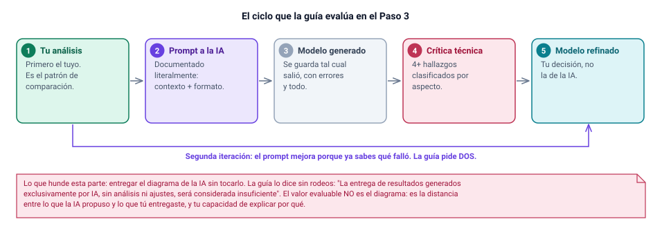
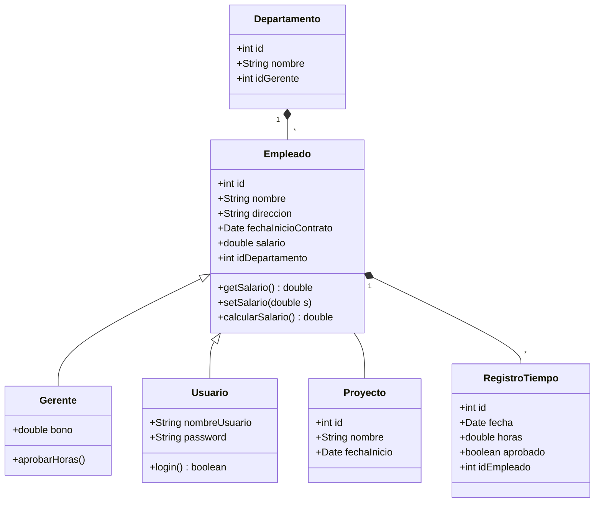
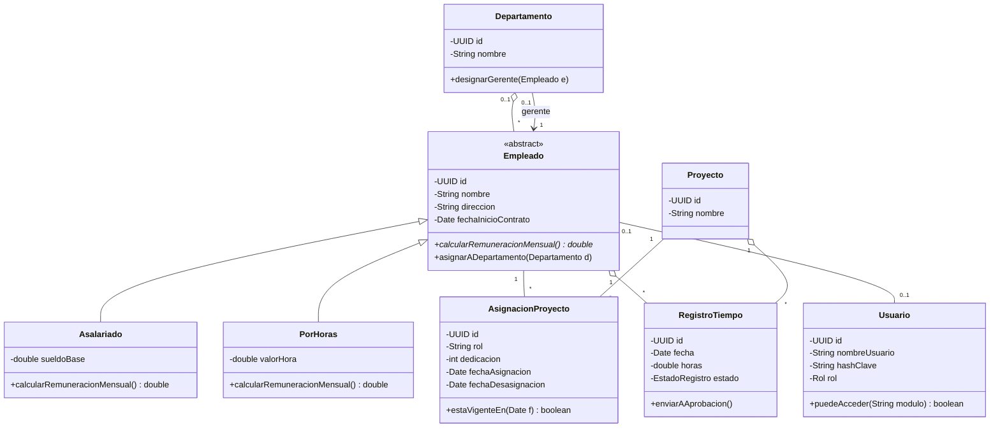
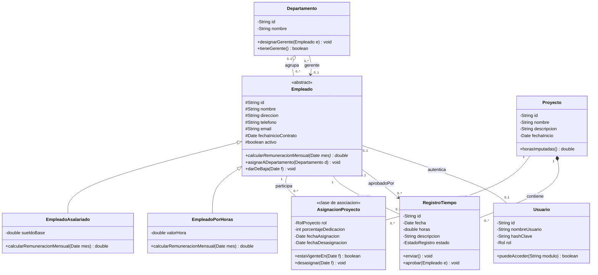

# Paso 3: evaluacion critica del modelo generado por IA

Este es el paso donde la asignatura muestra su verdadera intención. No te pide usar
una herramienta de IA: te pide **auditarla**. Lo evaluable no es el diagrama que
salió de la máquina, es la distancia entre lo que ella propuso y lo que tú entregas,
más tu capacidad de explicar esa distancia hablando. Responde al criterio **1.1.3 —
Aplica criterios técnicos de modelado orientado a objetos al ajustar diagramas de
clases generados por herramientas de IA**, y produce cinco piezas de evidencia,
cuatro escritas y una oral, que aterrizan en *Uso de herramientas de IA* y *Mejoras
aplicadas*, dentro del Desarrollo.

:::clave Lo que se evalúa en este paso
Que tengas un modelo propio **antes** de preguntarle a nadie, que dejes registro
literal de lo que pediste y de lo que te devolvieron, que sepas decir con
vocabulario técnico qué está mal en esa respuesta y por qué, y que el diagrama que
entregas sea consecuencia de tu decisión y no de la sugerencia. Se evalúa el
proceso: un diagrama perfecto sin rastro del proceso puntúa peor que uno correcto
con la cadena completa a la vista.
:::

---

## Qué pide la guía

El paso tiene cuatro *Acciones para desarrollar* escritas más una oral. Como la
Rúbrica N°1 se declara pero no viene adjunta, son la única rúbrica observable:
trátalas como indicadores con nota propia.

> Presenta al menos 2 iteraciones de una propuesta inicial de modelo de clases
> (con al menos 3 clases, atributos, métodos y relaciones) utilizando una
> herramienta de IA.

> Documenta al menos 2 prompts utilizados (incluyendo el contexto del problema y
> las instrucciones de formato) y el resultado obtenido para cada iteración.

> Analiza el modelo generado por IA, identificando al menos 4 elementos (errores,
> similitudes o diferencias), clasificándolos según el aspecto del modelo (clases,
> atributos o relaciones) y contrastándolos con el análisis propio del problema.

> Ajusta la versión final del diagrama con una estructura UML desarrollada,
> incorporando mejoras que fortalecen la organización del modelo y su
> interpretación como solución al problema.

> Expone mediante argumentos técnicos las modificaciones, correcciones y
> adaptaciones aplicadas sobre el modelo inicial sugerido por la Inteligencia
> Artificial, demostrando criterio propio y dominio de buenas prácticas de
> modelado orientado a objetos.

Dos exigencias más, de las Instrucciones generales y con el mismo peso: *"Debes
documentar el uso de la herramienta (prompt y resultado)"* y *"Se debe realizar un
análisis crítico del modelo generado por la IA, identificando errores, omisiones y
mejoras necesarias"*. Más la advertencia que ordena todo el paso:

> Importante: La entrega de resultados generados exclusivamente por IA, sin
> análisis ni ajustes, será considerada insuficiente.

### La tabla de mínimos de este paso

| Indicador | Mínimo | Forma de evidencia | Dónde va en el informe |
|---|:--:|---|---|
| Iteraciones generadas con IA, cada una con 3 clases, atributos, métodos y relaciones | **2** | Diagrama por iteración | *Uso de herramientas de IA* |
| Prompts documentados, con contexto del problema **y** instrucciones de formato | **2** | Texto literal en caja de código | *Uso de herramientas de IA* |
| Resultados obtenidos, uno por iteración | **2** | Captura o transcripción literal | *Uso de herramientas de IA* |
| Elementos analizados y clasificados por aspecto (clases / atributos / relaciones) | **4** | Tabla | *Evaluación crítica de los aportes de la IA* |
| Categorías del análisis: errores, omisiones y mejoras necesarias | **3** | Prosa apoyada en la tabla | *Evaluación crítica* |
| Versión del diagrama ajustada tras la crítica | **1** | Diagrama | *Mejoras aplicadas* |
| Exposición oral de las modificaciones aplicadas | **1** | Oral, ante el docente | Defensa |

:::aviso El indicador más barato de perder de toda la evaluación
El prompt es binario: está o no está. Un informe que *cuenta* lo que le pidió a la
herramienta sin pegar el texto pierde el indicador completo, aunque la crítica
posterior sea excelente. Y no se repone en la defensa: la viñeta exige documentarlo
por escrito.
:::

---

## Cómo razonarlo



El orden del ciclo es lo que se evalúa. **Tu análisis va primero**, y no por
trámite: es el patrón de comparación. La viñeta pide contrastar el modelo de la IA
"con el análisis propio del problema", y sin análisis anterior no hay contraste,
hay opinión. Por eso el Paso 2 cierra con *"Una vez construido tu modelo, en el Paso
3 deberás contrastarlo con una propuesta generada por una herramienta de IA"*. A ese
modelo tuyo lo llamamos **M0**.

Después, **el prompt se documenta literal**, no parafraseado. **El modelo generado
se guarda tal cual salió**, con errores y todo: si lo limpias antes de pegarlo,
destruyes la evidencia y la crítica se queda sin objeto. **La crítica** produce al
menos cuatro hallazgos clasificados por aspecto. Y **el modelo refinado es tu
decisión**. Luego el ciclo reinicia: la segunda iteración existe porque ya sabes
qué falló.

### Qué es un prompt documentado

No es "le pedí un diagrama de clases para EcoTech". Es el texto exacto que
escribiste, reproducible, con las dos partes que la guía nombra entre paréntesis y
que por eso son obligatorias:

1. **Contexto del problema.** El caso dentro del prompt: la empresa, los dolores, los requisitos. Sin esto la herramienta responde con el sistema de gestión de empleados promedio de internet, no con el tuyo, y tú no puedes demostrar que le entregaste el caso.
2. **Instrucciones de formato.** Notación, visibilidad de atributos, marcado de clases abstractas, multiplicidades obligatorias en los dos extremos. Solo puedes exigir lo que sabes nombrar, así que esta mitad es en sí misma una muestra de dominio: al escribir "declara la multiplicidad en los dos extremos" demuestras que sabes que una relación sin multiplicidad está incompleta.

Y la guía pide *iteraciones*, no alternativas. "Dame un modelo" y después "dame otro
distinto" son dos consultas paralelas: no hay aprendizaje entre una y otra, y se
nota. Iterar significa que **el segundo prompt contiene lo que aprendiste del primer
resultado**: nombra los defectos, explica por qué lo son y pide la corrección. Ese
prompt ya es análisis crítico en lenguaje técnico; si el docente solo leyera tus dos
prompts, vería que distingues herencia de asociación y agregación de composición.

### Cómo se registra el resultado

Cinco datos por iteración: **herramienta** (nombre del producto, no "una IA"),
**versión o modelo**, **fecha**, **prompt literal completo** y **resultado**. Si la
salida es texto, **transcríbela**: una captura de un bloque de código se vuelve
ilegible al reducirla a papel carta con márgenes de 2,5 cm. La captura sirve para una
imagen o para probar que la conversación existió, con fecha y nombre visibles.

:::clave Por qué la fecha importa, y no es un formalismo
1. **Los modelos cambian en silencio.** El mismo prompt, en la misma herramienta, dos meses después, devuelve otra cosa. La fecha es lo único que ancla tu evidencia a un estado del mundo.
2. **Prueba el orden del proceso, que es lo que se evalúa.** Si M0 está fechado antes del primer prompt y el modelo final después de la crítica, la secuencia queda demostrada en el papel. Sin fechas, un informe con las mismas piezas es indistinguible de uno escrito hacia atrás desde la respuesta de la IA.
3. **Dos iteraciones con la misma marca de tiempo no son dos iteraciones.** Iterar toma tiempo: leer, detectar los fallos, reescribir. Y como la evaluación dura cuatro semanas, fechas repartidas evidencian trabajo sostenido; todo fechado la noche anterior también dice algo, y no es bueno.

Además, APA 6 —la norma que exige la plantilla— pide fecha de consulta para fuentes
en línea. Es la misma fecha que anotas aquí.
:::

### Los errores típicos de una IA al modelar son reconocibles

No son aleatorios: la herramienta devuelve el patrón estadísticamente más frecuente,
no el más adecuado a **tu** dominio. Aprende estos siete y vas a encontrar la mayoría
en cualquier salida.

1. **Inventa una clase `Usuario` que duplica a `Empleado`**, o la hace heredar de ella. Rompe por los dos extremos: hay empleados sin cuenta (el operario al que su supervisor le carga las horas) y cuentas sin empleado (el auditor externo).
2. **Olvida la clase asociativa de la relación N a M.** Une `Empleado` y `Proyecto` con una línea simple y deja sin hogar el rol, la dedicación y las fechas de alta y baja: justo la trazabilidad que la empresa pide.
3. **Pone getters y setters para todo.** Encapsulamiento aparente: `setSalario(-100)` sigue siendo posible y las reglas quedan fuera de la clase que debería protegerlas.
4. **Confunde agregación con composición.** El rombo relleno entre `Departamento` y `Empleado` significa que eliminar el departamento elimina a sus empleados; en una empresa real, disolver un área reasigna a la gente.
5. **Mete claves foráneas como atributos.** `idDepartamento` dentro de `Empleado` es pensamiento de tabla colado en un diagrama de clases: la línea ya expresa la relación, y el atributo la duplica. Duplicada, se puede contradecir.
6. **Omite las multiplicidades**, sobre todo donde menos entiende. Una relación sin multiplicidad no expresa ninguna regla: no distingue un proyecto de cien ni permite saber si puede haber cero.
7. **No marca las clases abstractas.** Devuelve `Empleado` como clase concreta pese a definirle subclases por modalidad de contrato. Eso permite instanciar un empleado sin modalidad: un objeto imposible.

:::nota El patrón detrás de los siete
La herramienta optimiza **coherencia interna**, no correspondencia con tu dominio.
Los diagramas de abajo son sintácticamente correctos y ningún validador de UML
marcaría un error: los fallos son todos de correspondencia con EcoTech.
:::

---

## Cómo hacerlo paso a paso

1. **Ten M0 listo y fechado antes de abrir la herramienta**: es tu diagrama del [Paso 2](04-paso-2-modelo-uml.html), y sin él la viñeta del contraste no se puede cumplir.
2. **Escribe el primer prompt en un archivo aparte**, con sus dos mitades, contexto y formato. Lo vas a pegar literal.
3. **Ejecútalo y guarda la salida cruda, sin tocarla.** Anota herramienta, versión y fecha en ese mismo momento.
4. **Compara la salida contra M0, clase por clase**: qué tiene la IA y tú no, qué tienes tú y ella no, y qué tienen ambos modelado distinto.
5. **Pasa los siete errores típicos como lista de chequeo.** Es mecánico y casi siempre encuentras cuatro o cinco.
6. **Escribe el segundo prompt citando los defectos concretos** con su razón técnica. Ese texto ya es análisis crítico: cuídalo.
7. **Ejecuta la segunda iteración, guárdala con su fecha y critícala también**: va a estar mejor y va a seguir teniendo fallos, los sutiles, que son los peligrosos.
8. **Llena la tabla de hallazgos**, con al menos una fila de cada aspecto e incluyendo una coincidencia, y **ajusta el diagrama** con lo que decidiste tú.
9. **Verifica la cadena**: M0 → prompt 1 → salida 1 → crítica → prompt 2 → salida 2 → crítica → modelo ajustado. Si falta un eslabón, el evaluador lo ve.

---

## Respuesta modelo

:::aviso Esto es un ejemplo del que aprender la forma y el nivel
Está trabajado a propósito, para que veas hasta dónde llega este paso bien hecho.
**No es un texto para copiar y entregar.** Tus prompts tienen que ser los que tú
ejecutaste, con tus fechas, y tus hallazgos los de la salida que a ti te devolvieron,
que no va a ser igual a esta. La defensa oral existe para distinguir una de la otra.
:::

### Iteración 1 — prompt

> **Herramienta:** ChatGPT (OpenAI), modelo GPT-4o. **Fecha:** 12 de septiembre de
> 2025, 20:14. **Objetivo:** propuesta amplia, sin condicionar, para contrastar M0.

```text
Actúa como analista de sistemas con experiencia en modelado orientado a objetos.

CONTEXTO DEL PROBLEMA
La empresa EcoTech Solutions, dedicada al desarrollo de tecnologías sostenibles,
creció aceleradamente y hoy gestiona su información interna con hojas de cálculo y
sistemas aislados. Eso le provoca cinco problemas: duplicidad de información de
empleados, errores en la asignación de personal a proyectos, falta de trazabilidad
en el registro de horas, reportes poco confiables y riesgos sobre los datos
personales. El sistema debe cubrir estos requisitos:
1. Registrar empleados con nombre, dirección, teléfono, correo, fecha de inicio de
   contrato y salario, asignando automáticamente un ID único.
2. Crear, editar, buscar y eliminar departamentos, con nombre y gerente asociado.
3. Asignar y reasignar empleados a departamentos; cada empleado pertenece a uno
   solo a la vez.
4. Registrar horas trabajadas con fecha, cantidad y descripción de las tareas.
   Cada registro pertenece a un empleado Y a un proyecto específico.
5. Crear, editar y eliminar proyectos, con nombre, descripción y fecha de inicio.
6. Asignar y desasignar empleados a uno o varios proyectos.
7. Generar informes de empleados, proyectos, departamentos y horas, exportables a
   PDF y Excel.
8. Autenticar usuarios con contraseñas seguras y autorizar el acceso por módulo.
9. Almacenar los datos personales cifrados y validar todas las entradas.

TAREA
Propón un diagrama de clases UML que represente la estructura de este sistema.

INSTRUCCIONES DE FORMATO
- Entrega el diagrama como código Mermaid usando classDiagram.
- En cada clase incluye los atributos con tipo y visibilidad (+ público,
  - privado, # protegido) y los métodos con parámetros y tipo de retorno.
- Marca las clases abstractas con <<abstract>> y los métodos abstractos con *.
- Declara la multiplicidad en los DOS extremos de todas las relaciones.
- Usa la notación correcta de cada relación: <|-- herencia, *-- composición,
  o-- agregación, --> asociación dirigida, ..> dependencia.
- Agrega una línea de justificación por relación. Responde en castellano.
```

### Iteración 1 — resultado obtenido

Transcripción literal, **sin correcciones**: los errores son el material a analizar.



### Iteración 2 — prompt

> **Herramienta:** ChatGPT (OpenAI), modelo GPT-4o. **Fecha:** 15 de septiembre de
> 2025, 19:02. **Objetivo:** corregir los defectos, con su razón técnica.

```text
Vas a corregir el diagrama de clases que generaste para EcoTech Solutions.
Mantén el mismo contexto del problema y los mismos requisitos.

DEFECTOS DETECTADOS EN TU PROPUESTA ANTERIOR, QUE DEBES CORREGIR
1. Usuario hereda de Empleado. Incorrecto: hay empleados sin cuenta (a quienes su
   supervisor les carga las horas) y cuentas sin empleado (auditor externo). Modela
   Usuario como clase independiente asociada a Empleado, 0..1 en ambos extremos.
2. Gerente hereda de Empleado. Ser gerente es un cargo que se ocupa y se deja, no
   un tipo permanente de persona: al ascender o degradar a alguien habría que
   destruir y recrear el objeto, perdiendo su identificador, sus horas y su
   historial. Modélalo como asociación con nombre de rol "gerente" desde
   Departamento hacia Empleado.
3. Uniste Empleado y Proyecto con un muchos a muchos simple. Esa relación tiene
   atributos propios: rol, porcentaje de dedicación, fecha de asignación y fecha de
   desasignación. Modélala como clase de asociación AsignacionProyecto.
4. Usaste rombo relleno (composición) entre Departamento y Empleado. Disolver un
   departamento no elimina a sus empleados: se reasignan. Usa agregación, y 0..1
   del lado del departamento, porque un empleado recién ingresado puede no tener
   departamento todavía.
5. Pusiste idDepartamento en Empleado, idGerente en Departamento e idEmpleado en
   RegistroTiempo. Son claves foráneas de base de datos, no atributos del dominio:
   la relación ya la expresa la línea del diagrama. Elimínalas.
6. Definiste getters y setters públicos por atributo, lo que deja la clase igual de
   expuesta: setSalario(-100) sigue siendo posible. Reemplázalos por operaciones
   con nombre de negocio, como asignarADepartamento().
7. Dejaste Empleado -- Proyecto sin multiplicidades, colgaste RegistroTiempo solo
   de Empleado —el requisito 4 exige empleado Y proyecto— y no marcaste ninguna
   clase como abstracta.

CORRECCIONES DE MODELADO QUE DEBES INCORPORAR
- La modalidad de contrato SÍ es una jerarquía válida, porque no cambia durante la
  vida del objeto: Empleado como clase abstracta con el método abstracto
  calcularRemuneracionMensual(), y las subclases Asalariado y PorHoras.
- RegistroTiempo debe referenciar empleado Y proyecto, y tener un estado con los
  valores BORRADOR, ENVIADO, APROBADO y RECHAZADO en vez del booleano aprobado.

INSTRUCCIONES DE FORMATO
Las mismas de la petición anterior: Mermaid classDiagram, tipo y visibilidad en
todos los atributos, <<abstract>> en las clases abstractas y * en los métodos
abstractos, multiplicidad en los DOS extremos de todas las relaciones, y una línea
de justificación por relación. Castellano.
```

:::nota Qué hace mejor al segundo prompt
No es más largo por adorno. Es mejor por tres cosas medibles: **nombra el
defecto**, **da la razón técnica** ("habría que destruir y recrear el objeto") y
**especifica la corrección esperada** ("agregación, multiplicidad `0..1`"). Los
tres juntos son lo que hace que la segunda salida sea distinta de la primera.
:::

### Iteración 2 — resultado obtenido

Transcripción literal. Corrige lo señalado y conserva fallos más sutiles.



### La tabla de hallazgos

La viñeta pide **al menos 4 elementos clasificados por aspecto**. Aquí van doce,
cuatro por aspecto. Dos de los tipos vienen de las Instrucciones generales —error y
omisión—; el tercero, coincidencia, de las *similitudes* que la viñeta también
admite. La tercera categoría que sí exigen las Instrucciones generales, **mejoras
necesarias**, no es un tipo de fila: va en la prosa que sigue a la tabla.

| # | Aspecto | Qué hizo la IA | Qué dice mi análisis | Tipo | Corrección aplicada |
|:--:|:--:|---|---|:--:|---|
| 1 | Clases | `Usuario` hereda de `Empleado` | La jerarquía rompe por los dos extremos: hay empleados sin cuenta y cuentas sin empleado, como la del auditor externo | Error | Clases separadas, asociación opcional `0..1` a `0..1` |
| 2 | Clases | `Gerente` como subclase de `Empleado` | Gerente es un cargo temporal, no un tipo de persona: ascender obligaría a destruir el objeto y perder su historial de horas | Error | Asociación con nombre de rol desde `Departamento` hacia `Empleado` |
| 3 | Clases | Ninguna clase entre `Empleado` y `Proyecto` | La relación tiene datos propios —rol, dedicación, fechas— que no pertenecen ni al empleado ni al proyecto | Omisión | `AsignacionProyecto` como clase de asociación con identidad |
| 4 | Clases | Identificó `Empleado`, `Departamento`, `Proyecto` y `RegistroTiempo` como entidades principales | Coincide con las cuatro primeras filas de mi Tabla A del Paso 1, con los mismos nombres | Coincidencia | Se conservan; confirman el núcleo del dominio |
| 5 | Atributos | Ninguna clase marcada como abstracta, ni tras definir subclases | `Empleado` no se instancia: toda persona contratada tiene una modalidad de contrato concreta | Error | `<<abstract>>` y `calcularRemuneracionMensual()` abstracto |
| 6 | Atributos | `idDepartamento` en `Empleado`, `idEmpleado` en `RegistroTiempo` | Son claves foráneas de base de datos; la línea ya expresa la relación y el atributo la puede contradecir | Error | Eliminadas en la iteración 2 |
| 7 | Atributos | `salario` en la clase base, igual para todos | El propio enunciado pide registrar horas trabajadas: quien cobra por hora no tiene sueldo mensual fijo. La contradicción está en el caso | Error | `sueldoBase` y `valorHora`, cada uno en su subclase |
| 8 | Atributos | Getters y setters públicos por atributo, y `boolean aprobado` en `RegistroTiempo` | Encapsulamiento aparente: `setSalario(-100)` sigue siendo posible; y con un booleano, "no enviado" y "rechazado" son indistinguibles | Error | Atributos privados, operaciones con nombre de negocio y `EstadoRegistro` con `aprobadoPor` |
| 9 | Relaciones | Rombo relleno entre `Departamento` y `Empleado` | Disolver un área reasigna a la gente, no la elimina. La composición dice lo contrario | Error | Agregación, rombo hueco, con `0..1` del lado del departamento |
| 10 | Relaciones | `Empleado -- Proyecto` sin multiplicidad en ningún extremo | Una relación sin multiplicidad no expresa ninguna regla: no distingue "uno o varios" de "exactamente uno" | Omisión | `1` a `*` en ambos extremos, vía `AsignacionProyecto` |
| 11 | Relaciones | `RegistroTiempo` colgado solo de `Empleado` | El requisito 4 dice que el registro pertenece a un empleado **y** a un proyecto; sin la segunda referencia no hay costo por proyecto | Error | Doble referencia, a empleado y a proyecto |
| 12 | Relaciones | En la iteración 2, `Departamento "0..1" --> "1" Empleado : gerente` | Corrigió la herencia pero dejó el gerente obligatorio: un departamento en transición queda sin gerente y el modelo lo prohíbe | Error | `0..1` también del lado del gerente |

:::avanzado El hallazgo que más vale es el número 12
Encontrar un fallo en la versión ya corregida es el indicador más fuerte de
revisión propia. Busca al menos uno: casi siempre está en una multiplicidad, en un
ciclo de vida ausente o en un requisito no funcional que la herramienta trató como
capa posterior.
:::

### Errores, omisiones y mejoras

**Errores.** Nueve de los doce hallazgos son errores conceptuales: modeló como
herencia dos relaciones que son asociaciones, usó composición donde correspondía
agregación y trasladó al diagrama claves foráneas. Confunde estructura léxica con
estructura semántica: ve dos sustantivos donde uno parece un caso particular del
otro y produce herencia, sin distinguir "es un tipo de" de "hace de".

**Omisiones.** Dos hallazgos son ausencias, difíciles de ver porque nada en el
diagrama las señala: la clase de asociación y las multiplicidades. Una tercera la
comparten ambas iteraciones: los datos personales quedaron como cadenas planas pese
a que el enunciado exige cifrado y validación.

**Mejoras necesarias.** Faltan tres piezas que ninguna iteración propuso: estados de
proyecto (para no cargar horas a uno cerrado), presupuesto de horas y auditoría.

### El diagrama ajustado tras la crítica

Es la cuarta viñeta del paso —*"Ajusta la versión final del diagrama con una
estructura UML desarrollada"*— y la única pieza escrita que no sale de la
herramienta. Va en *Mejoras aplicadas*. Cada diferencia con la iteración 2 es
trazable a la tabla de arriba: el gerente pasa a `0..1` en los dos extremos
(hallazgo 12); `RegistroTiempo` deja de ser agregado por dos todos a la vez y queda
compuesto por el proyecto y asociado al empleado (hallazgo 11); la aprobación se
modela como asociación con rol `aprobadoPor` en vez de un booleano (hallazgo 8); y
las subclases se renombran a las de tu Paso 2. Además se reponen los atributos que
el enunciado pide y ninguna de las dos iteraciones incluyó: teléfono y correo del
empleado, descripción del registro de tiempo, descripción y fecha de inicio del
proyecto.



:::aviso Este diagrama no es el del Paso 4
Aquí termina la *versión ajustada tras la crítica*: corrige lo que la crítica
encontró, y nada más. La *versión final validada* del Paso 4 le suma los principios
de diseño aplicados con nombre y la matriz de trazabilidad. Si entregas el mismo
dibujo en los dos pasos, uno de los dos indicadores se queda sin evidencia propia.
:::

### Cómo declarar honestamente el uso de IA

La guía no premia decir que no usaste IA —de hecho la exige— ni castiga usarla
mucho. Castiga una sola cosa: entregar resultados generados exclusivamente por IA.
La declaración honesta tiene tres partes: **qué herramienta, en qué versión, en qué
fechas y para qué tareas**; **una tabla de reparto** que separe lo generado de lo
decidido; y **una frase de límite**, que es la que demuestra criterio.

| Tarea | Aporte de la herramienta | Decisión propia |
|---|---|---|
| Identificación inicial de entidades | Lista amplia de candidatos en segundos | Selección, descarte y justificación; `AsignacionProyecto` no la propuso |
| Notación Mermaid | Sintaxis correcta y consistente | Elección de cada tipo de relación y cada multiplicidad |
| Estructura de la jerarquía | Propuso herencia por cargo y por cuenta de usuario | Rechazada: la jerarquía final es por modalidad de contrato |
| Atributos por clase | Enumeró los del enunciado | Separación de datos sensibles, atributos por subclase, estados |
| Redacción del informe | No se utilizó | Íntegramente propia |

Y la frase de límite, escrita y ensayada:

> El apoyo automático fue útil para producir un punto de partida amplio y para
> escribir notación correcta. Su límite es nítido: entrega lo estadísticamente
> habitual, y modelar bien exige decidir qué es verdad en esta empresa, incluido
> detectar que el propio enunciado se contradice cuando pide un salario fijo y a la
> vez registrar horas. Por eso las propuestas se usaron como material a criticar.

:::aviso Si ya tenías el sistema construido
Declararlo es mejor que omitirlo, pero el orden importa: la Unidad 1 pide modelar,
no implementar. El encuadre que funciona es que el modelo es el entregable y la
implementación fue la forma de comprobar que se sostenía. Si reconstruyes los
prompts desde tu registro de trabajo, dilo con esas palabras y ejecútalos de nuevo
para adjuntar la salida real: la guía sanciona entregar resultados de IA sin
análisis, no el uso honesto y declarado.
:::

### La acción oral de este paso

La viñeta pide exponer **las modificaciones**, no el modelo. Tres cosas tienes que
poder decir sin leer: un error de la IA **con su mecanismo** —"está mal porque es
herencia" no basta—, una cosa que **aceptaste** y por qué, y el límite de la
herramienta en una frase.

:::ejemplo Noventa segundos de apertura, como forma a imitar
La primera propuesta me devolvió `Gerente` y `Usuario` heredando de `Empleado`.
Ninguna resiste: gerente es un cargo que se ocupa y se deja, y con esa herencia
ascender a alguien obliga a destruir el objeto y recrearlo, perdiendo sus horas
cargadas y sus asignaciones; `Usuario` rompe por los dos extremos, porque hay
empleados sin cuenta y cuentas sin empleado. Las dos las convertí en asociaciones.
El segundo cambio grande fue empleado-proyecto: la IA lo dejó como un muchos a
muchos simple, y esa relación tiene atributos propios —rol, dedicación y fechas de
alta y baja—, así que la modelé como clase de asociación; sin ella no hay forma de
saber si unas horas del 3 de marzo corresponden a un proyecto en el que la persona
ya participaba ese día. Sí acepté la jerarquía por modalidad de contrato, porque
ahí la herencia es permanente y la remuneración se resuelve por polimorfismo. Y en
la segunda salida, ya corregida, encontré un fallo que se le quedó: el gerente con
multiplicidad `1`, que impide un departamento en transición. Lo cambié a `0..1`.

Dilo con tus hallazgos y tus razones. Si esta versión no coincide con lo que
escribiste en tu informe, la que hay que cambiar es esta, no la tuya.
:::

---

## Versión avanzada

:::avanzado Los cinco movimientos que separan un 7 de un 5
Un Paso 3 de 5 pega un prompt corto, una imagen del diagrama y cuatro viñetas que
dicen "faltaban detalles". Cumple los mínimos y no demuestra criterio.

1. **Nombra el patrón de fallo, no solo el error.** "Confunde estructura léxica con semántica", "devuelve el patrón más frecuente y no el más adecuado", "trata los requisitos no funcionales como capa posterior". Clasificar en familias demuestra que entiendes por qué ocurren y que podrías anticiparlos en otro dominio.
2. **Incluye al menos una coincidencia y defiéndela.** Un informe que solo encuentra errores parece escrito para quedar bien. Decir "esto lo tomé de la IA y estoy de acuerdo, por esta razón" es más creíble y más difícil de fingir.
3. **Encuentra un fallo en la iteración ya corregida**, o una regresión: a veces la segunda salida corrige lo que pediste y rompe algo que estaba bien.
4. **Cuantifica el resultado de la crítica.** "De doce hallazgos, nueve son errores, dos omisiones y uno una coincidencia; diez se incorporaron al modelo final." Un número obliga a haber contado, y contar obliga a haber revisado la tabla fila por fila.
5. **Declara qué no le pediste a la herramienta, y por qué.** Las multiplicidades, por ejemplo, son reglas de negocio, y las reglas de negocio no se delegan: decidir si un departamento puede quedarse sin gerente es una decisión de la empresa, no de un modelo de lenguaje.

Y uno extra para la defensa: ten a mano **la pregunta que la IA nunca se hizo**.
Aquí es "¿qué pasa con quien cobra por hora si el salario está en la clase base?".
Quien la detecta, modeló; quien no, transcribió.
:::

---

## Ambigüedades de este paso

**"Modelo inicial": ¿el tuyo o el de la IA?** El Paso 2 te manda construir tu modelo
antes de tocar la herramienta, pero el Paso 4 habla de "el modelo inicial generado",
donde el participio apunta a la IA. Y la sección de informe pide "el modelo inicial
y el modelo final": dos artefactos cuando el proceso produce cuatro. Rotúlalos todos
—**M0** tuyo del Paso 2, **M1** y **M2** las iteraciones, **MF** el final— y agrega
una tabla comparativa M0 / IA / MF con lo que conservaste, tomaste y descartaste.

**"Al menos 4 elementos... clasificándolos según el aspecto".** No queda claro si
son cuatro en total o cuatro por aspecto. Cubre ambas lecturas: entre nueve y doce
hallazgos, con al menos tres de cada aspecto.

**"La versión final del diagrama" aparece en el Paso 3 y otra vez en el Paso 4.**
Trata la del Paso 3 como *versión ajustada tras la crítica* y la del Paso 4 como
*versión final validada contra los requerimientos*; entre una y otra se agregan los
principios de diseño y la matriz de trazabilidad. Con un solo diagrama para los dos
pasos, uno de los indicadores queda sin evidencia.

**La guía no nombra herramienta ni adjunta la Rúbrica N°1.** Cualquier herramienta
sirve mientras declares nombre y versión; lo que no sirve es escribir "una IA". Y
como rúbrica, lo único disponible son estas viñetas más las dos exigencias
generales: ninguna puede quedar sin párrafo visible. El detalle está en
[Ambigüedades de la guía](02-ambiguedades-y-riesgos.html).

---

## Errores que hunden este paso

:::trampa Parafrasear el prompt, o iterar solo en apariencia
"Se le solicitó a la herramienta un diagrama de clases para el sistema de EcoTech."
Eso no es un prompt documentado: es su resumen. Y "dame un diagrama" seguido de
"dame uno con herencia" no son dos iteraciones, son dos consultas paralelas: iterar
exige que el segundo prompt cite los defectos del primer resultado.
:::

:::trampa Crítica sin clasificar y sin mecanismo
Una lista de problemas mezclados no cumple: la guía pide clasificarlos "según el
aspecto del modelo (clases, atributos o relaciones)". Tampoco basta la etiqueta:
"falta la clase de asociación" no dice nada; "sin ella no hay dónde guardar la
dedicación y no se puede impedir que alguien quede asignado al 200 % de su jornada"
es un argumento.
:::

:::trampa Escribir el análisis propio después de ver la salida de la IA
Si redactas M0 hacia atrás, partiendo del diagrama generado, el contraste queda
vacío: tu análisis coincide sospechosamente con la propuesta en todo, incluidos sus
errores. El orden de las etapas es parte de lo que se evalúa.
:::

:::trampa Entregar el diagrama de la IA con retoques cosméticos
Cambiar nombres de clase y agregar dos atributos no es refinamiento técnico. La guía
es explícita: *"La entrega de resultados generados exclusivamente por IA, sin
análisis ni ajustes, será considerada insuficiente."* El extremo opuesto tampoco
funciona: declarar cero uso de IA, en una evaluación cuyo criterio es ajustar
diagramas generados por IA, te deja sin cuatro de los cinco indicadores del paso.
:::

:::trampa Capturas ilegibles, enlaces, o el sistema implementado en vez del proceso
Una captura que en papel carta queda del tamaño de una estampilla no es evidencia
legible, y un enlace a la conversación no es evidencia entregada: el entregable es
un archivo Word o PDF subido al AAI, y la guía cierra la puerta con *"NO SE
RECIBIRÁN ENTREGAS POR CORREO."* Mostrar aquí un sistema ya implementado tampoco
sirve: este paso evalúa el ciclo prompt-salida-crítica-refinamiento, y un producto
terminado no evidencia ninguna de esas etapas. Su lugar es el Paso 4.
:::

---

## Para aprender más

**Practica la auditoría en otro dominio.** Pide un diagrama de clases para una
veterinaria o un taller mecánico y pasa la lista de los siete errores típicos: vas a
encontrar cuatro o cinco en la primera salida, siempre.

**Guarda tus prompts como se guarda el código**, con fecha, herramienta, versión y
el texto exacto. Y **aprende a leer la salida por lo que falta**: ¿dónde están las
multiplicidades?, ¿qué relación N a M tiene atributos propios que nadie guarda?,
¿qué requisito no funcional del enunciado no aparece en ninguna clase?

**Bibliografía de la asignatura**, que además necesitas citar en APA 6:

- Sánchez Palacio, A. (2025). *ChatGPT y OpenAI: desarrollo y uso de herramientas de inteligencia artificial generativa*. RA-MA Editorial. Es la referencia directa de este paso: cómo se formula un prompt y qué se puede esperar de la respuesta.
- Jiménez de Parga, C. (2021). *UML: arquitectura de aplicaciones en Java, C++ y Python* (1.ª ed.). Ra-Ma. Da el vocabulario con el que se nombran los errores: clase de asociación, agregación, composición, multiplicidad, clase abstracta.

**Lo que sigue.** Con las dos iteraciones documentadas, la tabla de hallazgos cerrada
y el diagrama ajustado, el Paso 4 pide la versión final validada: los principios de
diseño aplicados con nombre, la matriz de trazabilidad y la defensa de la viabilidad
técnica. La cuenta completa de mínimos está en
[Qué pide la evaluación](01-que-pide-la-evaluacion.html).
