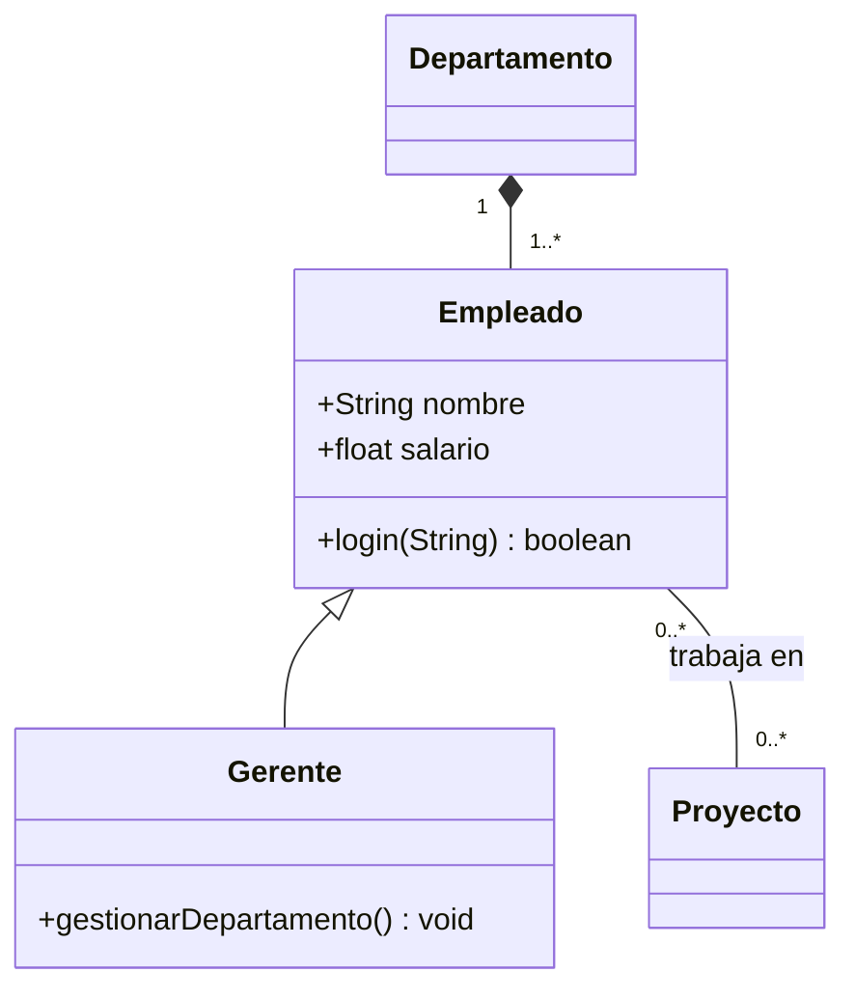
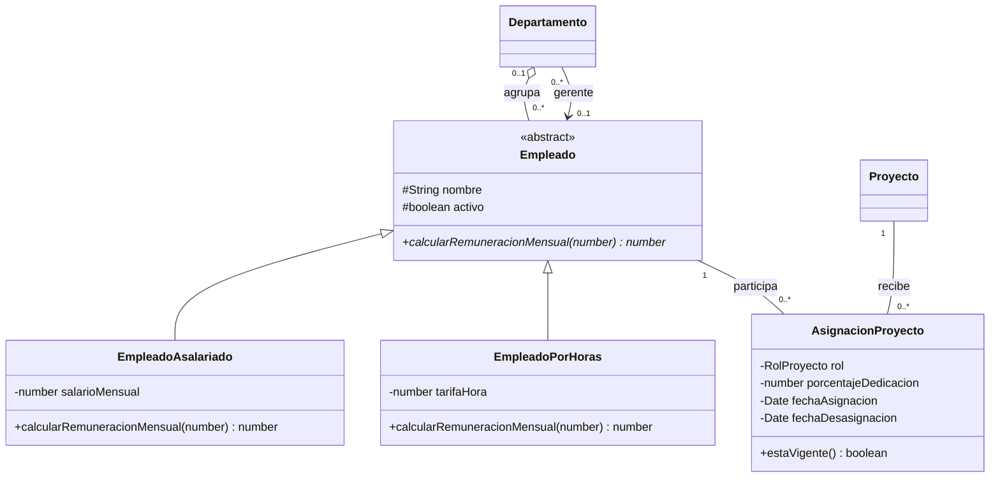

# Paso 4: modelo final, principios y trazabilidad

El Paso 4 no te pide dibujar otro diagrama. Te pide demostrar que el que ya tienes es **el correcto**, y hacerlo con tres piezas que casi nadie entrega completas: el delta respecto del modelo inicial, los principios de diseño señalados clase por clase, y una matriz de trazabilidad que amarre cada requisito del enunciado a una clase y a un método concreto.

Es el criterio **1.1.4 — Diseña un diagrama de clases UML, considerando los fundamentos de programación y el análisis crítico de recomendaciones generadas por herramientas de IA**. Y es el paso donde la evaluación deja de medir si sabes dibujar y empieza a medir si sabes **argumentar** lo que dibujaste.


:::clave Lo que se evalúa en este paso
Un diagrama final que se pueda comparar con el inicial y donde el cambio se explique con criterio técnico; al menos tres principios de diseño aplicados y **localizados** en la mayoría de las clases; una matriz que pruebe que ningún requisito del enunciado se quedó fuera; y la capacidad de cerrar la defensa sosteniendo que ese diseño se implementa en Python, respondiendo repreguntas sin titubear.
:::

---

## Qué pide la guía

Las cinco viñetas del Paso 4, textuales:

> Paso 4: Construcción y validación de la solución final (1.1.4)
> Deberás desarrollar un diagrama de clases final que integre los fundamentos de
> programación orientada a objetos junto con un análisis crítico del apoyo
> proporcionado por herramientas de IA.
>
> - Elaborar la versión final del diagrama de clases UML incorporando mejoras
>   estructurales respecto al modelo inicial generado
> - Aplicar al menos 3 principios de diseño orientado a objetos (por ejemplo:
>   cohesión, responsabilidad única, encapsulamiento, claridad) en la mayoría de
>   las clases del modelo.
> - Validar la coherencia del modelo con los requerimientos del sistema,
>   elaborando una matriz de trazabilidad que relacione al menos 3 requerimientos
>   del sistema con las clases correspondientes.
> - Fundamentar las decisiones de diseño del diagrama de clases UML utilizando
>   criterios técnicos y presentando el modelo de forma clara, técnica y
>   estructurada.
> - Concluye la presentación defendiendo la viabilidad técnica del diseño
>   definitivo en Python, respondiendo con seguridad y fundamentos sólidos a las
>   preguntas del docente o comisión, y evidenciando una postura crítica y
>   estructurada sobre el uso de herramientas de IA en el desarrollo de software.

A esas cinco se suman dos exigencias que están en otras partes del documento pero se cobran sobre este mismo diagrama. La primera, de las instrucciones generales:

> La versión final del diagrama debe ser el resultado de un proceso de
> refinamiento técnico propio. Importante: La entrega de resultados generados
> exclusivamente por IA, sin análisis ni ajustes, será considerada insuficiente.

La segunda, de la situación de evaluación:

> Justifique técnicamente las decisiones de diseño adoptadas en el diagrama de
> clases final, a partir del análisis crítico del apoyo de IA.

### La tabla de mínimos de este paso

| Origen | Qué exige | Mínimo que se cuenta | Dónde va |
|---|---|:--:|---|
| P4-R1 | Diagrama final con mejoras estructurales respecto al inicial | 1 diagrama + delta explícito | Diseño del sistema |
| P4-R2 | Principios de diseño aplicados en la mayoría de las clases | 3 principios, >50% de las clases | Mejoras aplicadas |
| P4-R3 | Matriz de trazabilidad requisito → clase | 3 requisitos (hay 10 en el enunciado) | Mejoras aplicadas |
| P4-R4 | Fundamentación técnica de las decisiones | — | Diseño del sistema + oral |
| P4-R5 | Defensa de la viabilidad técnica **en Python** | — | Oral |
| GEN-06 | El modelo final debe diferir del generado por IA | distinto y demostrable | Diagrama + delta |
| SE-04 | Justificación a partir del análisis crítico de la IA | — | Mejoras aplicadas |

:::trampa "La mayoría de las clases" y "al menos 3 requerimientos"
Son dos números que alguien va a contar con el dedo sobre tu informe, y los dos tienen una lectura mínima y una lectura sensata.

**"La mayoría"** no está definida en ninguna parte. La lectura literal es más del 50% de las clases del modelo. Si tu diagrama tiene siete clases, cuatro no bastan para dormir tranquilo: apunta a todas, y si alguna queda fuera, dilo y explica por qué (una enumeración, por ejemplo, no tiene comportamiento que encapsular).

**"Al menos 3 requerimientos"** es el mínimo más barato de superar de toda la evaluación. El enunciado trae **diez** requisitos del sistema numerados con su propio subtítulo. Trazar tres de diez es dejar siete filas de evidencia gratis sobre la mesa, y además deja el modelo sin validar justo donde suele estar el hueco: informes, autenticación, cifrado y validación de entradas.
:::

Este paso aterriza en dos sitios del informe: el diagrama definitivo y su fundamentación van en **Diseño del sistema**; el delta, los principios y la matriz van en **Mejoras aplicadas**.


---

## Cómo razonarlo

**El Paso 4 evalúa la argumentación, no el dibujo.** Si tu diagrama del Paso 2 estaba bien, el del Paso 4 puede ser casi el mismo. Lo que cambia no es la figura: es que ahora viene acompañada de tres pruebas —cambió esto por esto, cumple estos principios aquí, cubre estos requisitos así— y de la capacidad de sostenerlas en voz alta. Un diagrama idéntico con esas tres pruebas puntúa muy por encima de un diagrama más elaborado sin ellas.

**El delta es tu prueba de autoría.** Este es el punto que hay que entender antes que ningún otro. La guía dice que entregar salida de IA sin ajustes es "insuficiente", pero un corrector no tiene forma de saber qué generó la máquina y qué pusiste tú… salvo que se lo muestres. La tabla antes/después es exactamente esa demostración: aquí estaba el modelo generado, aquí está el mío, estas son las ocho diferencias y este es el argumento técnico de cada una. Sin esa tabla, un modelo impecable que aparece de la nada se lee como sospechoso; con ella, el mismo modelo se lee como el resultado visible de un proceso.

:::aviso Si ya tienes un sistema construido, el riesgo se invierte
Tener un sistema completo y desplegado es evidencia excelente y, a la vez, la manera más rápida de que te pregunten si esto lo hiciste tú. La defensa contra esa sospecha no es esconder el trabajo: es **mostrar el proceso**. Fechas, versiones del modelo, decisiones descartadas y errores que cometiste y corregiste. Un trabajo que solo muestra el resultado final perfecto parece generado; uno que muestra las tres versiones intermedias y por qué murió cada una, no.

Este riesgo está desarrollado entero en [Ambigüedades y riesgos](02-ambiguedades-y-riesgos.html), riesgo 6.
:::

**Un principio no se "aplica": se ve o no se ve en la figura.** Escribir "el modelo aplica encapsulamiento" no vale nada si el diagrama tiene todos los atributos con `+`. Cada principio que nombres tiene que poder señalarse con el dedo sobre una clase concreta: *este* atributo privado, *este* método que en vez de exponer el estado lo cambia respetando una regla, *esta* clase que no hace aquella otra cosa. La prueba de que entendiste un principio es que puedes decir qué clase lo **incumpliría** si estuviera mal diseñada.

**La trazabilidad se recorre en los dos sentidos.** De requisito a clase te dice si algo se quedó sin modelar; es la dirección obvia y la que pide la guía. De clase a requisito te dice si sobra algo, y es la dirección que nadie recorre: si una clase de tu diagrama no responde a ningún requisito del enunciado, o hay un requisito implícito que no declaraste, o esa clase está de adorno. Las dos direcciones se responden con la misma tabla leída al revés, así que el costo de hacer la segunda es cero.

**La viabilidad en Python es una afirmación falsable.** La guía cierra pidiendo que defiendas que el diseño es viable en Python. "Un diagrama UML es independiente del lenguaje" es la respuesta correcta y es insuficiente sola, porque es una afirmación que se puede comprobar. La forma robusta de sostenerla es tener a mano el esqueleto: las mismas clases, en Python, ejecutándose. Ahí la afirmación deja de ser una opinión.

---

## Cómo hacerlo paso a paso

1. **Congela el modelo inicial.** Antes de tocar nada, guarda una copia fechada del diagrama generado por la IA en el Paso 3 y de tu propio modelo del Paso 2. Son las dos columnas "antes" de tu tabla; si las pierdes, el delta hay que reconstruirlo de memoria y se nota.
2. **Lista los cambios, uno por línea.** Recorre el modelo generado y anota cada diferencia con el tuyo. No filtres todavía: renombrar un atributo también entra en la lista.
3. **Separa cosmético de estructural.** La guía pide "mejoras **estructurales**". Un cambio es estructural si altera clases, relaciones, multiplicidades, visibilidad o responsabilidades. Renombrar `nom` a `nombre` no lo es. Deja los cosméticos en una línea agregada al final de la tabla y desarrolla los estructurales.
4. **Escribe el motivo técnico de cada cambio estructural.** Una frase por fila, y que la frase contenga un criterio, no una preferencia. "Queda más ordenado" no es un criterio. "Un gerente es un rol temporal y la herencia modela pertenencia permanente" sí lo es.
5. **Elige tus tres principios y ancla cada uno.** Responsabilidad única, cohesión alta con acoplamiento bajo y encapsulamiento son los tres que mejor se ven en este dominio. Para cada uno, encuentra en tu diagrama la clase donde se ve más claro y la clase donde estuviste tentado de incumplirlo.
6. **Construye la tabla clase por clase.** Una fila por clase del modelo, con qué principio se aplica y en qué elemento concreto se ve. Al terminar, cuenta: clases cubiertas dividido por clases totales. Escribe el porcentaje en el informe. Esa cifra es la que responde "en la mayoría de las clases".
7. **Numera los requisitos del enunciado.** Ponles código: RF-01 a RF-10 para los diez requisitos del sistema, RT-01 a RT-05 para las consideraciones técnicas. Los códigos hacen la matriz referenciable y te dejan citarlos en la defensa.
8. **Llena la matriz fila por fila y marca los huecos.** Si un requisito no tiene clase que lo realice, no lo escondas: es exactamente lo que la matriz sirve para encontrar. O agregas la clase, o declaras que ese requisito queda fuera del alcance del modelo estructural y dices dónde se resuelve.
9. **Traduce dos clases a Python.** No el sistema entero: la clase abstracta con su método abstracto y una subclase. Con eso demuestras herencia, polimorfismo, encapsulamiento con `@property` y clase abstracta con `abc`. Ejecútalo antes de la defensa.
10. **Relee el informe buscando contradicciones figura–texto.** Que ninguna frase afirme algo que el diagrama no muestre. Es el chequeo que más puntos salva y toma quince minutos.

---

## Respuesta modelo

:::nota Esto es un ejemplo trabajado, no tu entrega
Lo que viene sirve para que veas la **forma**, el nivel de detalle y el tipo de argumento que se espera. Tus filas tienen que salir de tu modelo, de los errores que encontraste tú en la propuesta que generaste tú, y de los requisitos tal como tú los interpretaste. Si copias estas tablas, la primera repregunta de la defensa —"¿por qué esta fila dice esto?"— te deja sin respuesta, y ese es precisamente el propósito de que la defensa exista.
:::

### A. El delta: qué cambió entre el modelo inicial y el final

Antes de la tabla va un párrafo de encuadre. Este, o uno equivalente tuyo:

> El modelo final conserva de la propuesta generada por IA la identificación de
> las cuatro entidades centrales del dominio y buena parte de sus atributos.
> Difiere de ella en ocho decisiones estructurales que afectan a la jerarquía, a
> tres relaciones y a la visibilidad de los atributos. Cada una se justifica a
> continuación con el criterio técnico que la motiva.

| # | Aspecto | Modelo inicial (IA) | Modelo final | Criterio técnico que obliga el cambio |
|:--:|---|---|---|---|
| 1 | Jerarquía | `Gerente` hereda de `Empleado` | Asociación dirigida `Departamento --> Empleado` con rol *gerente*, `0..1` | La herencia modela pertenencia permanente; ser gerente es un rol temporal y reversible. Con herencia, una promoción obliga a destruir el objeto y crear otro |
| 2 | Jerarquía | Una sola clase `Empleado` con atributo `salario` | `Empleado` abstracta con `EmpleadoAsalariado` y `EmpleadoPorHoras` | El enunciado exige registrar horas trabajadas y pagar sueldos: son dos formas de remunerar. La herencia da polimorfismo real y elimina el `if` por tipo de contrato |
| 3 | Relación Empleado–Proyecto | Asociación N a M simple | Clase `AsignacionProyecto` con `rol`, `porcentajeDedicacion`, `fechaAsignacion` y `fechaDesasignacion` | Una N a M con atributos propios exige clase asociativa: esos datos no caben en ninguno de los dos extremos sin duplicarse |
| 4 | Relación Departamento–Empleado | Composición, multiplicidad `1..*` | Agregación, `0..1` en el extremo del departamento | Disolver un área no elimina a su gente; y un empleado recién ingresado todavía no tiene área asignada |
| 5 | Registro de horas | `RegistroTiempo` asociado solo al empleado | Asociado a empleado **y** a proyecto, con dependencia «use» hacia `AsignacionProyecto` | El enunciado lo dice literal: *"estos registros de tiempo deben estar asociados a un empleado y a un proyecto específico"* |
| 6 | Estados | `boolean aprobado` en `RegistroTiempo` | Enumeración `EstadoRegistro` con `BORRADOR / ENVIADO / APROBADO / RECHAZADO` y `aprobadoPor` | Un booleano no distingue "no enviado" de "rechazado", y sin quién aprobó no hay trazabilidad, que es el problema declarado por la empresa |
| 7 | Visibilidad | Atributos públicos, sin operaciones de negocio | Atributos privados o protegidos; operaciones con nombre de negocio (`aprobar`, `desasignar`, `cambiarEstado`) | Encapsulamiento: con atributos públicos no existe ningún punto donde validar una invariante |
| 8 | Autenticación | `login()` como método de `Empleado` | `Usuario` como entidad aparte, asociada `0..1` a `Empleado` | Autenticar no es una responsabilidad del empleado. Además hay usuarios que no son empleados y empleados sin acceso al sistema |
| — | Cosméticos | — | — | Se normalizaron nombres a PascalCase singular, se completaron tipos de retorno y se agregaron multiplicidades ausentes en cuatro extremos |

Las dos vistas comparadas, reducidas a la región que cambió. Así se ve el delta de un vistazo sin repetir el diagrama completo:

**Antes — propuesta generada, iteración 1:**



**Después — modelo final:**




:::clave Por qué esta tabla es la pieza más defendible del Paso 4
Responde de una sola vez a tres exigencias distintas: P4-R1 ("mejoras estructurales respecto al modelo inicial"), SE-04 ("justifique técnicamente las decisiones a partir del análisis crítico del apoyo de IA") y GEN-06 (el modelo final tiene que ser resultado de refinamiento propio). Una tabla, tres requisitos cubiertos, y una página de informe.
:::

### B. Los tres principios de diseño

La guía nombra cuatro candidatos —cohesión, responsabilidad única, encapsulamiento, claridad— y pide al menos tres. Estos son los tres que mejor se sostienen en este dominio, con su definición precisa y dónde se ven.

#### Responsabilidad única

**Definición.** Una clase debe tener una sola razón para cambiar. Formulado al revés y más útil para revisar un diagrama: si puedes nombrar dos motivos independientes por los que tendrías que editar esa clase, tiene dos responsabilidades y hay que partirla.

**Dónde se ve en el modelo.** `RegistroTiempo` sabe cuántas horas se trabajaron, en qué fecha, sobre qué proyecto y en qué estado está su aprobación. **No** sabe exportarse a PDF ni a Excel: eso vive en `Exportador`. Si mañana cambia el formato del PDF, `RegistroTiempo` no se toca. Si mañana cambia la regla de cuántas horas diarias se pueden imputar, se toca `RegistroTiempo` y nada más.

**Dónde estuvo la tentación de incumplirlo.** La propuesta de IA ponía `login()` en `Empleado`. Con eso, `Empleado` cambiaba por dos motivos: porque cambiara la información laboral de una persona, o porque cambiara la política de contraseñas. Dos razones, dos clases.

#### Cohesión alta y acoplamiento bajo

**Definición.** Cohesión es cuánto tienen que ver entre sí los elementos que están dentro de una misma clase: alta cuando todos sirven al mismo propósito. Acoplamiento es cuánto depende una clase de los detalles internos de otra: bajo cuando conoce lo mínimo indispensable. Son un par, no dos principios sueltos: bajar el acoplamiento a costa de repartir una responsabilidad entre tres clases baja también la cohesión, y el modelo empeora.

**Dónde se ve la cohesión alta.** `Proyecto` tiene nombre, descripción, fecha de inicio, estado y las operaciones que trabajan sobre ese estado (`cambiarEstado`, `admiteCargaDeHoras`). Todo lo que hay dentro sirve a la misma idea. No hay ni un atributo que esté ahí "porque no sabía dónde ponerlo", que es la señal de cohesión baja.

**Dónde se ve el acoplamiento bajo.** `Departamento` conoce a su gerente por una asociación **dirigida**: la flecha va del departamento al empleado y no al revés, así que `Empleado` no arrastra ningún atributo por dirigir un área ni cambia si mañana cambia la política de jefaturas. Y agrupa a sus empleados por **agregación**: guarda referencias a objetos que existen fuera de él y le sobreviven, en vez de poseer su ciclo de vida como haría una composición. Y `RegistroTiempo` se relaciona con `AsignacionProyecto` mediante una **dependencia «use»**, no mediante un atributo: la consulta al crearse para comprobar que existe una asignación vigente, y después no la conserva. Esa flecha discontinua es acoplamiento bajo dibujado.

:::avanzado La frase que convierte esto en nota alta
"Elegí agregación y no composición entre `Departamento` y `Empleado` porque bajar el acoplamiento aquí tiene una consecuencia concreta en el dominio: el ciclo de vida del empleado deja de depender del departamento, y disolver un área no borra a su gente." Cuando un principio se enuncia junto con la consecuencia que evita, deja de sonar a definición memorizada.
:::

#### Encapsulamiento

**Definición.** Ocultar la representación interna de un objeto detrás de operaciones que garantizan sus invariantes. No es "poner todo privado y agregar getters y setters" —eso deja el objeto igual de abierto, con más código— sino decidir qué reglas tiene que cumplir siempre el objeto y no dejar ninguna vía de modificarlo que las salte.

**Dónde se ve en el modelo.** `RegistroTiempo` tiene `-estado: EstadoRegistro` privado y **no** tiene `setEstado()`. Tiene `enviar()` y `aprobar(aprobador)`. La diferencia es que `aprobar()` puede exigir que el registro esté en `ENVIADO`, que el aprobador no sea el mismo autor y que quede guardado quién aprobó. Con un setter público, esas tres reglas no tienen dónde vivir y cada punto del sistema que toque el estado tiene que acordarse de ellas.

**El otro caso claro.** `-salarioMensual` es privado en `EmpleadoAsalariado`. Nadie fuera de la clase lee el sueldo directamente: se pide `calcularRemuneracionMensual()`. Eso además es lo que hace posible el polimorfismo, porque `EmpleadoPorHoras` responde al mismo mensaje con otra fórmula.

#### La tabla clase por clase

Esta es la evidencia que la guía pide cuando dice "en la mayoría de las clases". Una fila por clase, con el elemento concreto donde el principio se ve:

| Clase | Principio aplicado | Cómo se ve en el modelo |
|---|---|---|
| `Entidad` (abstracta) | Responsabilidad única · Encapsulamiento | Solo gestiona identidad: genera el ID único que exige el enunciado y lo expone de solo lectura. Un identificador que se puede reasignar no identifica |
| `Empleado` (abstracta) | Responsabilidad única · Encapsulamiento | Datos laborales y operaciones sobre ellos. Atributos `#` protegidos para las subclases, ninguno público. No autentica, no exporta, no calcula nóminas de terceros |
| `EmpleadoAsalariado` | Cohesión alta · Encapsulamiento | Un solo atributo, `-salarioMensual`, privado, y la implementación concreta del método abstracto. Nada más cabe aquí |
| `EmpleadoPorHoras` | Cohesión alta · Encapsulamiento | `-tarifaHora` privada; misma operación, otra fórmula. Es el polimorfismo del modelo |
| `Departamento` | Acoplamiento bajo · Responsabilidad única | Conoce a su gerente por asociación dirigida `0..1` y agrupa empleados por agregación: no controla su ciclo de vida |
| `Proyecto` | Cohesión alta · Encapsulamiento | Estado privado con máquina de estados: `cambiarEstado()` valida la transición; `admiteCargaDeHoras()` responde una pregunta de negocio sin exponer el estado |
| `AsignacionProyecto` | Responsabilidad única · Claridad | Existe para sostener los datos del vínculo —rol, dedicación, vigencia— que no pertenecen ni al empleado ni al proyecto. Hace una sola cosa y la hace explícita |
| `RegistroTiempo` | Encapsulamiento · Responsabilidad única | `-estado` privado sin setter; `enviar()` y `aprobar()` como únicas vías de cambio. No sabe exportarse |
| `Usuario` | Responsabilidad única · Acoplamiento bajo | Credenciales y sesión, separadas de la información laboral. Asociación `0..1` con `Empleado`: puede haber empleados sin acceso |
| `DatosPersonales` («valueObject») | Encapsulamiento · Cohesión alta | Agrupa los datos sensibles en un solo punto, que es el único sitio donde hay que cifrar y descifrar. Inmutable: se reemplaza, no se muta |
| `EstadoProyecto`, `EstadoRegistro` («enumeration») | Claridad | No aplican encapsulamiento: son conjuntos cerrados de valores sin estado propio. Sustituyen cadenas de texto libres y hacen imposible un estado inventado |

**El recuento, escrito en el informe:** el diagrama de dominio final tiene **10 clases y 2 enumeraciones**; las clases de servicio e infraestructura que aparecen en la matriz de trazabilidad —`Reporte`, `Exportador`, `ServicioCifrado`, `Validador`, `Repositorio<T>`— quedan fuera del alcance declarado del diagrama de dominio, y ese alcance hay que escribirlo al lado del recuento para que nadie cuente otra cosa. Nueve de las 10 clases aplican al menos dos de los tres principios elegidos y la restante, `AsignacionProyecto`, aplica responsabilidad única y claridad; los tres aparecen repartidos en el conjunto: responsabilidad única en 6, cohesión alta y acoplamiento bajo en 6, encapsulamiento en 7. Cobertura: **10 de 10 clases, 100%**, muy por encima del "más del 50%" que exige la lectura literal de "la mayoría".

Escribe ese recuento con las cifras. Es media línea y hace innecesario que nadie cuente: el número que responde al criterio queda dicho por ti, con el criterio de conteo declarado al lado.

### C. La matriz de trazabilidad

**Qué es.** Una tabla que conecta cada requisito del enunciado con el elemento del modelo que lo realiza. Nada más que eso, y por eso es tan barata de hacer.

**Para qué sirve.** Para tres cosas, y las tres importan en esta evaluación:

1. **Detectar huecos.** Si un requisito no tiene clase, el modelo está incompleto y la matriz es lo único que lo hace evidente antes de que lo haga el corrector.
2. **Detectar sobrantes.** Leída de derecha a izquierda, muestra clases que no responden a ningún requisito.
3. **Evaluar impacto.** Cuando el cliente cambia un requisito, la fila te dice exactamente qué clases hay que tocar.

**Cómo se construye.** Cuatro movimientos:

1. Numera los requisitos tal como aparecen en el enunciado, sin reinterpretarlos. Cada subtítulo del apartado "Requisitos del Sistema" es una fila: RF-01 a RF-10.
2. Para cada uno, busca en tu diagrama qué clase o clases lo realizan.
3. Baja al detalle: **qué método o qué atributo concreto**. Una matriz que solo nombra clases es un índice, no una trazabilidad.
4. Escribe cómo se verificaría. Puede ser una prueba, una consulta o un escenario de uso descrito en una línea.

:::trampa La matriz que apunta solo a clases
"RF-04 Registro de tiempo → clase `RegistroTiempo`" es una fila que no prueba nada: repite el nombre del requisito con otras palabras. La fila útil dice qué método concreto lo cumple y cómo se comprueba. La columna del método es la que convierte la tabla en evidencia.
:::

#### Matriz principal: los diez requisitos del sistema

| Requisito del enunciado | Clases que lo realizan | Método o atributo concreto | Cómo se verifica |
|---|---|---|---|
| **RF-01** Registro de empleados con datos personales, fecha de contrato, salario e **ID único automático** | `Empleado`, `EmpleadoAsalariado`, `EmpleadoPorHoras`, `DatosPersonales`, `Entidad` | `Entidad.id` (solo lectura, generado en el constructor); `-datosPersonales: DatosPersonales`; `#fechaInicioContrato`; `-salarioMensual` / `-tarifaHora` | Crear dos empleados seguidos y comprobar que los identificadores difieren y que ninguno se pudo fijar desde fuera |
| **RF-02** Creación, edición, búsqueda y eliminación de departamentos, con nombre y gerente | `Departamento` | `-nombre`; asociación dirigida a `Empleado` con rol *gerente* `0..1`; `designarGerente(Empleado)`, `tieneGerente()` | Designar gerente, reemplazarlo y dejar el puesto vacante sin que el departamento quede en estado inválido |
| **RF-03** Asignación de empleados a departamentos; **uno solo a la vez**; permite reasignación | `Departamento`, `Empleado` | Agregación `Departamento "0..1" o-- "0..*" Empleado`; `Empleado.asignarADepartamento(Departamento)` | La multiplicidad `0..1` en el extremo del departamento es la regla escrita en el diagrama: reasignar sustituye, no acumula |
| **RF-04** Registro de horas con fecha, cantidad y descripción, **asociado a empleado y a proyecto** | `RegistroTiempo`, `Empleado`, `Proyecto`, `AsignacionProyecto` | `-fecha`, `-horas`, `-descripcion`; composición desde `Proyecto`; asociación con `Empleado`; dependencia «use» a `AsignacionProyecto` | Intentar imputar horas a un proyecto donde el empleado no tiene asignación vigente: el modelo lo impide por la dependencia |
| **RF-05** Creación, edición y eliminación de proyectos con nombre, descripción y fecha de inicio | `Proyecto`, `EstadoProyecto` | `-nombre`, `-descripcion`, `-fechaInicio`, `-estado`; `cambiarEstado(EstadoProyecto)` | Un proyecto cerrado no admite cargas: `admiteCargaDeHoras()` devuelve falso y el diagrama lo explica |
| **RF-06** Asignación y desasignación de empleados a **uno o varios** proyectos | `AsignacionProyecto`, `Empleado`, `Proyecto` | `-fechaAsignacion`, `-fechaDesasignacion`, `-rol`, `-porcentajeDedicacion`; `estaVigente()`, `desasignar(Date)` | Desasignar cierra el período en vez de borrarlo: las horas históricas siguen teniendo quién y por qué |
| **RF-07** Generación de informes de empleados, proyectos, departamentos y horas, **exportables a PDF o Excel** | `Reporte` (abstracta), `Exportador` (abstracta), `ExportadorPDF`, `ExportadorExcel` | `Reporte.generar()` como método plantilla; `Exportador.exportar(Reporte)` polimórfico | Agregar un formato nuevo es agregar una subclase de `Exportador`: ninguna clase existente se modifica |
| **RF-08** Autenticación robusta y autorización por módulo | `Usuario`, `Rol`, `PoliticaAutorizacion` | `Usuario.-hashContrasena` (nunca la contraseña); `verificarCredenciales()`; `PoliticaAutorizacion.puede(Usuario, Accion)` | El atributo se llama `hashContrasena` a propósito: el nombre en el diagrama ya declara que no se guarda en claro |
| **RF-09** Almacenamiento seguro de datos personales con cifrado y cumplimiento de privacidad | `DatosPersonales` («valueObject»), `ServicioCifrado` | `DatosPersonales` inmutable como bloque cifrable; `ServicioCifrado.cifrar()` / `descifrar()` | Agrupar los datos sensibles en un objeto da **un solo punto** donde cifrar, en vez de cuatro atributos repartidos |
| **RF-10** Validación rigurosa de todas las entradas para prevenir ataques comunes | `Validador` (abstracta) y sus subclases; constructores de las entidades | `Validador.validar(valor)`; validación en el constructor y en cada operación de negocio, no en la interfaz | Construir un `RegistroTiempo` con horas negativas debe ser imposible: el objeto no llega a existir en estado inválido |

#### Matriz complementaria: las consideraciones técnicas

Estas cinco no están en el apartado de requisitos pero se corrigen igual, y trazar también estas es lo que separa una matriz suficiente de una completa:

| Consideración técnica | Dónde se realiza en el modelo | Cómo se verifica |
|---|---|---|
| **RT-01** Paradigma orientado a objetos | Todo el diagrama: entidades con estado y comportamiento, sin clases de solo datos ni clases-dios | Ninguna clase del modelo es un contenedor de atributos sin operaciones |
| **RT-02** Clases para empleados, departamentos, proyectos y registros de tiempo | `Empleado`, `Departamento`, `Proyecto`, `RegistroTiempo` | Las cuatro están explícitas en el diagrama final |
| **RT-03** Herencia y polimorfismo "de manera efectiva para evitar duplicación" | `Empleado` abstracta con dos subclases; `calcularRemuneracionMensual()` abstracto | El cálculo de nómina recorre la colección de empleados sin un solo `if` sobre el tipo de contrato |
| **RT-04** Uso de una base de datos | `Repositorio<T>` como abstracción de persistencia; el diagrama de clases modela el **dominio**, no el esquema | Cambiar el motor de almacenamiento cambia la implementación del repositorio y ninguna entidad |
| **RT-05** Interfaz de usuario | Capa de presentación separada, fuera del diagrama de dominio, que consume las operaciones públicas | Ninguna entidad del dominio conoce la interfaz: la dependencia va en un solo sentido |

:::aviso RT-04 es la fila donde hay que ser preciso
El enunciado dice *"utiliza una base de datos"*. Si tu sistema usa un almacén clave-valor, o memoria, o archivos, la fila honesta no dice "usa una base de datos": dice qué usa y por qué eso satisface la intención del requisito —persistencia duradera, consultable e independiente de la ejecución del programa—. Y añade la frase que cierra el asunto: el diagrama de clases modela el dominio y la persistencia queda tras una abstracción, precisamente para que la decisión de motor sea reversible. El tratamiento completo está en [Ambigüedades y riesgos](02-ambiguedades-y-riesgos.html), riesgo 12.
:::

### D. Las decisiones que hay que saber fundamentar

P4-R4 pide fundamentar con criterios técnicos. Estas cuatro son las que se preguntan, con la alternativa que descartaste —que es la mitad que casi nadie escribe—:

| Decisión adoptada | Alternativa descartada | Criterio técnico | Qué pasa si se hace al revés |
|---|---|---|---|
| Herencia por tipo de contrato | Atributo `tipoContrato: String` con un `if` | Polimorfismo: agregar una modalidad es agregar una clase, no editar un condicional | Cada nueva modalidad obliga a tocar todos los `if` repartidos por el sistema |
| Gerente como rol en una asociación | `Gerente` como subclase de `Empleado` | La herencia modela pertenencia permanente; el rol es temporal y reversible | Una promoción exige destruir y recrear el objeto, y se pierde la identidad de la persona |
| Agregación entre departamento y empleado | Composición | Ciclo de vida independiente: la parte sobrevive al todo | Disolver un departamento borraría a sus empleados |
| Clase asociativa reificada | Asociación N a M simple | Los atributos del vínculo no pertenecen a ninguno de los dos extremos | Rol y dedicación se duplican o se pierden; no hay historial de participaciones |

### E. Cómo se cierra la defensa: la viabilidad técnica en Python

La última viñeta del Paso 4 es la que cierra la presentación:

> Concluye la presentación defendiendo la viabilidad técnica del diseño definitivo
> en Python, respondiendo con seguridad y fundamentos sólidos a las preguntas del
> docente o comisión, y evidenciando una postura crítica y estructurada sobre el
> uso de herramientas de IA en el desarrollo de software.

**El argumento de fondo, en dos frases.** Un diagrama de clases UML describe estructura —clases, atributos, operaciones, relaciones— y ninguna de esas cuatro cosas es propiedad de un lenguaje. La viabilidad en Python no se declara: se demuestra mostrando la correspondencia elemento por elemento.

| Elemento UML | Traducción a Python |
|---|---|
| Clase abstracta (nombre en cursiva) | `class X(ABC)` |
| Método abstracto | decorador `@abstractmethod` |
| Atributo privado `-` / protegido `#` | `self._nombre` (convención de un guion bajo) |
| Atributo de solo lectura | `@property` sin `setter` |
| Generalización (triángulo cerrado) | `class Hija(Madre)` |
| Composición (rombo relleno) | la colección vive dentro del todo y se crea y destruye con él |
| Agregación (rombo hueco) | se guarda una referencia a un objeto que existe fuera |
| Clase asociativa | una clase propia con referencia a los dos extremos más sus atributos |
| Multiplicidad `0..*` | una lista |
| Multiplicidad `0..1` | un `Optional[...]` |
| «enumeration» | `class X(Enum)` |

Y el esqueleto que lo prueba, que es lo que conviene tener abierto en la pantalla cuando llegue la pregunta:

```python
from abc import ABC, abstractmethod

class Empleado(ABC):
    """Clase abstracta: en UML va en cursiva."""

    def __init__(self, nombre: str, fecha_inicio_contrato):
        self._nombre = nombre                    # UML:  #nombre
        self._fecha_inicio_contrato = fecha_inicio_contrato
        self._activo = True

    @property
    def nombre(self) -> str:                     # solo lectura: sin setter
        return self._nombre

    @abstractmethod
    def calcular_remuneracion_mensual(self, horas_aprobadas: float) -> float:
        """Cada modalidad de contrato la implementa a su manera."""

class EmpleadoAsalariado(Empleado):
    def __init__(self, nombre, fecha_inicio_contrato, salario_mensual: float):
        super().__init__(nombre, fecha_inicio_contrato)
        self._salario_mensual = salario_mensual  # UML:  -salarioMensual

    def calcular_remuneracion_mensual(self, horas_aprobadas: float) -> float:
        return self._salario_mensual

class EmpleadoPorHoras(Empleado):
    def __init__(self, nombre, fecha_inicio_contrato, tarifa_hora: float):
        super().__init__(nombre, fecha_inicio_contrato)
        self._tarifa_hora = tarifa_hora

    def calcular_remuneracion_mensual(self, horas_aprobadas: float) -> float:
        return self._tarifa_hora * horas_aprobadas

# El polimorfismo haciendo trabajo real: ni un solo `if` sobre el tipo.
for empleado in nomina:
    total += empleado.calcular_remuneracion_mensual(horas[empleado.id])
```

El modelo completo traducido y ejecutable está en [`python/modelo.py`](python/modelo.py) de esta misma guía: se corre con `python3 modelo.py` y no necesita instalar nada. Ejecútalo **antes** de la defensa y entiende qué imprime, porque la utilidad de tenerlo no es exhibirlo, es que las respuestas te salgan concretas.

Las tres repreguntas que caen aquí, con lo que la respuesta tiene que contener:

| Pregunta | Qué tiene que aparecer en tu respuesta |
|---|---|
| "Python no tiene atributos privados de verdad, ¿entonces no hay encapsulamiento?" | El encapsulamiento es una decisión de diseño sobre quién puede tocar qué; el lenguaje ayuda más o menos a sostenerla. Python la sostiene con `property`: un atributo sin setter no se reasigna por accidente, y el guion bajo declara la intención |
| "¿Dónde está la base de datos en tu diagrama?" | El diagrama de clases modela el dominio, no el esquema. La persistencia queda tras una abstracción de repositorio, y por eso el modelo no cambia si cambia el motor |
| "Si el diseño es en Python, ¿por qué el código está en otro lenguaje?" | Que el modelo se traduce sin torcerse, y la demostración a mano. Un modelo que sobrevive a dos lenguajes es un modelo bien abstraído: eso es un argumento a favor, no una excusa |

**La otra mitad de la viñeta: la postura sobre la IA.** La misma frase que pide defender Python cierra pidiendo *"evidenciando una postura crítica y estructurada sobre el uso de herramientas de IA en el desarrollo de software"*, y esa mitad se cobra aparte. No se responde con un elogio ni con una condena, sino con una posición formulada y con su límite dicho: la herramienta es buena generando candidatos y mala decidiendo, porque no conoce el dominio ni carga con las consecuencias del error; por eso la usaste como material a criticar y no como resultado, y por eso cada prompt está documentado junto al error que produjo. Dilo en treinta segundos y con las pruebas al lado —el delta de la sección A, la tabla de hallazgos del Paso 3 y las alternativas descartadas de la sección D—, porque una postura sin evidencia es una opinión. El guion completo, con las repreguntas de autoría, está en [La defensa oral](08-defensa-oral.html).

---

## Versión avanzada

Cinco cosas que suben el nivel sin costar mucho más trabajo:

**Trazabilidad bidireccional.** Después de la matriz requisito → clase, agrega una tabla corta clase → requisito. Si aparece una clase sin requisito, tienes dos salidas honestas y ninguna mala: o la clase sobra y la quitas, o responde a un requisito implícito que hay que declarar (por ejemplo, `Entidad` responde a "se debe asignar automáticamente un ID único", que está enterrado dentro de RF-01).

**Versionado explícito del modelo.** Rotula tus figuras como *v0 — modelo propio (Paso 2)*, *v1 — propuesta generada (Paso 3, iteración 1)*, *v2 — propuesta generada corregida (iteración 2)* y *v3 — modelo final (Paso 4)*, cada una con su fecha. Cuatro rótulos con fecha son la evidencia de proceso más barata que existe, y son exactamente lo que desactiva la sospecha de autoría.

**Nombra el origen de cada principio.** Responsabilidad única viene de los principios SOLID; la pareja cohesión/acoplamiento viene del diseño estructurado de Stevens, Myers y Constantine, y el criterio de *qué* ocultar detrás de una interfaz estable es de Parnas. Citarlo en APA en la sección de Referencias es media línea y cambia el registro del informe.

**Restricciones escritas en el diagrama.** UML permite anotar invariantes entre llaves junto al elemento: `{horas > 0 and horas <= 24}` en `RegistroTiempo`, `{fechaDesasignacion == null or fechaDesasignacion >= fechaAsignacion}` en `AsignacionProyecto`. Son las reglas que el encapsulamiento protege, escritas donde se ven. Muy poca gente las pone.

**Declara el alcance, incluido lo que no modelaste.** Un párrafo que diga "el diagrama final modela el dominio; la capa de presentación y la de persistencia se representan por sus abstracciones y no se detallan, porque el criterio 1.1.4 evalúa la estructura del dominio" te protege de que una omisión deliberada se lea como un olvido. Saber qué dejaste fuera **a propósito** es una señal de criterio.

---

## Ambigüedades de este paso

**"Respecto al modelo inicial generado": ¿el tuyo o el de la IA?** La frase queda cortada en la guía y admite las dos lecturas. La salida segura es presentar el delta contra el modelo generado por IA —es la lectura que hace coherente el resto de la viñeta, que habla de "análisis crítico del apoyo de IA"— y añadir una columna o un párrafo que mencione también en qué se diferencia de tu propio modelo del Paso 2. Cubres las dos lecturas con dos líneas extra. Está desarrollado en [Ambigüedades y riesgos](02-ambiguedades-y-riesgos.html), riesgo 11.

**Qué cuenta como "requerimiento del sistema" en la matriz.** El enunciado tiene diez requisitos con subtítulo propio y cinco consideraciones técnicas. La lectura literal son los diez; la generosa son quince. Traza los diez en la matriz principal y las cinco en una tabla complementaria, y la ambigüedad deja de importar. Riesgo 13 del mismo documento.

**"La mayoría de las clases" no está definida.** Declara tú el criterio en el informe —"se considera mayoría más del 50% de las clases del modelo"— y muestra el recuento. Cuando tú defines el criterio y además lo superas, la ambigüedad juega a tu favor.

**Python contra el lenguaje en que esté tu sistema.** La ES1 se define como una solución "en Python" y el Paso 4 cierra pidiendo defender la viabilidad "en Python". Si tu implementación está en otro lenguaje, lo que **no** hay que hacer es ocultarlo. Lo que hay que hacer es tener la traducción y la tabla de correspondencias. Riesgo 1.

**La Rúbrica N°1 asigna la nota y no está adjunta.** Todo lo que este documento trata como criterio de corrección está inferido de las viñetas "Acciones para desarrollar". Búscala en el AAI y contrástala: si dice algo distinto, manda la rúbrica. Riesgo 5.

---

## Errores que hunden este paso

:::trampa Entregar como final el modelo que generó la herramienta
Es el único error que la guía sanciona con una palabra explícita: *"La entrega de resultados generados exclusivamente por IA, sin análisis ni ajustes, será considerada insuficiente."* Y se detecta rápido, porque el modelo generado tiene huellas reconocibles: `Gerente` heredando de `Empleado`, N a M sin clase asociativa, atributos públicos, un booleano donde hace falta un estado. Si tu diagrama final tiene esas cuatro cosas, dice de dónde salió sin que tú lo digas.
:::

:::trampa Un delta de cambios cosméticos
"Renombré los atributos, agregué tipos y ordené las cajas" no son mejoras estructurales. Estructural es lo que cambia clases, relaciones, multiplicidades, visibilidad o responsabilidades. Si toda tu tabla de cambios es de forma, el mensaje que llega es que el modelo generado estaba bien y solo lo peinaste.
:::

:::trampa Nombrar principios sin señalar dónde
"El modelo aplica encapsulamiento, alta cohesión y responsabilidad única" es una frase que se puede escribir sobre cualquier diagrama, incluido uno malo. Sin la tabla clase por clase, no es evidencia de nada. La versión que sí cuenta nombra el atributo, el método o la relación concreta donde el principio se ve.
:::

:::trampa La contradicción entre la figura y el texto
El informe dice "atributos privados para garantizar el encapsulamiento" y el diagrama tiene todos los miembros con `+`. O el texto dice "se aplicó responsabilidad única" y hay una clase con quince métodos de cuatro áreas distintas. Es el error que más rápido se detecta, porque salta a la vista sin leer nada, y el que peor impresión deja: sugiere que el texto se escribió sin mirar la figura.
:::

:::trampa Una matriz de tres filas cuando el enunciado tiene diez requisitos
Cumples el mínimo literal y dejas siete filas de evidencia sin entregar. Peor: las que se suelen omitir son justamente RF-07 a RF-10 —informes, autenticación, cifrado, validación—, que son los requisitos que la asignatura *Programación Orientada a Objeto Seguro* mira con más atención y los que las propuestas automáticas siempre olvidan. Que estén en tu matriz es una señal fuerte.
:::

:::trampa Descubrir el hueco y taparlo
Si al llenar la matriz encuentras un requisito sin clase, hay dos reacciones. La mala es borrar la fila. La buena es agregar la clase que falta o declarar explícitamente que ese requisito se resuelve fuera del modelo estructural y dónde. La matriz sirve precisamente para encontrar eso; ocultar el hallazgo desperdicia la única herramienta que te avisa antes que el corrector.
:::

:::trampa No poder responder "muéstrame esto en Python"
La viñeta oral lo pide literalmente y es la última pregunta de la presentación, la que queda en la memoria de quien evalúa. Si no tienes preparadas la tabla de correspondencias y un esqueleto que hayas ejecutado al menos una vez, la conclusión de tu defensa es un titubeo.
:::

:::trampa Cambiar el diagrama entre el informe y la defensa
El informe se cierra y se sube al AAI; la defensa viene después. Si en el intertanto mejoras el modelo y presentas otro, todo lo que digas contradice el documento que el evaluador tiene delante. Si de verdad encuentras un error grave, la salida es defender el diagrama entregado y **decir** cuál sería la corrección y por qué: eso demuestra criterio. Presentar en silencio una versión distinta demuestra lo contrario.
:::

:::trampa Entregar un enlace en vez de un archivo
La matriz más completa del curso no vale nada si vive en un repositorio. El entregable es **un archivo Word o PDF subido al AAI**, y la guía es categórica: *"NO SE RECIBIRÁN ENTREGAS POR CORREO."* Tablas, diagramas y código: todo pegado dentro del archivo.
:::

### Antes de dar por cerrado el Paso 4

- La tabla de delta tiene al menos cinco cambios **estructurales**, cada uno con su criterio técnico.
- El diagrama final está rotulado sin ambigüedad y con fecha, distinguible del generado por IA y del tuyo del Paso 2.
- Los tres principios están definidos con precisión, no solo nombrados.
- La tabla clase por clase cubre más del 50% de las clases y el porcentaje está escrito en el informe.
- La matriz traza los diez requisitos del enunciado, no tres.
- Cada fila de la matriz nombra un **método o atributo concreto**, no solo una clase.
- Los requisitos no funcionales —RF-08, RF-09, RF-10— tienen fila propia.
- La tabla de decisiones incluye la **alternativa descartada** de cada una.
- La tabla de correspondencias UML → Python está en el informe.
- Ejecutaste el esqueleto en Python y entiendes qué imprime.
- Tienes formulada en una frase, con su límite, tu **postura crítica sobre el uso de IA**: la última viñeta la pide junto con la viabilidad en Python.
- Ninguna frase del texto afirma algo que el diagrama no muestre.
- Puedes explicar, sin leer, por qué cada uno de los ocho cambios del delta era necesario.

---

## Para aprender más

**Bibliografía de la asignatura**, que además necesitas en la sección de Referencias en APA: Jiménez de Parga, C. (2021). *UML: arquitectura de aplicaciones en Java, C++ y Python* (1.ª ed.). Ra-Ma —es la referencia directa para la notación y para el capítulo de correspondencia con Python—; y Sánchez Palacio, A. (2025). *ChatGPT y OpenAI: desarrollo y uso de herramientas de inteligencia artificial generativa*. RA-MA Editorial, que es donde apoyar la postura crítica sobre el uso de IA que la viñeta oral pide evidenciar.

**Lo que sigue.** Con los cuatro pasos cerrados, queda montar el documento y prepararse para hablar: [El informe técnico](07-el-informe-tecnico.html) explica cómo encajar los seis bloques de la guía en los cinco apartados de la plantilla, y [La defensa oral](08-defensa-oral.html) trae el guion con tiempos y las preguntas anticipadas. Si algo de la notación quedó flojo, está en [Fundamentos POO y UML](09-fundamentos-uml-y-poo.html).
