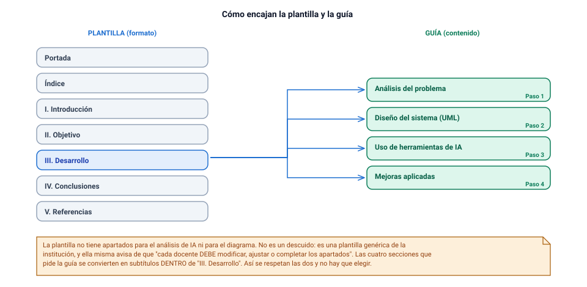

# Que usar de este repositorio, y que no

Este repositorio contiene un sistema de gestión interna para EcoTech Solutions: 16.399 líneas de TypeScript desplegadas y funcionando, 7.421 líneas de documentación técnica repartidas en 12 documentos, 25 diagramas Mermaid y 81 pruebas. Resuelve el mismo enunciado que te toca a ti.

Eso no es tu entrega. Es **materia prima**, y tratarla como si fuera el entregable es la forma más rápida de reprobar una evaluación que ya tenías ganada.

Este documento hace dos cosas. La primera es un inventario honesto: qué archivo sirve para qué paso y cuánto trabajo hay que hacerle encima. La segunda, más importante, es la lista de los diez huecos: lo que la evaluación pide y aquí **no existe**. Son diez, son concretos, y cuatro de ellos son requisitos nominales con nombre propio que un evaluador va a buscar en el índice de tu informe.

:::aviso Lo primero, porque cambia cómo lees todo lo demás
La entrega es **un archivo Word o PDF subido al AAI**. La guía lo cierra sin margen:

> NO SE RECIBIRÁN ENTREGAS POR CORREO.

Un enlace a GitHub no es evidencia entregada. Un repositorio adjunto no se navega durante la corrección. **Lo que no esté pegado dentro del archivo que subes, no se corrige.** Todo lo que sigue en este documento está escrito bajo esa restricción: no se trata de "qué hay disponible", sino de "qué se traslada, con qué recorte y con qué rótulo".
:::

---

## Los tres niveles de calidad

La columna final del inventario clasifica cada activo en tres niveles. No son adjetivos: cada uno implica un trabajo distinto y un riesgo distinto.

**Directo.** El contenido responde a una acción de la guía sin cambiarle el fondo. Aun así hay que reescribirlo: recortar lo que sobra, traducir los rótulos al vocabulario de la guía y meterlo en la estructura de la plantilla. *Directo* significa "no tienes que volver a pensarlo", no "cópialo".

**Requiere adaptación.** El material está, pero le falta una capa que la evaluación exige explícitamente: una columna, un rótulo, un nombre de principio, un prompt que lo origine. Es el nivel más traicionero, porque la tentación es dar por cubierto el criterio cuando en realidad falta justo la parte que se puntúa.

**Tangencial.** Excede lo que pide la Unidad 1 o pertenece a otra unidad. Puede reforzar la defensa oral o ir en un anexo de una página, nunca en el cuerpo del informe. Cada página tangencial que metas en el cuerpo diluye las páginas que sí se evalúan.

---

## El inventario

| Archivo del repo | Qué contiene | Para qué paso sirve | Calidad |
|---|---|---|:--:|
| `docs/01-analisis-poo.md` (238 líneas) | Los 5 síntomas del enunciado traducidos a causa técnica y exigencia sobre el modelo; 11 entidades con su criterio de identidad y una responsabilidad; 4 no-entidades descartadas con su razonamiento; los 4 fundamentos POO con ejemplo del dominio | Paso 1 entero (1.1.1) y la sección "Análisis del problema" del informe | directo |
| `docs/03-modelo-uml.md` §3.1 | El diagrama de clases definitivo: 14 clases, visibilidad `+ # -`, estereotipos, métodos abstractos y estáticos marcados, 22 relaciones, nueve de ellas con multiplicidad explícita | Paso 2 (1.1.2) y Paso 4 (1.1.4). Es literalmente el entregable central | directo |
| `docs/03-modelo-uml.md` §3.3 y §3.9 | Tabla de 8 relaciones con origen / destino / tipo / multiplicidad / justificación, más la tabla de notación UML empleada | Paso 2, acción "determinar al menos 3 relaciones especificando tipo y multiplicidad"; §3.9 es la leyenda del diagrama | directo |
| `docs/03-modelo-uml.md` §3.2 | Catálogo en prosa, clase por clase: razón de existir, invariante que protege, archivo de código; tabla de las 3 subclases con su fórmula de remuneración | Paso 2, acción "establecer atributos y métodos relevantes" | directo |
| `docs/02-evaluacion-critica-ia.md` §2.2–§2.4 | Tres propuestas preliminares con diagrama Mermaid completo: A (jerarquía por conveniencia), B (modelo anémico con clase-dios), C (la que casi acierta) | Paso 3, las "al menos 2 iteraciones". Hay tres y están encadenadas | requiere adaptación |
| `docs/02-evaluacion-critica-ia.md` §2.5 y catálogo A1–C8 | 25 errores con identificador estable y explicación desarrollada, más la tabla resumen de 25 filas con su corrección en el modelo final | Paso 3, los "al menos 4 elementos"; alimenta también "Mejoras aplicadas" | requiere adaptación |
| `docs/02-evaluacion-critica-ia.md` §2.1, §2.6, §2.7 | Método de evaluación en 6 preguntas-criterio; 6 patrones de fallo recurrentes de la IA al modelar; 4 aportes reales de la asistencia automática y dónde está su límite | Paso 3 acción oral, Conclusiones del informe y la "postura crítica sobre IA" que exige el Paso 4 | directo |
| `docs/04-justificacion-diseno.md` (525 líneas) | 15 decisiones de diseño en formato Decisión / Alternativa descartada / Razonamiento / Prueba / Consecuencia. Pesan 4.1 a 4.7, 4.9, 4.11 y 4.13 | Paso 4, "fundamentar las decisiones de diseño con criterios técnicos". Es también el banco de respuestas de la defensa | directo |
| `docs/03-modelo-uml.md` §3.4–§3.6 | Jerarquía `Reporte` (método plantilla, 5 informes) y `Exportador` (4 formatos + fábrica); jerarquía `Regla` (10 reglas) y `ErrorDominio` (8 subclases); patrón `Repositorio<T>` | Paso 4, "aplicar al menos 3 principios de diseño". Es la evidencia gráfica; falta ponerle encima el nombre del principio | requiere adaptación |
| `docs/03-modelo-uml.md` §3.7–§3.8 | Dos máquinas de estados (Proyecto y RegistroTiempo) y tres diagramas de secuencia | "Incorporar elementos visuales relevantes". La Unidad 1 no los pide: anexo o respuesta preparada | tangencial |
| `README.md` (138 líneas) | Contexto y URL en producción; tabla problema → mecanismo con los 5 síntomas; tabla de 7 conceptos POO → archivo → qué demuestra; 6 reglas de negocio | Introducción y Objetivo del informe. La tabla concepto → archivo es un esqueleto casi listo para la matriz de trazabilidad | requiere adaptación |
| `docs/06-seguridad.md` (1.044 líneas) | Modelo de amenazas; matriz RBAC de 23 permisos × 4 roles; cifrado AES-256-GCM con índice ciego HMAC; validación en lista blanca; auditoría | Las tres filas de seguridad de la matriz de trazabilidad. Escrito para implementadores: hay que extraer y resumir mucho | requiere adaptación |
| `src/dominio/` (5.225 líneas TS) | El modelo del diagrama implementado de verdad: `Entidad` → `Persona` → `Empleado` → tres subclases, validación, fábricas, reportes, seguridad, auditoría | Prueba de que el modelo es implementable. Sostiene la defensa oral. Está en TypeScript, y la guía dice Python | tangencial |
| `src/aplicacion/Semilla.ts` (457 líneas) | Juego de datos: 5 departamentos (los cuatro que nombra el enunciado, más Operaciones), 10 empleados con todos sus atributos, 6 proyectos, 6 semanas de partes de horas | Paso 1 pide "posibles objetos" para cada elemento. Esta es la fuente de instancias verosímiles: transcribe 2 o 3 por clase | requiere adaptación |
| `tests/` (81 pruebas en 3 archivos) | Invariantes comprobados: nadie aprueba sus propias horas, tope de dedicación acumulada, transiciones de estado válidas, errores de dominio distinguibles | Respaldo de la defensa oral, no material del informe | tangencial |
| `docs/05-arquitectura.md` (586 líneas) | Capas y regla de dependencia con su diagrama; inversión sobre `Repositorio`; inyección de dependencias; ciclo de vida de una petición | Argumento de cohesión y bajo acoplamiento para el Paso 4; respuesta a "cómo se llevaría esto a una aplicación real" | tangencial |
| `docs/08-modelo-datos-kv.md` (733 líneas) | Mapa de claves, esquema por colección, `erDiagram` de las relaciones, consistencia eventual e integridad referencial | Solo si el docente pregunta por "la base de datos" del enunciado. No es material del informe | tangencial |
| `docs/README.md` (41 líneas) | Índice de los 11 documentos numerados con una línea cada uno y cuatro recorridos sugeridos, entre ellos "para evaluar el trabajo de análisis y modelado: 01 → 02 → 03 → 04" | Mapa de navegación si adjuntas el repositorio; base para el índice del informe | tangencial |
| `docs/09-manual-usuario.md` (733 líneas) | Guía por rol y por módulo, circuito de aprobación de horas, preguntas frecuentes, dos diagramas | Evidencia de los requisitos "interfaz de usuario" y "generación de informes". Solo como cita en la matriz | tangencial |

:::nota Cómo se lee esta tabla en la práctica
Cuatro archivos concentran casi todo lo aprovechable: `docs/01`, `docs/02`, `docs/03` y `docs/04`. Las otras nueve entradas de la tabla van al informe como una línea, una cita o un anexo, o no van. Si tienes poco tiempo, lee esos cuatro y olvida el resto: es exactamente el recorrido que el propio `docs/README.md` recomienda a quien viene a evaluar el modelado.
:::

---

## Los diez huecos

Todo lo anterior es lo que sobra. Esto es lo que falta. Cada hueco está verificado contra el repositorio con una búsqueda concreta, y cada uno corresponde a una acción de la guía que hoy no tiene con qué cumplirse.

| # | Hueco | Acción de la guía que lo exige | Coste estimado |
|:--:|---|---|:--:|
| 1 | Los prompts textuales | Paso 3: "documenta al menos 2 prompts" | 1–2 h |
| 2 | Errores de IA clasificados por aspecto | Paso 3: "clasificándolos según el aspecto del modelo" | 30 min |
| 3 | Matriz de trazabilidad requisito → clase | Paso 4: "elaborando una matriz de trazabilidad" | 1–2 h |
| 4 | Cualquier cosa en Python | ES1 y Paso 4: "el diseño definitivo en Python" | 1 h |
| 5 | Los principios de diseño, nombrados | Paso 4: "aplicar al menos 3 principios de diseño" | 1 h |
| 6 | El informe como documento | Plantilla completa: portada, índice, 5 apartados | 8–12 h |
| 7 | Referencias bibliográficas en APA | Plantilla: sección obligatoria | 30 min |
| 8 | El guion de la defensa oral | Los cuatro pasos terminan en una acción oral | 3 h |
| 9 | Delimitación de alcance y autoría | Instrucciones generales sobre uso de IA | 1 h |
| 10 | La Rúbrica N°1 | "Revisar: Rúbrica de evaluación (Rúbrica N°1)" | descárgala |

### 1. Los prompts. Este es el grave

Búsqueda hecha: `grep -rni 'prompt' docs/ README.md src/` devuelve **cero resultados**. La palabra no aparece ni una sola vez en el repositorio.

`docs/02` presenta las tres propuestas como "preliminares representativas" y no dice con qué herramienta se generaron, en qué fecha, ni con qué instrucción. Lo único que hay son paráfrasis embebidas en la prosa:

> Es la salida más común cuando se pide "un diagrama de clases para un sistema de gestión de empleados, departamentos y proyectos".

> Tercera iteración, tras señalar los fallos anteriores.

Eso son semillas para reconstruir un prompt, no prompts documentados. La guía pide otra cosa, dos veces:

> Documenta al menos 2 prompts utilizados (incluyendo el contexto del problema y las instrucciones de formato) y el resultado obtenido para cada iteración.

> Debes documentar el uso de la herramienta (prompt y resultado).

:::trampa El error de cálculo más caro de toda la evaluación
Es tentador pensar que un análisis crítico excelente compensa la falta de prompts. No compensa: son acciones distintas de la misma rúbrica. Tienes 25 errores catalogados con una calidad que casi nadie va a alcanzar, y sin dos bloques de texto que cuesten una hora, el criterio 1.1.3 queda a medias.

Peor todavía: la guía advierte que *"la entrega de resultados generados exclusivamente por IA, sin análisis ni ajustes, será considerada insuficiente"*. Presentar tres modelos sin decir de dónde salieron te deja en la posición exacta que esa frase castiga, aunque el análisis lo hayas hecho tú.

Qué hacer, y no es negociable: escribe dos o tres prompts completos —contexto del enunciado + instrucción + formato de salida pedido, del tipo "devuélvelo en Mermaid `classDiagram`"—, nombra herramienta y versión, ponles fecha, y preséntalos en bloque literal junto al diagrama que produjo cada uno. El cómo está en [Paso 3](05-paso-3-evaluacion-critica-ia.html).
:::

### 2. La clasificación de los errores por aspecto del modelo

Los 25 errores de `docs/02` están clasificados por propuesta de origen (A, B, C), no por qué parte del modelo afectan. La tabla §2.5 tiene columnas `# / Error / Propuesta / Corrección`. La guía pide una columna más:

> Analiza el modelo generado por IA, identificando al menos 4 elementos (errores, similitudes o diferencias), **clasificándolos según el aspecto del modelo (clases, atributos o relaciones)** y contrastándolos con el análisis propio del problema.

Son dos columnas nuevas, en realidad: **Aspecto** y **Contraste con mi análisis**. La segunda tiene su contenido ya escrito en `docs/01`; es cuestión de emparejar.

Un reparto que funciona, con los 25 errores del catálogo colocados, para que veas la forma:

| Aspecto | Errores que caen ahí |
|---|---|
| Clases | A1, A2, B2, B6, C6, C8 |
| Atributos | A6, A10, C1, C2, C4, C5 |
| Relaciones | A3, A4, A5, C7 |
| Métodos y comportamiento | A7, A8, A9, B1, B3, B4, B5, B7, C3 |

La cuarta categoría no la nombra la guía. Si tu docente exige las tres literales, absórbela en "clases": un método mal ubicado es un problema de responsabilidad de clase. Dilo explícitamente en una nota al pie de la tabla, y demuestras criterio en vez de parecer despistado.

### 3. La matriz de trazabilidad

No existe en el repositorio. Lo más cercano son dos tablas —`docs/01` §1.5 y "Qué resuelve" del README— que trazan los **5 síntomas** de la empresa, no los **requisitos del sistema**. Son cosas distintas: el síntoma es "duplicidad de información de empleados"; el requisito es "Registro de Empleados".

> Validar la coherencia del modelo con los requerimientos del sistema, elaborando una matriz de trazabilidad que relacione al menos 3 requerimientos del sistema con las clases correspondientes.

Es un entregable con nombre propio. El evaluador lo busca en el índice. Se construye rápido porque el material está disperso pero completo: cada uno de los requisitos que enumera el enunciado → clase o clases del diagrama §3.1 → método que lo materializa. Para los tres de seguridad (autenticación y autorización, datos sensibles, validación de entradas) la fuente es `docs/06`. La matriz completa está armada en [Paso 4](06-paso-4-validacion-final.html).

### 4. Python

Búsqueda hecha: `grep -rni 'python'` sobre `.md`, `.ts` y `.json` del repositorio devuelve **cero resultados**. Y no es un descuido: `docs/04` §4.13 justifica por escrito un almacén clave-valor sobre Cloudflare Workers, es decir, justifica una tecnología que no es Python.

La guía dice Python dos veces:

> Esta evaluación corresponde a la ES1 (15%), que consiste en un Informe técnico del diseño y desarrollo de una solución de software en Python representada mediante un diagrama de clases UML.

> Concluye la presentación defendiendo la viabilidad técnica del diseño definitivo en Python.

Un diagrama de clases UML es independiente del lenguaje, y esa es la respuesta correcta. Pero es una afirmación que hay que **demostrar**, no enunciar. Por eso esta guía trae [`python/modelo.py`](python/modelo.py): el mismo modelo, en Python ejecutable, con la tabla de correspondencia UML → Python (clase abstracta → `ABC`, método abstracto → `@abstractmethod`, atributo privado → guion bajo y `@property`, tipos enumerados → `Enum`, multiplicidad `0..1` → `Optional[...]`, multiplicidad `0..*` → lista). Lleva eso al informe como sección de viabilidad y como anexo, y la pregunta obvia del docente deja de ser un problema.

### 5. Los principios de diseño, sin nombrar

Búsquedas hechas sobre `docs/`: "cohesión" **0 apariciones**, "SOLID" **0**, "abierto/cerrado" **0**, "Liskov" **0**, "inversión de dependencias" **0**. "Responsabilidad única" aparece dos veces, de pasada.

Los principios se aplican por todas partes —una clase por regla, una por informe, `aprobar(jefe)` en lugar de `setEstado`, añadir un formato es añadir una clase— y no se nombran nunca.

> Aplicar al menos 3 principios de diseño orientado a objetos (por ejemplo: cohesión, responsabilidad única, encapsulamiento, claridad) en la mayoría de las clases del modelo.

Un evaluador con rúbrica en la mano busca **los nombres**. Falta una tabla `principio → clases donde se ve → evidencia concreta`. El contenido existe entero; falta la etiqueta. Es el hueco de mejor relación entre esfuerzo y puntos: una hora, un criterio.

### 6. El informe técnico como documento

No hay ningún informe en el repositorio. No hay portada, ni índice, ni "Objetivo", ni "Conclusiones", ni "Referencias bibliográficas". `docs/` son 12 documentos técnicos encadenados entre sí, escritos para quien va a implementar el sistema. No hay `.docx` ni `.pdf`.

La plantilla exige estructura fija (Introducción, Objetivo, Desarrollo, Conclusiones, Referencias), portada con ocho campos, tabla de contenidos en página independiente, tamaño carta, márgenes de 2,5 cm, Arial o Calibri, títulos a 14 en negrita, subtítulos a 12, texto a 11, párrafo justificado con interlineado sencillo.

**Las 7.421 líneas de `docs/` son la materia prima. El entregable hay que escribirlo.** El montaje está en [El informe técnico](07-el-informe-tecnico.html).

### 7. Referencias bibliográficas en APA

El repositorio no cita ni una sola fuente externa. `docs/03` §3.9 invoca "las convenciones son las de UML 2.5" sin citar de dónde sale. Las dos obras que la guía pone en bibliografía no aparecen en ningún documento.

La plantilla incluye "Referencias bibliográficas" como sección obligatoria, en norma APA 6, con interlineado doble y sangría francesa. Es media hora de trabajo y es fácil de perder por olvido. Como mínimo van las dos obras de la guía; conviene citar la especificación de UML al justificar la notación y al distinguir agregación de composición. Fíjate en que la segunda referencia lleva Python en el título: es la cita natural para tu sección de viabilidad.

### 8. El guion de la defensa oral

No hay ningún material orientado a exponer: ni guion, ni orden, ni preguntas anticipadas, ni resumen de una página para llevar. Y los cuatro pasos de la guía terminan, cada uno, en una acción oral: *"expone oralmente..."*, *"explica de manera lógica y fluida..."*, *"expone mediante argumentos técnicos..."*, *"concluye la presentación defendiendo..."*.

La materia prima es buenísima: `docs/04` está escrito en formato decisión / alternativa descartada / razonamiento, que es exactamente la forma de una respuesta de comisión. Lo que falta es ordenarlo como discurso y anticipar las preguntas duras, que en tu caso son previsibles: por qué no es Python, por qué Workers KV cuando el enunciado pide "una base de datos", qué hiciste tú y qué hizo la IA, por qué hay 14 clases si se pedían 3, por qué agregación y no composición. Están respondidas una a una en [La defensa oral](08-defensa-oral.html).

### 9. Alcance y autoría

Este hueco tiene sección propia más abajo, porque no se llena con una tabla.

### 10. La Rúbrica N°1

La guía manda revisarla y no viene en el paquete: vive en el AAI. Todo lo que esta guía trata como criterio de corrección está inferido de las viñetas "Acciones para desarrollar", que están redactadas como filas de rúbrica.

Los mínimos que sí conocemos son numéricos ("al menos 4 entidades", "al menos 2 prompts", "al menos 3 relaciones", "al menos 3 principios", "al menos 3 requerimientos"), pero **no sabemos los descriptores de excelencia**, que son los que deciden entre un 5 y un 7. Descárgala antes de decidir cuánto material trasladas. Si dice algo distinto de lo que dice esta guía, manda la rúbrica.

---

## El riesgo de la sobre-entrega

:::aviso Tu mayor activo es también tu mayor riesgo, y depende de una sola cosa
La Unidad 1 pide **modelar**. Tú **implementaste**: un sistema desplegado, 16.399 líneas de TypeScript, 25 diagramas, 81 pruebas y 7.421 líneas de documentación, sobre un repositorio con 10 commits cuyos mensajes hablan de producto, no de aprendizaje.

Un docente que recibe eso tiene dos lecturas disponibles, y elige en los primeros cinco minutos de tu defensa:

1. **"Este estudiante entendió el modelado tan bien que pudo llevarlo a código funcionando."** Nota alta, y con argumento.
2. **"Esto lo generó una IA y el estudiante lo entregó."** Que es exactamente lo que la guía anuncia que castiga: *"la entrega de resultados generados exclusivamente por IA, sin análisis ni ajustes, será considerada insuficiente."*

Lo único que separa una lectura de la otra es si **puedes explicar cada decisión que aparece en tu informe**. No "el sistema funciona", sino "elegí agregación y no composición entre `Departamento` y `Empleado` porque al cerrar un departamento los empleados siguen existiendo, y por eso la multiplicidad es `0..1` y no `1`".

De ahí sale la regla operativa: **no metas en el informe ni una sola línea que no puedas defender de pie y sin apuntes.** Ante la duda, fuera. Un informe de 20 páginas que dominas vale más que uno de 60 con tres párrafos que no sabrías explicar, porque la comisión pregunta precisamente por lo que se ve más sofisticado.
:::

### Cómo se presenta sin que juegue en contra

El principio de montaje es simple: **el cuerpo del informe es modelado; la implementación es un anexo de validación.** El código no es la prueba principal de nada en esta unidad; es una prueba secundaria de que el modelo era implementable.

| Material | Dónde va | Extensión máxima |
|---|---|:--:|
| Análisis conceptual, diagrama UML, iteraciones de IA, principios, matriz | Cuerpo del informe (III. Desarrollo) | lo que haga falta |
| Traducción del modelo a Python y correspondencia UML → Python | Cuerpo, como sección de viabilidad técnica | 1–2 páginas |
| Prototipo funcional: capturas, jerarquía real de clases, resultado de las pruebas | Anexo, rotulado "Validación adicional" | 1 página |
| Arquitectura por capas, modelo de datos, manual de usuario, API | Fuera. Como mucho, una frase en el anexo | — |

Y una nota de alcance en la Introducción, de tres o cuatro líneas, que diga qué estás entregando para esta unidad y qué queda fuera a propósito. Delimitar el alcance tú mismo desactiva la sospecha antes de que nazca: quien acota su propio trabajo demuestra que sabe qué se le pidió.

:::trampa Tres formas de dispararse en el pie con material excelente
- **Abrir el informe con el sistema en producción.** El evaluador lee "aquí hay un producto" antes de leer "aquí hay un análisis", y ya no consigue evaluar lo segundo. Abre con el análisis conceptual del Paso 1, que es lo que pide el criterio 1.1.1.
- **Pegar código TypeScript en el cuerpo.** Refuerza la única objeción que no tiene respuesta fácil (la guía dice Python) en el sitio de máxima visibilidad. Si va código en el cuerpo, que sea el Python de `python/modelo.py`.
- **Presentar los 25 errores de IA sin decir de qué prompt salió cada modelo.** Es el hueco 1 combinado con la sobre-entrega: un catálogo impecable de errores ajenos, sin trazar de dónde vienen esos modelos, se lee como un texto encontrado, no como un análisis hecho.
:::

### La prueba de la defensa

Antes de dar por cerrado el informe, toma cinco elementos al azar de lo que pegaste —una multiplicidad, una clase, un error del catálogo, un principio, una fila de la matriz— y respóndete tres preguntas en voz alta:

1. ¿Por qué está ahí y no otra cosa?
2. ¿Qué alternativa descarté, y qué se rompía con ella?
3. ¿Qué pasaría en el sistema si mañana el requisito cambiara?

Si fallas en alguno de los cinco, ese elemento no está listo: o lo estudias hasta poder responder, o lo sacas. Las tres preguntas no son un ejercicio inventado: son el formato exacto de `docs/04-justificacion-diseno.md`, y también el formato de una pregunta de comisión.

---

## Cómo declarar la autoría

La guía no prohíbe usar IA. **La espera:**

> Durante esta evaluación, se permite y se espera el uso de herramientas de Inteligencia Artificial (IA) como apoyo en la generación de propuestas iniciales de modelado.

Lo que castiga es entregar salida de IA sin análisis ni ajustes. Es decir: no te evalúan por *si* usaste IA, sino por *qué hiciste con ella*. Declararlo bien no es una confesión, es la evidencia del criterio 1.1.3 completo.

Hay además un dato incómodo que conviene mirar de frente: `docs/02` §2.7 reconoce por escrito que la asistencia automática se usó, entre otras cosas, para *"redacción de documentación a partir de código ya escrito y revisado"*. Si el docente lee `docs/`, lo va a encontrar. Que lo lea primero en tu informe, contado por ti, cambia por completo cómo cae.

### La tabla que conviene incluir

Una tabla de tres columnas, dentro de la sección "Uso de herramientas de IA", separa lo que hiciste de lo que delegaste. Esta es la forma; el contenido tienes que rehacerlo con lo que hiciste tú de verdad, porque cada fila es una pregunta potencial de la defensa.

| Actividad | Autoría | Cómo se verifica |
|---|---|---|
| Identificación de entidades y descarte de no-entidades | Propia | Los cuatro descartes razonados; ninguna IA propone descartar `Gerente` |
| Generación de las propuestas preliminares A, B y C | Herramienta de IA, con mis prompts | Prompts transcritos con fecha, herramienta y versión |
| Detección y clasificación de los 25 errores | Propia | Cada error contrastado contra mi análisis previo del Paso 1 |
| Decisiones del modelo final (herencia por contrato, clase de asociación, agregación) | Propia | Alternativa descartada y consecuencia documentadas para cada una |
| Redacción y ordenación de partes de la documentación técnica | Asistida por IA, revisada y corregida por mí | Declarado aquí; el contenido técnico es anterior a la redacción |
| Implementación del prototipo | Propia, con asistencia para código mecánico y verificable | Las pruebas comprueban los invariantes del modelo |

:::ejemplo Un párrafo de declaración, como modelo de forma y nivel
Esto es un ejemplo del que aprender el tono y el grado de detalle, **no un texto para copiar**. El tuyo tiene que decir lo que tú hiciste, y tienes que poder sostenerlo en la defensa; si describe un proceso que no ocurrió, la primera repregunta lo deshace.

> El análisis conceptual del dominio (entidades, responsabilidades y descartes) se elaboró antes de consultar ninguna herramienta de IA, y se usó después como criterio de contraste. Las tres propuestas preliminares de modelo se generaron con [herramienta y versión] mediante los prompts transcritos en el Anexo A, entre el [fecha] y el [fecha]. La evaluación de esas propuestas, la clasificación de los 25 hallazgos y las decisiones del modelo final son propias, y cada una se justifica en la sección 3.4 indicando la alternativa descartada. La herramienta se usó además como apoyo de redacción en partes de la documentación técnica anexa, sobre contenido técnico ya definido y revisado por mí. Ninguna de las propuestas generadas se incorporó al modelo final sin modificación: la comparación entre el modelo C y el definitivo, en la tabla 3.4.1, registra ocho cambios estructurales.
:::

### Por qué esto juega a tu favor

**Porque el criterio 1.1.3 es exactamente esto.** "Aplica criterios técnicos de modelado orientado a objetos al ajustar diagramas de clases generados por herramientas de IA" no se puede evidenciar sin mostrar el modelo generado, el criterio aplicado y el ajuste. Sin declaración de autoría no hay criterio 1.1.3; hay un diagrama sin historia.

**Porque una declaración precisa demuestra control del proceso.** Distinguir "generación de propuestas", "apoyo a la redacción" y "análisis propio" señala que sabes qué hace bien una IA y qué no. Esa es literalmente la postura crítica que el Paso 4 pide defender.

**Porque lo alternativo es peor.** El silencio sobre el uso de IA en un trabajo de este tamaño no se lee como ausencia de IA: se lee como omisión. Y una omisión detectada en la defensa vale mucho más caro que cualquier uso declarado.

:::clave El límite que no se puede cruzar
Declarar bien no arregla no entender. La guía es explícita en que la evaluación es individual y busca *"demostrar el dominio conceptual y las habilidades de modelado"*, y hay defensa oral en los cuatro criterios. La declaración de autoría te protege de la sospecha; solo el estudio te protege de la pregunta. Son dos trabajos distintos y los dos hay que hacerlos.
:::

---

## Qué no llevar al informe

Lista corta y sin matices, para revisar antes de exportar el PDF.

- **Código TypeScript en el cuerpo.** Refuerza la objeción del lenguaje. Si va código, que sea Python.
- **`docs/07-api.md`, `docs/10-despliegue.md`, `docs/11-pruebas.md`.** Son de despliegue y operación. Nada que ver con el criterio de modelado.
- **El mapa de claves de Workers KV.** Solo si te preguntan por la base de datos, y entonces oralmente.
- **Los tres diagramas de secuencia y las dos máquinas de estados** en el cuerpo del informe. Van al anexo: no los pide la Unidad 1, y en el cuerpo compiten con el diagrama de clases por la atención del evaluador.
- **La URL de producción como evidencia principal.** El evaluador corrige un archivo; puede que nunca abra un enlace, y no está obligado a hacerlo.
- **Capturas de la interfaz más allá de una.** Una prueba que el modelo se implementó; cinco parecen relleno.
- **Cualquier párrafo copiado de `docs/` sin reescribir.** Se nota, porque `docs/` está escrito para implementadores y el informe se escribe para un evaluador. Cambian el destinatario, el vocabulario y lo que hay que explicar.

---

## Para seguir

- [Paso 3 — Evaluación crítica con IA](05-paso-3-evaluacion-critica-ia.html): cómo se escribe un prompt documentado y cómo se registra el resultado. Cierra el hueco 1, que es el más caro.
- [Paso 4 — Modelo final y trazabilidad](06-paso-4-validacion-final.html): la matriz de trazabilidad y la tabla de principios. Cierra los huecos 3 y 5.
- [El informe técnico](07-el-informe-tecnico.html): dónde va cada pieza del inventario, con qué rótulo y en qué anexo. Cierra los huecos 6 y 7.
- [La defensa oral](08-defensa-oral.html): las preguntas sobre Python, sobre la base de datos y sobre qué hiciste tú. Cierra los huecos 8 y 9.
- [`python/modelo.py`](python/modelo.py): el modelo en Python ejecutable. Cierra el hueco 4.
